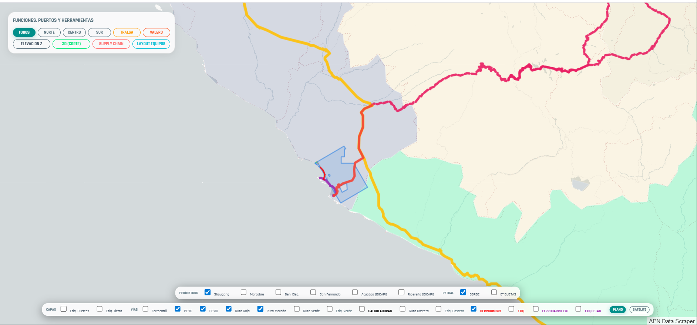
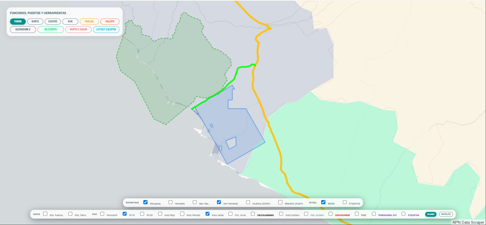

# PLAN DE TRABAJO: VISITA DE CAMPO MARCONA

## 1. Objetivos de la Visita
Realizar una inspección técnica de las vías de acceso al terreno de **PETRAL** para documentar el estado actual, identificar obstrucciones y validar la logística de movilidad.

## 2. Nomenclatura Oficial de Rutas
Para la coordinación y reporte, se utilizarán los siguientes nombres (ya integrados en el Dashboard):
- **PETRAL BORDE:** Perímetro del terreno.
- **RUTA VERDE:** Acceso Norte vía concesión Shougang.
- **RUTA ROJA:** Tramo Panamericana Sur (1S) a San Juan de Marcona.
- **RUTA MORADA:** Conexión Pueblo Marcona a inicio de Servidumbre.
- **SERVIDUMBRE:** Tramo de acceso final (Lado Sur).

## 3. Itinerario Detallado

### DÍA 1: Inspección de Acceso Sur y Servidumbre
*   **Ruta:** Panamericana Sur → **RUTA ROJA** → San Juan de Marcona → **RUTA MORADA** → **SERVIDUMBRE**.
*   **Actividades:**
    1. Recorrido completo de la **SERVIDUMBRE** hasta el **PETRAL BORDE** (Lado Sur).
    2. Identificación de obstrucciones físicas o interferencias.
    3. Documentación fotográfica georeferenciada.
*   **Meta:** Confirmar la viabilidad del ingreso sur y estado de la servidumbre.

### DÍA 2: Inspección de Acceso Norte (Ruta Verde)
*   **Ruta:** Panamericana Sur → **RUTA VERDE** → **PETRAL BORDE** (Lado Norte).
*   **Actividades:**
    1. Recorrido por la **RUTA VERDE** evaluando el estado de la vía.
    2. Verificación de puntos de control en el lateral norte del terreno.
*   **Meta:** Validar la ruta alternativa norte y su conexión estratégica.

---

## 4. Instrucciones de Uso del Dashboard (Modo Garmin)
El Dashboard de Puertos ha sido optimizado para funcionar como un dispositivo de seguimiento GPS (similar a un Garmin) durante la expedición, incluso en zonas sin cobertura de internet.

### Configuración Inicial (Con Señal)
1.  **Acceder:** Abrir `petral.geeksoft.tech/dashboard.html` en Chrome móvil.
2.  **Identificación:** Ingresar sus iniciales o ID en el campo **"Tu nombre (ej: RG)"**.
3.  **Activar GPS:** Presionar el botón **GPS OFF** (cambiará a **GPS ON**). Esperar a que el punto azul aparezca en el mapa.
4.  **Seguimiento:** Presionar **Follow Me** para que el mapa se centre automáticamente en su posición.

### Durante el Recorrido (Grabación)
1.  **Iniciar Grabación:** Presionar el botón **⏺ GRABAR**. El botón cambiará a **🔴 REC ON**.
2.  **Frecuencia:** El dispositivo registrará su posición cada **1 minuto**.
3.  **Mantener Pantalla:** El sistema activará el "Wake Lock" para evitar que la pantalla se bloquee mientras se graba. **No minimice el navegador.**

### Operación Offline (Sin Señal en el Desierto)
1.  **Almacenamiento Local:** Si pierde la señal de internet, el app guardará automáticamente los puntos en la memoria del teléfono (localStorage).
2.  **Sincronización Automática:** Al recuperar señal, el sistema detectará la conexión y enviará **todos los puntos acumulados** masiva y automáticamente a la base de datos.

*Actualizado el 09 de marzo de 2026 con instrucciones de seguimiento GPS.*

*Actualizado el 09 de marzo de 2026 con instrucciones de seguimiento GPS.*
