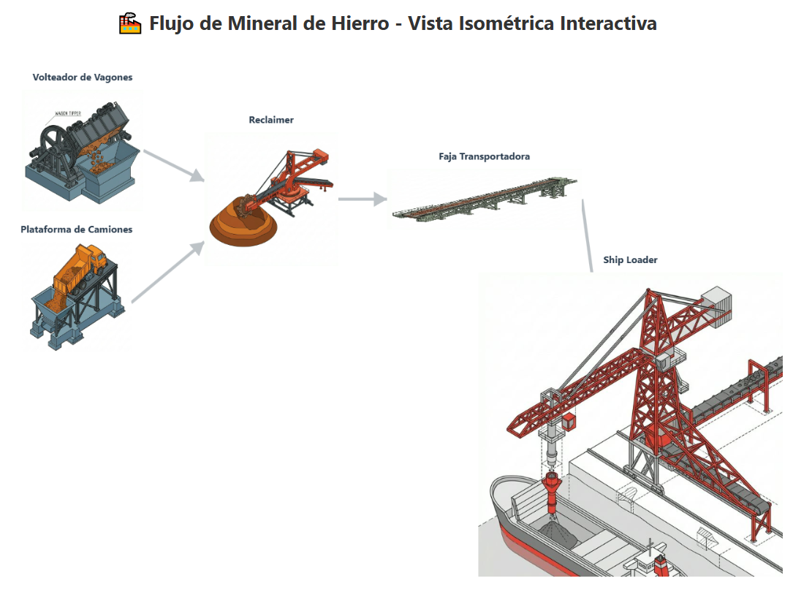

# Estimación CAPEX: Terminal de Manejo de Hierro (10 Mtpa)

  
  
<i>Vista Isométrica del Flujo de Procesos</i>

---

Esta estimación preliminar cubre el Capital Expenditure (CAPEX) para una instalación de manejo de mineral de hierro con una capacidad nominal de 10 millones de toneladas anuales (Mtpa), alimentada por ferrocarril.

## Parámetros de Diseño
- **Capacidad Anual:** 10,000,000 Toneladas.
- **Tasa de Diseño (Peak):** ~4,000 - 5,000 tph (para manejar picos y mantenimiento).
- **Alimentación:** Tren (Vagones de ~100t).
- **Despacho:** Buques Capesize/Panamax.

## Desglose de Equipamiento Principal (Directos)

| Equipo | Unidad | Especificaciones Técnicas (Sugeridas) | CAPEX Unitario (MUSD) | CAPEX Total (MUSD) |
| :--- | :---: | :--- | :---: | :---: |
| **Volteador de Vagones (Wagon Tipper)** | 1 | Sistema Rotativo Tandem (2 vagones/ciclo), ~5000 tph | $22.0 - $28.0 | $22.0 - $28.0 |
| **Apilador (Stacker)** | 1 | Luffing & Slewing, Pluma 45m, ~4500 tph | $8.0 - $12.0 | $8.0 - $12.0 |
| **Recuperador (Reclaimer)** | 1 | Rueda de Cangilones (Bucket Wheel), ~5000 tph | $14.0 - $20.0 | $14.0 - $20.0 |
| **Cargador de Buques (Ship Loader)** | 1 | Tipo Lanzadera (Shuttle) / Radial, ~6000 tph | $15.0 - $22.0 | $15.0 - $22.0 |
| **Fajas Transportadoras (Overland)** | 4 km | Ancho 1600-1800mm, Steel Cord, Alta Tensión | $3.5 - $4.5 /km | $14.0 - $18.0 |
| **Torres de Transferencia y Muestreo** | 4 | Incluye sistemas de pesaje y muestreo automático | $1.5 - $2.5 | $6.0 - $10.0 |
| **Sistemas de Control y Eléctricos** | 1 | Red PLC/SCADA, Subestación Principal 69/13.8kV | $5.0 - $8.0 | $5.0 - $8.0 |
| **Backup: Sistema de Camiones** | 1 | Tolva de recepción + Faja de alimentación | $3.0 - $5.0 | $3.0 - $5.0 |
| **TOTAL EQUIPAMIENTO ESTIMADO (FOB)** | | | | **$87.0 - $123.0** |

## Infraestructura y Obras Civiles

| Componente | Descripción | Costo Estimado (MUSD) |
| :--- | :--- | :--- |
| **Preparación de Stockyard** | Nivelación, fundaciones para rieles, drenaje y contención. | $40.0 - $70.0 |
| **Muelle y Berths** | Estructuras marinas para barcos de gran calado, defensas, bitas. | $120.0 - $200.0 |
| **Infraestructura Ferroviaria** | Loop ferroviario de recepción, patios de maniobra. | $30.0 - $60.0 |
| **Edificios y Talleres** | Control, mantenimiento, oficinas y almacenes. | $10.0 - $15.0 |
| **Total Infraestructura** | | **$200.0 - $345.0** |

## Resumen Ejecutivo de CAPEX

| Categoría | Porcentaje Est. | Costo Estimado (MUSD) |
| :--- | :--- | :--- |
| **Costo Directo (Equipos + Obra)** | 75% | $287.0 - $468.0 |
| **Indirectos (EPCM, Seguros)** | 15% | $43.0 - $70.0 |
| **Contingencia (P50)** | 10% | $29.0 - $47.0 |
| **TOTAL CAPEX ESTIMADO** | **100%** | **$359.0 - $585.0** |

> [!IMPORTANT]
> **Notas Legales y Técnicas:**
> - Estos valores son de orden de magnitud (Clase 5) con una precisión de +/- 40%.
> - No incluyen costos de adquisición de terrenos, licencias ambientales ni OPEX.
> - La variabilidad depende críticamente de la profundidad del puerto (necesidad de dragado) y la distancia ferroviaria.

## Siguientes Pasos Recomendados
1. **Trade-off Study:** Comparar descarga por gravedad vs. volteadores rotativos.
2. **Estudio de Suelos:** Definir tipo de fundaciones para los apiladores gigantes.
3. **Simulación Dinámica:** Verificar que el loop ferroviario no cause cuellos de botella para los 10 Mtpa.

## Fuentes de Investigación
- **ArcelorMittal Liberia Expansion:** Inversión de \$1.8B para incremento de 5 a 20 Mtpa (incluye concentradora, rieles y puerto).
- **Canyon Resources (Minim Martap):** Benchmark de \$97M para 10 Mtpa bauxite (usando infraestructura ferroviaria existente).
- **BHP Port Hedland:** Inversión de \$1.4B para expansión (car dumpers de 16,000 tph).
- **Beumer Group / West River Conveyors:** Costos promedio de fajas overland \$1,000 - \$3,000 por metro instalado.
- **Dry Cargo Mag / Ship-Technology:** Análisis de costos en terminales de graneles sólidos y cargadores de barcos de alta capacidad.
- **Allied Market Research:** Reporte de mercado de equipos de manejo de graneles 2024-2031.
