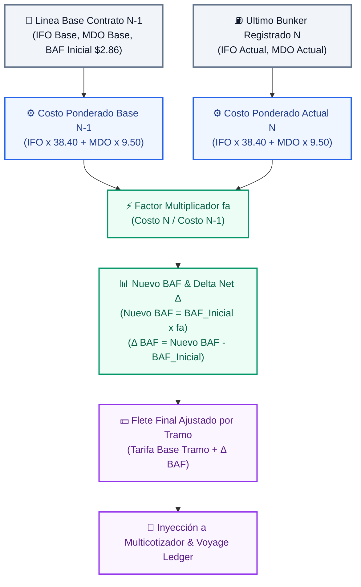

# ⚡ Flowchart: Motor BAF (Bunker Adjustment Factor & Indexación de Fletes)
> **Herramienta**: Motor BAF de Indexación Tarifaria (Maestro de Contratos & Tarificador Comercial)
> **Script**: `C:\Users\rguti\PETRAL.SMART.DASHBOARD\Boiler.Plate\Flow.Charts\FLOWCHART_MOTOR_BAF.py`
> **SVG**: `Geeksoft_Frontend/public/FLOWCHART_MOTOR_BAF.svg`
> **Visor Web**: Herramientas ➔ 🗺️ Flowchart del Sistema ➔ Tab "Motor BAF"

---

## 🎯 Propósito

El **Motor BAF (Bunker Adjustment Factor)** es el motor paramétrico y polinómico encargado de ajustar automáticamente las tarifas de flete marítimo ($/MT) en función de las fluctuaciones del mercado internacional de combustibles marinos (IFO 380 VLSFO y MDO Diesel / MGO).

Calcula la **variación neta por tonelada ($\Delta$ USD/PMT)** producida entre la línea base del contrato y el precio del último bunker registrado, **adicionando o deduciendo esta delta directamente a las tarifas base de los tramos (tiers)** de la ruta.

---

## 🔄 Flujo Estricto de 5 Pasos (Vertical Top-to-Bottom)

### PASO 1 — Inputs Contractuales & Registro de Bunker
- **Parámetros Contrato ($N-1$)**: `Baseline IFO ($/MT)`, `Baseline MDO ($/MT)` y `Componente BAF Inicial ($/PMT)` (ej. $2.86).
- **Consumos Fijos Contractuales (B/T Moquegua)**: `38.40` IFO / `9.50` MDO.
- **Último Bunker Vigente ($N$)**: Precios del mercado del último aprovisionamiento o factura registrada en Maestro de Bunker.

### PASO 2 — Estructura Polinómica de Costo Ponderado
- **Costo Base ($N-1$)**: $(\text{IFO}_{\text{Base}} \times 38.40) + (\text{MDO}_{\text{Base}} \times 9.50)$
- **Costo Actual ($N$)**: $(\text{IFO}_{\text{Actual}} \times 38.40) + (\text{MDO}_{\text{Actual}} \times 9.50)$

### PASO 3 — Motor Polinómico Factor BAF & Delta Neta ($\Delta$)
```
⚡ MOTOR POLINÓMICO BAF
──────────────────────────────────────
• Factor BAF (fa) = Costo_N ÷ Costo_N-1
• Nuevo BAF = BAF_Inicial × fa
• Delta BAF (Δ) = Nuevo BAF - BAF_Inicial
```

### PASO 4 — Aplicación a la Matriz de Tiers & Auditoría Sección 7
- **Ajuste por Tramo**: $\text{Flete Final Tramo}_i = \text{Tarifa Base Tramo}_i + \Delta \text{ BAF}$
- **Paper Técnico de Auditoría**: Desglose paso a paso (Pasos A, B, C y D) disponible en vivo dentro de la Sección 7 del Maestro de Contratos.

### PASO 5 — Integración y Salidas
- 💼 **Inyección a Multicotizador Spot & Voyage Ledger**: Actualiza las cotizaciones comerciales y la Matriz Financiera con los fletes ajustados vigentes.

---

## 📐 Flujograma Mermaid de Arquitectura BAF



---

## 🔗 Referencias Cruzadas

- **Script flowchart**: [FLOWCHART_MOTOR_BAF.py](file:///C:/Users/rguti/PETRAL.SMART.DASHBOARD/Boiler.Plate/Flow.Charts/FLOWCHART_MOTOR_BAF.py)
- **Documentación Obsidian BAF**: [[Metodologia_y_Regla_BAF_Bunker]]
- **Anterior**: [[Flowchart.Motor.PxQ]]
- **Siguiente**: [[Flowchart.Multicotizador]]
