# 🧭 Índice General AS-BUILT — PETRAL SMART DASHBOARD

> **Sistema**: PETRAL SMART DASHBOARD (Motor de P&L, Cotizador Spot, Motor PxQ Portuario y Auditoría Dual)
> **Fecha de Actualización AS-BUILT**: 2026-07-30
> **Estado**: Producción Activa (VPS `91.108.125.253` | `https://forecast.geeksoft.tech`)

---

## 📌 Navegación del Grafo de Conocimiento (MOC)

```mermaid
graph TD
    subgraph Fundamentos ["🏛️ Arquitectura e Infraestructura"]
        A1["[[01_AS_BUILT_Arquitectura_General_y_Stack_Tecnico]]"]
        A2["[[02_AS_BUILT_Modelo_Entidad_Relacion_Supabase_PostgreSQL]]"]
        A3["[[03_AS_BUILT_Despliegue_VPS_Nginx_Systemd_SSL]]"]
        A4["[[AS_BUILT_Sistema_Auth_JWT_Roles_y_Permisos]]"]
    end

    subgraph Maestros ["📦 Maestros del Sistema (CRUD)"]
        M1["[[AS_BUILT_Maestro_01_Buques_VesselsMaster]]"]
        M2["[[AS_BUILT_Maestro_02_Rutas_RuteadorSpot_RouteMaster]]"]
        M3["[[AS_BUILT_Maestro_03_Clientes_ClientsMaster]]"]
        M4["[[AS_BUILT_Maestro_04_Contratos_ContractsMaster]]"]
        M5["[[AS_BUILT_Maestro_05_Puertos_PortsMaster]]"]
        M6["[[AS_BUILT_Maestro_06_Costos_Portuarios_PortCostsMaster]]"]
        M7["[[AS_BUILT_Maestro_07_Tarifario_Portuario_PortTariffsMaster]]"]
        M8["[[AS_BUILT_Maestro_08_Sources_Sinks_SourcesSinksMaster]]"]
        M9["[[AS_BUILT_Maestro_09_Precios_Bunker_BunkerMaster]]"]
    end

    subgraph Herramientas ["⚙️ Herramientas y Motores Operativos"]
        H1["[[AS_BUILT_Herramienta_01_Multicotizador_Spot]]"]
        H2["[[AS_BUILT_Herramienta_02_Matriz_Financiera_Dashboard]]"]
        H3["[[AS_BUILT_Herramienta_03_Analisis_Grafico_Commercial]]"]
        H4["[[AS_BUILT_Herramienta_04_Analisis_Grafico_Liquidaciones]]"]
        H5["[[AS_BUILT_Herramienta_05_Auditoria_PDF_Liquidaciones_WeasyPrint]]"]
        H6["[[AS_BUILT_Herramienta_06_Mapa_de_Espaguetis]]"]
        H7["[[AS_BUILT_Herramienta_07_Auditoria_Ledger_VoyageLedger]]"]
        H8["[[AS_BUILT_Herramienta_08_Auditoria_Engine_PL]]"]
        H9["[[AS_BUILT_Herramienta_09_Auditoria_Final_Dual]]"]
        H10["[[AS_BUILT_Herramienta_10_Visor_Flowcharts_Sistema]]"]
        H11["[[AS_BUILT_Herramienta_11_Documentacion_Interactiva]]"]
    end

    A1 --> A2
    A2 --> M1
    A2 --> M2
    A2 --> M4
    M1 & M2 & M4 & M9 --> H1
    H1 --> H2
    H2 --> H3 & H4 & H5 & H7 & H9
    H5 --> A3
```

---

## 🏛️ 1. Fundamentos y Arquitectura

| Documento | Tema Principal | Archivo / Componente Principal |
|---|---|---|
| [[01_AS_BUILT_Arquitectura_General_y_Stack_Tecnico]] | Stack Tecnológico & Topología | React 18, Vite, FastAPI, Supabase, WeasyPrint |
| [[02_AS_BUILT_Modelo_Entidad_Relacion_Supabase_PostgreSQL]] | Modelo E-R y Tablas Supabase | 18+ Tablas relacionales y constraints SQL |
| [[03_AS_BUILT_Despliegue_VPS_Nginx_Systemd_SSL]] | Guía de Producción en VPS | Nginx, Systemd, Certbot SSL, Deploy SSH/SFTP |
| [[AS_BUILT_Sistema_Auth_JWT_Roles_y_Permisos]] | Seguridad, RBAC y Roles | JWT Token Auth, Módulos UI, `AuthContext` |

---

## 📦 2. Maestros del Sistema

| Documento | Ruta UI | Archivo React Frontend | Tabla Supabase |
|---|---|---|---|
| [[AS_BUILT_Maestro_01_Buques_VesselsMaster]] | `/vessels` | `VesselsMaster.tsx` / `VesselsMaster_V2.tsx` | `vessels` |
| [[AS_BUILT_Maestro_02_Rutas_RuteadorSpot_RouteMaster]] | `/routes`, `/spot-routes`, `/quotes` | `RoutesMaster.tsx` / `RouteMaster_V2.tsx` | `routes_master`, `routes` |
| [[AS_BUILT_Maestro_03_Clientes_ClientsMaster]] | `/clients` | `ClientsMaster.tsx` / `ClientsMaster_V2.tsx` | `clients` |
| [[AS_BUILT_Maestro_04_Contratos_ContractsMaster]] | `/contracts` | `ContractsMaster.tsx` / `ContractsMaster_V2.tsx` | `contracts`, `contract_tariffs` |
| [[AS_BUILT_Maestro_05_Puertos_PortsMaster]] | `/ports` | `PortsMaster_V2.tsx` | `ports` |
| [[AS_BUILT_Maestro_06_Costos_Portuarios_PortCostsMaster]] | `/port-costs` | `PortCostsMaster_V2.tsx` / `DynamicAuditViewer.tsx` | `port_costs_matrix`, `port_cost_static` |
| [[AS_BUILT_Maestro_07_Tarifario_Portuario_PortTariffsMaster]] | `/port-tariffs` | `PortTariffsMaster.tsx` | `port_cost_concepts`, `port_costs_matrix` |
| [[AS_BUILT_Maestro_08_Sources_Sinks_SourcesSinksMaster]] | `/sources-sinks` | `SourcesSinksMaster_V2.tsx` | `sources_sinks` |
| [[AS_BUILT_Maestro_09_Precios_Bunker_BunkerMaster]] | `/bunker-prices` | `BunkerMaster.tsx` | `bunker_prices` |

---

## ⚙️ 3. Herramientas y Motores Operativos

| Documento | Ruta UI | Archivo React / Backend | Función Principal |
|---|---|---|---|
| [[AS_BUILT_Herramienta_01_Multicotizador_Spot]] | `/multicotizador` | `MultiCotizador_V2.tsx` / `MultiCotizadorExcel.tsx` | Cotizador paramétrico de viajes multileg |
| [[AS_BUILT_Herramienta_02_Matriz_Financiera_Dashboard]] | `/dashboard` | `FinancialMatrix_V2.tsx` / `CommercialForecast.tsx` | Grilla comercial de 31 viajes y recálculo P&L |
| [[AS_BUILT_Herramienta_03_Analisis_Grafico_Commercial]] | `/graphic-analysis` | `GraphicAnalysis_V2.tsx` | ECharts de EBITDA, Yield y costos |
| [[AS_BUILT_Herramienta_04_Analisis_Grafico_Liquidaciones]] | `/liquidations-graphic-analysis` | `LiquidationsGraphicAnalysis_V2.tsx` | Gráficos comparativos Forecast vs Real |
| [[AS_BUILT_Herramienta_05_Auditoria_PDF_Liquidaciones_WeasyPrint]] | `/liquidations-pdf-audit` | `LiquidationsAuditPdf_V2.tsx` / `utils.py` | Exportación PDF via FastAPI + WeasyPrint 69.0 |
| [[AS_BUILT_Herramienta_06_Mapa_de_Espaguetis]] | `/spaghetti-map` | `SpaghettiMap_V2.tsx` / `SpaghettiMap.tsx` | Visualizador de rutas marítimas y `searoute` |
| [[AS_BUILT_Herramienta_07_Auditoria_Ledger_VoyageLedger]] | `/audit-ledger` | `AuditLedger_V2.tsx` / `spot_engine.py` | Engine P&L, Triple Mínimo (`MIN`) y ledger |
| [[AS_BUILT_Herramienta_08_Auditoria_Engine_PL]] | `/audit-engine` | `AuditEngine_V2.tsx` / `engine.py` | Auditoría de consumo granular IFO/MDO |
| [[AS_BUILT_Herramienta_09_Auditoria_Final_Dual]] | `/audit-final` | `AuditFinal_V2.tsx` / `DynamicAuditViewer.tsx` | Auditoría Dual (Matriz vs Experta Sandra) |
| [[AS_BUILT_Herramienta_10_Visor_Flowcharts_Sistema]] | `/system-flowchart` | `SystemFlowchartViewer_V2.tsx` | Visor de diagramas Mermaid y SVG |
| [[AS_BUILT_Herramienta_11_Documentacion_Interactiva]] | `/system-documentation` | `SystemDocumentation_V2.tsx` | Centro de documentación técnica en UI |

---

## 🗺️ 4. Flowcharts y Diagramas de Procesos AS-BUILT

| Documento Flowchart | SVG Public Frontend | Tema Principal |
|---|---|---|
| [[01_AS_BUILT_Flowchart_Analisis_Grafico]] | `FLOWCHART_ANALISIS_GRAFICO.svg` | Flujo de analítica visual y ECharts |
| [[02_AS_BUILT_Flowchart_Auditoria_Dual]] | `FLOWCHART_AUDITORIA_DUAL.svg` | Conciliación de facturas vs proforma PxQ |
| [[03_AS_BUILT_Flowchart_Mapa_Espaguetis]] | `FLOWCHART_MAPA_ESPAGUETIS.svg` | Trazo de rutas marítimas y geolocalización |
| [[04_AS_BUILT_Flowchart_Matriz_Financiera]] | `FLOWCHART_MATRIZ_FINANCIERA.svg` | Flujo de 31 viajes y recálculo P&L |
| [[05_AS_BUILT_Flowchart_Motor_BAF]] | `FLOWCHART_MOTOR_BAF.svg` | Indexación de fletes por búnker |
| [[06_AS_BUILT_Flowchart_Motor_PxQ]] | `FLOWCHART_MOTOR_PXQ.svg` | Evaluación de tarifas portuarias A/B/C |
| [[07_AS_BUILT_Flowchart_Multicotizador]] | `FLOWCHART_MULTICOTIZADOR.svg` | Cotización de circuitos multileg |
| [[08_AS_BUILT_Flowchart_Voyage_Ledger]] | `FLOWCHART_VOYAGE_LEDGER.svg` | Algoritmo Triple Mínimo (MIN) y Ledger |

---

## 🧪 5. Protocolos de QC y Tests de Aceptación del Sistema

> **Índice Dedicado del Módulo QC**: [[00_Indice_Protocolos_y_Loops_QC]]

| Documento QC | Script / Mecanismo de Prueba | ¿Qué Audita / Qué Compara? |
|---|---|---|
| [[QC_Loop_01_Validacion_Autonoma_7_Reglas_de_Negocio_y_PDF]] | `run_qc_loop_pdf.py` | Audita 7 reglas de negocio contra `PORT_COSTS_MASTER` y emite Acta PDF |
| [[QC_Loop_02_Test_de_Oro_Convergencia_Matarani_BT_Moquegua]] | `VOYAGE_LEDGER_TEST` | Exige convergencia exacta (4.0801 d, $39k port, $18.5k búnker) contra Excel Petral |
| [[QC_Loop_03_Auditoria_Grilla_31_Viajes_y_Yield_Ponderado]] | `FinancialMatrix_V2.tsx` | Valida fórmula global de Yield (USD/MT) y recálculos en la grilla |
| [[QC_Loop_04_Conciliacion_Facturas_Armador_vs_Proforma_Sandra]] | `DynamicAuditViewer.tsx` | Umbrales de tolerancia y objeción al cotejar factura real vs Sandra |
| [[QC_Loop_05_Alternancia_Costo_Puerto_Fijo_Static_vs_Matrix_PxQ]] | `StaticVsDynamicPortCost_V2.tsx` | Certifica la alternancia sin error entre costo fijo estático y matriz PxQ |
| [[QC_Loop_06_Guardado_Cotizaciones_Spot_y_Llaves_Compuestas]] | `MultiCotizador_V2.tsx` | Valida guardado de cotizaciones spot y llaves compuestas `CLIENTE.PUERTOS.BUQUE` |
| [[QC_Loop_07_Doble_Loop_ETL_ReParseo_Coordenadas_Excel_Operadores]] | `run_qc_loop_non_plus_ultra.py` | Mapeo exacto de celdas Excel (Col N/Q Single, Col C/H/S Multileg) para re-scrapeo ETL |
| [[QC_Loop_08_Non_Plus_Ultra_Prueba_Final_31_Viajes_vs_Spot_Matrix]] | `run_qc_loop_non_plus_ultra.py` | Prueba final: Simula 31 viajes reales vs Multicotizador Spot con centavos PxQ dinámicos |

---

> **Regla de Negocio Crítica:**
> - En todo el software PETRAL, las siglas **MGO** equivalen y se registran unificadamente bajo el estándar **MDO**.
> - La generación de PDF se ejecuta de forma asíncrona a través de la API REST `POST /api/v1/utils/generate-pdf` impulsada por **WeasyPrint**, evitando bloqueos de archivos temporales (Sharing Violation 32 de Windows).
