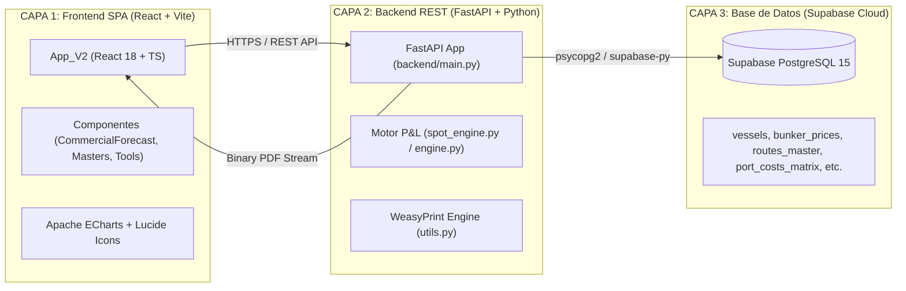

# 🏛️ AS-BUILT: Arquitectura General y Stack Tecnológico

> **Sistema**: PETRAL SMART DASHBOARD
> **Módulo**: Infraestructura y Capas de Software
> **Última Modificación**: 2026-07-30

---

## 🧭 Navegación
| [← Plan Maestro](file:///C:/Users/rguti/PETRAL.SMART.DASHBOARD/Desarrollo.Profesional/Obsidian.1/DashBoardPetral/06_AS_BUILT/00_Plan_Maestro_AS_BUILT.md) | 🏠 [[00_AS_BUILT_Indice_General_Dashboard]] | [Siguiente: Modelo E-R →](file:///C:/Users/rguti/PETRAL.SMART.DASHBOARD/Desarrollo.Profesional/Obsidian.1/DashBoardPetral/06_AS_BUILT/00_Fundamentos_y_Arquitectura/02_AS_BUILT_Modelo_Entidad_Relacion_Supabase_PostgreSQL.md) |

---

## 🎯 1. Arquitectura de 3 Capas (Three-Tier Architecture)

El sistema **PETRAL SMART DASHBOARD** está construido bajo una arquitectura desacoplada y moderna de 3 capas:

---

## 🛠️ 2. Stack Tecnológico Real (AS-BUILT)

### A. Capa de Presentación (Frontend)
- **Framework**: React 18 con TypeScript y Vite 8.1.
- **Estilos & UI**: Tailwind CSS (estética dark/light glassmorphism), Lucide React para iconografía.
- **Gráficos & Visualización**: Apache ECharts (`echarts-for-react`) para matrices dinámicas y mapas espaguetis.
- **Mapeo Marítimo**: `searoute` e Leaflet para la generación y renderizado de trazos geográficos marítimos.

### B. Capa de Negocio y Servicios (Backend)
- **Runtime**: Python 3.12 en entorno virtual (`/opt/geeksoft_engine/venv`).
- **Framework REST**: FastAPI con ASGI Uvicorn (modo multi-worker).
- **Motor P&L y Logística Naviera**: Custom Engine en `backend/spot_engine.py` y `backend/engine.py`.
- **Motor de Renderizado PDF**: **WeasyPrint 69.0** para la conversión HTML/CSS a PDF A4 Landscape y Portrait en servidor.

### C. Capa de Datos (Persistence Layer)
- **Engine BBDD**: Supabase Cloud PostgreSQL 15.
- **ORM / Client**: `supabase-py` Client con pool de conexiones asíncronas.
- **Caché en Memoria**: In-memory Master Data Cache en el arranque de FastAPI (`lifespan` en `main.py`).

### D. Capa de Infraestructura y Servidor (Hosting)
- **VPS Host**: Ubuntu Server en IP `91.108.125.253`.
- **Reverse Proxy**: Nginx 1.18 con terminación SSL/TLS HTTPS vía Certbot / Let's Encrypt.
- **Procesos Systemd**: `geeksoft-engine.service` gestionado vía Uvicorn daemon.

---

## 🔗 Enlaces Relacionados
- [[02_AS_BUILT_Modelo_Entidad_Relacion_Supabase_PostgreSQL]] — Esquema relacional de tablas.
- [[03_AS_BUILT_Despliegue_VPS_Nginx_Systemd_SSL]] — Manual de despliegue en servidor VPS.
- [[AS_BUILT_Herramienta_05_Auditoria_PDF_Liquidaciones_WeasyPrint]] — Generación de PDFs sin Sharing Violation.
