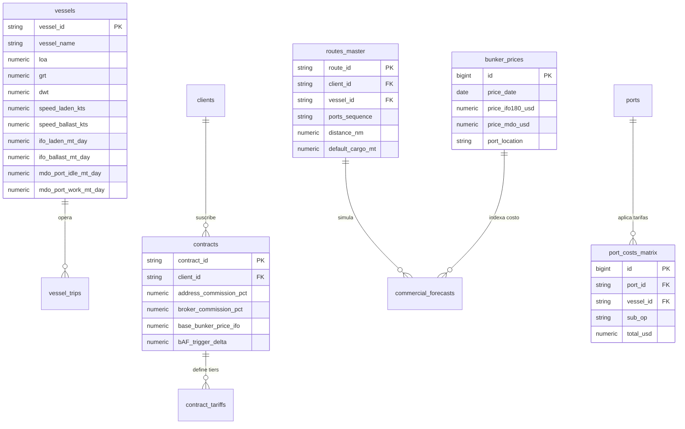

# 🗄️ AS-BUILT: Modelo Entidad-Relación y Base de Datos Supabase

> **Sistema**: PETRAL SMART DASHBOARD
> **Módulo**: Persistence Layer (Supabase PostgreSQL)
> **Última Modificación**: 2026-07-30

---

## 🧭 Navegación
| [← Stack Tecnológico](file:///C:/Users/rguti/PETRAL.SMART.DASHBOARD/Desarrollo.Profesional/Obsidian.1/DashBoardPetral/06_AS_BUILT/00_Fundamentos_y_Arquitectura/01_AS_BUILT_Arquitectura_General_y_Stack_Tecnico.md) | 🏠 [[00_AS_BUILT_Indice_General_Dashboard]] | [Siguiente: Despliegue VPS →](file:///C:/Users/rguti/PETRAL.SMART.DASHBOARD/Desarrollo.Profesional/Obsidian.1/DashBoardPetral/06_AS_BUILT/00_Fundamentos_y_Arquitectura/03_AS_BUILT_Despliegue_VPS_Nginx_Systemd_SSL.md) |

---

## 📊 1. Diagrama Entidad-Relación Relacional (ERD)

---

## 📋 2. Catálogo de Tablas del Sistema AS-BUILT

| Tabla | Clave Primaria (PK) | Propósito y Descripción Técnica |
|---|---|---|
| `vessels` | `vessel_id` | Maestro de buques con consumos IFO/MDO granulares y datos físicos (LOA, GRT, DWT). |
| `routes_master` | `route_id` | Tabla única de rutas unificadas. Mantiene la relación compuestas `${CLIENTE}.${PUERTOS}.${BUQUE}`. |
| `routes` | `id` | Matriz secundaria de tramos spot individuales. |
| `ports` | `port_id` | Puertos y terminales con ritmos operacionales máximos y restricciones operativas. |
| `clients` | `client_id` | Catálogo de clientes corporativos (SPCC, NEXA, Viterra, Glencore). |
| `contracts` | `contract_id` | Parámetros contractuales de flete, comisiones de agenciamiento y cláusulas BAF. |
| `contract_tariffs` | `id` | Brackets de fletes por rango de tonelaje y destino. |
| `port_costs_matrix` | `id` | Tarifario dinámico de agencia y puerto por terminal y sub-operación (`MAIN`, `STANDBY`). |
| `port_cost_static` | `id` | Fallback estático consolidado de costos de puerto cuando falla el look-up en matriz. |
| `port_cost_concepts` | `id` | Catálogo de conceptos tarifarios (Practicaje, Remolcaje, Muellaje, Faro y Balisas, Sanidad). |
| `bunker_prices` | `id` | Cotizaciones oficiales de combustible marino IFO 180 VLSFO y MDO Diesel. |
| `sources_sinks` | `id` | Oferta y demanda anual de Ácido Sulfúrico por puerto y año fiscal. |
| `commercial_forecasts` | `forecast_id` | Corridas grabadas y escenarios guardados de la Matriz Financiera. |
| `vessel_trips` | `trip_id` | Bitácora de viajes ejecutados reales (utilizado para el comparativo Audit Dual). |
| `audit_benchmarks` | `id` | Valores benchmark importados del Excel original de Petral para QC de convergencia. |
| `users` | `user_id` | Gestión de usuarios, contraseñas encriptadas (bcrypt) y asignación de roles RBAC. |

---

## 🔗 Enlaces Relacionados
- [[01_AS_BUILT_Arquitectura_General_y_Stack_Tecnico]] — Inyección de dependencias y backend.
- [[AS_BUILT_Maestro_01_Buques_VesselsMaster]] — Tabla `vessels` en detalle.
- [[AS_BUILT_Maestro_04_Contratos_ContractsMaster]] — Tablas `contracts` y `contract_tariffs`.
