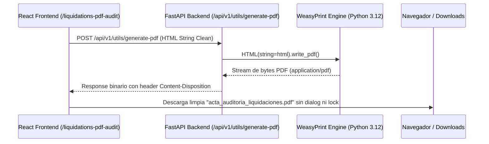

# 📄 AS-BUILT: Herramienta 05 — Auditoría PDF de Liquidaciones (WeasyPrint Engine)

> **Ruta UI**: `/liquidations-pdf-audit`
> **Componente React**: `LiquidationsAuditPdf_V2.tsx` / `LiquidationsExecutivePdfAudit.tsx`
> **Endpoint Backend**: `POST /api/v1/utils/generate-pdf` (`backend/api/routers/utils.py`)
> **Módulo Auth**: `matriz_financiera`

---

## 🧭 Navegación
| [← Análisis Gráfico Liquidaciones](file:///C:/Users/rguti/PETRAL.SMART.DASHBOARD/Desarrollo.Profesional/Obsidian.1/DashBoardPetral/06_AS_BUILT/02_Herramientas_y_Motores/AS_BUILT_Herramienta_04_Analisis_Grafico_Liquidaciones.md) | 🏠 [[00_AS_BUILT_Indice_General_Dashboard]] | [Siguiente: Mapa de Espaguetis →](file:///C:/Users/rguti/PETRAL.SMART.DASHBOARD/Desarrollo.Profesional/Obsidian.1/DashBoardPetral/06_AS_BUILT/02_Herramientas_y_Motores/AS_BUILT_Herramienta_06_Mapa_de_Espaguetis.md) |

---

## 🎯 1. Arquitectura Anti-Sharing Violation (El Solucionador)

### El Problema de Windows:
Anteriormente, al presionar "Imprimir PDF" se usaba `window.print()` en el navegador. Cuando se trataba de reportes extensos (como el Acta de Liquidaciones de 31 viajes), Chrome mantenía un **write lock** sobre el archivo PDF temporal en `%TEMP%`. Si Windows intentaba abrir el archivo automáticamente con Foxit o Adobe Reader, arrojaba el error **Sharing Violation (Error 32)**.

### La Solución Definitiva AS-BUILT:
Se migró la generación de PDF completamente al **Backend FastAPI** impulsado por **WeasyPrint 69.0**:



---

## ⚙️ 2. Endpoint Backend FastAPI (`utils.py`)

```python
from fastapi import APIRouter, HTTPException
from fastapi.responses import Response
from pydantic import BaseModel
import weasyprint

router = APIRouter()

class PdfRequest(BaseModel):
    html: str
    filename: str = "acta_petral.pdf"

@router.post("/generate-pdf")
async def generate_pdf(request: PdfRequest):
    try:
        pdf_bytes = weasyprint.HTML(string=request.html).write_pdf()
        return Response(
            content=pdf_bytes,
            media_type="application/pdf",
            headers={"Content-Disposition": f'attachment; filename="{request.filename}"'}
        )
    except Exception as e:
        raise HTTPException(status_code=500, detail=str(e))
```

---

## 📥 Inyección de Dependencias
- [[03_AS_BUILT_Despliegue_VPS_Nginx_Systemd_SSL]] — Paquetes `libpango` y `weasyprint` en VPS.
- [[AS_BUILT_Maestro_07_Tarifario_Portuario_PortTariffsMaster]] — Desglose PxQ Secciones A, B y C.
