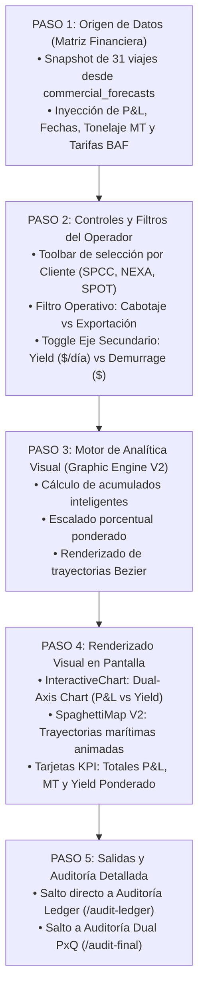

# 📊 AS-BUILT Flowchart 01 — Análisis Gráfico (Forecast Comercial)

> **Herramienta**: Forecast Comercial — Análisis Gráfico y Analítica Visual
> **Ruta UI**: `/graphic-analysis`
> **Componentes React**: `GraphicAnalysis_V2.tsx`, `LiquidationsInteractiveChart.tsx`
> **Script Python Diagrama**: `C:\Users\rguti\PETRAL.SMART.DASHBOARD\Boiler.Plate\Flow.Charts\FLOWCHART_ANALISIS_GRAFICO.py`
> **Asset SVG Public**: `Geeksoft_Frontend/public/FLOWCHART_ANALISIS_GRAFICO.svg`
> **Visor Web**: Herramientas ➔ 🗺️ Flowchart del Sistema ➔ Tab "Análisis Gráfico" (`/system-flowchart`)

---

## 🧭 Navegación
| [← Índices AS-BUILT](file:///C:/Users/rguti/PETRAL.SMART.DASHBOARD/Desarrollo.Profesional/Obsidian.1/DashBoardPetral/06_AS_BUILT/00_Fundamentos_y_Arquitectura/00_AS_BUILT_Indice_General_Dashboard.md) | 🏠 [[00_AS_BUILT_Indice_General_Dashboard]] | [Siguiente: Flowchart Auditoría Dual →](file:///C:/Users/rguti/PETRAL.SMART.DASHBOARD/Desarrollo.Profesional/Obsidian.1/DashBoardPetral/06_AS_BUILT/04_Flowcharts_y_Diagramas_AS_BUILT/02_AS_BUILT_Flowchart_Auditoria_Dual.md) |

---

## 🎯 1. Propósito y Estructura AS-BUILT

El **Flowchart del Análisis Gráfico** documenta el flujo de procesamiento de datos y renderizado visual del tablero de analítica comercial. Describe la secuencia de 5 pasos desde la ingesta de viajes en la Matriz Financiera hasta la generación de gráficos en Apache ECharts y el salto a los tableros de auditoría.

---

## 🔄 2. Flujo Estricto de 5 Pasos (Vertical Top-to-Bottom)

---

## 📊 3. Desglose de Componentes UI y Visualización

| Componente | Tipo de Gráfico / Analítica | Archivo React Relevante |
|---|---|---|
| 📉 **InteractiveChart** | Dual-Axis Chart (P&L vs Yield) | `LiquidationsInteractiveChart.tsx` |
| 🗺️ **SpaghettiMap V2** | Mapa de Rutas ECharts con trayectorias Bezier | `SpaghettiMap_V2.tsx` |
| 🏆 **KPI Cards** | Tarjetas de Resumen Financiero y Tonelaje | `GraphicAnalysis_V2.tsx` |

---

## 🔗 Enlaces Relacionados
- [[AS_BUILT_Herramienta_03_Analisis_Grafico_Commercial]] — Documentación de la herramienta UI.
- [[AS_BUILT_Herramienta_06_Mapa_de_Espaguetis]] — Mapa geográfico de rutas.
- [[AS_BUILT_Herramienta_10_Visor_Flowcharts_Sistema]] — Visor web de diagramas.
