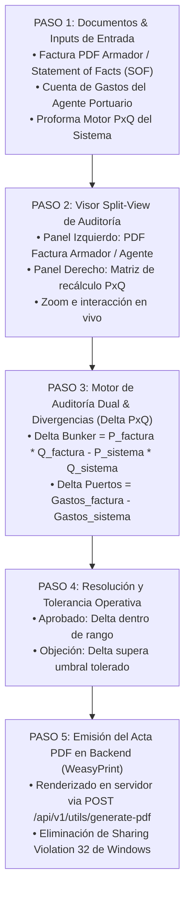

# 🔍 AS-BUILT Flowchart 02 — Liquidador de Gastos Portuarios (Auditoría Dual P×Q)

> **Herramienta**: Liquidador de Gastos Portuarios (Auditoría Dual P×Q & Split-View PDF)
> **Ruta UI**: `/audit-final`
> **Componentes React**: `AuditFinal_V2.tsx`, `DynamicAuditViewer.tsx`
> **Script Python Diagrama**: `C:\Users\rguti\PETRAL.SMART.DASHBOARD\Boiler.Plate\Flow.Charts\FLOWCHART_AUDITORIA_DUAL.py`
> **Asset SVG Public**: `Geeksoft_Frontend/public/FLOWCHART_AUDITORIA_DUAL.svg`

---

## 🧭 Navegación
| [← Flowchart Análisis Gráfico](file:///C:/Users/rguti/PETRAL.SMART.DASHBOARD/Desarrollo.Profesional/Obsidian.1/DashBoardPetral/06_AS_BUILT/04_Flowcharts_y_Diagramas_AS_BUILT/01_AS_BUILT_Flowchart_Analisis_Grafico.md) | 🏠 [[00_AS_BUILT_Indice_General_Dashboard]] | [Siguiente: Flowchart Mapa Espaguetis →](file:///C:/Users/rguti/PETRAL.SMART.DASHBOARD/Desarrollo.Profesional/Obsidian.1/DashBoardPetral/06_AS_BUILT/04_Flowcharts_y_Diagramas_AS_BUILT/03_AS_BUILT_Flowchart_Mapa_Espaguetis.md) |

---

## 🎯 1. Propósito y Estructura AS-BUILT

El **Flowchart de Auditoría Dual P×Q** detalla el proceso de conciliación de gastos reales de puerto y búnker frente a las proformas calculadas por el sistema PETRAL y la liquidación oficial de la Experta Sandra.

---

## 🔄 2. Flujo Estricto de 5 Pasos

---

## 🔗 Enlaces Relacionados
- [[AS_BUILT_Herramienta_09_Auditoria_Final_Dual]] — Documentación de la herramienta UI.
- [[AS_BUILT_Herramienta_05_Auditoria_PDF_Liquidaciones_WeasyPrint]] — Motor de generación PDF.
