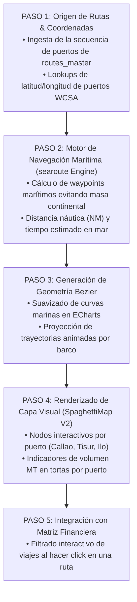

# 🗺️ AS-BUILT Flowchart 03 — Mapa de Espaguetis (SpaghettiMap)

> **Herramienta**: Trazo Geográfico & Visualizador de Rutas Marítimas
> **Ruta UI**: `/spaghetti-map`
> **Componentes React**: `SpaghettiMap_V2.tsx`, `SpaghettiMap.tsx`
> **Script Python Diagrama**: `C:\Users\rguti\PETRAL.SMART.DASHBOARD\Boiler.Plate\Flow.Charts\FLOWCHART_MAPA_ESPAGUETIS.py`
> **Asset SVG Public**: `Geeksoft_Frontend/public/FLOWCHART_MAPA_ESPAGUETIS.svg`

---

## 🧭 Navegación
| [← Flowchart Auditoría Dual](file:///C:/Users/rguti/PETRAL.SMART.DASHBOARD/Desarrollo.Profesional/Obsidian.1/DashBoardPetral/06_AS_BUILT/04_Flowcharts_y_Diagramas_AS_BUILT/02_AS_BUILT_Flowchart_Auditoria_Dual.md) | 🏠 [[00_AS_BUILT_Indice_General_Dashboard]] | [Siguiente: Flowchart Matriz Financiera →](file:///C:/Users/rguti/PETRAL.SMART.DASHBOARD/Desarrollo.Profesional/Obsidian.1/DashBoardPetral/06_AS_BUILT/04_Flowcharts_y_Diagramas_AS_BUILT/04_AS_BUILT_Flowchart_Matriz_Financiera.md) |

---

## 🔄 Flujo Estricto de 5 Pasos

---

## 🔗 Enlaces Relacionados
- [[AS_BUILT_Herramienta_06_Mapa_de_Espaguetis]] — Documentación de la herramienta UI.
- [[AS_BUILT_Maestro_02_Rutas_RuteadorSpot_RouteMaster]] — Secuencia de puertos.
