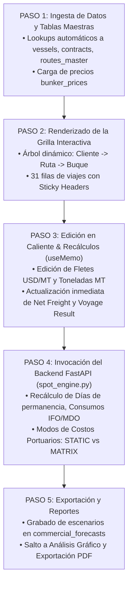

# 📊 AS-BUILT Flowchart 04 — Matriz Financiera (Commercial Forecast)

> **Herramienta**: Tablero P&L Comercial y Grilla de 31 Viajes
> **Ruta UI**: `/dashboard`
> **Componentes React**: `FinancialMatrix_V2.tsx`, `CommercialForecast.tsx`
> **Script Python Diagrama**: `C:\Users\rguti\PETRAL.SMART.DASHBOARD\Boiler.Plate\Flow.Charts\FLOWCHART_MATRIZ_FINANCIERA.py`
> **Asset SVG Public**: `Geeksoft_Frontend/public/FLOWCHART_MATRIZ_FINANCIERA.svg`

---

## 🧭 Navegación
| [← Flowchart Mapa Espaguetis](file:///C:/Users/rguti/PETRAL.SMART.DASHBOARD/Desarrollo.Profesional/Obsidian.1/DashBoardPetral/06_AS_BUILT/04_Flowcharts_y_Diagramas_AS_BUILT/03_AS_BUILT_Flowchart_Mapa_Espaguetis.md) | 🏠 [[00_AS_BUILT_Indice_General_Dashboard]] | [Siguiente: Flowchart Motor BAF →](file:///C:/Users/rguti/PETRAL.SMART.DASHBOARD/Desarrollo.Profesional/Obsidian.1/DashBoardPetral/06_AS_BUILT/04_Flowcharts_y_Diagramas_AS_BUILT/05_AS_BUILT_Flowchart_Motor_BAF.md) |

---

## 🔄 Flujo Estricto de 5 Pasos

---

## 🔗 Enlaces Relacionados
- [[AS_BUILT_Herramienta_02_Matriz_Financiera_Dashboard]] — Documentación de la herramienta UI.
- [[AS_BUILT_Herramienta_07_Auditoria_Ledger_VoyageLedger]] — Engine P&L.
