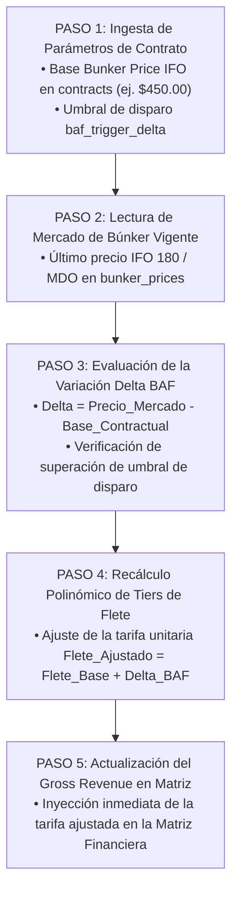

# ⚡ AS-BUILT Flowchart 05 — Motor BAF (Bunker Adjustment Factor)

> **Herramienta**: Motor BAF de Indexación Tarifaria
> **Ruta UI**: `/contracts`
> **Componentes React**: `ContractsMaster.tsx`, `ContractsMaster_V2.tsx`
> **Script Python Diagrama**: `C:\Users\rguti\PETRAL.SMART.DASHBOARD\Boiler.Plate\Flow.Charts\FLOWCHART_MOTOR_BAF.py`
> **Asset SVG Public**: `Geeksoft_Frontend/public/FLOWCHART_MOTOR_BAF.svg`

---

## 🧭 Navegación
| [← Flowchart Matriz Financiera](file:///C:/Users/rguti/PETRAL.SMART.DASHBOARD/Desarrollo.Profesional/Obsidian.1/DashBoardPetral/06_AS_BUILT/04_Flowcharts_y_Diagramas_AS_BUILT/04_AS_BUILT_Flowchart_Matriz_Financiera.md) | 🏠 [[00_AS_BUILT_Indice_General_Dashboard]] | [Siguiente: Flowchart Motor PxQ →](file:///C:/Users/rguti/PETRAL.SMART.DASHBOARD/Desarrollo.Profesional/Obsidian.1/DashBoardPetral/06_AS_BUILT/04_Flowcharts_y_Diagramas_AS_BUILT/06_AS_BUILT_Flowchart_Motor_PxQ.md) |

---

## 🔄 Flujo Estricto de 5 Pasos

---

## 🔗 Enlaces Relacionados
- [[AS_BUILT_Maestro_04_Contratos_ContractsMaster]] — Parámetros de contrato.
- [[AS_BUILT_Maestro_09_Precios_Bunker_BunkerMaster]] — Cotización de combustibles marinos.
