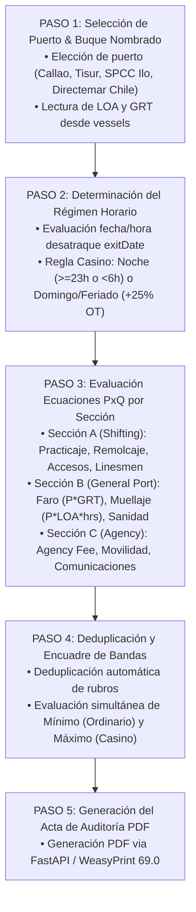

# 🏗️ AS-BUILT Flowchart 06 — Motor PxQ Portuario

> **Herramienta**: Motor PxQ de Tarifas y Liquidaciones Portuarias
> **Ruta UI**: `/port-tariffs`
> **Componentes React**: `PortTariffsMaster.tsx`, `DynamicAuditViewer.tsx`
> **Script Python Diagrama**: `C:\Users\rguti\PETRAL.SMART.DASHBOARD\Boiler.Plate\Flow.Charts\FLOWCHART_MOTOR_PXQ.py`
> **Asset SVG Public**: `Geeksoft_Frontend/public/FLOWCHART_MOTOR_PXQ.svg`

---

## 🧭 Navegación
| [← Flowchart Motor BAF](file:///C:/Users/rguti/PETRAL.SMART.DASHBOARD/Desarrollo.Profesional/Obsidian.1/DashBoardPetral/06_AS_BUILT/04_Flowcharts_y_Diagramas_AS_BUILT/05_AS_BUILT_Flowchart_Motor_BAF.md) | 🏠 [[00_AS_BUILT_Indice_General_Dashboard]] | [Siguiente: Flowchart Multicotizador →](file:///C:/Users/rguti/PETRAL.SMART.DASHBOARD/Desarrollo.Profesional/Obsidian.1/DashBoardPetral/06_AS_BUILT/04_Flowcharts_y_Diagramas_AS_BUILT/07_AS_BUILT_Flowchart_Multicotizador.md) |

---

## 🔄 Flujo Estricto de 5 Pasos

---

## 🔗 Enlaces Relacionados
- [[AS_BUILT_Maestro_07_Tarifario_Portuario_PortTariffsMaster]] — Tarifario PxQ.
- [[AS_BUILT_Herramienta_05_Auditoria_PDF_Liquidaciones_WeasyPrint]] — Motor de generación PDF.
