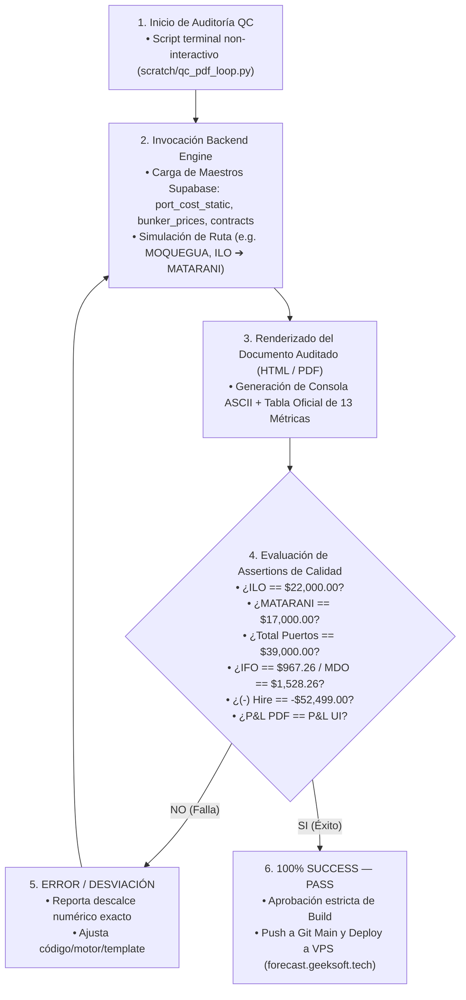

# 🔄 AS-BUILT 07.1 — Loop de Control de Calidad (QC Loop) Multicotizador & PDF

> **Módulo**: Control de Calidad Automatizado & Auditoría Dual (UI vs PDF)
> **Ruta UI**: `/multicotizador`
> **Script Python Auditoría**: `scratch/qc_pdf_loop.py`
> **Nota Padre**: [[07_AS_BUILT_Flowchart_Multicotizador]]

---

## 🧭 Navegación
| [← Flowchart Multicotizador Spot](file:///C:/Users/rguti/PETRAL.SMART.DASHBOARD/Desarrollo.Profesional/Obsidian.1/DashBoardPetral/06_AS_BUILT/04_Flowcharts_y_Diagramas_AS_BUILT/07_AS_BUILT_Flowchart_Multicotizador.md) | 🏠 [[00_AS_BUILT_Indice_General_Dashboard]] | [Siguiente: Flowchart Voyage Ledger →](file:///C:/Users/rguti/PETRAL.SMART.DASHBOARD/Desarrollo.Profesional/Obsidian.1/DashBoardPetral/06_AS_BUILT/04_Flowcharts_y_Diagramas_AS_BUILT/08_AS_BUILT_Flowchart_Voyage_Ledger.md) |

---

## 🎯 Propósito del QC Loop

El **Loop de Control de Calidad Automatizado (QC Loop)** es un mecanismo de verificación non-interactivo en terminal que valida la concordancia matemática al 100.0% entre el **Motor Backend (Geeksoft Engine)**, la **Interfaz de Usuario (UI React)** y el **Acta Oficial de Cálculos Detallados (PDF)** antes de cualquier despliegue en producción.

---

## 🔄 Flujo del Loop de Auditoría (Diagrama Mermaid)

---

## 📊 Matriz de Assertions del Loop de Calidad

| Check # | Métrica Auditada | Fuente / Estándar | Valor Esperado | Criterio de Aprobación |
| :-: | :--- | :--- | :-: | :--- |
| **1** | **Agencia POL (ILO)** | Maestro Gastos Portuarios (22.Junio.2026) | **`$22,000.00 USD`** | `abs(val - 22000.0) < 0.01` |
| **2** | **Agencia POD (MATARANI)** | Maestro Gastos Portuarios (22.Junio.2026) | **`$17,000.00 USD`** | `abs(val - 17000.0) < 0.01` |
| **3** | **Total Port Costs** | Suma Estática Puertos Origen + Destino | **`$39,000.00 USD`** | `abs(val - 39000.0) < 0.01` |
| **4** | **Búnker IFO 380** | Séptimo Ajuste (2.Julio.2026) | **`$967.26 / MT`** | `abs(val - 967.26) < 0.01` |
| **5** | **Búnker MDO** | Séptimo Ajuste (2.Julio.2026) | **`$1,528.26 / MT`** | `abs(val - 1528.26) < 0.01` |
| **6** | **(-) Hire** | TCE Requerido Nave × Días Totales | **`-$52,499.00 USD`** | `Coincidencia exacta con UI` |
| **7** | **Voyage Result P&L** | Revenue - Hire - Bunker - Ports - Comm | **`$145,279.00 USD`** | `PDF == UI (Sincronización Total)` |

---

## 🔗 Enlaces Relacionados
- [[07_AS_BUILT_Flowchart_Multicotizador]] — Diagrama principal del Multicotizador.
- [[AS_BUILT_Herramienta_01_Multicotizador_Spot]] — Especificaciones técnicas de la UI.
- [[AS_BUILT_Herramienta_02_Acta_Calculos_Detallados]] — Documentación del Acta PDF.
