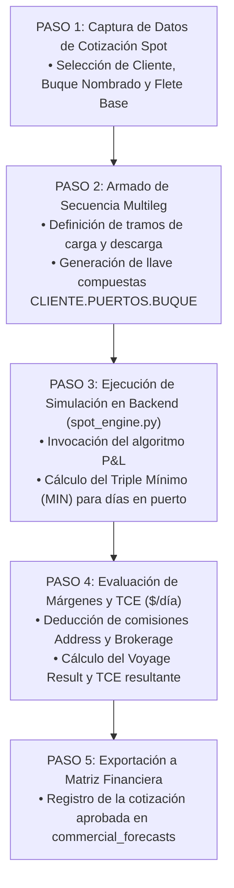

# 🧮 AS-BUILT Flowchart 07 — Multicotizador Spot

> **Herramienta**: Cotizador Paramétrico de Viajes Multileg
> **Ruta UI**: `/multicotizador`
> **Componentes React**: `MultiCotizador_V2.tsx`, `MultiCotizadorExcel.tsx`
> **Script Python Diagrama**: `C:\Users\rguti\PETRAL.SMART.DASHBOARD\Boiler.Plate\Flow.Charts\FLOWCHART_MULTICOTIZADOR.py`
> **Asset SVG Public**: `Geeksoft_Frontend/public/FLOWCHART_MULTICOTIZADOR.svg`

---

## 🧭 Navegación
| [← Flowchart Motor PxQ](file:///C:/Users/rguti/PETRAL.SMART.DASHBOARD/Desarrollo.Profesional/Obsidian.1/DashBoardPetral/06_AS_BUILT/04_Flowcharts_y_Diagramas_AS_BUILT/06_AS_BUILT_Flowchart_Motor_PxQ.md) | 🏠 [[00_AS_BUILT_Indice_General_Dashboard]] | [Siguiente: Flowchart Voyage Ledger →](file:///C:/Users/rguti/PETRAL.SMART.DASHBOARD/Desarrollo.Profesional/Obsidian.1/DashBoardPetral/06_AS_BUILT/04_Flowcharts_y_Diagramas_AS_BUILT/08_AS_BUILT_Flowchart_Voyage_Ledger.md) |

---

## 🔄 Flujo Estricto de 5 Pasos

---

## 🔗 Enlaces Relacionados
- [[07_01_AS_BUILT_QC_Loop_Multicotizador]] — Nota Hija: Loop de Control de Calidad Automatizado & Auditoría Dual (UI vs PDF).
- [[AS_BUILT_Herramienta_01_Multicotizador_Spot]] — Documentación de la herramienta UI.
- [[AS_BUILT_Maestro_02_Rutas_RuteadorSpot_RouteMaster]] — Llave de rutas.
