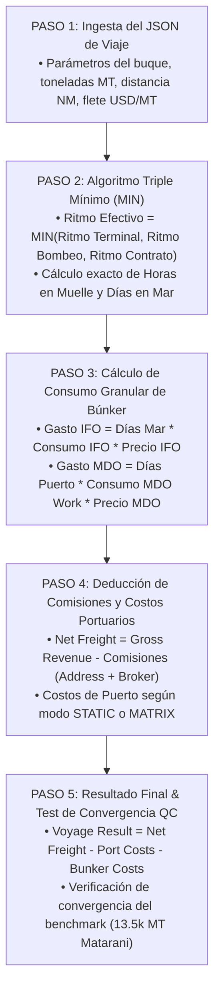

# ⚓ AS-BUILT Flowchart 08 — Voyage Ledger Engine

> **Herramienta**: Motor Algorítmico P&L y Ledger de Navegación
> **Ruta UI**: `/audit-ledger`
> **Componentes React**: `AuditLedger_V2.tsx`, `VoyageLedgerFinal.tsx`
> **Script Python Backend**: `backend/spot_engine.py`
> **Script Python Diagrama**: `C:\Users\rguti\PETRAL.SMART.DASHBOARD\Boiler.Plate\Flow.Charts\FLOWCHART_VOYAGE_LEDGER.py`
> **Asset SVG Public**: `Geeksoft_Frontend/public/FLOWCHART_VOYAGE_LEDGER.svg`

---

## 🧭 Navegación
| [← Flowchart Multicotizador](file:///C:/Users/rguti/PETRAL.SMART.DASHBOARD/Desarrollo.Profesional/Obsidian.1/DashBoardPetral/06_AS_BUILT/04_Flowcharts_y_Diagramas_AS_BUILT/07_AS_BUILT_Flowchart_Multicotizador.md) | 🏠 [[00_AS_BUILT_Indice_General_Dashboard]] | [← Volver al Índice General](file:///C:/Users/rguti/PETRAL.SMART.DASHBOARD/Desarrollo.Profesional/Obsidian.1/DashBoardPetral/06_AS_BUILT/00_Fundamentos_y_Arquitectura/00_AS_BUILT_Indice_General_Dashboard.md) |

---

## 🔄 Flujo Estricto de 5 Pasos

---

## 🔗 Enlaces Relacionados
- [[AS_BUILT_Herramienta_07_Auditoria_Ledger_VoyageLedger]] — Documentación de la herramienta UI.
- [[AS_BUILT_Maestro_01_Buques_VesselsMaster]] — Consumos del buque.
