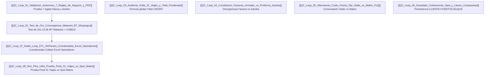

# 🧪 Index de Protocolos y Loops de QC (Control de Calidad)

> **Ubicación**: `C:\Users\rguti\PETRAL.SMART.DASHBOARD\Desarrollo.Profesional\Obsidian.1\DashBoardPetral\06_AS_BUILT\05_Protocolos_QC_y_Tests_de_Aceptacion\`
> **Propósito**: Guía explicativa e índice navegable de todos los bucles de auditoría (QC Loops) del software.

---

## 🧭 Navegación
| [← Volver al Índice General](file:///C:/Users/rguti/PETRAL.SMART.DASHBOARD/Desarrollo.Profesional/Obsidian.1/DashBoardPetral/06_AS_BUILT/00_Fundamentos_y_Arquitectura/00_AS_BUILT_Indice_General_Dashboard.md) | 🏠 [[00_AS_BUILT_Indice_General_Dashboard]] | [Plan Maestro →](file:///C:/Users/rguti/PETRAL.SMART.DASHBOARD/Desarrollo.Profesional/Obsidian.1/DashBoardPetral/06_AS_BUILT/00_Plan_Maestro_AS_BUILT.md) |

---

## 📋 Resumen Explicativo de Cada Loop de QC

---

## 🔍 Catálogo Detallado de Loops

### 1. [[QC_Loop_01_Validacion_Autonoma_7_Reglas_de_Negocio_y_PDF]]
- **¿Qué hace?**: Corre la suite autónoma `run_qc_loop_pdf.py` en terminal.
- **¿Qué compara?**: Audita las rutas en Supabase contra **7 Reglas Invariables** (búnker $> \$20\text{k}$ si dist $> 500\text{ NM}$, lastre $\$0.00$, Mejillones $\ge \$45\text{k}$, naming SPCC `SPCC.ILO.PUERTO.ILO`).
- **Salida**: Genera el PDF oficial `ACTA_AUDITORIA_FINAL_RUTAS_SPCC_NEXA.pdf`.

### 2. [[QC_Loop_02_Test_de_Oro_Convergencia_Matarani_BT_Moquegua]]
- **¿Qué hace?**: El "Test de Oro" del Voyage Ledger Engine.
- **¿Qué compara?**: Exige que al enviar 13,500 MT a Matarani (Laden) con el barco `MOQUEGUA`, el motor converja exactamente en **4.0801 días**, **$39,000.00** en puerto y **$18,560.53** en búnker contra el Excel de PETRAL.

### 3. [[QC_Loop_03_Auditoria_Grilla_31_Viajes_y_Yield_Ponderado]]
- **¿Qué hace?**: Audita los recálculos dinámicos en la Matriz Financiera (`/dashboard`).
- **¿Qué compara?**: Valida la preservación de la fórmula de Yield Ponderado Global: $\sum(\text{Gross}+\text{Demurrage}) / \sum(\text{MT})$.

### 4. [[QC_Loop_04_Conciliacion_Facturas_Armador_vs_Proforma_Sandra]]
- **¿Qué hace?**: Módulo de auditoría dual (`/audit-final`).
- **¿Qué compara?**: Compara las facturas reales del armador/agente contra la plantilla Excel de Sandra y la proforma PxQ del sistema, emitiendo veredictos de Aprobación o Objeción.

### 5. [[QC_Loop_05_Alternancia_Costo_Puerto_Fijo_Static_vs_Matrix_PxQ]]
- **¿Qué hace?**: Test de conmutación de modo de costo portuario.
- **¿Qué compara?**: Certifica que el motor pase limpiamente del costo fijo estático (`port_cost_static`) al tarifario granular PxQ (`port_costs_matrix`) sin distorsionar el Voyage Result.

### 6. [[QC_Loop_06_Guardado_Cotizaciones_Spot_y_Llaves_Compuestas]]
- **¿Qué hace?**: Test del Multicotizador Spot (`/multicotizador`).
- **¿Qué compara?**: Valida que al guardar una cotización multileg se genere la llave compuestas `${CLIENTE}.${PUERTOS}.${BUQUE}` en `routes_master` en Supabase DB.

### 7. [[QC_Loop_07_Doble_Loop_ETL_ReParseo_Coordenadas_Excel_Operadores]]
- **¿Qué hace?**: Protocolo del Doble Loop de Re-Parseo ETL sobre los Exceles de liquidación.
- **¿Qué compara?**: Mapea las coordenadas exactas de celdas (Col N/Q Filas 14-20 en Single Leg y Col C/H/S Fila 48/23 en Multileg) para corregir la tabla `voyage_liquidations` de Supabase DB.

### 8. [[QC_Loop_08_Non_Plus_Ultra_Prueba_Final_31_Viajes_vs_Spot_Matrix]]
- **¿Qué hace?**: La **Prueba Final de Auditoría** (`run_qc_loop_non_plus_ultra.py`).
- **¿Qué compara?**: Simula los 31 viajes ejecutados reales de la flota contra el Multicotizador Spot con centavos PxQ dinámicos, midiendo la convergencia ($\le \pm 10\%$ días, $\le \pm 8\%$ búnker) y **cazando números planos ficticios** (ej. `$30,000.00`).
