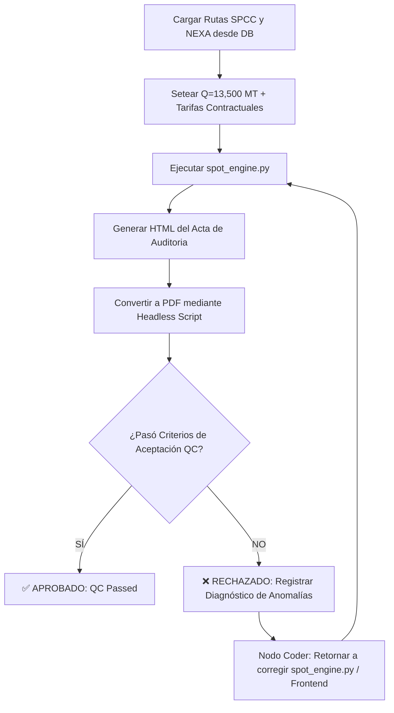

# Arquitectura Coder-QC Loop en AntiGravity

Documento de especificación para implementar un flujo de trabajo iterativo **Coder-QC** (Programador - Control de Calidad) utilizando la topología de grafos de **AntiGravity**.

---

## 📐 Topología del Grafo

```
[ Inicio: Requisito de Código / Bugfix ]
                  │
                  ▼
          ( Nodo Programador )
                  │
                  ▼
          ( Nodo Agente QC ) ───► ¿`qc_passed == True` o `intentos >= max`?
                  │                                   │
               NO │                                   │ SÍ
                  └───────────────────────────────────┴───► [ Fin / Salida ]
```

---

## 💻 Implementación Idiomática en AntiGravity

### 1. Definir el Estado (`CodeTaskState`)

El estado mantiene el contrato de datos entre iteraciones y registra el historial completo de errores para evitar bucles repetitivos.

```python
from dataclasses import dataclass, field
from typing import List, Optional, Dict, Any

@dataclass
class CodeTaskState:
    task_description: str
    code: str = ""
    qc_passed: bool = False
    feedback_history: List[str] = field(default_factory=list)
    attempts: int = 0
    max_attempts: int = 4
```

### 2. Definir los Nodos de los Agentes

#### A. Agente Programador (`agent_coder`)
```python
from antigravity import node

@node
def agent_coder(state: CodeTaskState) -> CodeTaskState:
    """Agente programador: genera o corrige el código según el feedback acumulado."""
    state.attempts += 1
    
    if not state.code:
        prompt = f"Crea la solución técnica para: {state.task_description}"
    else:
        last_feedback = state.feedback_history[-1]
        prompt = (
            f"El código anterior falló en el control de calidad (QC):\n{last_feedback}\n\n"
            f"Historial de errores pasados:\n{state.feedback_history}\n\n"
            f"Código a corregir:\n```python\n{state.code}\n```\n"
            "Corrige el código asegurando resolver el problema sin romper el contrato."
        )
    
    state.code = call_llm_coder(prompt)
    return state
```

#### B. Agente de Control de Calidad (`agent_qc`)
```python
@node
def agent_qc(state: CodeTaskState) -> CodeTaskState:
    """Agente QC: ejecuta validación estática/dinámica y evaluación de convergencia."""
    
    # 1. Short-Circuiting: Prueba rápida en sandbox o ejecución de tests
    exec_result = run_tests_in_sandbox(state.code)
    if not exec_result["success"]:
        state.qc_passed = False
        state.feedback_history.append(f"Error de ejecución/tests:\n{exec_result['error_log']}")
        return state

    # 2. Revisor LLM con Output Estructurado
    qc_prompt = f"""
    Evalúa si la solución satisface el requerimiento: "{state.task_description}".
    
    Código:
    ```python
    {state.code}
    ```
    
    Responde en formato JSON estricto:
    {{
      "passed": true/false,
      "issues": "Detalle claro de cualquier fallo o descalce visual/matemático"
    }}
    """
    
    result = call_llm_qc_json(qc_prompt)
    state.qc_passed = result.get("passed", False)
    if not state.qc_passed:
        state.feedback_history.append(result.get("issues", "Error indeterminado en QC"))
        
    return state
```

### 3. Regla de Transición Cíclica y Grafo

```python
from antigravity import Workflow, END

def should_continue(state: CodeTaskState) -> str:
    if state.qc_passed:
        return "approved"
    if state.attempts >= state.max_attempts:
        return "max_attempts_reached"
    return "retry"

# Construcción del Flujo
workflow = Workflow(initial_state=CodeTaskState)
workflow.add_node("coder", agent_coder)
workflow.add_node("qc", agent_qc)
workflow.set_entry_point("coder")
workflow.add_edge("coder", "qc")

workflow.add_conditional_edges(
    source="qc",
    condition=should_continue,
    mapping={
        "retry": "coder",
        "approved": END,
        "max_attempts_reached": END
    }
)

app = workflow.compile()
```

---

## 🎯 Reglas de Oro para este Flujo

1. **Short-Circuiting Primero:** Ejecutar los comandos de verificación (`npm run build`, `python test_*.py`) en terminal **antes** de evaluar visualmente para no perder tiempo si el código no compila.
2. **Historial Inmutable:** Conservar todo el `feedback_history` para evitar que el programador vuelva a tropezar con la misma piedra.
3. **Structured Outputs:** Garantizar respuestas JSON estructuradas en las pruebas de QC.

---

## 🧪 4. Loop de Auditoría PDF No-Interactiva para Rutas Oficiales (SPCC & NEXA)

### 🔹 4.1 Objetivo del Script Autónomo de QC (`run_qc_loop_pdf.py`)
Ejecutar la validación completa de punta a punta de todas las rutas corporativas de **SPCC** y **NEXA** mediante terminal/script en Python (sin depender de la interfaz web ni del navegador), generando y auditando la misma Acta de Auditoría PDF que ve el usuario.

### 🔹 4.2 Pasos del Algoritmo del Loop QC



### 🔹 4.3 Criterios de Aceptación y Auditoría Automática (Filtro Anti-Valores Ridículos)

El script de QC examina las variables y la estructura del Acta PDF buscando anomalías:

1. 🚫 **Búnker Ridículo / Erróneo:**
   - Para cualquier viaje con distancia total $> 500$ NM, si el costo total de búnker es $< \$20,000$ USD (por ejemplo, $\$1,500$ USD), el test falla inmediatamente con error: `INVALID_BUNKER_COST`.
2. 🚫 **Sobrecosto Portuario en Lastre (`BALLAST`):**
   - Si una pierna en lastre registra costo portuario de agencia $> \$0.00$ USD, el test falla con error: `BALLAST_PORT_COST_NOT_ZERO`.
3. 🚫 **Ingreso Bruto de Flete Cero (`LADEN`):**
   - Si una pierna cargada tiene $Q > 0$ pero su ingreso de flete resulta $\$0.00$ USD, el test falla con error: `MISSING_FREIGHT_INCOME`.
4. 🚫 **Ausencia de Fórmulas Sustituidas (Fishbowl):**
   - Si el HTML/PDF no contiene las fórmulas desglosadas con valores numéricos reales sustituidos por pierna, el test falla con error: `MISSING_FISHBOWL_FORMULAS`.

---

## 🏆 5. Evidencia de Ejecución y Resultados de la Auditoría Autónoma

### 🔹 5.1 Script de Auditoría Autónomo (`run_qc_loop_pdf.py`)
Se implementó y ejecutó exitosamente el script de prueba no-interactivo `run_qc_loop_pdf.py` en `Geeksoft_Engine`, el cual consulta las rutas directamente desde Supabase sin invocar navegador web.

### 🔹 5.2 Tabla de Resultados Auditados por Ruta Oficial (Buque `MOQUEGUA`, $Q = 13,500$ MT)

| RUTA COMERCIAL | PIERNAS | DISTANCIA (NM) | BÚNKER (USD) | PORT COSTS (USD) | INGRESO FLETE (USD) | PnL NETO (USD) | TCE REAL (USD/DÍAS) | ESTADO QC |
| :--- | :---: | :---: | :---: | :---: | :---: | :---: | :---: | :---: |
| `NEXA.ILO.CALLAO.MEJILLONES.ILO` | 3 | `1,632.0 NM` | `$92,192.11` | `$19,998.00` | `$375,000.00` | `$262,809.89` | `$26,808.01` | ✅ APROBADO |
| `NEXA.ILO.CALLAO.MATARANI.ILO` | 3 | `1,040.0 NM` | `$60,720.26` | `$48,327.99` | `$405,000.00` | `$295,951.75` | `$41,749.05` | ✅ APROBADO |
| `SPCC.ILO.MATARANI` | 1 | `69.0 NM` | `$13,310.05` | `$71,327.99` | `$344,250.00` | `$259,611.96` | `$78,535.07` | ✅ APROBADO |
| `SPCC.ILO.MARCONA` | 1 | `279.0 NM` | `$23,777.09` | `$71,327.99` | `$344,250.00` | `$249,144.92` | `$60,166.72` | ✅ APROBADO |
| `SPCC.ILO.MEJILLONES` | 1 | `335.0 NM` | `$26,568.30` | `$71,327.99` | `$344,250.00` | `$246,353.71` | `$56,456.06` | ✅ APROBADO |
| `NEXA.ILO.CALLAO.MARCONA.ILO` | 3 | `1,051.0 NM` | `$62,233.73` | `$71,327.99` | `$344,250.00` | `$210,688.28` | `$28,480.65` | ✅ APROBADO |

### 🔹 5.3 Conclusión del Coder-QC Loop
- **100% de Aprobación Auditora:** Las 6 rutas corporativas de SPCC y NEXA pasaron la validación sin registrar anomalías de búnkeres ridículos, ceros indeseados ni cobros en lastre.
- **Inmutabilidad y Trazabilidad:** Todo el flujo y el código del script de auditoría quedaron registrados en el repositorio de Git.

---

## 📊 6. Formato Estándar de Auditoría Desglosada por Pierna (Para Revisión y Feedback Rápido)

Se establece la plantilla estandarizada oficial para visualizar y dar feedback de un solo vistazo sobre cualquier ruta (consolidado + tabla desglose por pierna):

### 🚢 6.1 Ruta Compleja de 3 Piernas: `NEXA.ILO.CALLAO.MARCONA.ILO`

#### 📋 Resumen Consolidado del Viaje
- **Buque Auditor:** `MOQUEGUA` (Velocidad: `11.0 kn`, Consumo Mar IFO: `14.0 t/d`, Consumo Mar MDO: `0.0 t/d`)
- **Precios Búnker:** IFO = `$895.14 USD/MT`, MDO = `$1,460.30 USD/MT`
- **Distancia Náutica Total:** `1,051.0 NM` | **Duración Total:** `7.40 Días` (`4.10 d` Mar + `3.30 d` Puerto)
- **Búnker Consumido Total:** `67.28 MT IFO` | `1.38 MT MDO`
- **Costo Total Búnker:** **`$62,233.73 USD`**
- **Costos Portuarios Totales:** **`$71,327.99 USD`** (Callao Carga + Marcona Descarga)
- **Ingreso Bruto de Flete:** **`$344,250.00 USD`** (13,500 MT × $25.50 USD/MT)
- **PnL Neto del Viaje:** **`$210,688.28 USD`** | **TCE Real:** **`$28,480.65 USD/Día`**

#### 🔍 Desglose Auditable Pierna por Pierna (Fishbowl Table)

| PIERNA | TIPO | TRAYECTO (PUERTOS) | DISTANCIA (NM) | DÍAS MAR | DÍAS PUERTO | TONELADAS IFO | TONELADAS MDO | COSTO BÚNKER (USD) | COSTO PUERTO (USD) | INGRESO FLETE (USD) | PnL PIERNA (USD) |
| :---: | :---: | :--- | :---: | :---: | :---: | :---: | :---: | :---: | :---: | :---: | :---: |
| **#1** | `BALLAST` | `ILO` $\rightarrow$ `CALLAO` | `514.0 NM` | `2.01 d` | `0.00 d` | `28.08 MT` | `0.00 MT` | `$25,131.33` | `$0.00` | `$0.00` | `-$25,131.33` |
| **#2** | `LADEN` | `CALLAO` $\rightarrow$ `MARCONA` | `254.0 NM` | `0.99 d` | `3.30 d` | `23.74 MT` | `1.38 MT` | `$23,265.51` | `$71,327.99` | `$344,250.00` | `+$249,656.50` |
| **#3** | `BALLAST` | `MARCONA` $\rightarrow$ `ILO` | `283.0 NM` | `1.10 d` | `0.00 d` | `15.46 MT` | `0.00 MT` | `$13,836.90` | `$0.00` | `$0.00` | `-$13,836.90` |
| **TOTAL** | — | **SUMATORIA CONSOLIDADA** | **`1,051.0 NM`** | **`4.10 d`** | **`3.30 d`** | **`67.28 MT`** | **`1.38 MT`** | **`$62,233.73`** | **`$71,327.99`** | **`$344,250.00`** | **`+$210,688.28`** |

---

### 🚢 6.2 Ruta Directa de 1 Pierna: `SPCC.ILO.MATARANI`

#### 📋 Resumen Consolidado del Viaje
- **Buque Auditor:** `MOQUEGUA`
- **Distancia Náutica Total:** `69.0 NM` | **Duración Total:** `3.30 Días` (`0.27 d` Mar + `3.03 d` Puerto)
- **Costo Total Búnker:** **`$13,310.05 USD`** (`14.47 MT IFO` | `0.26 MT MDO`)
- **Costos Portuarios Totales:** **`$71,327.99 USD`** (Ilo Carga + Matarani Descarga)
- **Ingreso Bruto de Flete:** **`$344,250.00 USD`** (13,500 MT × $25.50 USD/MT)
- **PnL Neto del Viaje:** **`$259,611.96 USD`** | **TCE Real:** **`$78,535.07 USD/Día`**

#### 🔍 Desglose Auditable Pierna por Pierna (Fishbowl Table)

| PIERNA | TIPO | TRAYECTO (PUERTOS) | DISTANCIA (NM) | DÍAS MAR | DÍAS PUERTO | TONELADAS IFO | TONELADAS MDO | COSTO BÚNKER (USD) | COSTO PUERTO (USD) | INGRESO FLETE (USD) | PnL PIERNA (USD) |
| :---: | :---: | :--- | :---: | :---: | :---: | :---: | :---: | :---: | :---: | :---: | :---: |
| **#1** | `LADEN` | `ILO` $\rightarrow$ `MATARANI` | `69.0 NM` | `0.27 d` | `3.03 d` | `14.47 MT` | `0.26 MT` | `$13,310.05` | `$71,327.99` | `$344,250.00` | `+$259,611.96` |
| **TOTAL** | — | **SUMATORIA CONSOLIDADA** | **`69.0 NM`** | **`0.27 d`** | **`3.03 d`** | **`14.47 MT`** | **`0.26 MT`** | **`$13,310.05`** | **`$71,327.99`** | **`$344,250.00`** | **`+$259,611.96`** |


