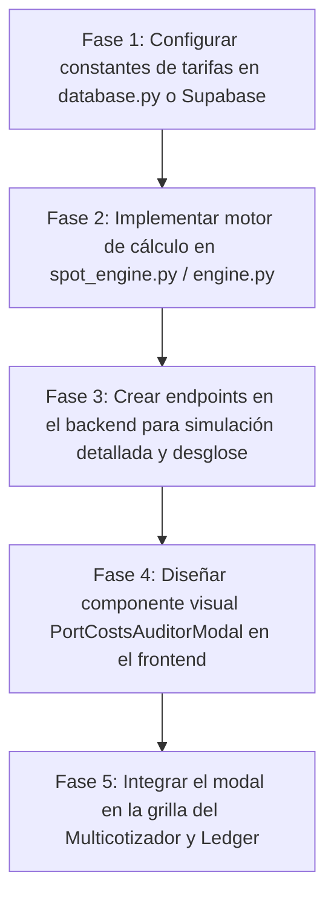

# ⚓ Matriz de Costos Portuarios Extraídos (SPCC)

Este documento centraliza los costos fijos de agencia y aduanas extraídos de los Exceles de *Voyage Calculations* reales (Tablones, Moquegua, Concon Trader) pertenecientes al cliente SPCC.

Esta información alimenta directamente la tabla `agency_matrix` en la Base de Datos según el [[Modelo.E-R]].

## 📊 Matriz Base de Tarifas Reales (SPCC)

| Puerto (Port ID) | Buque (Vessel ID) | Costo Portuario Extraído (USD) | Tipo de Operación Inferido |
| :--- | :--- | :--- | :--- |
| **ILO** | CONCON_TRADER | $23,500 | CARGA (Origen) |
| **ILO** | MOQUEGUA | $22,000 | CARGA (Origen) |
| **ILO** | TABLONES | $23,000 | CARGA (Origen) |
| **MATARANI** | CONCON_TRADER | $19,000 | DESCARGA (Destino) |
| **MATARANI** | MOQUEGUA | $17,000 | DESCARGA (Destino) |
| **MATARANI** | TABLONES | $18,000 | DESCARGA (Destino) |
| **MARCONA** | CONCON_TRADER | $61,000 | DESCARGA (Destino) |
| **MARCONA** | MOQUEGUA | $40,000 | DESCARGA (Destino) |
| **MARCONA** | TABLONES | $44,000 | DESCARGA (Destino) |
| **MEJILLONES** | CONCON_TRADER | $60,000 | DESCARGA (Destino) |
| **MEJILLONES** | MOQUEGUA | $29,000 | DESCARGA (Destino) |
| **MEJILLONES** | TABLONES | $32,000 | DESCARGA (Destino) |

> 📌 **Nota Operativa:**
> Todos estos valores pertenecen comercialmente al cliente **SPCC**. En el esquema de rutas de cabotaje/exportación de ácido sulfúrico, el puerto de Ilo actúa como base de origen (`CARGA`), mientras que Matarani, Marcona y Mejillones actúan como puertos de destino final (`DESCARGA`).

---
*Datos auditados y extraídos directamente de la gerencia comercial para inyección en el módulo Commercial Forecast.*

---

## 🛠️ Sesión de Trabajo — 2026-07-08

### Bugs Corregidos

#### 1. Anomalía Visual en Yield de Enero 2027 (ILO-MARCONA / MOQUEGUA / SPCC)

- **Síntoma:** La grilla mostraba **1 viaje** y **13,500 MT** en Enero 2027, pero los campos financieros (Gross Revenue: `$616,140`) correspondían a **2 viajes**, disparando el Yield Flete a `$32.33 USD/MT` en lugar de `$20.92 USD/MT`.
- **Causa Raíz:** `handleFrequencyChange` en `CommercialForecast.tsx` usaba solo `destination_port_id` para buscar la línea a actualizar (`findIndex` devolvía `-1`), insertando un duplicado en el estado `projectionLines`. La UI pintaba el duplicado (1 viaje) pero el backend recibía ambas líneas y calculaba los financieros con 2 viajes.
- **Solución:** Se refactorizaron `handleFrequencyChange` y `handleTariffChange` para comparar `origin_port_id` **y** `destination_port_id`. Se agregó deduplicación en caliente y limpieza automática al cargar escenarios (`handleLoadSelected`).
- **Archivo modificado:** `src/pages/CommercialForecast/CommercialForecast.tsx`

#### 2. SPCC no aparecía en el selector de Cliente de la Matriz Financiera

- **Síntoma:** Al agregar una nueva ruta de SPCC a un escenario cargado, el selector de Cliente solo mostraba NEXA.
- **Causa Raíz:** `ForecastBuilder_V2` construía la lista de clientes filtrando **únicamente** rutas con bandera `is_multicotizador === true` en la tabla `spots`. SPCC tiene rutas simples hardcodeadas, no guardadas ahí.
- **Solución:** Se agregó `SPCC` como cliente fijo garantizado. NEXA y demás siguen siendo dinámicos según BD. SPOT fue evaluado y retirado.
- **Archivo modificado:** `src/components/CommercialForecast/ForecastBuilder_V2.tsx`

### Mejoras / Assets

#### 3. Foto del B/T MOQUEGUA actualizada en Maestro de Buques

- Imagen anterior `moquegua_1.jpg` reemplazada por fotografía oficial a color (`moquegua.color.jpeg`).
- Archivo copiado a `public/` del frontend y recompilado en el bundle de Vite.

### Despliegues Realizados

| # | Descripción | Commit | Estado |
|---|---|---|---|
| 1 | Fix anomalía Yield Enero 2027 | `a6beb3e` | ✅ |
| 2 | Fix selector cliente SPCC | `1f8375b` | ✅ |
| 3 | Retirar SPOT del selector | `f651ff2` | ✅ |
| 4 | Foto MOQUEGUA actualizada | `1f8375b` | ✅ |

**URL Producción:** https://forecast.geeksoft.tech

---

## 🚀 Plan de Implementación: Costos Portuarios Dinámicos (Fórmulas Complejas)

Este plan detalla el diseño, la lógica de cálculo y la hoja de ruta para incorporar el cálculo dinámico y detallado de costos de puerto (basado en fórmulas y variables físicas de los buques y tiempos reales de estadía), permitiendo al usuario alternar entre la **Matriz Estática** (valores fijos de agencia) y la **Matriz Dinámica** (cálculo auditado granular).

### 1. Digestión de Exceles de Costos Portuarios (Rastro Matemático)

Tras parsear los Exceles de la gerencia comercial (`Costos.SUA % 2026`), se extraen las siguientes variables y fórmulas de cálculo por puerto:

#### A. Variables Físicas y Operativas de Entrada
*   `LOA (Eslora)` ── Eslora del buque en metros (ej: `134.16` para Moquegua, `158.80` para Tablones).
*   `GRT (TRB)` ── Tonelaje de Registro Bruto del buque (ej: `8,259` para Moquegua, `11,365` para Tablones).
*   `Carga (Q)` ── Cantidad de ácido sulfúrico a cargar o descargar en toneladas métricas (MT).
*   `Ritmo` ── Ritmo de carga o descarga configurado en toneladas/día o toneladas/hora.
*   `País de Origen` ── País del puerto de procedencia del buque (ej: `Peru`).

#### B. Fórmula de Tiempo en Puerto (Estadía Estimada)
El tiempo total de puerto (horas) se calcula de forma estándar como:
$$\text{Horas de Puerto} = \frac{\text{Carga (Q)}}{\text{Ritmo (MT/día)}} \times 24 \text{ (si es T/h)} + \text{Maniobras (3 hrs)} + \text{Esperas (2 hrs)}$$
*Fórmula en Excel:* `= (Cantidad / Ritmo) + 3 + 2` horas.

---

#### C. Fórmulas de Cálculo por Puerto y Concepto

##### 1. Puerto de ILO (Operación de Carga)
*   **Practicaje + Remolcadores + Lanchas (Integral):** Tarifa plana de **`$5,550 USD`** por maniobra. Se multiplica por **2** (entrada y salida) = **`$11,100 USD`**.
    *   *Recargos:* 25% o 50% aplicable sobre la tarifa integral según condiciones climáticas.
*   **Amarradores (Linesmen):** Tarifa plana de **`$357.30 USD`** por servicio.
*   **Derecho de Faro (Lighthouse Dues):**
    *   Si procede de puerto nacional (cabotaje): $\text{GRT} \times \$0.03\text{ USD}$
    *   Si procede de puerto extranjero: $\text{GRT} \times \$0.12\text{ USD}$
*   **Muellaje (Dockage):**
    *   Fórmula: $\text{Tarifa (\$0.65 USD)} \times \text{LOA (m)} \times \text{Horas de Puerto}$
*   **Gastos de Agencia:** Tarifa fija de **`$1,100 USD`** + **`$400 USD`** de movilidad/comunicaciones.

##### 2. Puerto de MARCONA (Operación de Descarga)
*   **Practicaje + Lancha de Piloto:** Tarifa de **`$4,980 USD`** x **2** (maniobras) = **`$9,960 USD`**.
*   **Amarradores (Linesmen):** Tarifa de **`$4,450 USD`** x **2** = **`$8,900 USD`**.
*   **Remolcadores (Towage):** Tarifa de **`$18,000 USD`** x **2** = **`$36,000 USD`**.
*   **Derecho de Faro (Lighthouse Dues):**
    *   Fórmula: $\text{Tarifa (\$0.03 o \$0.12)} \times \text{GRT}$
*   **Lancha de Espera (Launch Hire Stand By):**
    *   Fórmula: $\text{Tarifa (\$40.00 USD/hr)} \times \text{Horas de Puerto}$
*   **Gastos de Agencia:** Tarifa fija de **`$1,400 USD`** + **`$450 USD`** de movilidad/comunicaciones.

##### 3. Puerto de MATARANI (Operación de Descarga)
*   **Practicaje + Remolcadores + Lanchas (Integral):** Tarifa de **`$5,550 USD`** x **2** = **`$11,100 USD`**.
*   **Derecho de Faro (Lighthouse Dues):**
    *   Fórmula: $\text{Tarifa (\$0.03 o \$0.12)} \times \text{GRT}$
*   **Muellaje (Dockage):**
    *   Fórmula: $\text{Tarifa (\$0.65 USD)} \times \text{LOA (m)} \times \text{Horas de Puerto}$
*   **Gastos de Agencia:** Tarifa fija de **`$1,100 USD`** + **`$400 USD`** de movilidad/comunicaciones.

---

### 2. Diseño del Auditor de Costos Portuarios (UI/UX)

Para dar total transparencia a los números que publica el sistema (estilo *Auditoría Ledger*), implementaremos un **Panel de Auditoría de Gastos Portuarios**:

1.  **Activación:** Al hacer clic en el valor del Costo de Puerto de cualquier tramo en la grilla del Multicotizador o de la Matriz Financiera, se abrirá un modal de auditoría.
2.  **Sección Superior: Variables de Entrada (Fact Sheet en Tiempo Real):**
    *   Una tabla que resume las variables activas tomadas para el cálculo: buque seleccionado, eslora, TRB (GRT), toneladas de carga, ritmo de operación, horas estimadas de puerto y país de procedencia.
3.  **Sección Central: Desglose de Fórmulas y Conceptos:**
    *   Un desglose detallado en 3 bloques contables:
        *   **A) Maniobras (Shifting):** Prácticos, Remolcadores, Amarradores, Derechos de Acceso.
        *   **B) Gastos Generales (General Port):** Muellaje (con el desglose de $\text{LOA} \times \text{Horas} \times \text{Tarifa}$), Derechos de Faro ($\text{GRT} \times \text{Tarifa}$), Lanchas de Espera e Inspecciones Sanitarias/Despacho.
        *   **C) Agencia:** Honorarios de Agencia, Movilidad y Comunicaciones.
    *   Cada fila mostrará el nombre del concepto, la tarifa base, el multiplicador aplicado (ej. GRT, Horas, Fijo) y el total.
4.  **Sección Inferior: Comparativo de Modos (Estático vs. Dinámico):**
    *   Un resumen que contrastará:
        *   Costo Estático (Tarifa Plana de la base de datos).
        *   Costo Dinámico (Suma del desglose de fórmulas).
        *   Desviación absoluta en dólares y porcentual.

---

### 3. Hoja de Ruta de Desarrollo

*   **Fase 1 (Base de Datos):** Mapear y registrar las tarifas dinámicas de practicaje, muellaje, remolcadores y faro de Ilo, Matarani y Marcona en una tabla de coeficientes en Supabase o como constantes tipadas en el backend.
*   **Fase 2 (Backend / Motores):** Crear la función `calculate_dynamic_port_costs(port_id, vessel_id, quantity, rate, origin_country)` que implemente el rastro matemático de las fórmulas de los Exceles.
*   **Fase 3 (API Endpoints):** Exponer un endpoint `POST /api/v1/forecast/port_costs/audit` que reciba los parámetros del tramo y retorne el JSON desglosado para el modal de auditoría.
*   **Fase 4 (Frontend UI):** Crear el componente React del modal aplicando estilo exceliano contable de alta densidad con bordes definidos.
*   **Fase 5 (Integración y Despliegue):** Cablear el modal y desplegar todo a producción en el VPS.

