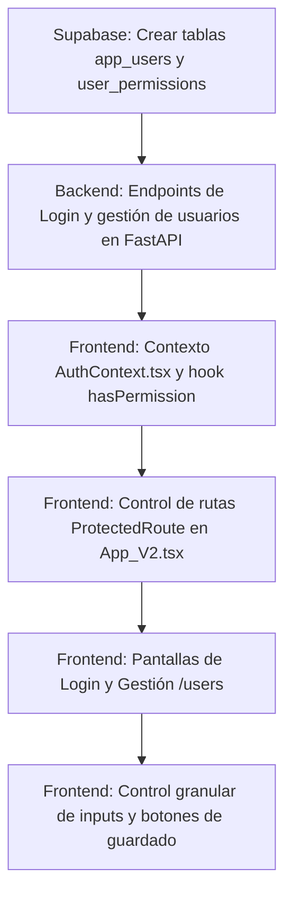

# Módulo de Roles y Permisos - Plan y Hoja de Ruta (Actualizado - Emails Oficiales)

Este documento registra la estrategia de diseño técnico y la ejecución del módulo de gestión de accesos (Roles y Permisos) para la plataforma **SMART DASHBOARD**, alineado con los requerimientos del Hito 3.

---

## 1. Definición de Roles y Niveles de Acceso

### **Identificador de Acceso (Usuario)**
*   El usuario de inicio de sesión para el sistema será estrictamente el **correo electrónico (email)** corporativo de cada persona.

### **ADMIN (Administrador)**
*   **Permiso Global:** Acceso irrestricto a todas las herramientas y maestros.
*   **Capacidades Exclusivas:** 
    *   Crear nuevos usuarios en el sistema ingresando su email y contraseña.
    *   Editar perfiles de usuarios existentes.
    *   Asignar/modificar la matriz de permisos de cualquier usuario.
    *   Eliminar usuarios del sistema.

### **USER (Usuario Operativo)**
Posee accesos restringidos por módulo según la matriz asignada por el Administrador:
1.  **Editor:** Lectura y escritura total (Crear, Editar, Guardar, Eliminar registros).
2.  **Visor:** Solo lectura. Se inhabilitan los controles de guardado, carga de escenarios y campos editables (modo auditoría pasivo).
3.  **Nulo:** Sin acceso al módulo. Bloqueo de rutas a nivel enrutador (React Router).

---

## 2. Matriz de Permisos Inicial (Semilla)

Basada en las directrices de Iosef Zavala, utilizando los correos oficiales (`@petral.com.pe`):

| Usuario | Email / Login | Rol Global | Multicotizador | Matriz Financiera | Maestros |
| :--- | :--- | :--- | :--- | :--- | :--- |
| **Iosef Zavala** | `izavala@petral.com.pe` | ADMIN | Editor | Editor | Editor |
| **Fernando Harten** | `fharten@petral.com.pe` | USER | Visor | Visor | Visor |
| **Jorge Neyra** | `jneyra@petral.com.pe` | USER | Editor | Editor | Editor |
| **Maria Elena Castro**| `mcastro@petral.com.pe`| USER | Editor | Editor | Editor |
| **Sandra Galvez** | `sgalvez@petral.com.pe` | USER | Editor | Editor | Editor |
| **Patricio Rueda** | `prueda@petral.com.pe` | USER | Editor | Editor | Editor |

---

## 3. Hoja de Ruta de Execution Técnica

### Fase A: Base de Datos & Backend (Geeksoft_Engine)
*   **SQL Migration:** Crear tabla de usuarios `app_users` (con `email` único) y permisos `user_permissions` en Supabase con sus restricciones.
*   **FastAPI Router:** Desarrollar `auth.py` para manejar el login de usuarios por correo corporativo, sesión y endpoints de administración protegidos para creación y edición de usuarios.

### Fase B: Frontend (Geeksoft_Frontend)
*   **Autenticación:** Reemplazar el login simulado actual por un formulario que pida el email `@petral.com.pe` del usuario y conecte a la API de FastAPI.
*   **Enrutador:** Configurar `ProtectedRoute` para interceptar tránsitos no autorizados (redirigir al Home/Dashboard con un aviso visual).
*   **Control Granular:** Conectar los componentes Maestros y Herramientas al `AuthContext` para inhabilitar botones de Guardar/Editar si el usuario cuenta con el permiso `Visor`.
*   **Panel Administrativo:** Desarrollar la vista `/users` con un formulario para crear nuevos usuarios por email y dropdowns interactivos para reconfigurar la matriz en tiempo real.
