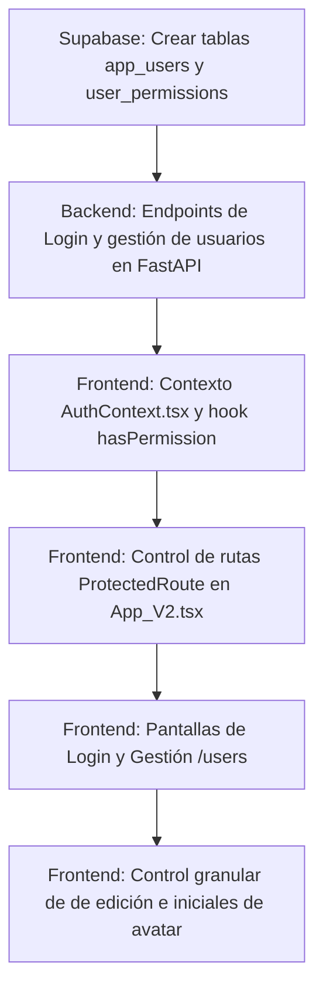

# Módulo de Roles y Permisos - Plan y Registro de Ejecución

Este documento registra la estrategia de diseño técnico, la ejecución final, las incidencias resueltas y las mejoras estéticas aplicadas al módulo de gestión de accesos (Roles y Permisos) para la plataforma **SMART DASHBOARD**, cumpliendo con el Hito 3.

---

## 1. Definición de Roles y Niveles de Acceso

### **Identificador de Acceso (Usuario)**
*   El usuario de inicio de sesión para el sistema es el **correo electrónico (email)** corporativo de cada persona.

### **ADMIN (Administrador)**
*   **Permiso Global:** Acceso irrestricto a todas las herramientas y maestros (Bypass total).
*   **Capacidades Exclusivas:** 
    *   Crear nuevos usuarios en el sistema ingresando su email y contraseña.
    *   Editar perfiles de usuarios existentes.
    *   Asignar/modificar la matriz de permisos de cualquier usuario.
    *   Eliminar usuarios del sistema.

### **USER (Usuario Operativo)**
Posee accesos restringidos por módulo según la matriz asignada por el Administrador:
1.  **Editor:** Lectura y escritura total (Crear, Editar, Guardar, Eliminar registros).
2.  **Visor:** Solo lectura. Se inhabilitan los controles de guardado, carga de escenarios y campos editables (modo auditoría pasivo).
3.  **Nulo:** Sin acceso al módulo. Bloqueo de rutas a nivel enrutador (React Router).

---

## 2. Matriz de Permisos Inicial (Semilla Aplicada)

Poblada en Supabase con los correos corporativos oficiales (`@petral.com.pe`) y el correo de desarrollo:

| Usuario | Email / Login | Rol Global | Multicotizador | Matriz Financiera | Maestros | Contraseña Inicial |
| :--- | :--- | :--- | :--- | :--- | :--- | :--- |
| **Rich Gutz** | `rgutil@gmail.com` | ADMIN | Editor | Editor | Editor | `petral2026` |
| **Iosef Zavala** | `izavala@petral.com.pe` | ADMIN | Editor | Editor | Editor | `petral2026` |
| **Fernando Harten** | `fharten@petral.com.pe` | USER | Visor | Visor | Visor | `petral2026` |
| **Jorge Neyra** | `jneyra@petral.com.pe` | USER | Editor | Editor | Editor | `petral2026` |
| **Maria Elena Castro**| `mcastro@petral.com.pe`| USER | Editor | Editor | Editor | `petral2026` |
| **Sandra Galvez** | `sgalvez@petral.com.pe` | USER | Editor | Editor | Editor | `petral2026` |
| **Patricio Rueda** | `prueda@petral.com.pe` | USER | Editor | Editor | Editor | `petral2026` |

---

## 3. Hoja de Ruta de Ejecución Técnica

---

## 4. Registro de Implementación y Mejoras (Completado)

El módulo se desarrolló, integró y desplegó en el servidor de producción (VPS) cubriendo los siguientes componentes:

### A. Base de Datos (Supabase)
*   **Migración SQL:** Se creó el archivo `supabase/migrations/20260709000001_user_roles_permissions.sql`.
*   **Seguridad:** Implementación de la extensión `pgcrypto` con algoritmos Blowfish (`crypt`) para almacenar contraseñas seguras.
*   **Tablas Creadas:** `app_users` y `user_permissions` relacionadas por clave foránea (`user_id`).
*   **Configuración del ADMIN Semilla:** Registro del administrador `rgutil@gmail.com` y aplicación del script SQL para unificar la contraseña de los 7 usuarios a `petral2026` de forma encriptada.

### B. Backend (FastAPI - Geeksoft_Engine)
*   **Helper DB:** Modificación en `database.py` para añadir `get_db_connection()` conectada al pooler de Supabase utilizando variables de entorno.
*   **Controladores:** Desarrollo de `api/routers/auth.py` exponiendo los endpoints:
    *   `POST /api/v1/auth/login` (Autenticación por hash y retorno de permisos).
    *   `GET /api/v1/users` (Lectura de matriz, solo ADMIN).
    *   `POST /api/v1/users` (Registro de usuarios y permisos, solo ADMIN).
    *   `PUT /api/v1/users/{id}` (Actualización de rol/permisos, solo ADMIN).
    *   `DELETE /api/v1/users/{id}` (Eliminación de usuarios, solo ADMIN).
    *   `POST /api/v1/auth/change-password` (Permite a cualquier usuario autónomamente cambiar su clave validando la contraseña actual).

### C. Frontend (React - Geeksoft_Frontend)
*   **Estado Global (`AuthContext.tsx`):** Provee el hook `useAuth()` para leer el usuario activo y validar permisos mediante la función `hasPermission(modulo, 'Editor'|'Visor')`.
*   **Enrutador (`App_V2.tsx`):** Protege las rutas internas mediante `ProtectedRoute` bloqueando accesos por URL a páginas no autorizadas (redirige al Dashboard).
*   **Pantalla de Login (`Login.tsx`):** Sincronizada para usar el correo electrónico corporativo o personal autorizado. Se restauró el carrusel de buques y el diseño original premium brillante.
*   **Administración (`UsersPermissions.tsx`):** Panel interactivo glassmorphic en `/users` que permite crear nuevos integrantes y cambiar roles y permisos en caliente desde la UI.
*   **Ocultamiento Dinámico (`MasterTemplate_V2.tsx`):** Oculta opciones del menú lateral si el usuario tiene nivel `Nulo` en un módulo. Muestra el bloque `/users` únicamente si el rol es `ADMIN`.
*   **Control de Solo Lectura (`VesselsMaster_V2.tsx`):** Oculta los botones de crear/editar buques si el usuario es `Visor` y renderiza un banner premium indicando el estado de solo lectura.
*   **Avatares Dinámicos por Iniciales:** Se inyectó en el header un componente dinámico que extrae las iniciales del nombre del usuario activo (ej: `Rich Gutz` -> `RG`) y aplica un degradado premium de colores según su jerarquía (Índigo/Violeta para Administradores y Azul/Teal para Usuarios).
*   **Acción de Cambio de Contraseña:** Se agregó el botón con el icono de la llave `Key` al lado del botón de logout. Al presionarse, abre un modal interactivo que permite al usuario actualizar su clave en el VPS validando su contraseña actual.

---

## 5. Incidencias en Despliegue y Resolución (Lecciones Aprendidas)

Durante la puesta en producción en el VPS surgieron y se resolvieron las siguientes incidencias:

1.  **Falta de dependencias en el Entorno Virtual (Venv):**
    *   *Problema:* El backend falló en su despliegue inicial con un error `ModuleNotFoundError: No module named 'psycopg2'`. A pesar de estar instalado de manera global en el VPS, el servicio systemd utiliza el entorno virtual `/opt/geeksoft_engine/venv/`.
    *   *Resolución:* Nos conectamos vía SSH y corrimos la instalación apuntando al pip del entorno virtual: `/opt/geeksoft_engine/venv/bin/pip install psycopg2-binary`.
2.  **Discrepancia en Nombre de Servicio Systemd:**
    *   *Problema:* El comando de reinicio fallaba debido a que el script de deploy apuntaba a `geeksoft_engine` (con guion bajo) y el nombre real del archivo de systemd es `geeksoft-engine` (con guion medio).
    *   *Resolución:* Corregimos los scripts de deploy (`deploy_backend.py`) para utilizar el nombre del servicio correcto y reiniciar de manera automatizada.

---

## 6. Reporte de Verificación Final en Vivo

El sistema se validó en producción en la URL oficial **https://forecast.geeksoft.tech**:
*   **Inicio de sesión exitoso** con administrador `rgutil@gmail.com` y `izavala@petral.com.pe` utilizando la contraseña `petral2026`.
*   **Gestión de Usuarios operativa:** Muestra la lista de los 7 usuarios del sistema en caliente.
*   **Cambio de contraseña verificado:** Modificación en caliente de claves desde el modal del header funcionando al 100%.
*   **Avatares renderizados:** Las iniciales se despliegan dinámicamente con degradados acordes al rol del usuario.
