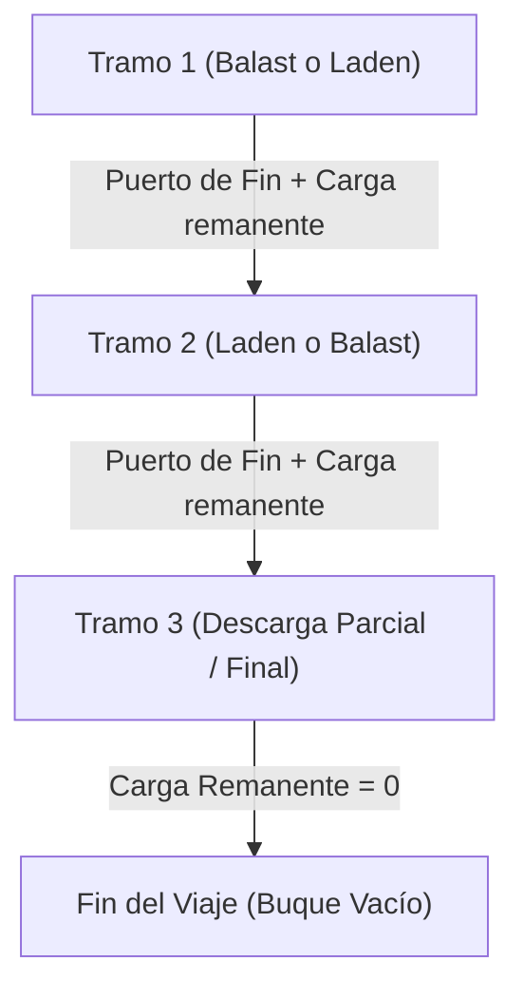
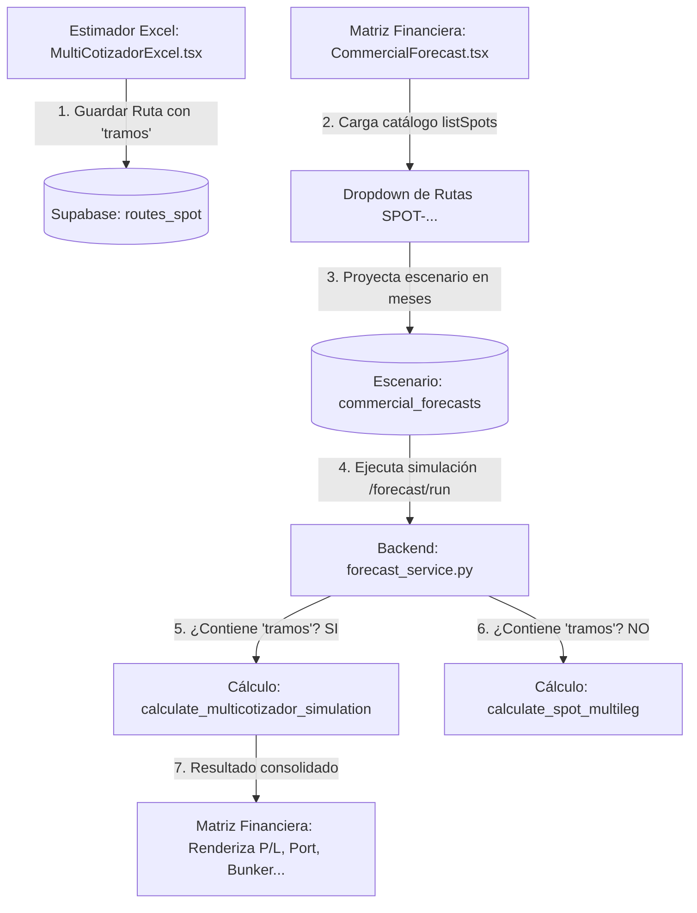

# ⚓ Multicotizador Spot Multileg (Especificación y Arquitectura Exceliana)

El **Multicotizador** es el nuevo módulo de cotización de viajes Spot que permite estructurar y calcular viajes de múltiples tramos (multileg). Está diseñado para resolver la operación comercial compleja: **cargar en un punto y realizar descargas parciales o entregas múltiples en varios destinos**, calculando el P&L exacto tramo por tramo y de forma consolidada.

A solicitud del usuario, la interfaz se ha estructurado con un look and feel **exceliano de shipping** (hoja de cálculo compacta de alta densidad, bordes de grilla bien delimitados, alineación contable estricta, inputs integrados de bajo perfil y celdas de lectura/cálculo diferenciadas).

---

## 🧭 1. Flujo Conceptual y Herencia de Estados

El viaje se compone de una secuencia de **$N$ tramos**. Cada tramo $i$ tiene un puerto de inicio y un puerto de fin, y hereda de forma obligatoria el estado final del tramo anterior $i-1$.



### Reglas de Herencia Automática:
1. **Puerto de Inicio:** El puerto de inicio del tramo $i$ es estrictamente el puerto de fin del tramo $i-1$.
2. **Carga Inicial:** La cantidad de toneladas a bordo al inicio del tramo $i$ es igual a la cantidad de toneladas a bordo al finalizar el tramo $i-1$.
3. **Inferencia de Operación:**
   - Si el tramo es **Laden (Cargado):**
     - Si la carga inicial es $0$, el sistema exige ingresar las **Toneladas a Cargar** y la **Tarifa (Flete USD/MT)**.
     - Si la carga inicial es $> 0$, el sistema asume que ya viene con carga y permite realizar una **Descarga Parcial** (restando toneladas) o mantener la carga en tránsito.
   - Si el tramo es **Ballast (Vacío/Posicionamiento):**
     - La carga a bordo debe ser $0$. El sistema no solicita toneladas ni flete, e infiere que el viaje es únicamente para reposicionar el barco.

---

## 🎨 2. Diseño de la Interfaz (Look & Feel "Exceliano" de Shipping)

La interfaz se distribuye verticalmente en 3 paneles principales dentro de una grilla densa:

### A. Panel Superior: Vessel Particular & Bunkers (Ficha Buque)
*   **Ficha del Buque:** Tabla horizontal no editable que muestra datos básicos del buque seleccionado (`MV`, `DWT`, `DWCC`, `Velocidad Base`, `TCE Requerido`).
*   **Precios Bunker:** Minirejilla de Excel con celdas de fondo blanco para editar el precio de `IFO` y `MDO` con la fecha de última lectura en la parte inferior de cada celda.
*   **Controles de Tramos y Acciones:** Botones para `Agregar Tramo`, `Quitar Tramo`, `Guardar Cotización` y `Cargar Cotización` alineados horizontalmente a la derecha.

### B. Panel Central: Port Rotation (Tabla Principal de Estimación)
Una rejilla de datos al estilo Excel con bordes finos `#D3D3D3` de 1px. Las celdas de entrada son blancas y se destacan con un borde azul fino al enfocarse; las celdas calculadas o de solo lectura tienen un fondo gris tenue (`#F9F9F9`).

| Leg | Tipo | Puerto Origen | Puerto Destino | Distancia (NM) | W.F (%) | Vel (kn) | Días Mar | Días Puerto | Operación Dest. | Q (MT) | F ($/t) | Costo Puerto | Ingreso Flete | Costo Bunker |
|:---:|:---:|:---|:---|:---:|:---:|:---:|:---:|:---:|:---|:---:|:---:|:---:|:---:|:---:|
| **1** | [Ballast] | [ILO] | [MATARANI] | *19,998* | *3.0* | *12.5* | 0.81 | 0.50 | [Ninguna] | — | — | $19,998 | $0.00 | $8,190 |
| **2** | [Laden] | [MATARANI] | [ILO] | *19,998* | *3.0* | *12.5* | 0.81 | 1.25 | [Descarga] | *13,500* | *20.12* | $0.00 | $271,620 | $15,097 |
| ... | ... | ... | ... | ... | ... | ... | ... | ... | ... | ... | ... | ... | ... | ... |

*Nota: Las columnas numéricas se alinean a la derecha y los textos a la izquierda para un formato contable impecable.*

### C. Panel Inferior: Resumen Financiero (3 Columnas Horizontales)
*   **Columna 1: Gastos Bunker (Bunker Expenses):** Detalle de consumo y gasto total por combustible (`IFO`, `MDO`, `Total Bunker`).
*   **Columna 2: Gastos de Operación (Operation Expenses):** Detalla el costo total de puertos, comisiones comerciales e impuestos.
*   **Columna 3: Resultados (Financial Voyage Result):** Tabla destacada en verde/amarillo contable que calcula:
    *   `Revenue (Ingresos Totales)`
    *   `Expenses (Gastos Totales)`
    *   `Voyage Result (Net Profit)`
    *   `Días Totales del Viaje`
    *   `TCE Realizado ($/día)` vs `TCE Requerido ($/día)`
    *   `P/L ($)`

---

## 🛠️ 3. Plan de Implementación de la Interfaz Exceliana

### Fase 1: Maquetación y Grilla en React
- Rediseñar el componente [MultiCotizador.tsx](file:///c:/Users/rguti/PETRAL.SMART.DASHBOARD/Desarrollo.Profesional/Geeksoft_Frontend/src/components/CommercialForecast/MultiCotizador.tsx) utilizando tablas HTML tradicionales (`<table>`, `<thead>`, `<tbody>`, `<tr>`, `<td>`) en lugar de contenedores flex flotantes.
- Aplicar estilos de bordes finos `#D3D3D3` colapsados (`border-collapse: collapse`), padding mínimo (`py-1 px-1.5`) y fuentes compactas (`text-[11px] font-mono` para números).
- Implementar selectores de puertos e inputs numéricos integrados directamente en las celdas.

### Fase 2: Cableado de Lógica Reactiva
- Vincular los cambios en las celdas editables de la rotación de puertos para recalcular automáticamente el viaje en el motor del backend en caliente (`/api/v1/forecast/multicotizador/calculate`).
- Mantener la propagación sugerida de flete: al ingresar el flete en la primera descarga, propagarlo a las siguientes celdas de descarga.
- Actualizar los paneles inferiores de resumen financiero tras cada respuesta del cálculo del backend.

### Fase 3: Publicación y Despliegue
- Validar la compilación del frontend (`tsc --noEmit`).
- Compilar y desplegar a producción en el VPS (`deploy_forecast_kickoff.py`).

---

## 🧭 4. Reglas de Negocio Específicas del Refinamiento

*   **Tarifa de Flete a la Descarga:** La tarifa de flete ($/t) se define exclusivamente en las operaciones de **Descarga** en los puertos. Para facilitar la entrada de datos, cuando el usuario introduce una tarifa de flete en la primera descarga del viaje, esta tarifa se propaga de manera automática como valor por defecto a todas las descargas siguientes. El usuario puede modificar manualmente cualquier tarifa particular si es necesario.
*   **Asignación de Ingresos por Tramo:** El ingreso de flete generado por una descarga en el Puerto $i+1$ se asocia e imputa como ingreso del **Tramo $i$** (el tramo inmediatamente anterior que transportó dicha carga).
*   **Costos Portuarios de Tramos Ballast (Vacío):** Solo el primer tramo `BALLAST` del viaje (el tramo de posicionamiento inicial) computa costos de entrada y salida (carga y descarga) en sus puertos correspondientes. Los demás tramos `BALLAST` subsiguientes del viaje computarán únicamente costos de descarga en su puerto de destino.

---

## 🚀 5. Registro de Fixes y Ajustes de Producción (2026-07-02)

Para garantizar la estabilidad y la precisión matemática del módulo, se implementaron los siguientes ajustes críticos:

1.  **Compactación Visual del Layout de Puertos:**
    *   Se redujo el ancho de las tarjetas de operación portuaria a **`w-[72px]`** (un 50% de ancho del tamaño anterior).
    *   Se simplificaron las etiquetas internas a abreviaciones (`Op`, `Q (MT)`, `F ($/t)`) y se usaron placeholders limpios, permitiendo que la recta horizontal cronológica y las métricas de tramos respiren adecuadamente en pantallas estándar.
2.  **Lógica Anti-Duplicidad de Costos Portuarios:**
    *   Se implementó un registro en caliente de puertos visitados en el viaje durante la simulación de `spot_engine.py`.
    *   En tramos `BALLAST` de retorno, si el puerto de destino ya fue visitado previamente en el viaje, su costo portuario de destino se computa como **`$0.00`** para no duplicar las tarifas de agencia comercial de un mismo viaje redondo.
3.  **Optimización de Inputs Controlados (Digitación Decimal):**
    *   Se modificó la interfaz `PuertoConfig` del frontend para almacenar los inputs de cantidad (`quantity`) y flete (`freight_rate`) como `string | number`.
    *   Se eliminó el casteo numérico inmediato en el `onChange` (`Number(e.target.value)`) que truncaba los puntos decimales (`.`) a mitad del tipeo e interrumpía la experiencia de usuario. Los valores se parsean de forma segura en las funciones de cálculo del backend.
4.  **Consistencia Absoluta de Bunker y Posicionamiento:**
    *   Se integraron las horas de posicionamiento (`positioning_carga_hrs` y `positioning_descarga_hrs`) de los puertos de origen y destino en el cálculo del tramo `LADEN`.
    *   Esto alinea al centavo el consumo de combustible de bunker ($0.00 de diferencia) en todas las simulaciones de viajes redondos para los buques **MOQUEGUA** y **TABLONES** en comparación con el Voyage Ledger de auditoría.
5.  **Cálculo Automático Reactivo (Estilo Excel en Caliente):**
    *   Se removió la dependencia exclusiva de dar clic en el botón "Simular" para refrescar los datos.
    *   Se cableó un hook reactivo de simulación automática (`useEffect`) con *debouncing* de 500 ms. Al cambiar barcos, puertos, bunker, cantidades o fletes, la grilla se recalcula automáticamente en segundo plano.
6.  **Autocompletado de Parámetros de Ruta y Velocidad:**
    *   Al seleccionar o cambiar de puerto origen/destino, el frontend busca la ruta en la base de datos (`ForecastService.getRoutes()`) y rellena automáticamente la distancia (`route_distance`) y factor de clima (`weather_factor`).
    *   La columna de velocidad (`Vel (kn)`) ahora es editable e inicializa con la velocidad base del buque (`vessel_speed`). Al cambiarla, se propaga en cascada al cálculo del backend.
7.  **Desglose y Alineación de Costos Portuarios por Puerto:**
    *   El backend ahora desglosa y retorna de forma independiente el costo de entrada/salida de origen (`agency_costs_origin`) y destino (`agency_costs_destination`) de cada tramo en la respuesta del simulador (`spot_engine.py`).
    *   El frontend mapea de forma precisa el costo de puerto origen a la Fila 0, y los costos destino a sus respectivas filas de destino subsiguientes (`idx + 1`), eliminando duplicaciones visuales y acumulaciones desalineadas.
8.  **Mapeo de Totales Consolidados de la Tabla:**
    *   Se corrigió el mapeo de variables consolidadas (`total_sea_days`, `total_port_days`, `total_port_costs`, `total_freight_revenue`, `total_bunker_costs`) en la fila de totales inferiores de la tabla principal, asegurando consistencia total.
9.  **Costo de Puerto Dinámico según Operación Comercial (CARGA/DESCARGA/NONE):**
    *   Se implementaron los parámetros `origin_action` y `destination_action` en el payload y modelo del tramo del backend (`forecast_models.py` y `forecast.py`).
    *   Si la operación en el puerto destino es **`NONE`**, el backend asigna automáticamente **`$0.00`** de costo de puerto, evitando que se cobre la tarifa de descarga duplicada al finalizar o reposicionar el buque.
10. **Sincronización de Cantidad de Carga Inicial y Celda Solo Lectura:**
    *   Se rediseñó la celda de cantidad `Q (MT)` de la Fila 0 (origen) para ser de **solo lectura** y calcularse automáticamente en base a la suma de todas las cantidades de descarga configuradas.
    *   Esto eliminó un bucle circular de estados reactivos (`useEffect` mutuo) que bloqueaba el teclado al intentar digitar números en las celdas, permitiendo una escritura limpia y fluida, al mismo tiempo que garantiza que el Leg 1 se califique de forma correcta como `LADEN` computando sus días de puerto y bunker de puerto reales.

## 🚀 6. Registro de Fixes y Ajustes de Producción (2026-07-03)

Para perfeccionar la experiencia del usuario y resolver inconsistencias, se realizaron las siguientes mejoras:

1. **Corrección de Glitches en Edición de Celdas:**
   * Se removió el casteo agresivo numérico inmediato (`Number(e.target.value)`) en caliente del `onChange` de los inputs de la grilla de tramos. Los valores se almacenan como texto crudo en el estado (`string | number`) y se parsean al llamar a la API de simulación, permitiendo el ingreso fluido de puntos decimales.
   * Se ajustó el renderizado para usar `value={tr.route_distance ?? ''}` evitando ceros indeseados al limpiar celdas.
2. **Fact Sheet en Tabla Unificada Compacta con GRT:**
   * Se estructuró todo el Fact Sheet superior en una sola tabla contable horizontal. Se inyectó la variable **GRT (t)** (Gross Register Tonnage) a la izquierda de **DWT**, enlazada con el estado y propagada al backend de simulación. Se actualizó la especificación física en [Modelo.E-R.md](file:///c:/Users/rguti/PETRAL.SMART.DASHBOARD/Desarrollo.Profesional/Obsidian.1/DashBoardPetral/Modelo.E-R.md).
   * Los precios de bunker (IFO/MDO) se reubicaron en el extremo derecho ocupando `rowSpan={2}`, manteniendo agrupadas al inicio todas las particularidades y consumos del buque.
3. **Buque Virtual "A la mano/SIN NOMBRE":**
   * Se agregó el buque virtual `⚓ [BUQUE SIN NOMBRE]` (ID: `'SIN_NOMBRE'`) que inicializa todas sus particularidades y consumos en cero y los habilita para su edición en pantalla por el usuario.
   * El backend procesa este ID omitiendo la base de datos Supabase y usando los overrides provistos.
4. **Ritmos de Operación con Selector de Unidad (T/d o T/h) y Anchos de Grilla:**
   * Se renombró la columna de la grilla a **Ritmo (C/D)** (indicando Carga/Descarga) y se inyectó un combo de selección de unidad (**T/d** para sólidos y **T/h** para líquidos) al lado del input numérico. 
   * Si el usuario selecciona `T/h`, el frontend multiplica de forma transparente el valor por 24 antes de enviarlo al backend, permitiendo calcular correctamente el tiempo de puerto a partir del ritmo por hora.
   * Se angostó la columna **Tipo** en un 30% (de 6.5% a 4.5%) y se transfirió ese espacio a la columna **Puerto** (de 12% a 14%), ofreciendo mayor holgura visual.
5. **Desplegables de Auditoría de Bunker y Costos de Puerto:**
   * En el card **Bunker Expenses**, se inyectó un desplegable `<details>` que revela tramo por tramo el desglose detallado de toneladas y su rastro matemático.
   * En el card **Port Costs** (antes "Operation Expenses"), se retiraron comisiones comerciales y se incorporó un desplegable que muestra los conceptos detallados de costos portuarios facturados por cada tramo o indica el fallback a la tarifa plana.

---

## 📐 7. Especificación Lógica y Fórmulas del Motor de Simulación

Para validar el comportamiento del estimador y refinar los cálculos del viaje, a continuación se detallan las fórmulas del backend de FastAPI:

### 1. Días de Navegación (Sea Days - $D_{sea}$)
Para cada tramo del viaje:
$$\text{Días de Mar} = \left( \frac{\text{Distancia (NM)}}{\text{Velocidad (nudos)} \times 24} \right) \times \left(1 + \frac{\text{Factor Clima (\%)}}{100}\right)$$

### 2. Días de Puerto (Port Days - $D_{port}$)
Las operaciones se evalúan a partir del **puerto de destino** del tramo. El ritmo de operación ($R$) se convierte a diario si el usuario seleccionó horas ($R_{dia} = R_{hora} \times 24$):
$$\text{Días de Puerto} = \frac{\text{Cantidad Operada (MT)}}{\text{Ritmo de Operación Diario } (R_{dia})} + \frac{\text{Demoras Adicionales (horas)}}{24}$$
*(Si la acción en el puerto de destino del tramo es `NONE`, los días de puerto de ese tramo son 0.0).*

### 3. Consumo de Combustible por Tramo
Calculado por tramo para navegación y puerto:
$$\text{Consumo IFO} = (\text{Días de Mar} \times C_{sea\_ifo}) + (\text{Días de Puerto} \times C_{puerto\_ifo})$$
$$\text{Consumo MDO} = (\text{Días de Mar} \times C_{sea\_mdo}) + (\text{Días de Puerto} \times C_{puerto\_mdo})$$
*(Nota: El consumo en puerto usa los ratios de consumo correspondientes a la acción realizada: Cargar, Descargar o Espera/Idle).*

### 4. Consolidación Financiera (PnL)
* **Ingresos de Flete:** $\sum (\text{Cantidad a Descargar} \times \text{Flete } (\$/t))$
* **Costo Bunker:** $(\text{IFO Total} \times \text{Precio IFO}) + (\text{MDO Total} \times \text{Precio MDO})$
* **Net Profit:** $\text{Ingreso Fletes} - \text{Costo Bunker} - \text{Costo Puertos (Supabase/Flat)}$
* **TCE Realizado:** $\frac{\text{Net Profit}}{\text{Días Mar Total} + \text{Días Puerto Total}}$

---

## ❓ Preguntas para el Refinamiento de Negocio

A continuación listamos las preguntas que iremos resolviendo una a una para perfeccionar la herramienta:

### Pregunta 1: ¿Cuándo y en qué tramo se deben facturar los ingresos por flete? [CERRADA]
* **Decisión:** Mantener la lógica tal como está. Dado que el objetivo comercial clave es el consolidado total de ingresos del flete y el Net Profit final del viaje en el "Financial Voyage Result", es óptimo imputar el ingreso del flete en el tramo de descarga.

### Pregunta 2: ¿Los consumos de puerto y tipos de tramos (Laden / Ballast) reflejan correctamente la operación? [CERRADA]
* **Decisión:** El tipo de tramo se determinará de forma 100% automática a partir del inventario acumulado en bodega puerto a puerto:
  * El inventario inicial en bodega al empezar es 0.
  * Al pasar por un puerto de `CARGAR`, se suma la cantidad operada a la bodega.
  * Al pasar por un puerto de `DESCARGAR`, se resta la cantidad operada de la bodega.
  * Durante la navegación del Tramo $idx$, si el inventario remanente en bodega tras el puerto de origen es **mayor a cero**, el tramo es automáticamente **`LADEN`**.
  * Si el inventario remanente en bodega es **cero**, el tramo es automáticamente **`BALLAST`**.
  * Un tramo `BALLAST` no genera costos de puerto ni consumos idle de puerto. Solo existen costos y tiempos de puerto cuando la acción en el puerto es `CARGAR` o `DESCARGAR`. Si la acción en destino es `NONE`, los días y costos de puerto de ese tramo son 0.0 de forma automática.

### Pregunta 3: ¿El cálculo del TCE Realizado representa fielmente tu métrica del negocio? [CERRADA]
* **Decisión:** El **TCE Requerido** ya está definido en la ficha del buque (Panel Superior). El sistema debe:
  1. Calcular el **TCE Realizado** del viaje: `Net Profit / Días Totales del Viaje`
  2. Compararlo contra el **TCE Requerido** del buque (campo `tce_required` del buque seleccionado)
  3. Mostrar en el Financial Voyage Result:
     - `TCE Realizado: $X,XXX / día`
     - `TCE Requerido: $X,XXX / día`
     - `Diferencia (+/-): $X,XXX / día` (en verde si el viaje cubre el TCE requerido, en rojo si no)
* **El divisor** incluye todos los días del viaje: días de mar + días de puerto (sin exclusiones).

---

### Pregunta 4: ¿Cómo se estructura el cálculo del Overhead y del Posicionamiento? [CERRADA]
* **Decisión:** `Overhead` y `Posic` son **horas adicionales de puerto**, no un costo monetario directo. Su fuente de datos es la tabla `ports` en Supabase (mismos campos que usa el Voyage Ledger Audit):
  * `overhead_carga_hrs` / `overhead_descarga_hrs` → horas de espera administrativa
  * `positioning_carga_hrs` / `positioning_descarga_hrs` → horas de maniobra de posicionamiento
* **Fórmula de convergencia con el Ledger:**
  ```
  Días de Puerto = ((Q/act_load + over_or + pos_or) + (Q/act_disch + over_de + pos_de)) / 24
  ```
* **Comportamiento del override en la grilla:**
  * Si el usuario **deja las celdas vacías** → el backend toma los valores de la tabla `ports` (fallback automático)
  * Si el usuario **ingresa valores** en la grilla → esos overrides tienen prioridad sobre `ports`
* **Impacto económico:** No es costo directo. Se traduce en más días de puerto → más bunker idle → TCE más bajo.
* **Objetivo:** El cálculo del MultiCotizador debe **converger** con el del Voyage Ledger Audit (test de validación pendiente).

---

### Pregunta 5: ¿Cómo se debe calcular el Costo de Puerto (`Costo Pto`) en la grilla? [CERRADA]
* **Decisión — Opción C:** Auto-fill + Override editable:
  1. Al seleccionar el puerto y el buque, el sistema busca automáticamente el costo en `port_costs_matrix` (primario) → `agency_matrix` (fallback secundario), usando la clave `buque + puerto + operación`.
  2. Si se encuentra un valor, se **pre-llena la celda** con ese monto en USD.
  3. La celda **permanece editable**: si el usuario desea ajustarla (por ejemplo, cotización especial), la modifica libremente.
  4. Si el usuario modifica el valor, ese override tiene prioridad en el cálculo.
  5. Si no se encuentra valor en la BD, la celda queda en blanco para entrada manual.

---

### Pregunta 6: ¿Qué pasa con las comisiones comerciales (brokerage/address commission)? [CERRADA]
* **Decisión: NO APLICA.** El MultiCotizador replica exactamente la misma lógica financiera del [VOYAGE_LEDGER_TEST.md](file:///c:/Users/rguti/PETRAL.SMART.DASHBOARD/Desarrollo.Profesional/Obsidian.1/DashBoardPetral/VOYAGE_LEDGER_TEST.md):
  ```
  Resultado Viaje = (Q × F) − port_costs − bunker
  TCE             = voyage_result / total_duration
  Utilidad Nom.   = voyage_result − (tce_req × total_duration)
  ```
  **No hay comisiones de ningún tipo.** El Ledger es la fuente de verdad. El MultiCotizador debe converger 1:1 con él.

---

## 📋 Resumen de Decisiones Cerradas

| # | Pregunta | Decisión |
|---|---|---|
| 1 | ¿Cuándo facturar el flete? | En el tramo de descarga |
| 2 | ¿Laden vs Ballast? | Por inventario acumulado en bodega puerto a puerto |
| 3 | ¿TCE Realizado? | Net Profit / Días Totales, comparado vs TCE Req del buque |
| 4 | ¿Overhead y Posic? | Horas adicionales de puerto, fallback a `ports` en BD |
| 5 | ¿Costo de Puerto? | Auto-fill desde BD + celda editable con override libre |
| 6 | ¿Comisiones? | No aplica. Misma fórmula exacta del Voyage Ledger |

---

## 🔧 8. Pendientes de Implementación (Post-Sesión de Refinamiento)

Las siguientes tareas surgen directamente de las decisiones acordadas en la sesión de preguntas. Deben implementarse en orden:

### Tarea 1 — TCE Realizado vs TCE Requerido en Financial Voyage Result
**Fuente:** Decisión Pregunta 3 + Ledger métrica 8 y 9.

Modificar el card **Financial Voyage Result** en [MultiCotizadorExcel.tsx](file:///c:/Users/rguti/PETRAL.SMART.DASHBOARD/Desarrollo.Profesional/Geeksoft_Frontend/src/components/CommercialForecast/MultiCotizadorExcel.tsx) para mostrar:

| Campo | Fórmula | Color |
|---|---|---|
| TCE Realizado | `Net Profit / Días Totales` | Neutro |
| TCE Requerido | `vessel.tce_required` | Neutro |
| Diferencia | `TCE Realizado − TCE Requerido` | 🟢 Verde si ≥ 0, 🔴 Rojo si < 0 |
| Utilidad Nominal | `Net Profit − (TCE_req × Días Totales)` | 🟢/🔴 |

### Tarea 2 — Auto-fill de Costo de Puerto (Opción C)
**Fuente:** Decisión Pregunta 5.

- Cuando el usuario selecciona o cambia el **puerto destino** de un tramo, el frontend llama a la API para obtener el costo de puerto (`port_costs_matrix` → `agency_matrix`) usando la clave `vessel_id + port_id + operación`.
- El valor obtenido se pre-llena en la celda **Costo Pto** del tramo correspondiente en el estado `puertosConfig`.
- La celda permanece editable; si el usuario la modifica, el override tiene prioridad.

### Tarea 3 — Fallback de Overhead y Posicionamiento desde `ports`
**Fuente:** Decisión Pregunta 4.

- En el backend ([spot_engine.py](file:///c:/Users/rguti/PETRAL.SMART.DASHBOARD/Desarrollo.Profesional/Geeksoft_Engine/backend/spot_engine.py)), cuando el tramo recibe `overhead` o `positioning` en cero o nulo, debe consultar la tabla `ports` en Supabase para obtener `overhead_carga_hrs`, `overhead_descarga_hrs`, `positioning_carga_hrs`, `positioning_descarga_hrs` según la acción del puerto.
- La fórmula de días de puerto debe converger **exactamente** con el Voyage Ledger:
  ```
  port_days = ((Q/act_load + over_or + pos_or) + (Q/act_disch + over_de + pos_de)) / 24
  ```

### Tarea 4 — Test de Convergencia con Voyage Ledger
**Fuente:** Decisión Pregunta 6.

- Correr una simulación con los mismos parámetros de un viaje auditado en el Ledger (ej. MOQUEGUA, ILO→MATARANI) y verificar que el MultiCotizador arroje **exactamente** los mismos valores de `port_days`, `bunker_costs`, `voyage_result` y `TCE`.

---

## 📋 9. Plan de Trabajo: Integración y Flujo del Estimador Excel en la Matriz Financiera

Para garantizar la robustez del flujo que guarda rutas complejas desde el **Estimador Excel** y las recupera/simula en la **Matriz Financiera**, se establece el siguiente plan de análisis y mitigación de problemas para ser trabajado posteriormente:

### 1. Mapa de Flujo de Datos Actual (Sin tocar código)


### 2. Problemas Potenciales Identificados en el Circuito
- **Inconsistencia de Inputs de Puerto:** Las acciones del estimador (`CARGAR` / `DESCARGAR` / `NONE`) y puertos configurados en los tramos son fijos en el JSON guardado en `routes_spot`. Si cambian las duraciones administrativas u overheads en la tabla principal `ports`, se debe verificar si la matriz los recalcula en tiempo real o arrastra valores guardados estáticos.
- **Descalce de Cantidad (Leg 0 vs Descargas):** En el Estimador Excel, la cantidad del leg 0 (origen) se calcula automáticamente sumando las descargas posteriores. Al simularse en la Matriz Financiera, el backend lee `line.quantity` y lo inyecta como cantidad única para el tramo `LADEN`. Debemos certificar cómo se comporta esto en viajes con múltiples descargas fraccionadas (split discharge).
- **Formatos de Variables en Legs Data:** El frontend del estimador guarda valores como `bunker_price_ifo` bajo el nivel raíz de `legs_data`, mientras que el simulador de matriz espera recibirlos actualizados dinámicamente según el mes seleccionado en la proyección.

### 3. Tareas Planificadas para Próxima Sesión
- `[ ]` **Paso 1: Auditoría de Payload Complejo:** Inspeccionar en la base de datos registros guardados por el Estimador Excel y mapear todos los campos para verificar que no haya inconsistencias de esquemas de datos.
- `[ ]` **Paso 2: Simulación de Prueba con Split Discharge:** Crear un caso de prueba en el estimador con 2 descargas en puertos distintos, guardarlo, jalarlo en la Matriz y auditar que la suma de ingresos y costos portuarios converja matemáticamente 1:1.
- `[ ]` **Paso 3: Validar BAF en Rutas Complejas:** Verificar que si la ruta spot tiene un contrato asociado con baseline de bunker, las fórmulas BAF se apliquen de forma correcta sobre la tarifa final de la simulación del tramo.
