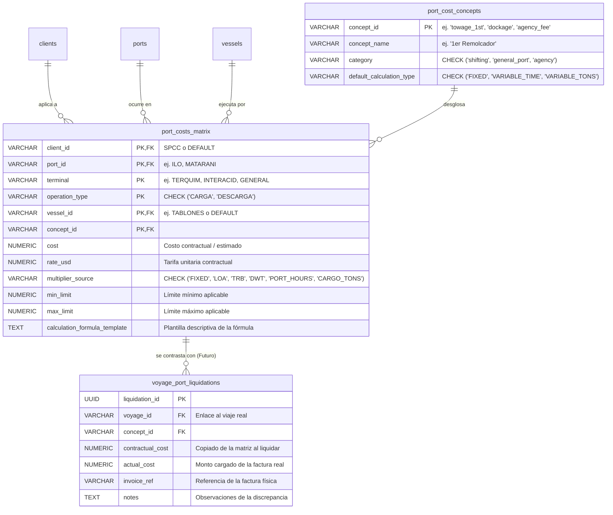

# ⚓ port_costs (Matriz de Costos Portuarios — agency_matrix V2)

Este documento centraliza el diseño arquitectónico de la matriz de costos portuarios desglosados y dinámicos. Estos datos alimentarán el motor de simulaciones (*Forecast*) y el futuro módulo de liquidaciones reales versus contractuales en Supabase, según el [[Modelo.E-R]].

## 📊 Matriz Base de Tarifas Reales (SPCC) - Referencia de Carga/Descarga

| Puerto (Port ID) | Buque (Vessel ID) | Costo Portuario Extraído (USD) | Tipo de Operación Inferido |
| :--- | :--- | :--- | :--- |
| **ILO** | CONCON_TRADER | $23,500 | CARGA (Origen) |
| **ILO** | MOQUEGUA | $22,000 | CARGA (Origen) |
| **ILO** | TABLONES | $23,000 | CARGA (Origen) |
| **MATARANI** | CONCON_TRADER | $19,000 | DESCARGA (Destino) |
| **MATARANI** | MOQUEGUA | $17,000 | DESCARGA (Destino) |
| **MATARANI** | TABLONES | $18,000 | DESCARGA (Destino) |
| **MARCONA** | CONCON_TRADER | $61,000 | DESCARGA (Destino) |
| **MARCONA** | MOQUEGUA | $40,000 | DESCARGA (Destino) |
| **MARCONA** | TABLONES | $44,000 | DESCARGA (Destino) |
| **MEJILLONES** | CONCON_TRADER | $60,000 | DESCARGA (Destino) |
| **MEJILLONES** | MOQUEGUA | $29,000 | DESCARGA (Destino) |
| **MEJILLONES** | TABLONES | $32,000 | DESCARGA (Destino) |

> 📌 **Nota Operativa:**
> Todos estos valores pertenecen comercialmente al cliente **SPCC**. En el esquema de rutas de cabotaje/exportación de ácido sulfúrico, el puerto de Ilo actúa como base de origen (`CARGA`), mientras que Matarani, Marcona y Mejillones actúan como puertos de destino final (`DESCARGA`).

---

## 📐 Diseño de Arquitectura de Datos (`port_costs`)

Para soportar tanto la fase actual de **Forecast** (costos agregados que se comportan como fijos) como el futuro módulo de **Liquidación y Auditoría** (ingreso de facturas detalladas contra costos contractuales calculados dinámicamente), se adopta una arquitectura relacional dinámica.

### 🌐 Diagrama Entidad-Relación (ER)

### 📋 1. Catálogo de Conceptos (`port_cost_concepts`)
Almacena los conceptos individuales que componen el costo de puerto.
*   **A) Shifting Expenses:** `'towage_1st'`, `'towage_2nd'`, `'mooring_access'`, `'shifting_surcharges'`.
*   **B) General Port Expenses:** `'lighthouse_dues'`, `'dockage_muellaje'`, `'launch_hire'`, `'watchmen'`, `'sanitary_inspection'`, `'clearance'`, `'coordinator_board'`.
*   **C) Agency Expenses:** `'agency_fee'`, `'transportation_communication'`.

### 🧮 2. Variables Multiplicadoras (`multiplier_source`)
*   `'FIXED'`: Aplica el `rate_usd` directamente (por defecto para el forecast inicial).
*   `'LOA'`: Multiplica por la eslora del buque (`vessels.loa`).
*   `'TRB'` / `'DWT'`: Multiplica por el tonelaje del buque (`vessels.dwt`).
*   `'PORT_HOURS'`: Multiplica por las horas (reales o estimadas) de permanencia en puerto.
*   `'CARGO_TONS'`: Multiplica por las toneladas métricas de ácido sulfúrico transferidas.

---

## 🚀 Hoja de Ruta para el Rediseño de Costos Portuarios

### 📋 Fase 1: Análisis del Desglose en Exceles
1.  Leer los archivos de liquidaciones reales de viaje (ej: [[Voyage.Calculation.Tablones]]) para aislar los conceptos individuales de gastos en puerto.
2.  Clasificar cada concepto según su regla matemática y su fuente multiplicadora (`multiplier_source`).

### 📐 Fase 2: Implementación Física del Esquema de Datos
1.  **Migración de Base de Datos (DDL):**
    *   Crear la tabla `port_cost_concepts`.
    *   Crear la tabla `port_costs_matrix` con las restricciones y claves foráneas indicadas en el diagrama E-R.
    *   Migrar las tarifas existentes de `agency_matrix` a `port_costs_matrix` asignándolas temporalmente bajo el concepto `'agency_fee'` con `multiplier_source = 'FIXED'` y `cost = rate_usd` para garantizar la compatibilidad con el forecast.
    *   Dar de baja (DROP) la tabla `agency_matrix` anterior.
2.  **Actualización del Motor (`engine.py`):**
    *   Modificar la consulta del motor financiero para sumar los desgloses en lugar de obtener una fila única.
    *   Implementar la lógica matemática del multiplicador en el cálculo del forecast.

### 💻 Fase 3: Interfaz de Usuario y Liquidación (Futuro)
1.  Modificar la UI en `VoyageLedgerTest.tsx` y el API service para visualizar los desgloses en el Card de Costos en pantalla y en la impresión.
2.  Crear la interfaz de liquidación real donde el usuario ingresará el costo real y se desplegará el análisis de diferencias contra el costo contractual calculado.

---

## 🛠️ Implementación Física y Resultados (Julio 2026)

Se ha completado con éxito la migración de base de datos y la lógica de negocio en el backend para dar soporte a la estructura de costos detallada.

### 1. Cambios en Base de Datos (Supabase)
Se ejecutó la migración SQL `20260702000001_port_costs_migration.sql` que:
*   Creó la tabla `port_cost_concepts` para el catálogo de conceptos estándar (shifting, port expenses y agency fee).
*   Creó la tabla `port_costs_matrix` con la clave primaria compuesta por `(client_id, port_id, terminal, operation_type, vessel_id, concept_id)`.
*   Migró de forma segura la matriz obsoleta `agency_matrix` hacia `port_costs_matrix` bajo la clave `'agency_fee'` con valor `'FIXED'` para compatibilidad hacia atrás.
*   Eliminó la tabla redundante `agency_matrix`.
*   Realizó el seeding completo de tarifas detalladas para el buque **MOQUEGUA** (SPCC).

### 2. Implementación Lógica y Desacoplamiento (FastAPI)
*   **Motorcito Desacoplado:** Se implementó la función helper `calculate_detailed_port_costs` en `forecast_service.py` que calcula el total de costos portuarios a partir del desglose de la matriz y retorna el total consolidado (`total_cost`) junto con su desglose en un JSON (`breakdown`).
*   **Aislamiento del Núcleo Matemático:** La función matemática central en `engine.py` se mantiene intacta recibiendo costos planos (`agency_costs_origin` y `agency_costs_destination`), protegiendo la estabilidad del cálculo de PnL y TCE de viaje.
*   **Regla de Negocio para Mejillones (Forecast):** Para las proyecciones de simulación, el puerto de `MEJILLONES` promedia aritméticamente las tarifas de sus tres terminales activas (`TERMINAL_A`, `INTERACID` y `TERQUIM`).
*   **Auditoría y Ledger (API Payload):** El payload de retorno del API de forecast incluye ahora la clave `"port_costs_breakdown"` con el detalle fino de rubros de origen y destino para visualización interactiva en el frontend.

### 3. Conciliación y Validación Matemática (MOQUEGUA)
Simulando las rutas reales de SPCC para el buque **MOQUEGUA**, los costos de puerto consolidan de forma exacta con las proformas de Sandra:

| Puerto | Tipo de Operación | Costo Sembrado / Calculado | Comentarios |
| :--- | :--- | :--- | :--- |
| **ILO** | CARGA (Origen) | **$20,571.00 USD** | Incluye `$2,730` de `launch_hire` (lancha operativa + autoridades) y rubros desglosados. |
| **MATARANI** | DESCARGA (Destino) | **$15,541.00 USD** | Detalle de 12 conceptos (remolcadores, pilotaje, dockage, etc.). |
| **MARCONA** | DESCARGA (Destino) | **$39,048.00 USD** | Incluye `$36,000` de remolcador fijo y gastos de despacho. |
| **CALLAO** | DESCARGA (Destino) | **$15,144.00 USD** | Rubros contractuales y agencia fijos. |
| **MEJILLONES** | DESCARGA (Destino) | **$48,715.12 USD** | Promedio aritmético exacto de: Terminal A (`$50,333.50`), Interacid (`$45,855.00`) y Terquim (`$49,956.85`). |
| **BARQUITO** | DESCARGA (Destino) | **$84,444.00 USD** | Sumatoria exacta de los rubros fijos. |
