# 📊 Modelo Entidad - Relación (E-R): Motor Dinámico de Costos Portuarios

> **Ubicación en Bóveda**: `Obsidian.Maestro.Costos.Portuarios/Modelo.ER.Motor.Costos.Portuarios.md`
> **Propósito**: Especificar la arquitectura de base de datos relacional y la estructura dinámica `JSONB` que soportan el **Motor de Gastos Portuarios** (Etapa 1: Proyecciones Realistas | Etapa 2: Auditoría y Liquidación de Cuentas de Agencia).
> **Principio de Diseño**: Modelo normalizado relacional híbrido. Las entidades fijas (puertos, terminales, proveedores, rubros) forman la estructura SQL, mientras que las reglas complejas (horarios, procedencias, indexaciones Brent, volumen, convenios flat) se almacenan en la columna dinámico-estructurada **`tariffs (JSONB)`** y se ejecutan a través de motores de cálculo desacoplados por puerto.

---

## 📐 1. Diagrama Entidad - Relación (Mermaid ERD)

```mermaid
erDiagram
    PORTS ||--o{ TERMINALS : "posee"
    PORTS ||--o{ PORT_COSTS_MATRIX : "registra reglas"
    TERMINALS ||--o{ PORT_COSTS_MATRIX : "aplica tarifas"
    SUPPLIERS ||--o{ PORT_COSTS_MATRIX : "presta servicio"
    COST_CONCEPTS ||--o{ PORT_COSTS_MATRIX : "clasifica concepto"
    
    PORTS ||--o{ VESSEL_TERMINAL_OPERATIONS : "registra ritmo"
    TERMINALS ||--o{ VESSEL_TERMINAL_OPERATIONS : "limita ritmo"
    VESSELS ||--o{ VESSEL_TERMINAL_OPERATIONS : "opera con ritmo"

    PORTS {
        varchar port_id PK "Ej: CALLAO, MARCONA, MATARANI, ILO, VALPARAISO, SAN_ANTONIO"
        varchar port_name "Nombre comercial del puerto"
        varchar country "Código ISO: PE, CL, EC"
        numeric lat "Latitud geográfica"
        numeric lon "Longitud geográfica"
    }

    TERMINALS {
        varchar terminal_id PK "Ej: APM, TISUR, ENAPU, TPM, SAN_NICOLAS"
        varchar port_id FK "Puerto al que pertenece"
        varchar terminal_name "Nombre completo del muelle"
        numeric max_load_rate "Ritmo máx carga (MT/h)"
        numeric max_disch_rate "Ritmo máx descarga (MT/h)"
        numeric max_draft "Calado máximo (m)"
        numeric max_loa "Eslora máxima (m)"
        numeric time_to_count_carga_hrs "Time to count carga (hrs)"
        numeric time_to_count_descarga_hrs "Time to count descarga (hrs)"
        numeric maneuver_carga_hrs "Maniobra extra carga (hrs)"
        numeric maneuver_descarga_hrs "Maniobra extra descarga (hrs)"
        boolean is_active "Flag de estado operativo"
    }

    SUPPLIERS {
        uuid supplier_id PK "DEFAULT gen_random_uuid()"
        varchar supplier_name "Ej: Trans Total, Petranso, PSA Marine, APM Terminals, Tisur, Port Operations, MGP, Sanidad"
        boolean is_active "Flag de proveedor activo"
    }

    COST_CONCEPTS {
        varchar concept_id PK "Ej: Pilotage_IN, Towage_OUT, Dockage_APM, Agency_Fee"
        varchar concept_name "Nombre comercial del rubro"
        varchar category "CHECK (category IN ('shifting', 'general_port', 'agency'))"
        varchar default_calculation_type "FIXED, VARIABLE_TIME, VARIABLE_TONS"
    }

    PORT_COSTS_MATRIX {
        uuid rule_id PK "DEFAULT gen_random_uuid()"
        varchar port_id FK "Puerto de la regla"
        varchar terminal FK "Terminal específico o GENERAL"
        varchar operation_type "CHECK (operation_type IN ('CARGA', 'DESCARGA'))"
        varchar vessel_id FK "DEFAULT o ID del buque específico"
        varchar concept_id FK "Concepto maestro del costo"
        varchar sub_item_name "Sub-ítem descriptivo (Ej: Practicaje Ingreso Pilotage IN)"
        uuid supplier_id FK "Proveedor / Agencia vinculada"
        varchar multiplier_source "CHECK (multiplier_source IN ('FIXED', 'PER_QTY', 'LOA', 'TRB', 'DWT', 'PORT_HOURS', 'CARGO_TONS'))"
        numeric rate_usd "Tarifa base unitaria en USD"
        numeric cost "Costo consolidado de referencia"
        text calculation_formula_template "Plantilla explicativa matemática"
        boolean allow_pass_through "Toggle: Cobrado al cliente (PT)"
        boolean is_optional "Toggle: Solo si requiere (OPC)"
        jsonb tariffs "Columna JSONB con reglas F1, F2, Brent, Casino y Volumen"
    }

    VESSELS {
        varchar vessel_id PK "Ej: MOQUEGUA, TABLONES, HUEMUL, CONCON_TRADER"
        varchar vessel_name "Nombre comercial de la nave"
        numeric loa "Eslora total (m)"
        numeric beam "Manga (m)"
        numeric draft "Calado operativo (m)"
        numeric grt "Gross Register Tonnage"
        numeric dwt "Deadweight Tonnage"
        numeric dwcc "Deadweight Cargo Capacity"
    }

    VESSEL_TERMINAL_OPERATIONS {
        varchar port_id PK, FK "Puerto de la operación"
        varchar terminal_id PK, FK "Terminal de la operación"
        varchar vessel_id PK, FK "Buque asignado"
        numeric ritmo_carga "Ritmo operativo de carga (MT/h)"
        numeric ritmo_descarga "Ritmo operativo de descarga (MT/h)"
        numeric amarre_hrs "Horas de posicionamiento/amarre"
        numeric desamarre_hrs "Horas de desamarre"
        numeric time_to_count_carga_hrs "Time to count carga por buque (hrs)"
        numeric time_to_count_descarga_hrs "Time to count descarga por buque (hrs)"
        numeric maneuver_carga_hrs "Horas de maniobra extra carga por buque"
        numeric maneuver_descarga_hrs "Horas de maniobra extra descarga por buque"
        int tugboats_in "Remolcadores Ingreso / Atraque (IN)"
        int tugboats_out "Remolcadores Salida / Desatraque (OUT)"
    }
```



---

## 🏛️ 2. Especificación Detallada de Tablas y Atributos

### 2.1. Tabla: `ports` (Maestro de Puertos)
* `port_id` *(VARCHAR, PK)* → Identificador único (`'CALLAO'`, `'MARCONA'`, `'MATARANI'`, `'ILO'`, `'VALPARAISO'`).
* `port_name` *(VARCHAR, NOT NULL)* → Nombre comercial (ej: "Puerto del Callao", "Puerto de Marcona").
* `country` *(VARCHAR(2), NOT NULL, DEFAULT 'PE')* → Código ISO (`'PE'`, `'CL'`, `'EC'`).
* `lat` *(NUMERIC)* → Latitud geográfica.
* `lon` *(NUMERIC)* → Longitud geográfica.

---

### 2.2. Tabla: `terminals` (Maestro de Terminales Físicos)
* `terminal_id` *(VARCHAR, PK)* → Identificador único (`'APM'`, `'TISUR'`, `'ENAPU'`, `'SAN_NICOLAS'`).
* `port_id` *(VARCHAR, PK, FK → ports.port_id)*
* `terminal_name` *(VARCHAR, NOT NULL)* → Nombre descriptivo del terminal/muelle.
* `max_load_rate` *(NUMERIC, DEFAULT 9999)* → Ritmo máx carga (MT/h).
* `max_disch_rate` *(NUMERIC, DEFAULT 9999)* → Ritmo máx descarga (MT/h).
* `max_draft` *(NUMERIC, DEFAULT 9999)* → Calado máximo (m).
* `max_loa` *(NUMERIC, DEFAULT 9999)* → Eslora máxima (m).
* `time_to_count_carga_hrs` *(NUMERIC, DEFAULT 6.0)*
* `time_to_count_descarga_hrs` *(NUMERIC, DEFAULT 6.0)*
* `maneuver_carga_hrs` *(NUMERIC, DEFAULT 2.0)*
* `maneuver_descarga_hrs` *(NUMERIC, DEFAULT 2.0)*
* `is_active` *(BOOLEAN, DEFAULT TRUE)*

---

### 2.3. Tabla: `suppliers` (Maestro de Proveedores / Agencias Marítimas)
* `supplier_id` *(UUID, PK, DEFAULT gen_random_uuid())*
* `supplier_name` *(VARCHAR, NOT NULL)* → Nombre comercial (`"Trans Total"`, `"Petranso"`, `"PSA Marine S.A."`, `"Tisur S.A."`, `"Port Operations"`, `"APM Terminals"`, `"DHN / MGP"`, `"Sanidad Marítima"`).
* `is_active` *(BOOLEAN, DEFAULT TRUE)*

---

### 2.4. Tabla: `port_costs_matrix` (`PORT_COST_RULES` — Motor Dinámico de Reglas)
* `rule_id` *(UUID, PK, DEFAULT gen_random_uuid())*
* `port_id` *(VARCHAR, NOT NULL, FK → ports.port_id)*
* `terminal` *(VARCHAR, NOT NULL, DEFAULT 'GENERAL')*
* `operation_type` *(VARCHAR, NOT NULL, CHECK (operation_type IN ('CARGA', 'DESCARGA')))*
* `vessel_id` *(VARCHAR, NOT NULL, DEFAULT 'DEFAULT')*
* `concept_id` *(VARCHAR, NOT NULL, FK → cost_concepts.concept_id)*
* `sub_item_name` *(VARCHAR)* → Nombre oficial del ítem.
* `supplier_id` *(UUID, FK → suppliers.supplier_id)* → Proveedor / Agencia vinculada.
* `multiplier_source` *(VARCHAR)* → Multiplicador base (`FIXED`, `LOA`, `TRB`, `DWT`, `PORT_HOURS`, `CARGO_TONS`).
* `rate_usd` *(NUMERIC, DEFAULT 0)* → Tarifa unitaria base.
* `calculation_formula_template` *(TEXT)* → Plantilla explicativa matemática mostrada al lado.
* `allow_pass_through` *(BOOLEAN, DEFAULT FALSE)* → Toggle *Pass Through* (PT).
* `is_optional` *(BOOLEAN, DEFAULT FALSE)* → Toggle *Opcional* (OPC).
* **`tariffs` *(JSONB, NOT NULL, DEFAULT '{}')*** → **Columna dinámico-estructurada JSONB.**

---

### 2.5. Tabla: `vessels` (Maestro de Flota / Buques)
* `vessel_id` *(VARCHAR, PK)* → Identificador (`'MOQUEGUA'`, `'TABLONES'`, `'HUEMUL'`, `'CONCON_TRADER'`).
* `vessel_name` *(VARCHAR, NOT NULL)* → Nombre comercial del buque.
* `loa` *(NUMERIC, NOT NULL)* → Eslora total en metros (ej: `134.16`).
* `beam` *(NUMERIC)* → Manga en metros.
* `draft` *(NUMERIC)* → Calado máximo operativo.
* `grt` *(NUMERIC, NOT NULL)* → Gross Register Tonnage (ej: `8259`).
* `dwt` *(NUMERIC, NOT NULL)* → Deadweight Tonnage (ej: `14298`).
* `dwcc` *(NUMERIC)* → Deadweight Cargo Capacity.

---

### 2.6. Tabla: `vessel_terminal_operations` (Matriz de Cantidades $Q$)
* `port_id` *(VARCHAR, PK, FK → ports.port_id)*
* `terminal_id` *(VARCHAR, PK, FK → terminals.terminal_id)*
* `vessel_id` *(VARCHAR, PK, FK → vessels.vessel_id)*
* `ritmo_carga` *(NUMERIC)* → Ritmo operativo neto de carga (MT/h).
* `ritmo_descarga` *(NUMERIC)* → Ritmo operativo neto de descarga (MT/h).
* `amarre_hrs` *(NUMERIC)* → Horas de maniobra de entrada / amarre.
* `desamarre_hrs` *(NUMERIC)* → Horas de maniobra de salida / desamarre.
* `time_to_count_carga_hrs` *(NUMERIC)* → Tiempo de preparación previo al Laytime.
* `time_to_count_descarga_hrs` *(NUMERIC)* → Tiempo de inspección previo al Laytime.
* `maneuver_carga_hrs` *(NUMERIC)* → Horas de maniobra extra por congestión/clima.
* `maneuver_descarga_hrs` *(NUMERIC)* → Horas de maniobra extra por congestión/clima.
* `tugboats_in` *(INT)* → Remolcadores obligatorios de ingreso.
* `tugboats_out` *(INT)* → Remolcadores obligatorios de salida.

> ⚠️ **Regla de Visualización $Q$**: Si para un terminal no se han ingresado datos de consumo ni existe motor configurado, la celda se renderizará **100% EN BLANCO (`""`)** sin mostrar valores dummy o ceros falsos.

---

## 💡 3. Estructura de la Columna `tariffs (JSONB)`

La columna `tariffs` permite flexibilidad total para definir condiciones tarifarias especiales sin alterar el esquema físico SQL:

```json
{
  "agreement_type": "SPCC_FLAT_CONVENIO",
  "flat_rate_usd": 36000.00,
  "standby_threshold_hours": 48.0,
  "standby_surcharge_usd": 3000.00,
  "psa_addenda_discount": 0.3931,
  "overtime_rules": {
    "night_casino_markup": 0.25,
    "sunday_holiday_markup": 0.50
  },
  "volume_discounts": [
    { "min_calls": 5, "discount_percentage": 0.06 },
    { "min_calls": 10, "discount_percentage": 0.075 }
  ]
}
```

---

## 🛠️ 4. Registro de Motores de Cálculo $P \times Q$ por Puerto

Los motores desacoplados residen en `Geeksoft_Engine/backend/port_engines/` y son orquestados mediante `core.py`:

| Puerto / Terminal | Archivo Backend | Tarifa / Regla Clave | Desglose $P \times Q$ |
| :--- | :--- | :--- | :--- |
| **Callao (APM Terminals)** | `calculator_callao.py` | Practicaje MGP/APM + Remolques Petranso ($800/tug) + Muellaje APM ($1.50/m/h) | `A_SHIFTING`, `B_GENERAL_PORT`, `C_AGENCY` |
| **Marcona (San Juan SPCC)** | `calculator_marcona.py` | **Acuerdo Convenio SPCC Flat $36,000.00 USD** (Stand-by +$3,000 USD >48h) | `A_SHIFTING`, `B_GENERAL_PORT`, `C_AGENCY` |
| **Matarani (Tisur S.A.)** | `calculator_matarani.py` | Servicio Integral PSA ($3,368/mnvr Addenda 39.31%) + Muellaje Tisur ($0.65/m/h) | `A_SHIFTING`, `B_GENERAL_PORT`, `C_AGENCY` |
| **Ilo (SPCC / Enapu)** | `calculator_ilo.py` | Practicaje Port Operations ($1,500/mnvr) + Muellaje SPCC ($0.05/GRT/día) + Remolques PSA/Petranso | `A_SHIFTING`, `B_GENERAL_PORT`, `C_AGENCY` |
| **Puertos de Chile** *(Próxima Fase)* | `calculator_cl.py` | Protocolo 6 Fases (Captura PNG ➔ Layout ➔ Reglas ➔ Motor ➔ Test ➔ UI) | `A_SHIFTING`, `B_GENERAL_PORT`, `C_AGENCY` |

---

## 🔍 5. Trazabilidad de Auditoría ($P \times Q$)

Cada motor retorna una lista auditada (`audit_trail`) dividida en los 3 bloques oficiales para auditoría comparativa de cuentas de agencias:

1. **`A_SHIFTING`**: Gastos de Maniobras (Practicaje, Remolcaje, Linesmen, Acceso Muelle, Port Toll).
2. **`B_GENERAL_PORT`**: Gastos Generales de Puerto (Derechos de Faro, Muellaje, Lanchas, Sanidad Marítima, Clearance, Coordinador a bordo).
3. **`C_AGENCY`**: Gastos de Agencia (Honorarios de Agenciamiento `Agency Fee`, Movilidad, Comunicaciones).
