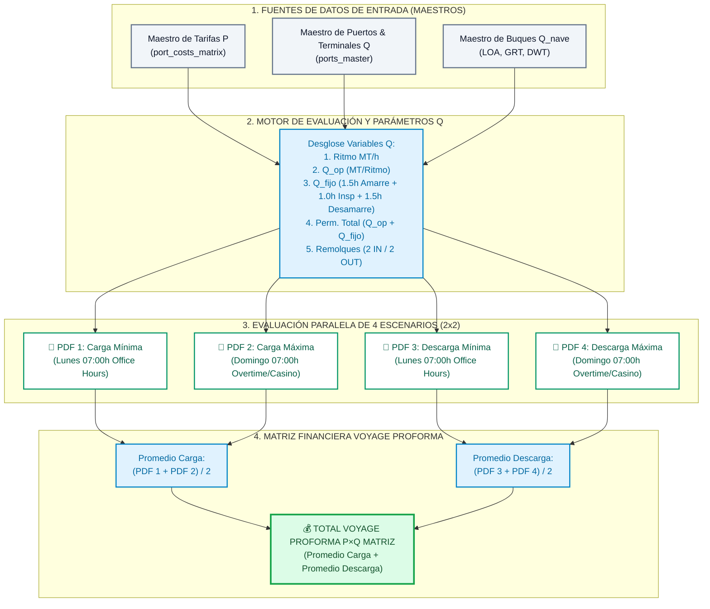

# ⚙️ Motor P×Q Promediado (Forecast & Proforma Dinámica)

> **Ubicación en Bóveda**: `Obsidian.Maestro.Costos.Portuarios/03_Arquitectura_y_Motores/Motor.PxQ.Promediado.md`  
> **Backend Python**: `Geeksoft_Engine/backend/port_engines/core.py`  
> **Componente Frontend**: `Geeksoft_Frontend/src/components/PortCosts/PxQPdfQuadViewer.tsx`  
> **Propósito**: Resolver la incertidumbre de la fecha/hora exacta de maniobra en la proformación comercial mediante la generación de 4 escenarios en PDF (2×2: Mínimos vs Máximos) y el promediado automático para la Matriz Financiera.

---

## 🎯 1. Problema de la Proforma sin Fecha/Hora Fija

Al proformar viajes futuros en el Forecast Comercial o Multicotizador:
- Se conoce el buque (`LOA`, `GRT`, `DWT`), puerto y terminal.
- Se conoce el volumen $Q$ (MT a cargar/descargar).
- **Incertidumbre**: No se conoce la fecha y hora exacta de entrada/salida. Tarifas como practicaje, remolcadores, lanchas y amarre aplican recargos del **25% al 50%** en horario nocturno (18:00h - 07:00h), domingos y feriados.

---

## 📐 2. Solución: Layout Dual de 4 PDFs (2 Filas × 2 Columnas)

El motor simula internamente 4 cotizaciones y las presenta organizadas en un panel 2x2:

```
┌──────────────────────────────────────────────┬──────────────────────────────────────────────┐
│ 📄 PDF 1: Carga Mínima (Horario Normal)       │ 📄 PDF 2: Descarga Mínima (Horario Normal)   │
│   • Titulo: [NIVEL BAJO - HORARIO ORDINARIO] │   • Titulo: [NIVEL BAJO - HORARIO ORDINARIO] │
│   • Maniobra Diurna Ordinaria (07:00-18:00h)  │   • Maniobra Diurna Ordinaria (07:00-18:00h)  │
├──────────────────────────────────────────────┼──────────────────────────────────────────────┤
│ 📄 PDF 3: Carga Máxima (Horario Recargo)      │ 📄 PDF 4: Descarga Máxima (Horario Recargo)  │
│   • Titulo: [NIVEL ALTO - HORARIO RECARGO]   │   • Titulo: [NIVEL ALTO - HORARIO RECARGO]   │
│   • Maniobra Nocturna/Feriado (00:00-07:00h) │   • Maniobra Nocturna/Feriado (00:00-07:00h) │
└──────────────────────────────────────────────┴──────────────────────────────────────────────┘
```

---

## 📊 3. Regla de Promediado Dinámico para la Matriz

$$\text{Costo Carga Proforma} = \frac{\text{PDF 1 (Carga Mínima) } + \text{ PDF 3 (Carga Máxima)}}{2}$$

$$\text{Costo Descarga Proforma} = \frac{\text{PDF 2 (Descarga Mínima) } + \text{ PDF 4 (Descarga Máxima)}}{2}$$

$$\text{Gasto Portuario Asignado a Matriz} = \text{Costo Carga Proforma} + \text{Costo Descarga Proforma}$$

---

## 🧮 4. Desglose Explícito de la Grilla Uniforme de 6 Variables $Q$

Las variables $Q$ provienen 100% automáticamente del **Maestro de Puertos y Terminales** y del **Maestro de Buques**:

1. **1. Ritmo Operativo ($Q_{\text{rate}}$)**: Ritmo nominal del terminal (ej. $500\text{ MT/h}$ Carga Callao APM, $350\text{ MT/h}$ Descarga Matarani Tisur).
2. **2. Componente Operativo ($Q_{\text{op}}$)**: $\frac{\text{Volumen MT}}{\text{Ritmo MT/h}}$ (ej. $\frac{13500}{500} = 27.0\text{ hrs}$).
3. **3. Componente Fijo ($Q_{\text{fijo}}$)**: Horas fijas de maniobra registradas en el Maestro (`4.0 hrs`: Atraque/Amarre $1.5\text{h}$ + Inspección Sanidad/APN $1.0\text{h}$ + Desamarre/Zarpe $1.5\text{h}$).
4. **4. Permanencia Total ($Q_{\text{total}}$)**: $Q_{\text{op}} + Q_{\text{fijo}}$ (ej. $27.0\text{h} + 4.0\text{h} = 31.0\text{ hrs}$).
5. **5. Remolques ($Q_{\text{tugs}}$)**: $2\text{ IN} / 2\text{ OUT}$.
6. **6. Nave ($Q_{\text{buque}}$)**: Eslora `LOA` (m) y Arqueo `GRT` (TRB).

---

## 🗓️ 5. Cronogramas Narrativos Realistas en los PDFs

- **Escenario Mínimo (Office Hours / Días Útiles)**:
  - **Atraque**: Lunes 07:00 hrs
  - **Desatraque**: Martes 14:00 hrs ($31.0\text{ hrs}$ Carga) / Miércoles 01:36 hrs ($42.6\text{ hrs}$ Descarga).
  - **Régimen**: $100\%$ Horario Ordinario Diurno de Oficina (sin recargos).
- **Escenario Máximo (Domingo / Día Feriado Overtime)**:
  - **Atraque**: Domingo 07:00 hrs (Día Dominical)
  - **Desatraque**: Lunes Feriado 14:00 hrs ($31.0\text{ hrs}$ Carga) / Lunes Feriado 01:36 hrs ($42.6\text{ hrs}$ Descarga).
  - **Régimen**: Recargo Nocturno / Dominical / Feriado ($+25\%$ a $+50\%$ Overtime & Regla Casino).

---

## 🔀 6. Diagrama de Flujo de Arquitectura (Flowchart P×Q)


