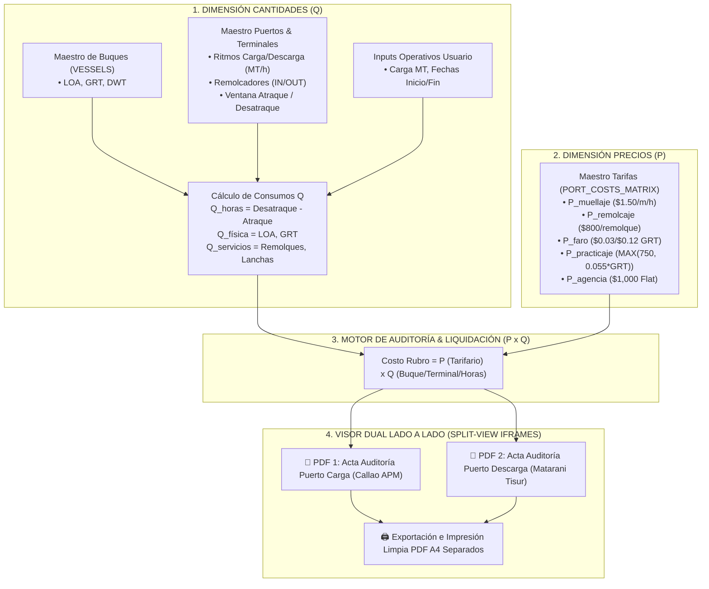

# 🚀 Plan de Implementación General: Maestro de Costos Portuarios & Motor Dinámico (Modelo P x Q)

> **Filosofía**: Desarrollo progresivo basado en la **Ecuación Fundamental de Costos Portuarios: $\text{Costo} = P \times Q$**
> - **$Q$ (Cantidad / Dimensiones Operativas)**: Jalado dinámicamente del **Maestro de Buques** ($\text{LOA}$, $\text{GRT}$, $\text{DWT}$) y **Maestro de Puertos/Terminales** (ritmo $\text{MT/h}$, remolques, ventana temporal atraque/desatraque).
> - **$P$ (Precios / Tarifas Unitarias)**: Jalado dinámicamente del **Maestro Tarifario** (`PORT_COSTS_MATRIX`).
> - **Auditoría & Cotizador**: Presenta la liquidación completa en **una sola ventana con vista dividida (Split-View)** de dos PDFs en paralelo (Carga y Descarga).

---

## 🗺️ Mapa General de la Arquitectura P x Q



---

## 📌 ESTADO DE AVANCE ACTUAL (RESUMEN EJECUTIVO)

| Capa / Etapa | Alcance / Entregable | Estado |
| :---: | :--- | :---: |
| **Capa 1 (LÓGICA P x Q)** | Levantamiento Lógico $P \times Q$ & Flujogramas Lineales PDF (Callao, Marcona, Matarani, Ilo) | **✅ COMPLETADO** |
| **Capa 2 (UI MAESTROS)** | `PortTariffsMaster.tsx` ($P$), `PortsMaster_V2.tsx` & `VesselTerminalMatrix.tsx` ($Q$) | **✅ COMPLETADO** |
| **Capa 3 (TABLAS BD)** | Esquema Supabase + Sembrados Oficiales (`seed_callao_experta.py`, `seed_matarani_experta.py`, etc.) | **✅ COMPLETADO** |
| **Capa 4 (MOTOR BACKEND)** | `Geeksoft_Engine/backend/port_engines/` con `calculator_callao.py` desacoplado | **✅ COMPLETADO** |
| **Capa 5 (AUDITORÍA VOYAGE DUAL)** | Visor Dual Lado a Lado Split-View (Carga vs Descarga) con recargo Casino y 3 Bloques | **✅ COMPLETADO** |
| **Capa 6 (MOTORES PUERTOS PERÚ)** | Desarrollo específico de motores de cálculo dinámico para Callao, Matarani, Marcona e Ilo | **✅ COMPLETADO** |


---

## 📅 HOJA DE RUTA PRÓXIMA ETAPA: MOTORES ESPECÍFICOS POR PUERTO PERUANO

1. **`calculator_matarani.py` (TISUR Matarani)**:
   - Motor dinámico para amarraderos C y F de Tisur, tarifas de muellaje por metro/hora y remolques Tramarsa.
2. **`calculator_marcona.py` (Shougang Hierro Perú)**:
   - Motor dinámico para muelle San Nicolás (Marcona), tarifas específicas de amarradero mineralero.
3. **`calculator_ilo.py` (Southern Perú SPCC / ENAPU Ilo)**:
   - Motor dinámico para terminal de fundición SPCC y Muelle Fiscal ENAPU Ilo.

---

## ⚙️ PROTOCOLO SECUENCIAL DE DESARROLLO POR PUERTO (DEL PNG AL CÓDIGO)

Para cada puerto (Perú, Chile o internacional), el desarrollo sigue un protocolo lineal obligatorio de 6 fases para garantizar 100% de coincidencia matemática:

```
0. Captura de Imagen PNG del Excel Fuente (Base Invariable de Auditoría)
   └── Capturar y guardar la imagen PNG del Excel de la experta como evidencia primaria indestructible.

1. Transcripción / Mapeo del PNG al Layout Markdown (ej. PNG_Chile_Quintero_Layout.md)
   └── Mapeo celdas Excel, ítems, proveedores y suma catálogo.

2. Redacción de Reglas de Cálculo de la Experta (ej. Reglas.Costos.Chile_Experta.md)
   └── Definición de 3 Filtros P x Q, conversión de moneda, recargos y acuerdos.

3. Codificación del Motor Backend (ej. calculator_cl.py / calculator_quintero.py)
   └── Programación de la lógica desacoplada en Geeksoft_Engine/backend/port_engines/.

4. Verificación Empírica en Terminal (ej. test_chile_engine.py)
   └── Ejecución script scratch en PowerShell para comprobar el costo centavo a centavo.

5. Integración Frontend, Compilación y Despliegue
   └── Reflejo de Q en matriz, prueba de compilación npm run build y push a VPS.
```


---

## 📌 Documentación de Referencia en Obsidian

- 📄 `Obsidian.Maestro.Costos.Portuarios/motores.calculo.complejo.md`
- 📄 `Obsidian.Maestro.Costos.Portuarios/hta.auditoria.md`
- 📄 `Obsidian.Maestro.Costos.Portuarios/Reglas.Costos.Callao_Experta.md`
- 📄 `Obsidian.Maestro.Costos.Portuarios/Reglas.Costos.Matarani_Experta.md`
- 📄 `Obsidian.Maestro.Costos.Portuarios/Reglas.Costos.Marcona_Experta.md`
- 📄 `Obsidian.Maestro.Costos.Portuarios/Reglas.Costos.Ilo_Experta.md`
- 📄 `Obsidian.Maestro.Costos.Portuarios/PNG_Marcona_Layout.md`
- 📄 `Obsidian.Maestro.Costos.Portuarios/PNG_Matarani_Layout.md`
- 📄 `Obsidian.Maestro.Costos.Portuarios/PNG_Ilo_Layout.md`

