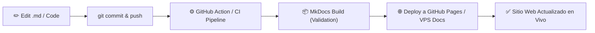

# 🚀 PLAN ESTRATÉGICO DE DOCUMENTACIÓN DOCS-AS-CODE
## PETRAL SMART DASHBOARD / SHIPPING.SOFT V2.5
### Ecosistema de Documentación Técnica, Operativa y Comercial Automatizada mediante Git

---

> **Empresa:** Naviera Petral S.A.  
> **Sistema:** PETRAL SMART DASHBOARD (Ecosistema Naviero P×Q & Voyage Ledger)  
> **Autor:** Equipo de Ingeniería de Software & Operaciones  
> **Fecha de Emisión:** Julio 2026  
> **Estado:** Aprobado para Implementación  

---

## 1. 📌 DIAGNÓSTICO & OBJETIVO GENERAL

Actualmente la documentación del sistema reside en archivos Markdown monolíticos aislados (ej. `Manual_y_Documentacion_Sistema_Petral.md`). Si bien el contenido es extenso, este enfoque presenta limitaciones operativas:

- **Falta de Navegación Dinámica:** Ausencia de buscador en tiempo real, menús laterales contextuales y breadcrumbs.
- **Riesgo de Desactualización:** Los cambios en código backend/frontend no se reflejan automáticamente en un portal visible para la gerencia.
- **Formato Rígido:** Los PDFs directos carecen de interactividad para explorar diagramas de arquitectura, contratos COA y fórmulas polinómicas BAF.

### 🎯 Objetivo General
Evolucionar la documentación técnica y operativa hacia una arquitectura de **Documentación como Código (Docs-as-Code)**, donde la documentación vive versionada en el repositorio Git (`/docs`) y se compila/publica automáticamente en un **Portal Web Interactivo** con buscador integrado, diagramación viva y sincronización vía `git push`.

---

## 2. 🛠️ SELECCIÓN DE STACK TECNOLÓGICO (GIT TOOLS)

Analizando las herramientas evaluadas en `GIT.TOOLS.MD`, la solución recomendada para PETRAL es un enfoque híbrido optimizado:

```
┌─────────────────────────────────────────────────────────────────────────────┐
│                          DOCS-AS-CODE STACK (PETRAL)                       │
├───────────────────────┬─────────────────────────────┬───────────────────────┤
│    MOTOR DE BUILD     │       TEMA & INTERFAZ       │    DESPLIEGUE / HOST  │
├───────────────────────┼─────────────────────────────┼───────────────────────┤
│  MkDocs / Docusaurus  │  Material for MkDocs (Dark) │ GitHub Pages / VPS    │
│  (Python / Node.js)   │  Search + Mermaid + MathJax │ (Workflow Automatizado)│
└───────────────────────┴─────────────────────────────┴───────────────────────┘
```

### Por qué MkDocs + Material for MkDocs:
1. **Nativo en Markdown (.md):** Reutiliza directamente todos los documentos y actas `.md` ya redactados.
2. **Soporte Nativo de Diagramas Mermaid & LaTeX:** Ideal para fórmulas BAF ($P \times Q$), encuadre de bandas tarifarias y diagramas de flujo de puertos.
3. **Buscador Completo Offline/Online:** Búsqueda instantánea por palabras clave (ej. "APM Callao", "TISUR", "MDO", "Overtime", "Sandra").
4. **Zero Mantenimiento de Servidor:** Se compila a HTML/JS/CSS estático ultrarrápido y liviano.

---

## 3. 📂 ARQUITECTURA DEL REPOSITORIO DE DOCUMENTACIÓN (`/docs`)

Estructura organizada en el repositorio bajo la carpeta `docs/`, asignando un archivo o subcarpeta por módulo del software:

```
PETRAL.SMART.DASHBOARD/
├── docs/
│   ├── index.md                        # Portal de Bienvenida & Dashboard Ejecutivo
│   ├── arquitectura/
│   │   ├── vista_general.md            # Arquitectura de 5 Niveles & Stack
│   │   ├── motores_python.md           # Geeksoft Engine, FastAPI & Supabase DB
│   │   └── flujo_datos.md              # Flujograma de Datos P×Q (Mermaid)
│   ├── maestros/
│   │   ├── flota.md                    # Buques, LOA, GRT, DWT y Consumos
│   │   ├── puertos.md                  # Puertos PE/CL, Terminales y Ritmos
│   │   ├── distancias.md               # Tabla de Distancias Navieras (Millas)
│   │   ├── clientes.md                 # SPCC, NEXA, Votorantim, COAs
│   │   ├── bunker.md                   # IFO 380, MDO/MGO (Homologación MDO) y BAF
│   │   └── originacion.md              # Sources & Sinks (Capacidades MT)
│   ├── motores_calculo/
│   │   ├── multicotizador_spot.md      # Algoritmo Spot Router y Simulación
│   │   ├── baf_polinomico.md           # Indexación por Combustibles
│   │   └── voyage_ledger.md            # P&L por Viaje, Estado de Resultados
│   ├── auditoria_qc/
│   │   ├── static_vs_dynamic.md        # Regla 6 OT (+25%) y Matriz Compleja
│   │   ├── bandas_tarifarias.md        # Resumen de Bandas MIN / MAX / FIJO
│   │   └── actas_experta_sandra.md     # Metodología de Validación & Proformas
│   └── guias_usuario/
│       ├── inicio_rapido.md            # Guía para Operadores y Compras
│       ├── generacion_pdf.md           # Exportación e Impresión de Actas A4
│       └── FAQ.md                      # Preguntas Frecuentes & Resolución de Errores
├── mkdocs.yml                          # Configuración Principal del Portal
└── .github/workflows/
    └── deploy-docs.yml                 # Automation GitHub Actions Deploy
```

---

## 4. 🔄 PIPELINE CI/CD & AUTOMATIZACIÓN DE PUBLICACIÓN

Cada vez que el desarrollador u operador realice modificaciones en el código o en los archivos `.md` del sistema:



### Configuración del Workflow (`deploy-docs.yml`):
```yaml
name: Deploy Documentation Site

on:
  push:
    branches:
      - main
    paths:
      - 'docs/**'
      - 'mkdocs.yml'

jobs:
  deploy:
    runs-on: ubuntu-latest
    steps:
      - uses: actions/checkout@v4
      - uses: actions/setup-python@v5
        with:
          python-version: '3.x'
      - run: pip install mkdocs-material mkdocs-mermaid2-plugin
      - run: mkdocs gh-deploy --force
```

---

## 5. 🎨 ESTÁNDAR VISUAL & REGLAS EDITORIALES (PETRAL BRAND)

Para mantener la calidad corporativa y ejecutiva del sitio web de documentación:

1. **Paleta de Colores Corporativa:**
   - Primario: `#1e3a5f` (Azul Naviero Petral)
   - Secundario: `#0284c7` (Azul Celeste Geeksoft)
   - Fondo Oscuro: `#0f172a` (Dark Mode por defecto)
2. **Gráficos & Diagramas Vivos:**
   - Utilizar diagramas **Mermaid** para flujogramas en lugar de imágenes estáticas pesadas.
3. **Imágenes Localmente Respaldadas:**
   - Toda captura de pantalla PNG se almacena en la ruta estandarizada:
     `Obsidian.Maestro.Costos.Portuarios/PNGs/`
4. **Cero Tolerancia a Fallbacks Raros:**
   - Si un dato no existe en DB, documentar el valor como `NO HAY` o `SIN DATO`.
5. **Regla de Homologación MDO/MGO:**
   - Todo consumo o tarifa que refiera a MGO debe estar explícitamente documentado bajo el estándar unificado **MDO**.

---

## 6. 📅 HOJA DE RUTA DE EJECUCIÓN (ROADMAP 4 SEMANAS)

| Semana | Fase | Entregable Clave |
|---|---|---|
| **Semana 1** | **Estructuración de Repositorio** | Creación de la carpeta `/docs`, migración del manual monolítico a archivos `.md` modulares y archivo `mkdocs.yml`. |
| **Semana 2** | **Integración de Diagramas & Fórmulas** | Conversión de fórmulas P×Q y diagramas de flujo a sintaxis Mermaid / MathJax. |
| **Semana 3** | **Automatización CI/CD** | Implementación del script de despliegue en Git (`git push` ➔ sitio web live en `docs.petral.com` o GitHub Pages). |
| **Semana 4** | **Auditoría & V°B° Experta Sandra** | Validación final del portal web de documentación por la gerencia naviera y operaciones. |

---

> **Conclusión:** Con esta estrategia Docs-as-Code, el sistema **PETRAL SMART DASHBOARD** dispondrá de una documentación viva, auditable, interactiva y profesional a la altura de las exigencias del sector naviero comercial.
