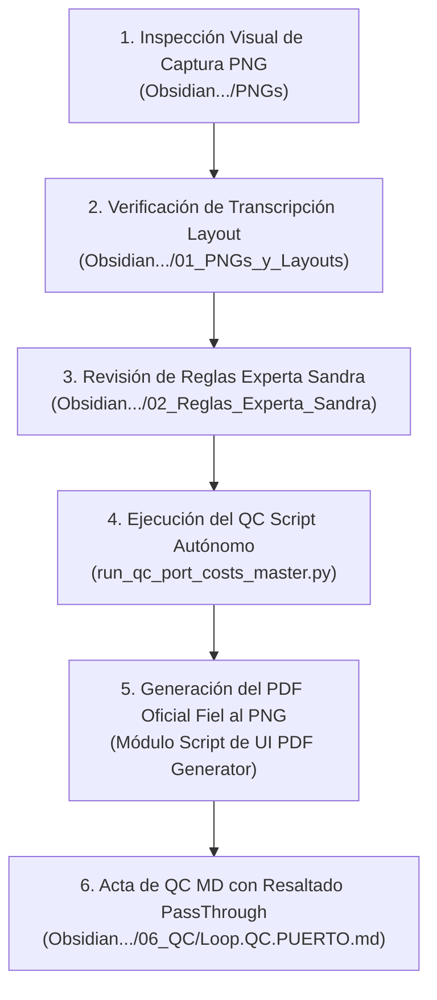

# 📖 PROTOCOLO Y METODOLOGÍA GENERAL DEL LOOP DE QC DE COSTOS PORTUARIOS (PETRAL / GEEKSOFT)

> **Destinatarios**: Agentes de IA (Gemini / Antigravity), Desarrolladores Backend & Frontend, Auditores Marítimos.  
> **Ubicación del Documento**: `Obsidian.Maestro.Costos.Portuarios/06_QC/00_Metodologia_QC_Loop_Costos_Portuarios.md`  
> **Estado**: NORMA OFICIAL INVARIABLE  

---

## 1. ⚙️ Propósito y Filosofía del Sistema de Auditoría
Este documento establece la **metodología estandarizada e invariable** para auditar y validar los costos portuarios de toda la flota de Naviera Petral en los terminales de Perú (Callao, Matarani, Ilo, Marcona) y Chile (TPM Mejillones, Barquito, Interacid, Terquim).

Ninguna IA o programador debe alterar esta lógica ni asumir valores por defecto sin seguir los 4 pasos del bucle autónomo.

---

## 2. 🛡️ Las Reglas de Oro del QC Loop

### 1️⃣ Consumo Dinámico Obligatorio de Parámetros $Q$ de la UI (`vessel_terminal_operations`)
- **TODAS las plantillas de PDF oficiales** por puerto y terminal deben consumir dinámicamente en tiempo real las cantidades $Q$ desde la base de datos de la UI (`vessel_terminal_operations`):
  - Ritmo de Carga / Descarga ($\text{MT/h}$).
  - Tiempos Fijos Operativos: Atraque ($\text{amarre\_hrs}$), Inspección/Pre-op ($\text{time\_to\_count}$) y Desamarre ($\text{desamarre\_hrs}$).
  - Cantidad de Remolques IN / OUT ($\text{tugboats\_count}$).
- **Fórmula Obligatoria de Horas**:
  $$Q_{\text{op}} = \frac{\text{Carga (MT)}}{\text{Ritmo (MT/h)}}, \quad Q_{\text{fijo}} = \text{Atraque} + \text{Prep} + \text{Desamarre}, \quad Q_{\text{puerto}} = Q_{\text{op}} + Q_{\text{fijo}}$$

### 2️⃣ Cuadro Comparativo Obligatorio al Pie de Todos los PDFs (Bandas Tarifarias)
- **TODOS los PDFs de auditoría** deben incorporar al pie de la liquidación el bloque comparativo de 4 métricas de referencia:
  1. **Escenario Optimista (Mínimo - Hábil)**: Nuestro cálculo dinámico en horario de oficina sin overtime.
  2. **Liquidación Oficial del PNG / Excel (Experta Sandra)**: Cifra de referencia alojada dentro de las bandas.
  3. **Matriz de Costo Fijo Estático (Supabase DB `port_cost_static`)**: Consulta directa a DB (`sub_operation_type = 'MAIN'`). Si la fila no existe, se desplegará obligatoriamente: **`⚠️ NO ESTÁ EN LA TABLA`** (Zero Fallbacks).
  4. **Escenario Pesimista (Máximo - Overtime)**: Nuestro cálculo dinámico con recargos de zarpe nocturno, domingos y festivos (+15%, +25%, +50%).

### 3️⃣ Desglose Explícito IN vs. OUT con Criterio Operativo (Practicaje & Remolcaje IN / OUT)
- Las maniobras de **Practicaje**, **Remolcaje**, **Lanchas** y **Acceso** se desglosan obligatoriamente en 2 filas independientes en los PDFs:
  - `Maniobra IN (Atraque / Ingreso)`: $P_{\text{IN}} \times Q_{\text{IN}}$
  - `Maniobra OUT (Desatraque / Salida)`: $P_{\text{OUT}} \times Q_{\text{OUT}}$
- Aísla con precisión qué maniobra ocurre en horario ordinario vs. la que cae en horario extraordinario/overtime.

### 4️⃣ Resaltado en Fondo Amarillo de Ítems PassThrough (Refacturables a Cliente)
- Todo ítem cuya columna de base de datos sea **`allow_pass_through = TRUE`** (refacturable 1:1 al cliente Southern Perú u otro armador según contrato 2025-2027) figurará en los PDFs **resaltado en amarillo brillante** con nota explicativa al pie (Impacto neto PnL $0.00 USD).

### 5️⃣ Regla "ZERO FALLBACKS" (Strict Zero Fallback Enforcement)
- **PROHIBIDO** usar valores harcodeados o inventados.
- Si falta una cantidad $Q$ o tarifa $P$, el motor emite un error `❌ MISSING_DATA_ERROR`.

---

## 3. 🔄 El Ciclo de 4 Pasos y Generación de PDF por Puerto/Terminal

---

## 4. 🗄️ Mapa de Archivos por Puerto Auditado

| Puerto / Terminal | Captura PNG | Layout Markdown | Reglas Experta | Acta de QC Loop |
| :--- | :--- | :--- | :--- | :--- |
| **Callao (APM)** | `Callao_APM.png` | `PNG_Callao_Layout.md` | `Reglas.Costos.Callao_Experta.md` | [Loop.QC.Callao.md](file:///C:/Users/rguti/PETRAL.SMART.DASHBOARD/Desarrollo.Profesional/Obsidian.Maestro.Costos.Portuarios/06_QC/Loop.QC.Callao.md) |
| **Matarani (Tisur)** | `Matarani_Tisur.png` | `PNG_Matarani_Layout.md` | `Reglas.Costos.Matarani_Experta.md` | [Loop.QC.Matarani.md](file:///C:/Users/rguti/PETRAL.SMART.DASHBOARD/Desarrollo.Profesional/Obsidian.Maestro.Costos.Portuarios/06_QC/Loop.QC.Matarani.md) |
| **Ilo (SPCC/Enapu)** | `Ilo_Enapu_SPCC.png` | `PNG_Ilo_Layout.md` | `Reglas.Costos.Ilo_Experta.md` | [Loop.QC.Ilo.md](file:///C:/Users/rguti/PETRAL.SMART.DASHBOARD/Desarrollo.Profesional/Obsidian.Maestro.Costos.Portuarios/06_QC/Loop.QC.Ilo.md) |
| **Marcona (SPCC)** | `Marcona_Shougang.png` | `PNG_Marcona_Layout.md` | `Reglas.Costos.Marcona_Experta.md` | [Loop.QC.Marcona.md](file:///C:/Users/rguti/PETRAL.SMART.DASHBOARD/Desarrollo.Profesional/Obsidian.Maestro.Costos.Portuarios/06_QC/Loop.QC.Marcona.md) |
| **Mejillones TPM** | `TPM_Mejillones_General.png` | `PNG_Mejillones_Layout.md` | `Reglas.Costos.Mejillones_Experta.md` | [Loop.QC.Mejillones_TPM.md](file:///C:/Users/rguti/PETRAL.SMART.DASHBOARD/Desarrollo.Profesional/Obsidian.Maestro.Costos.Portuarios/06_QC/Loop.QC.Mejillones_TPM.md) |
| **Interacid** | `Mejillones_Interacid.png` | `PNG_Mejillones_Interacid_Layout.md` | `Reglas.Costos.Mejillones_Interacid_Experta.md` | [Loop.QC.Mejillones_Interacid.md](file:///C:/Users/rguti/PETRAL.SMART.DASHBOARD/Desarrollo.Profesional/Obsidian.Maestro.Costos.Portuarios/06_QC/Loop.QC.Mejillones_Interacid.md) |
| **Terquim** | `Mejillones_Terquim.png` | `PNG_Mejillones_Terquim_Layout.md` | `Reglas.Costos.Mejillones_Terquim_Experta.md` | [Loop.QC.Mejillones_Terquim.md](file:///C:/Users/rguti/PETRAL.SMART.DASHBOARD/Desarrollo.Profesional/Obsidian.Maestro.Costos.Portuarios/06_QC/Loop.QC.Mejillones_Terquim.md) |
| **Barquito (Codelco)**| `Terminal_Barquito.png` | `PNG_Barquito_Layout.md` | `Reglas.Costos.Barquito_Experta.md` | [Loop.QC.Barquito.md](file:///C:/Users/rguti/PETRAL.SMART.DASHBOARD/Desarrollo.Profesional/Obsidian.Maestro.Costos.Portuarios/06_QC/Loop.QC.Barquito.md) |
