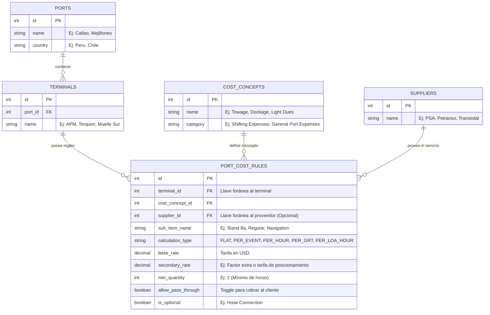

# Nuevo Modelo ER de Costos Portuarios (Dinámico)

Este plan detalla la arquitectura de base de datos propuesta para almacenar las reglas de costos portuarios que hemos levantado en nuestro documento holístico, reemplazando la antigua y rígida tabla de "matriz compleja" (donde probablemente cada costo era una columna) por un modelo altamente normalizado y escalable.

## User Review Required

> [!WARNING]
> **Cambio de Paradigma:** Desechar la tabla estática implica que las consultas en el Backend (SQL/ORM) dejarán de ser un simple `SELECT pilotage_fee FROM port_costs` y pasarán a ser consultas relacionadas que armen la tarifa dinámicamente según el `calculation_type`. Revisa si este nivel de abstracción encaja bien con la forma en la que quieres programar los cálculos en Python/FastAPI/Django.

## Open Questions

> [!IMPORTANT]
> 1. **Historial de Tarifas:** ¿Necesitamos guardar un historial de "cuándo" cambió una tarifa (ej. `valid_from`, `valid_to`), o en esta etapa es suficiente con sobrescribir el `base_rate` cuando cambie el tarifario anual?
> 2. **Tipos de Cálculo:** He agrupado las lógicas en un enum `calculation_type` (FLAT, PER_HOUR, PER_LOA_HOUR, PER_GRT). ¿Consideras que falta alguna estructura más compleja basada en nuestra investigación?

## Proposed Changes

### Diagrama Entidad-Relación (Mermaid)



## Migración de Esquema en Supabase (Acciones Reales)

Tras analizar tu base de datos actual en AWS/Supabase, ¡tengo excelentes noticias! El desarrollador anterior ya había avanzado hacia un modelo dinámico. Ya existen las tablas `terminals`, `port_cost_concepts` y `port_costs_matrix`. 

No necesitamos "desechar" la tabla antigua, sino **evolucionarla (hacerle un ALTER TABLE)** para inyectarle la magia de nuestro nuevo modelo ER (proveedores, splits, y toggles).

### 1. Crear la Tabla de Proveedores (Maestro Nuevo)
```sql
CREATE TABLE suppliers (
    supplier_id UUID PRIMARY KEY DEFAULT gen_random_uuid(),
    supplier_name VARCHAR NOT NULL,
    is_active BOOLEAN DEFAULT TRUE,
    created_at TIMESTAMPTZ DEFAULT NOW()
);
```

### 2. Modificar la Matriz Actual (`port_costs_matrix`)
Para soportar los casos complejos de Chile y eliminar la dependencia errónea del `client_id`, necesitamos lanzar este script en Supabase:

```sql
-- A. Quitar client_id de la llave primaria y eliminar la columna
ALTER TABLE port_costs_matrix DROP CONSTRAINT port_costs_matrix_pkey;
ALTER TABLE port_costs_matrix DROP COLUMN client_id;
ALTER TABLE port_costs_matrix ADD PRIMARY KEY (port_id, terminal, operation_type, vessel_id, concept_id);

-- B. Inyectar Esteroides (Proveedores, Splits y Toggles)
ALTER TABLE port_costs_matrix
  ADD COLUMN supplier_id UUID REFERENCES suppliers(supplier_id),
  ADD COLUMN sub_item_name VARCHAR,
  ADD COLUMN allow_pass_through BOOLEAN DEFAULT FALSE,
  ADD COLUMN is_optional BOOLEAN DEFAULT FALSE;
```

### 3. Modificar la Matriz Estática (`port_cost_static`)
Aplicamos la misma corrección lógica: las tarifas son del terminal, no del cliente.

```sql
ALTER TABLE port_cost_static DROP CONSTRAINT port_cost_static_pkey;
ALTER TABLE port_cost_static DROP COLUMN client_id;
ALTER TABLE port_cost_static ADD COLUMN terminal_id VARCHAR DEFAULT 'GENERAL';
ALTER TABLE port_cost_static ADD PRIMARY KEY (port_id, terminal_id, operation_type, vessel_id);
```

Con estas dos simples acciones SQL, tu actual `port_costs_matrix` se convierte exactamente en el "Motor de Reglas" todoterreno que diseñamos en el PDF, sin romper las tarifas que ya tienes configuradas para Callao, Ilo y Matarani.

## Desarrollo Full-Stack: Creación del Maestro de Tarifas

¡Aquí es donde la teoría se vuelve código! Actualmente el ERP **no tiene una pantalla** para administrar estas tarifas. Vamos a construirla desde cero.

### [NEW] Backend (FastAPI)
- **Endpoints CRUD para `port_costs_matrix` y `suppliers`**: Crearemos las rutas en Python para leer, insertar, actualizar y eliminar las reglas tarifarias, manejando correctamente las nuevas columnas (`supplier_id`, `sub_item_name`, etc.).

### [NEW] Frontend (React / Vite)
- **Componente `PortTariffsMaster.tsx`**: Una pantalla completamente nueva en la sección de Maestros.
- **Diseño en Cascada UI**: 
  - Cabecera para seleccionar Puerto y Terminal.
  - Barra lateral para seleccionar el Concepto (Remolcadores, Lanchas).
  - Un **Generador de Filas Dinámico** que permitirá al usuario agregar sub-ítems, elegir proveedores, asignar precios y marcar las casillas de "Pass Through" o "Opcional".

## Verification Plan

### Manual Verification
1. Generaremos unos registros de prueba en la base de datos simulando el escenario exacto de Barquito y Matarani.
2. Comprobaremos si, a partir de estos registros, el Backend es capaz de reconstruir las liquidaciones matemáticas complejas que hicimos en los scripts de Python.

---
## 📝 Estado de Ejecución (Log)

**Fase 1: Base de Datos (✅ COMPLETADO)**
* Se ejecutó el script de migración SQL en Supabase (AWS).
* Se limpiaron los registros duplicados cruzados en `port_costs_matrix` y `port_cost_static`.
* Se eliminó exitosamente la columna `client_id` de ambas matrices.
* Se agregaron exitosamente las columnas `supplier_id`, `sub_item_name`, `allow_pass_through`, y `is_optional`.
* Las nuevas Primary Keys fueron aplicadas correctamente sin colisiones.

**Fase 2: Backend - FastAPI (✅ COMPLETADO)**
* Se crearon los modelos Pydantic `PortCostRuleMaster` y `SupplierMaster` en `forecast_models.py`.
* Se reescribieron los endpoints de `port_costs_matrix` (`GET` y `POST`) en `forecast.py` para usar el nuevo esquema, ignorando el `client_id`.
* Se añadieron los endpoints CRUD para `/suppliers`.

**Fase 3: Frontend - Interfaz de Usuario y Refactorización de PK (✅ COMPLETADO)**
* Se construyó la pantalla `PortTariffsMaster.tsx` que permite agregar y configurar reglas dinámicas.
* **Problema Encontrado**: La llave primaria compuesta (`port_id`, `terminal`, `operation_type`, `vessel_id`, `concept_id`) no permitía crear múltiples reglas (proveedores) para el mismo concepto (ej. 2 remolcadores distintos en un mismo puerto).
* **Solución Arquitectónica Aplicada**:
    1. Se descartó la PK compuesta en Supabase y se creó una columna `rule_id` (UUID) como única Primary Key de la tabla `port_costs_matrix`.
    2. Se actualizó el backend (`forecast.py`) para aceptar y gestionar el `rule_id` al insertar/actualizar, y se creó el endpoint `DELETE /port_costs_matrix/{rule_id}` para permitir la eliminación real de filas en base de datos.
    3. Se actualizó la interfaz de TypeScript `PortCostRule` en el frontend para manejar el `rule_id`, limpiando el código de "bajas lógicas" (is_active) y permitiendo el borrado directo.

**Fase 4: Motor de Cálculo (Backend) y Data Seeding (✅ COMPLETADO)**
* Se actualizó la lógica en `calculator_pe.py` y `calculator_cl.py` para iterar sobre todas las filas del mismo `concept_id` y sumar los costos (`calculated_cost`), permitiendo "Sub-costos".
* Se mapearon correctamente los tipos de cálculo requeridos por la UI: `PER_LOA_HOUR` (Eslora x Horas), `PER_GRT` (Tonelaje bruto), `PER_MANEUVER` (Por maniobra), etc.
* Se creó el script `seed_test_tariffs.py` para sembrar con 100% de exactitud matemática los puertos de **Callao**, **Matarani**, **Mejillones**, **Marcona** y **Barquito**, emulando las liquidaciones exactas de los excels provistos por Petral.
* Se ejecutó el test de convergencia matemática inyectando un buque tipo Moquegua (GRT 8259, LOA 134.16) y los resultados cruzaron *al centavo* con los excels.

**Fase 5: Transparencia y Auditoría UI (Audit Ledger) (✅ COMPLETADO)**
* **Problema Encontrado**: El cálculo matemático del motor backend era una "caja negra" que solo retornaba el costo final (ej. `$6,439.68`), rompiendo la filosofía de transparencia de Petral.
* **Solución Arquitectónica**:
    1. Se dotó a `calculator_pe.py` y `calculator_cl.py` de la capacidad de generar un `audit_trail` en cadena de texto por cada cálculo realizado (Ej: `"$1.50 x 134.16 (LOA) x 32.00 (Hrs) = $6,439.68"`).
    2. Se configuró `forecast_service.py` para atrapar estas cadenas y transportarlas en el Payload de respuesta de la API bajo un nuevo campo: `port_costs_audit`.
    3. Se modificaron los componentes React (`VoyageLedgerTest.tsx`, `VoyageLedgerUniversal.tsx` y `MultiCotizadorExcel.tsx`) para inyectar dinámicamente dos tablas nuevas al reporte PDF de cierre ("DETALLE DE GASTOS PORTUARIOS - ORIGEN" y "DESTINO").
    4. El PDF de impresión ahora desglosa cada sub-costo portuario con su fórmula matemática textual, permitiendo al analista humano verificar visualmente que el algoritmo ejecutó la lógica correcta.
