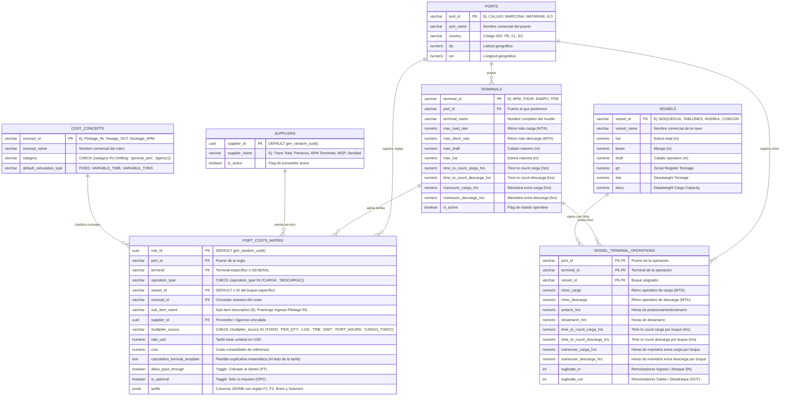

# 📊 Modelo Entidad - Relación (E-R): Motor Dinámico de Costos Portuarios

> **Ubicación en Bóveda**: `Obsidian.Maestro.Costos.Portuarios/Modelo.ER.Motor.Costos.Portuarios.md`
> **Propósito**: Especificar la arquitectura de base de datos relacional y la estructura dinámica `JSONB` que soportan el **Motor de Gastos Portuarios** (Etapa 1: Proyecciones Realistas | Etapa 2: Auditoría y Liquidación de Cuentas de Agencia).
> **Principio de Diseño**: Modelo normalizado relacional híbrido. Las entidades fijas (puertos, terminales, proveedores, rubros) forman la estructura SQL, mientras que las reglas complejas (horarios, procedencias, indexaciones Brent, volumen) se almacenan en la columna dinámico-estructurada **`tariffs (JSONB)`**.

---

## 📐 1. Diagrama Entidad - Relación (Mermaid ERD)

---

## 🏛️ 2. Especificación Detallada de Tablas y Atributos

### 2.1. Tabla: `ports` (Maestro de Puertos)
* `port_id` *(VARCHAR, PK)* → Identificador único (`'CALLAO'`, `'MARCONA'`, `'MATARANI'`, `'ILO'`).
* `port_name` *(VARCHAR, NOT NULL)* → Nombre comercial (ej: "Puerto del Callao").
* `country` *(VARCHAR(2), NOT NULL, DEFAULT 'PE')* → Código ISO (`'PE'`, `'CL'`, `'EC'`).
* `lat` *(NUMERIC)* → Latitud.
* `lon` *(NUMERIC)* → Longitud.

---

### 2.2. Tabla: `terminals` (Maestro de Terminales Físicos)
* `terminal_id` *(VARCHAR, PK)* → Identificador único (`'APM'`, `'TISUR'`, `'ENAPU'`, `'TPM'`).
* `port_id` *(VARCHAR, PK, FK → ports.port_id)*
* `terminal_name` *(VARCHAR, NOT NULL)* → Nombre descriptivo.
* `max_load_rate` *(NUMERIC, DEFAULT 9999)* → Ritmo máx carga (MT/h).
* `max_disch_rate` *(NUMERIC, DEFAULT 9999)* → Ritmo máx descarga (MT/h).
* `max_draft` *(NUMERIC, DEFAULT 9999)* → Calado máximo (m).
* `max_loa` *(NUMERIC, DEFAULT 9999)* → Eslora máxima (m).
* `time_to_count_carga_hrs` *(NUMERIC, DEFAULT 6.0)*
* `time_to_count_descarga_hrs` *(NUMERIC, DEFAULT 6.0)*
* `maneuver_carga_hrs` *(NUMERIC, DEFAULT 2.0)*
* `maneuver_descarga_hrs` *(NUMERIC, DEFAULT 2.0)*
* `is_active` *(BOOLEAN, DEFAULT TRUE)*

---

### 2.3. Tabla: `suppliers` (Maestro de Proveedores / Agencias Marítimas)
* `supplier_id` *(UUID, PK, DEFAULT gen_random_uuid())*
* `supplier_name` *(VARCHAR, NOT NULL)* → Nombre comercial (`"Trans Total"`, `"Petranso"`, `"APM Terminals"`, `"Hidrografía / MGP"`, `"Sanidad Marítima"`).
* `is_active` *(BOOLEAN, DEFAULT TRUE)*

---

### 2.4. Tabla: `port_costs_matrix` (`PORT_COST_RULES` — Motor Dinámico de Reglas)
* `rule_id` *(UUID, PK, DEFAULT gen_random_uuid())*
* `port_id` *(VARCHAR, NOT NULL, FK → ports.port_id)*
* `terminal` *(VARCHAR, NOT NULL, DEFAULT 'GENERAL')*
* `operation_type` *(VARCHAR, NOT NULL, CHECK (operation_type IN ('CARGA', 'DESCARGA')))*
* `vessel_id` *(VARCHAR, NOT NULL, DEFAULT 'DEFAULT')*
* `concept_id` *(VARCHAR, NOT NULL, FK → cost_concepts.concept_id)*
* `sub_item_name` *(VARCHAR)* → Nombre oficial del ítem.
* `supplier_id` *(UUID, FK → suppliers.supplier_id)* → Proveedor / Agencia vinculada.
* `multiplier_source` *(VARCHAR)* → Multiplicador base (`FIXED`, `LOA`, `TRB`, etc.).
* `rate_usd` *(NUMERIC, DEFAULT 0)* → Tarifa unitaria base.
* `calculation_formula_template` *(TEXT)* → Plantilla explicativa matemática mostrada al lado.
* `allow_pass_through` *(BOOLEAN, DEFAULT FALSE)* → Toggle *Pass Through* (PT).
* `is_optional` *(BOOLEAN, DEFAULT FALSE)* → Toggle *Opcional* (OPC).
* **`tariffs` *(JSONB, NOT NULL, DEFAULT '{}')*** → **Columna dinámico-estructurada JSONB.**
