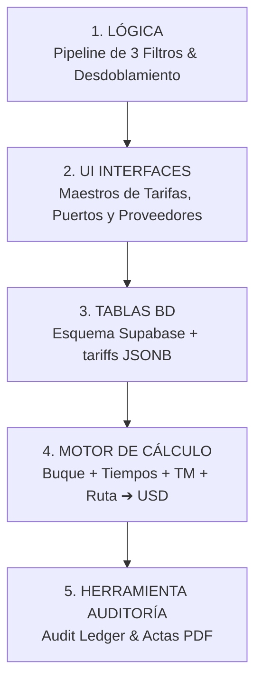

# 🚀 Plan de Implementación General: Maestro de Costos Portuarios & Motor Dinámico

> **Filosofía**: Desarrollo progresivo por etapas basado en una arquitectura desacoplada de 5 capas: 
> **`LÓGICA ➔ UI ➔ TABLAS (BD) ➔ MOTOR DE CÁLCULO ➔ HERRAMIENTA DE AUDITORÍA`**
>
> **Objetivo Final**: Lograr interfaces visuales intuitivas (UI) que convenzan al usuario, alimentando un motor de cálculo que tome buque, tiempos de maniobra, tonelaje y ruta para proyectar o liquidar el costo portuario exacto con 100% de transparencia matemática.

---

## 🗺️ Mapa General de las 5 Capas de Implementación



---

## 📌 CAPA 1: LÓGICA (Pipeline Universal de 3 Filtros) — ✅ 100% DEFINIDA

- **Desdoblamiento de Maniobras**: Eventos de ingreso (`IN`) y salida (`OUT`) evaluados contra su hora exacta de término (`end_time`).
- **Filtro 1 (Propiedades)**: Procedencia (`last_port`), destino (`next_port`), cabotaje vs. exportación.
- **Filtro 2 (Regla del Casino / Tiempo)**: Overtime (`18-24h` 25%, `00-07h` 50%), `Domingos`, `Feriados`, `Cierre de Puerto`.
- **Filtro 3 (Fórmulas Matemáticas Base - 7 Categorías)**:
  1. `FIXED_FLAT`: Tarifa fija.
  2. `PER_QTY`: Tarifa × Cantidad eventos.
  3. `PER_HOUR`: Tarifa × Horas de puerto.
  4. `PER_GRT`: Tarifa × Tonelaje Bruto.
  5. `PER_LOA_HOUR`: Tarifa × Eslora × Horas de puerto (Muellaje APM / Tisur).
  6. `CONDITIONAL_MAX`: $\max(\text{Tarifa Base}, k \times \text{GRT})$.
  7. `PERCENTAGE_SURCHARGE`: Recargo porcentual acumulativo (o tablas Brent / Rebates por Volumen).

---

## 📌 CAPA 2: INTERFACES DE USUARIO (UI & Diseños de Alto Impacto)

> 🎨 **Objetivo de Diseño**: Construir pantallas modernas, ejecutivas y fluidas que superen la rigidez de los Excels tradicionales y convenzan visualmente al analista.

### 2.1. 🏛️ Maestro de Tarifas Portuarias (`PortTariffsMaster.tsx`)
- **Responsabilidad**: Almacena y administra las **tarifas y reglas del Excel** por agencia, proveedor, puerto y terminal.
- **Componentes Visuales**:
  - Selector de Cascada: **País ➔ Puerto ➔ Terminal ➔ Proveedor (Agencia)**.
  - Tabla Inteligente con distintivos de categoría (`Shifting`, `General Port`, `Agency`).
  - Modal Generador de Reglas (Configuración de Tarifa Base, $1\text{er}$ Filtro Propiedad, $2\text{do}$ Filtro Casino, $3\text{er}$ Filtro Fórmula).
  - Toggles visuales para **Pass-Through** (asumido por cliente) y **Es Opcional**.

### 2.2. ⚓ Maestro de Puertos & Terminales (`PortMaster_V2.tsx`)
- **Responsabilidad**: Almacena los **parámetros físicos y reglas operativas del terminal**.
- **Campos Administrables**:
  - Ritmo máximo de carga (`max_load_rate` MT/h) y descarga (`max_disch_rate` MT/h).
  - Límites físicos: Calado máximo (`max_draft` m) y Eslora máxima (`max_loa` m).
  - Tiempos muertos contractuales estándar (Time to count en origen y destino).
  - Coordenadas geoespaciales (Latitud/Longitud) para el Mapa Espagueti.

### 2.3. 🏢 Maestro de Proveedores (`SuppliersMaster.tsx`)
- **Responsabilidad**: Almacena la identidad de agencias marítimas y operadores (`Trans Total`, `PSA Marine`, `Petranso`, `Ultratug`, `Port Operations`, `Tisur`).

---

## 📌 CAPA 3: TABLAS (Base de Datos Supabase SQL + JSONB)

- **`ports`**: Identidad de puertos (`CALLAO`, `MARCONA`, `MATARANI`, `ILO`).
- **`terminals`**: Terminales físicos (`APM`, `TISUR`, `ENAPU`, `TPM`, `INTERACID`).
- **`suppliers`**: Catálogo de proveedores y agencias marítimas.
- **`port_cost_concepts`**: Catálogo unificado de 22+ conceptos de gasto.
- **`port_costs_matrix` (`PORT_COST_RULES`)**:
  - Clave técnica primaria: `rule_id` (UUID).
  - Atributos relacionales: `port_id`, `terminal`, `operation_type`, `vessel_id`, `concept_id`, `sub_item_name`, `supplier_id`, `multiplier_source`, `rate_usd`, `cost`, `allow_pass_through`, `is_optional`.
  - Columna JSONB dinámico: `tariffs` (contiene `property_rules`, `time_rules`, `brent_rules`, `volume_discounts`).

---

## 📌 CAPA 4: MOTOR DE GASTOS PORTUARIOS (Backend Python Engine)

- **Firma del Endpoint / Función de Cálculo**:
  ```python
  def calculate_port_expenses(
      vessel_id: str,              # Buque (extrae LOA, GRT, DWT de vessels)
      port_id: str,                # Puerto (ej: CALLAO)
      terminal_id: str,            # Terminal (ej: APM)
      operation_type: str,         # CARGA / DESCARGA
      cargo_tons: float,           # Volumen de carga en TM
      maneuver_start_time: datetime, # Fecha/Hora inicio maniobra
      maneuver_end_time: datetime,   # Fecha/Hora fin maniobra (evalúa Casino/Overtime)
      last_port_country: str,      # Procedencia (evalúa Faro $0.03 vs $0.12)
      brent_price_usd: float = 80.0 # Precio de crudo Brent opcional
  ) -> PortCalculationResult:
  ```

- **Flujo de Ejecución Interno del Motor**:
  1. Extrae dimensiones físicas del buque desde `vessels` (`LOA`, `GRT`).
  2. Extrae las reglas activas de `port_costs_matrix` para el `port_id` y `terminal_id`.
  3. Ejecuta la **Tubería de 3 Filtros** en serie para cada regla.
  4. Genera el total acumulado en USD y la cadena transparente de auditoría (`audit_trail`).

---

## 📌 CAPA 5: HERRAMIENTA DE AUDITORÍA (Audit Ledger & Reporte PDF)

- **Auditoría en Pantalla (UI Audit Ledger)**:
  - Desglose transparente línea por línea con badge de estado (*Verificado / Sobrecargo Overtime*).
  - Muestra la ecuación exacta evaluada (ej: `"$1.50 × 134.16m (LOA) × 27h (Puerto) = $5,758.48 USD"`).
- **Reporte PDF de Auditoría**:
  - Generación del Acta de Gastos Portuarios de Origen y Destino con logos corporativos PETRAL y GEEKSOFT.

---

## 📋 Cronograma de Ejecución por Etapas

| Etapa | Alcance / Entregable | Estado |
| :---: | :--- | :---: |
| **Etapa 1.1** | Levantamiento Lógico & Flujogramas Lineales PDF (Perú: Callao, Marcona, Matarani, Ilo) | **✅ COMPLETADO** |
| **Etapa 1.2** | Diseño e Implementación de Pantallas UI convencedoras (`PortTariffsMaster.tsx` y `PortMaster_V2.tsx`) | **🔄 SIGUIENTE PASO** |
| **Etapa 1.3** | Ajuste de Tablas en Supabase y endpoints CRUD en FastAPI | **⏳ PENDIENTE** |
| **Etapa 1.4** | Ensamblaje del Motor de Gastos Portuarios (Buque + Tiempos + TM ➔ Costo) | **⏳ PENDIENTE** |
| **Etapa 1.5** | Herramienta de Auditoría UI & Reporte PDF de Liquidación | **⏳ PENDIENTE** |
