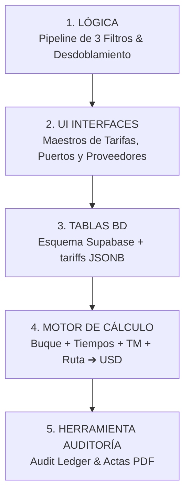
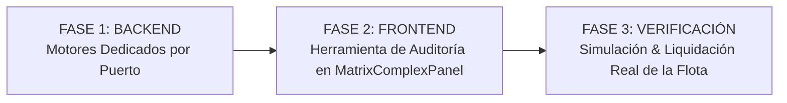

# 🚀 Plan de Implementación General: Maestro de Costos Portuarios & Motor Dinámico

> **Filosofía**: Desarrollo progresivo por etapas basado en una arquitectura desacoplada de 5 capas: 
> **`LÓGICA ➔ UI ➔ TABLAS (BD) ➔ MOTOR DE CÁLCULO ➔ HERRAMIENTA DE AUDITORÍA`**
>
> **Objetivo Final**: Lograr interfaces visuales intuitivas (UI) que convenzan al usuario, alimentando un motor de cálculo que tome buque, tiempos de maniobra, tonelaje y ruta para proyectar o liquidar el costo portuario exacto con 100% de transparencia matemática.

---

## 🗺️ Mapa General de las 5 Capas de Implementación

---

## 📌 ESTADO DE AVANCE ACTUAL (RESUMEN EJECUTIVO)

| Capa / Etapa | Alcance / Entregable | Estado |
| :---: | :--- | :---: |
| **Capa 1 (LÓGICA)** | Levantamiento Lógico & Flujogramas Lineales PDF (Callao, Marcona, Matarani, Ilo) | **✅ COMPLETADO** |
| **Capa 2 (UI MAESTROS)** | `PortTariffsMaster.tsx` (UI limpia a ancho completo desglosada en A, B y C) & `PortsMaster_V2.tsx` (Parámetros físicos y Matriz 10 variables Buque-Terminal desdoblada) | **✅ COMPLETADO** |
| **Capa 3 (TABLAS BD)** | Esquema Supabase + Sembrados Oficiales (`seed_callao_experta.py`, `seed_matarani_experta.py`, `seed_marcona_experta.py`, `seed_ilo_experta.py`) con proveedores vinculados | **✅ COMPLETADO** |
| **Capa 4 (MOTOR)** | Motores de cálculo modular por puerto (`backend/port_engines/`) | **📌 HOJA DE RUTA MAÑANA** |
| **Capa 5 (AUDITORÍA)** | Herramienta de Auditoría y Modelo Matriz Compleja (`MatrixComplexPanel.tsx`) | **📌 HOJA DE RUTA MAÑANA** |

---

## 📅 HOJA DE RUTA EXACTA PARA MAÑANA (SESIÓN DE TRABAJO)

Mañana nos enfocaremos en completar la **Capa 4 (Motor de Cálculo Backend)** y la **Capa 5 (Herramienta de Auditoría UI estilo AuditFinal)**.

---

### ☀️ FASE 1: Construcción de Motores Dedicados Backend (`port_engines/`)

Desarrollaremos la arquitectura modular backend en `Geeksoft_Engine/backend/port_engines/`:

1. **`core.py` (Tubería Orquestadora Base & Endpoint FastAPI)**:
   - Expone el endpoint `POST /api/v2/port-costs/calculate-audit`.
   - Recibe los 5 inputs operativos: `route_id`, `vessel_id`, `cargo_tons`, `entry_datetime`, `exit_datetime`.
   - Consulta `vessels` para extraer automáticamente $\text{LOA}$, $\text{GRT}$, $\text{DWT}$ y llama al calculador de puerto correspondiente.

2. **`calculator_callao.py` (Motor Dedicado Callao - APM Terminals)**:
   - Muellaje APM: $\$1.50 \times \text{LOA} \times \text{Horas Puerto}$.
   - Practicaje IN/OUT: $\max(\$750.00, 0.055 \times \text{GRT}) + \text{Overtime (25%/50%)}$.
   - Remolcaje IN/OUT: $\$800.00 \times \text{tugboats\_in}$ / $\text{tugboats\_out}$.
   - Faro y Balisas: $\$0.03\text{/GRT}$ Nacional vs. $\$0.12\text{/GRT}$ Extranjero.
   - Sanidad: $\$520.00\text{ USD Flat}$ (solo extranjero).

3. **`calculator_matarani.py` (Motor Dedicado Matarani - Tisur S.A. / Addenda PSA)**:
   - Servicio Integral PSA Addenda: $\$3,368.00\text{ USD}$ por maniobra ($\$6,736.00\text{ escala}$).
   - Recargos Overtime PSA: $+25\%$ ($\$842.00$) / $+50\%$ ($\$1,684.00$).
   - Muellaje Tisur: $\$0.65 \times \text{LOA} \times \text{Horas Puerto}$.
   - Sanidad: $\$670.00\text{ USD Flat}$.

4. **`calculator_marcona.py` (Motor Dedicado Marcona - SPCC / San Juan)**:
   - Aplicación directa de la Tarifa Acuerdo Petral/Southern: **$\$36,000.00\text{ USD Flat}$** por escala.
   - Desglose preferencial: Servicio Integral Atraque $\$30,508.48\text{ USD}$ + Agencia.

5. **`calculator_ilo.py` (Motor Dedicado Ilo - Enapu / SPCC)**:
   - Muellaje SPCC: $\$300.00 + (\$0.05 \times \text{GRT} \times \text{Días Muelle})$.
   - Remolcaje PSA Marine: $\max(\$1,800.00, 0.16 \times \text{GRT}) \times 2\text{ remolcadores}$.
   - Remolcaje Petranso: $0.18 \times \text{GRT} \times 2\text{ remolcadores}$ ($-10\%$ desc. comercial).

---

### ☀️ FASE 2: Desarrollo de la Herramienta de Auditoría (`MatrixComplexPanel.tsx`)

Implementaremos en la pestaña **"Modelo Matriz Compleja"** (dentro de `/port-costs`):

1. **Barra Superior de Inputs de Simulación**:
   - Selectores de **Ruta Commercial** (`Callao -> Matarani`, `Marcona -> Ilo`, etc.).
   - Selector de **Buque** (`BT MOQUEGUA`, `BT TABLONES`, `BT HUEMUL`, `CONCON TRADER`).
   - Input de **Toneladas de Carga** ($\text{MT}$).
   - Date-Pickers de **Fecha/Hora Entrada** y **Fecha/Hora Salida** (para cálculo de horas reales en muelle y recargos horario/festivo).

2. **4 Tarjetas KPI de Impacto Financiero (Estilo `AuditFinal_V2`)**:
   - 🔵 **Puerto Origen (Carga USD)**
   - 🟢 **Puerto Destino (Descarga USD)**
   - 🟣 **Total Escala Portuaria (USD)**
   - ⏱️ **Horas Totales en Puerto**

3. **Grilla Transparente de Auditoría Línea por Línea**:
   - Desglose por Puerto (Origen y Destino) organizado en sus 3 secciones oficiales:
     - 🟦 `A) SHIFTING EXPENSES`
     - 🟩 `B) GENERAL PORT EXPENSES`
     - 🟪 `C) AGENCY EXPENSES`
   - Mapeo de Ecuación Matemática Evaluada Real (ej: `"$1.50 × 134.16m (LOA) × 27h (Puerto)"` o `"MAX($750.00, 0.055 × 8,259 GRT) + 25% Overtime"`).
   - Badges de `<Pass Through>`, `<Overtime 25%>`, `<Acuerdo SPCC>`.

4. **Exportación de Auditoría**:
   - Botón de Exportar a Excel y Generar Acta PDF Oficial.

---

### ☀️ FASE 3: QC & Verificación con Escenarios Reales de la Flota

- Ejecutar las 4 simulaciones reales de la proforma oficial:
  - `BT MOQUEGUA` en Callao ➔ Matarani ($14,938.34 + $15,364.50 = $30,302.84 USD).
  - `BT TABLONES` en Callao ➔ Matarani.
  - `BT HUEMUL` en Callao ➔ Matarani.
  - `CONCON TRADER` en Callao ➔ Matarani.
- Verificar coincidencia al 100% de centavos contra la proforma de la experta.

---

## 📌 Documentación de Referencia en Obsidian

- 📄 `Obsidian.Maestro.Costos.Portuarios/motores.calculo.complejo.md`
- 📄 `Obsidian.Maestro.Costos.Portuarios/hta.auditoria.md`
- 📄 `Obsidian.Maestro.Costos.Portuarios/Modelo.ER.Motor.Costos.Portuarios.md`
- 📄 `Obsidian.Maestro.Costos.Portuarios/PNG_Callao_Layout.md`
- 📄 `Obsidian.Maestro.Costos.Portuarios/PNG_Matarani_Layout.md`
- 📄 `Obsidian.Maestro.Costos.Portuarios/PNG_Marcona_Layout.md`
- 📄 `Obsidian.Maestro.Costos.Portuarios/PNG_Ilo_Layout.md`
