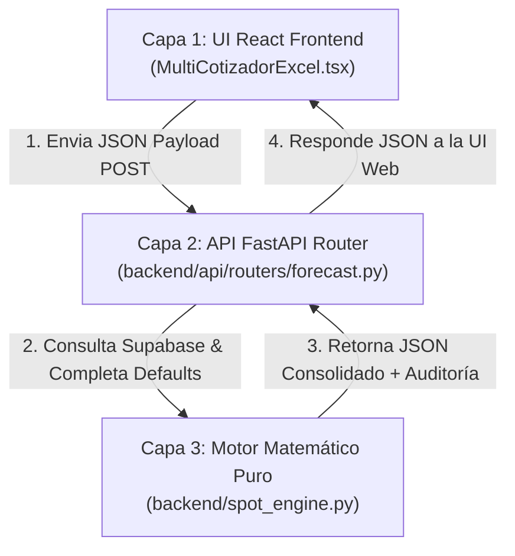

# 🏗️ ARQUITECTURA UNIFICADA DE 3 CAPAS — MULTICOTIZADOR SPOT FORECAST & ENGINE

> **Ruta del Proyecto**: `C:\Users\rguti\PETRAL.SMART.DASHBOARD`  
> **Fecha de Documentación**: 2026-08-12  
> **Módulo**: Refactorización del Multicotizador Spot V3  

---

## 1. 📐 Flujo End-to-End de Comunicación (UI ↔ API ↔ Engine)

El Multicotizador Spot opera bajo un flujo estrictamente acoplado de 3 capas. Ninguna prueba de convergencia es válida si se prueba únicamente la Capa 3 (Motor en Python) sin verificar que la Capa 1 (UI React) y la Capa 2 (API FastAPI Router) transmitan los datos sin alterar ceros ni forzar fallbacks.

---

## 2. 🧱 Detalle de las 3 Capas de la Arquitectura

### 🎨 Capa 1: UI React Frontend (`MultiCotizadorExcel.tsx`)
- **Ubicación**: `C:\Users\rguti\PETRAL.SMART.DASHBOARD\Desarrollo.Profesional\Geeksoft_Frontend\src\components\CommercialForecast\MultiCotizadorExcel.tsx`
- **Responsabilidad**:
  - Mantiene la grilla editable estilo Excel ($N$ piernas de viaje).
  - Captura datos de usuario: Ritmo Carga/Descarga, TIME TO COUNT (horas overhead), Posicionamiento (horas maniobra), Flete ($/MT), Costos de Puerto ($USD) y Precios Búnker.
  - Asigna de manera limpia el TIME TO COUNT y Costo de Puerto a su recalada correspondiente (evitando que una misma recalada intermedia se duplique como destino del tramo $i$ u origen del tramo $i+1$).

---

### 🔌 Capa 2: API FastAPI Router Middleware (`backend/api/routers/forecast.py`)
- **Ubicación**: `C:\Users\rguti\PETRAL.SMART.DASHBOARD\Desarrollo.Profesional\Geeksoft_Engine\backend\api\routers\forecast.py`
- **Punto de Entrada HTTP**: `POST /multicotizador/calculate`
- **Responsabilidad**:
  - Recibe el request JSON del frontend.
  - Consulta la base de datos Supabase (tablas `distances`, `ports`, `contracts`, `port_costs_matrix`).
  - **REGLA CRÍTICA DE FALLBACKS**:
    - **NUNCA** debe reemplazar un `0.0` o valor explícito ingresado por el usuario o enviado desde la UI por un fallback del contrato de Supabase.
    - Se corrigió la condición `if po_or > 0` a `if po_or is not None` para garantizar que si la UI envía `0.0` (para evitar duplicar el TIME TO COUNT en Callao), la API **respete el `0.0`** y no fuerce 6.0 horas adicionales del contrato.

---

### 🧮 Capa 3: Motor Matemático Puro de Simulación (`backend/spot_engine.py`)
- **Ubicación**: `C:\Users\rguti\PETRAL.SMART.DASHBOARD\Desarrollo.Profesional\Geeksoft_Engine\backend\spot_engine.py`
- **Responsabilidad**:
  - Kernel matemático puro sin estado (stateless).
  - Recibe la estructura de datos procesada por `forecast.py`.
  - Procesa cada leg en secuencia (`process_ballast_leg` y `process_laden_leg`).
  - Aplica las ecuaciones matemáticas de PETRAL:
    $$\text{Días de Mar} = \frac{\text{Distancia} \cdot (1 + \text{WF})}{\text{Velocidad} \cdot 24}$$
    $$\text{Días de Puerto} = \sum \left(\frac{Q}{\text{Ritmo Carga} \cdot 24} + \frac{Q}{\text{Ritmo Descarga} \cdot 24} + \frac{\text{TIME TO COUNT}}{24}\right)$$
    $$\text{Voyage Result / PCM} = \text{Freight Revenue} - \text{Port Costs} - \text{Bunker Costs} - \text{Commissions}$$
    $$\text{TCE Real ($/día)} = \frac{\text{Voyage Result}}{\text{Días Totales de Viaje}}$$
    $$\text{P/L Net Utility ($USD)} = \text{Voyage Result} - (\text{Días Totales} \times \text{TCE Requerido})$$

---

## 3. 🚨 Protocolo Estricto de Verificación End-to-End

1. **PROHIBICIÓN**: Nunca dar por validado un cambio probando un script aislado en Python si ese script no atraviesa la llamada API en `forecast.py` y el renderizado final en `MultiCotizadorExcel.tsx`.
2. **VERIFICACIÓN OBLIGATORIA EN NAVEGADOR / UI**:
   - Cada prueba de convergencia debe verificar que la UI muestre exactamente los mismos números del Excel PETRAL real (ej. `3.073` Días Pto y `7.13` Días Totales en la ruta `NEXA.ILO.CALLAO.MATARANI.ILO`).
