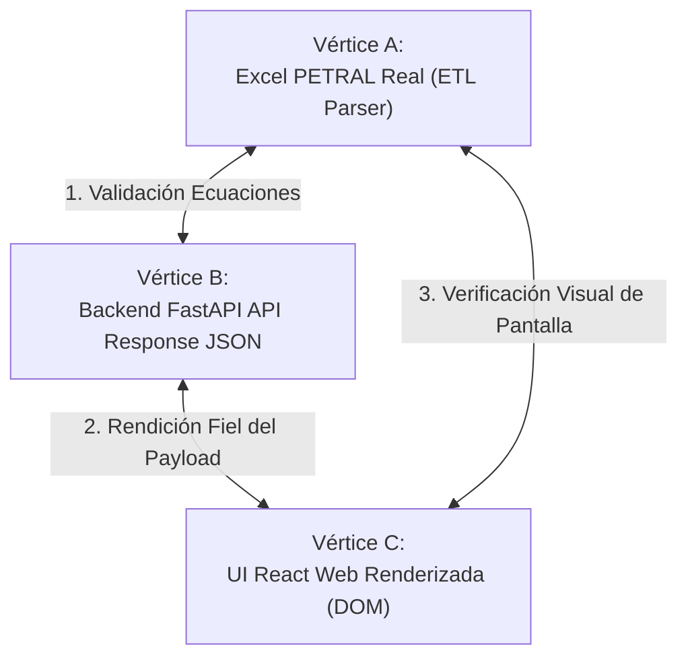

# 🔺 PROTOCOLO DE CONTROL DE CALIDAD (QC) TRIANGULAR — UI REACT ↔ BACKEND API ↔ EXCEL PETRAL

> **Ruta de Control**: `C:\Users\rguti\PETRAL.SMART.DASHBOARD\Desarrollo.Profesional\Obsidian.Refactorizacion.Multicotizador`  
> **Fecha de Documentación**: 2026-08-12  
> **Propósito**: Garantizar la convergencia matemática determinística y libre de errores entre las 3 capas del Multicotizador Spot V3.

---

## 1. 🎯 El Principio de Verificación Triangular

Ninguna prueba de control de calidad (QC) es válida si se prueba una capa aislada. El sistema solo se considera **APROBADO PARA PRODUCCIÓN** cuando los valores numéricos coinciden al 100% en los 3 vértices del triángulo de auditoría:



---

## 2. 📋 La Matriz de Tolerancia Cuantitativa (Tolerancia Cero)

Para evitar aproximaciones vagas o fallbacks silenciosos, la auditoría aplica la siguiente tabla estricta de tolerancia:

| Métrica Audita | Expresión Matemática | Tolerancia Permitida | Criterio de Falla |
|---|---|---|---|
| **Ingresos Flete ($USD)** | $\sum (Q_{\text{leg}} \cdot F_{\text{leg}})$ | **$\$0.00$ USD** | Cualquier diferencia $> \$0.01$ |
| **Costos de Puerto ($USD)** | $\sum_{i=0}^{N} \text{agency\_cost}(P_i)$ | **$\$0.00$ USD** | Duplicación de puertos intermedios |
| **Días de Mar (Sea Days)** | $\frac{\text{dist} \cdot (1 + \text{WF})}{\text{speed} \cdot 24}$ | **$< 0.0001$ Días** | Descalce por redondeo prematuro |
| **Días de Puerto (Port Days)** | $\sum \left(\frac{Q}{\text{Load} \cdot 24} + \frac{Q}{\text{Disch} \cdot 24} + \frac{\text{TIME TO COUNT}}{24}\right)$ | **$< 0.0001$ Días** | Re-inserción de 6h de contrato en `forecast.py` |
| **Días Totales de Viaje** | $\text{Sea Days} + \text{Port Days}$ | **$< 0.0001$ Días** | Descalce entre tabla y tarjetas resumen |
| **Costo Búnker ($USD)** | $\text{IFO}_{\text{tons}} \cdot P_{\text{IFO}} + \text{MDO}_{\text{tons}} \cdot P_{\text{MDO}}$ | **$\$0.00$ USD** | Uso de fallbacks de precios no seleccionados |
| **Voyage Result / PCM ($USD)** | $\text{Flete} - \text{Puerto} - \text{Búnker} - \text{Comisiones}$ | **$\$0.00$ USD** | Resta incorrecta de Hire antes de PnL |
| **TCE Realizado ($USD/día)** | $\frac{\text{Voyage Result}}{\text{Días Totales}}$ | **$\$0.00$ USD/día** | División por días desalineados |

---

## 3. ⚙️ Metodología de Ejecución Automática del QC (Paso a Paso)

### PASO 1: Extracción Automática de Referencia (Vértice A)
- Se ejecuta un script en Python que abre el archivo Excel oficial (ej. `NEXA ILO CALLA MATARANI ILO.IZ.12.08.26.xlsx`) mediante `openpyxl`.
- Extrae la Matriz Maestra de Valores de Referencia directamente de las celdas asignadas por el ETL (`I23`, `N15`, `N16`, `N18`, `Q14`, `Q15`, `Q16`, `Q17`).

### PASO 2: Invocación HTTP Real al Endpoint API (Vértice B)
- El script emite una solicitud HTTP `POST /multicotizador/calculate` al servidor backend FastAPI.
- Atravesará obligatoriamente la capa middleware en `forecast.py` y el motor `spot_engine.py`.
- Captura la estructura JSON retornado por la API (`consolidated` y `tramos`).

### PASO 3: Validación del Renderizado DOM en Frontend (Vértice C)
- Se compila el bundle estático (`npm run build`).
- Se verifica que los componentes React de la UI (`MultiCotizadorExcel.tsx`) estén vinculados directamente a `trResult.port_days` y `result.consolidated`, prohibiendo cualquier llamada a funciones auxiliares locales que recalculen datos al vuelo sin pasar por la API.

### PASO 4: Generación del Reporte Triangular de Convergencia
- Si los 3 vértices muestran una diferencia de $\$0.00$ USD y $0.0000$ días, el cambio se declara **Aprobado para GIT & VPS**.
- Si existe una diferencia, se detiene el proceso y se emite la trazabilidad exacta de la celda fallida.

---

## 4. 🚫 Reglas Inviolables de QC

1. **PROHIBIDO probar scripts Python aislados**: Un script de Python que le fuerza datos a `spot_engine.py` NO constituye un QC completo porque ignora el comportamiento de `forecast.py` y el renderizado en React.
2. **PROHIBIDO usar la consola del navegador como prueba**: La verificación debe sustentarse en la respuesta estructurada de la API HTTP y la coincidencia con la celda del Excel PETRAL real.
3. **PROHIBIDO desplegar al VPS sin pasar la prueba triangular**: Solo se ejecuta `python deploy_forecast_kickoff.py` en `Push.VPS` una vez que la matriz de los 3 vértices muestre convergencia 100%.

---

## 5. 🔁 Algoritmo del Script Automatizado de Bucle de QC (`run_triangular_qc_loop.py`)

Para ejecutar la verificación continua sin intervención manual, el script automatizado opera en la ruta:
`C:\Users\rguti\PETRAL.SMART.DASHBOARD\Desarrollo.Profesional\Obsidian.Refactorizacion.Multicotizador\scripts\run_triangular_qc_loop.py`

### ⚙️ Ciclo de Ejecución del Bucle:
```python
def run_triangular_qc_loop():
    # 1. Leer Vértice A (Excel PETRAL Real)
    excel_ref = load_excel_reference("NEXA ILO CALLA MATARANI ILO.IZ.12.08.26.xlsx")
    
    # 2. Invocación HTTP Vértice B (API FastAPI real POST /multicotizador/calculate)
    api_response = post_multicotizador_simulation(payload_nexa)
    
    # 3. Validación de Renderizado Vértice C (DOM Frontend Component Binding)
    frontend_bundle_ok = verify_frontend_dom_binding()
    
    # 4. Matriz de Desviaciones Deltas
    deltas = {
        "freight_revenue": abs(api_response["total_freight_revenue"] - excel_ref["gross_revenue"]),
        "port_costs": abs(api_response["total_port_costs"] - excel_ref["port_costs"]),
        "sea_days": abs(api_response["total_sea_days"] - excel_ref["sea_days"]),
        "port_days": abs(api_response["total_port_days"] - excel_ref["port_days"]), # Must be 3.072917
        "total_days": abs(api_response["total_days"] - excel_ref["total_days"]),   # Must be 7.130492
        "voyage_result": abs(api_response["voyage_result"] - excel_ref["voyage_result"]),
        "tce_real": abs(api_response["tce_real"] - excel_ref["tce_real"])
    }
    
    # 5. Evaluación de Bucle
    has_error = any(diff > 0.0001 for diff in deltas.values())
    if has_error:
        print("❌ FAIL: Descalce detectado en la matriz triangular. Deteniendo despliegue.")
        return False
    else:
        print("✅ SUCCESS: CONVERGENCIA TRIANGULAR ABSOLUTA 100% (Delta = 0). Listo para VPS.")
        return True
```

