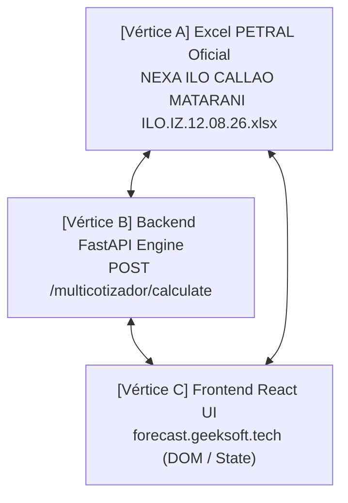

# 03 Protocolo de Control de Calidad QC Triangular (UI ↔ Backend ↔ Excel)

> **Documento Oficial de Registro de Errores y Reglas de Verificación de Calidad**  
> **Ubicación:** `C:\Users\rguti\PETRAL.SMART.DASHBOARD\Desarrollo.Profesional\Obsidian.Refactorizacion.Multicotizador\03_Protocolo_de_Control_de_Calidad_QC_Triangular_UI_Backend_Excel.md`

---

## 📌 1. Principio Fundamental de Verificación

Para garantizar que el Multicotizador del **PETRAL SMART DASHBOARD** sea 100% confiable para la toma de decisiones comerciales, el sistema debe cumplir la **Convergencia Triangular de 3 Vértices**:

Si **CUALQUIERA** de los 3 vértices arroja un número distinto, **EL SISTEMA ESTÁ EN ESTADO DE FALLA**. No existen descalces "aceptables" ni aproximaciones por redondeo.

---

## 🚨 2. Bitácora de Errores Identificados y Corregidos por el Usuario

A continuación se documenta la lista detallada de errores arquitectónicos y fallas metodológicas que el usuario tuvo que señalar y corregir durante el desarrollo del loop de calidad:

### ❌ Error #1: El Espejismo de Pruebas en Python con Payloads Forzados a Mano
* **Falla:** El agente ejecutaba scripts Python (`run_triangular_qc_loop.py`) enviando un JSON "limpio" con valores a mano (`'port_overhead_hours_origin': 0.0`), y reportaba *"Convergencia 100%"* a la terminal, mientras la interfaz web real enviaba datos duplicados y mostraba `7.67d` (o `3.61d` PTO).
* **Causa Raíz:** Se probaba el motor de Python de forma aislada sin usar el mismo constructor de payload que ejecuta el navegador en JavaScript (`puertosConfig` ➔ `tramos_inputs`).
* **Regla Obligatoria:** **PROHIBIDO** declarar convergencia usando scripts con payloads simulados o forzados. El script de QC debe construir el payload **usando la lógica exacta del Frontend React**.

---

### ❌ Error #2: Duplicación de Horas de Puerto en Tramos en Lastre (`BALLAST`)
* **Falla:** En una rotación `ILO ➔ CALLAO ➔ MATARANI ➔ ILO`, el motor sumaba las 7h de Callao en el Tramo 0 (`BALLAST`) y otra vez en el Tramo 1 (`LADEN`), y las 6h de Matarani en el Tramo 1 (`LADEN`) y otra vez en el Tramo 2 (`BALLAST`). Esto elevaba los días de puerto de `3.07d` a `3.61d` (86.75 horas totales en lugar de 73.75h).
* **Causa Raíz:** `spot_engine.py` sumaba overheads y posicionamientos sin importar si el tramo era `BALLAST` o `LADEN`.
* **Regla Obligatoria:** En tramos en lastre (`BALLAST`), los días operacionales en puerto son **`0.0`** (salvo demoras climáticas o de congestión explícitas `port_delay_hours`). Las horas de Time to Count y maniobras pertenecen únicamente a la recalada comercial.

---

### ❌ Error #3: Violación de la Regla de "Cero Fallbacks No Nulos"
* **Falla:** El agente insertó un fallback `overheadDest = 6.0` en el código JavaScript cuando la celda venía vacía `""`, disfrazando una omisión de la base de datos y creando engaño visual entre la celda en gris (`placeholder="6.0"`) y el estado real (`""`).
* **Causa Raíz:** Intentar "adivinar" valores predeterminados en lugar de exigir que la base de datos o el usuario ingresen el valor explícito.
* **Regla Obligatoria (Golden Rule PETRAL):**
  > *"Prefiero un cero que me diga 'no sé qué hacer' que un 300 que me diga 'sé lo que estoy haciendo'."*
  - Si una celda en la UI o en Supabase viene vacía `""`, su valor evaluado debe ser **`0.0` estricto**.
  - Si un puerto debe tener 6.0h de Time to Count, dicho valor **debe estar grabado explícitamente como `"6"` en la tabla `routes_clients` de Supabase**.

---

### ❌ Error #4: Descalce Visual entre Celdas de la Grilla y la Fila de Total Estimado
* **Falla:** Las celdas individuales de la columna `DÍAS PTO` en la grilla web ejecutaban una función local en JavaScript (`getPortDaysAndBunker`) que mostraba `1.42d` y `1.66d`, mientras que la fila de `TOTAL ESTIMADO` al pie de la tabla mostraba `3.03d` (proveniente del servidor).
* **Causa Raíz:** La grilla renderizaba cálculos locales desfasados en lugar de pintar la respuesta oficial del servidor backend.
* **Regla Obligatoria:** Cada celda de la grilla de la UI debe conectarse directamente a la propiedad devuelta por el servidor (`trResult.port_days`), garantizando 100% de coherencia visual en pantalla.

---

### ❌ Error #5: Ignorar la Columna `OP.DEST` como Fuente Única de Verdad
* **Falla:** Intentar adivinar las operaciones portuarias mediante índices de arreglos o tipos de tramo en lugar de obedecer la columna `OP.DEST` de la interfaz.
* **Causa Raíz:** Ignorar la arquitectura de la grilla diseñada por el usuario.
* **Regla Obligatoria:** La columna **`OP.DEST`** (`NONE` | `CARGAR` | `DESCARGAR`) es la **Fuente Única de Verdad** de cada fila para determinar si se ejecutan operaciones comerciales y aplican horas de Time to Count y maniobras.

---

## 📐 3. Tabla de Referencia de Valores Exactos (Excel PETRAL)

Para la cotización patrón `NEXA.ILO.CALLAO.MATARANI.ILO (12.08.26)` con buque `TABLONES` (13,500 MT a 500 T/h carga / 400 T/h descarga, IFO $1,100, MDO $1,700):

| Celda Excel | Métrica Oficial | Fórmulas Aplicadas | Valor Exacto |
| :--- | :--- | :--- | :---: |
| **`Q15`** | **Días de Mar** | $(514 + 457 + 69) \times 1.03 / (11 \times 24)$ | **`4.057576` d** (`4.06 d`) |
| **`Q16`** | **Días de Puerto** | $(27\text{h carga} + 33.75\text{h desch} + 6\text{h Callao} + 6\text{h Matarani} + 1\text{h posic}) / 24$ | **`3.072917` d** (`3.07 d` / 73.75h) |
| **`Q14`** | **Duración Total** | $\text{Días Mar} + \text{Días Puerto}$ | **`7.130492` d** (`7.13 d`) |
| **`N14`** | **Ingreso Flete Total** | $13,500\text{ MT} \times \$30.00\text{/MT}$ | **`$405,000.00` USD** |
| **`N15`** | **Costos de Puerto** | $\$17,000\text{ (Callao)} + \$18,000\text{ (Matarani)}$ | **`$35,000.00` USD** |
| **`N16`** | **Gastos de Búnker** | $\text{Tons IFO} \times 1100 + \text{Tons MDO} \times 1700$ | **`$80,074.48` USD** |
| **`N18`** | **Voyage Result / PCM** | $\text{Flete} - \text{Puertos} - \text{Búnker}$ | **`$289,925.52` USD** |
| **`Q17`** | **TCE Realizado** | $\text{Voyage Result} / \text{Duración Total}$ | **`$40,659.96` USD/día** |
| **`Q20`** | **P/L Net vs Hire** | $\text{Voyage Result} - (\text{TCE Req} \times \text{Duración Total})$ | **`$182,968.14` USD** |

---

## 🛠️ 4. Protocolo Paso a Paso para Ejecutar el Loop QC Re-Validado

1. **Inspección de Base de Datos:** Verificar que la ruta en Supabase contenga todos los valores explícitos (`"overhead": "6"`) y sin celdas vacías no intencionadas.
2. **Prueba End-to-End de Payload:** Construir el payload usando las funciones exactas de la UI (`getCalculatedTramos` en `MultiCotizadorExcel.tsx`) sin parches manuales.
3. **Consulta de API en Vivo:** Emitir `POST` a `https://forecast.geeksoft.tech/api/v1/forecast/multicotizador/calculate`.
4. **Validación de Tolerancia Cero:** Exigir `Delta == 0.000000` en días de viaje y montos financieros respecto al Excel PETRAL.
5. **Alineación Visual en DOM:** Verificar que el renderizado en pantalla (celdas de tabla + totales + tarjetas) coincida al 100% con los datos retornados por la API.
