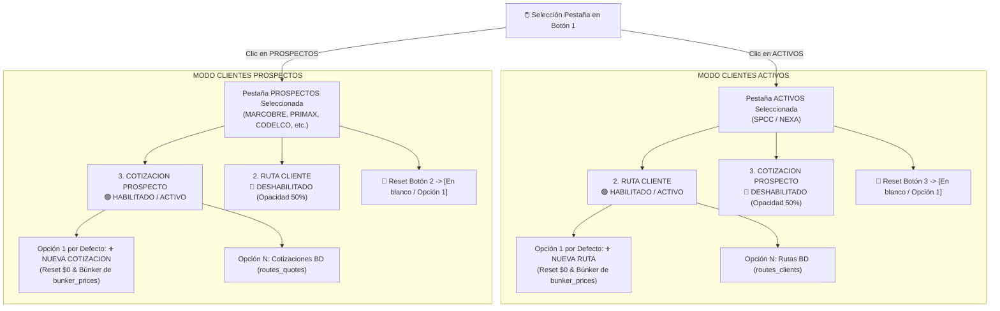
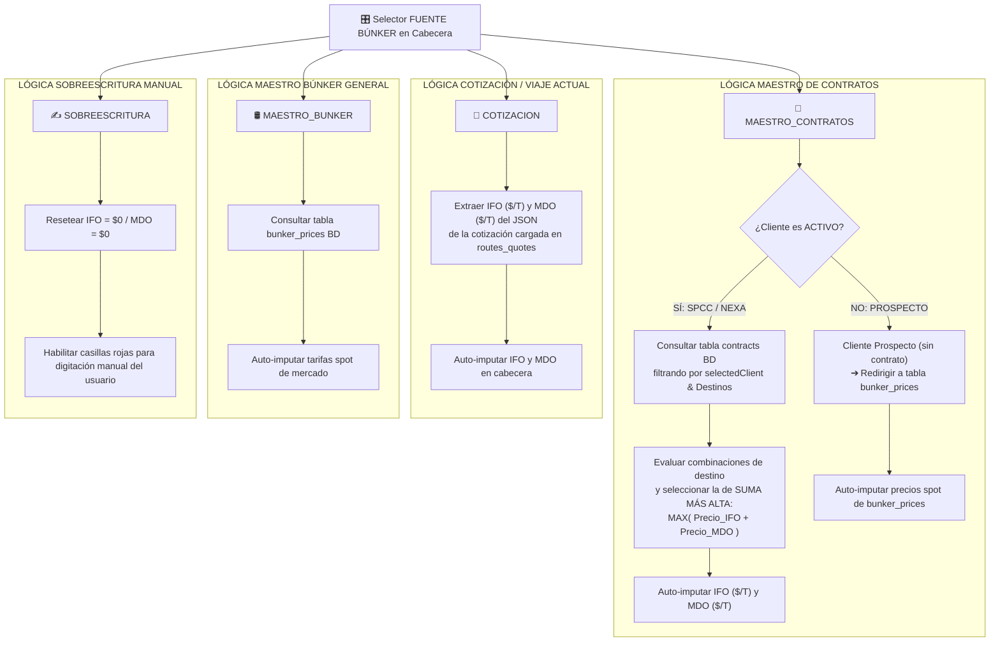

# 📑 ESPECIFICACIONES COMERCIALES Y VISIÓN GENERAL DEL MULTICOTIZADOR (V1.0)

> **Ubicación de Control:** `C:\Users\rguti\PETRAL.SMART.DASHBOARD\Desarrollo.Profesional\Obsidian.Refactorizacion.Multicotizador`  
> **Fecha de Documentación:** 14 de Agosto de 2026  
> **Estado:** Especificación Comercial y Lógica de Interfaz Multicotizador  
> **Fuente de Instrucción Comercial:** Transcripción de Audio `audio_transcrip/logica.general.multicotizador.ogg`  
> **Servidor VPS:** `https://forecast.geeksoft.tech`

---

## 🎯 0. Visión General y Lógica de Negocio del Multicotizador

El **Multicotizador** es el **corazón de todo el sistema PETRAL**. Su objetivo estratégico abarca dos pilares comerciales fundamentales:
1. **Gestión y Creación de Nuevas Rutas** (para Clientes Activos).
2. **Gestión y Creación de Nuevas Cotizaciones / Proformas** (para Clientes Prospectos).

```text
========================================================================================
             ❤️ MULTICOTIZADOR: EL CORAZÓN DEL SISTEMA PETRAL
========================================================================================
 🏢 TARGET 1: CLIENTES ACTIVOS (SPCC, NEXA)
    ├── Tienen negocio/contrato firmado en BD.
    ├── Generan NUEVAS RUTAS comerciales.
    └── Búnker base se obtiene del 📑 MAESTRO DE CONTRATOS (contracts).

 🏭 TARGET 2: CLIENTES PROSPECTOS (MARCOBRE, PRIMAX, CODELCO, R TRADING, CERRO VERDE)
    ├── Sin contrato firmado en BD (Clientes potenciales).
    ├── Generan NUEVAS COTIZACIONES / PROFORMAS.
    └── Búnker base se obtiene del 🛢️ MAESTRO BUNKER GENERAL (bunker_prices - Tarifas Spot).
========================================================================================
```

---

### 🔹 0.1. Lógica del Búnker y Reglas de Sobreescritura
* **Búnker en Contratos (Clientes Activos):** El contrato vigente fija las tarifas de IFO y MDO según el destino negociado.
* **Búnker Spot (Clientes Prospectos):** Al no tener contrato, se requiere la cotización a precios de mercado más recientes (`bunker_prices`).
* **Sobreescritura Manual (`SOBREESCRITURA`):** Es una funcionalidad transversal para todas las opciones. Al seleccionar *Sobreescribir*, la interfaz coloca en `$0` ambas casillas (IFO/MDO), permitiendo al usuario ingresar valores proyectados considerando volatilidades a futuro.
* **Cotizaciones Históricas:** Al cargar una cotización guardada realizada meses atrás, el sistema extrae los precios de búnker guardados en el JSON de la proforma (`routes_quotes`), permitiendo mantener el historial o sobreescribirlos si se desea actualizar al mercado actual.

---

### 🔹 0.2. Buque, Grilla Live de Tramos y Componentes de Costo
* **Selección del Buque (Fact Sheet Técnico):** Es obligatoria (Paso 4), pues cada buque posee velocidades específicas (knots), capacidades (GRT, DWT, DWCC, Calado) y 4 ratios de consumo de combustible (Navegación en Mar, Espera en Fondeo, Operación de Carga y Operación de Descarga).
* **Grilla Live — Mínimo de 3 Tramos (Legs):** Por norma comercial, todo viaje cotizado debe ser un **viaje redondo completo** (mínimo 3 filas en la grilla live: Ballast ➔ Laden ➔ Ballast).
* **Distancias Marítimas (NM):** Se obtienen del Maestro de Distancias. Si no existe registro en el catálogo, se coloca `0` por defecto.
* **Días de Mar:** Calculados matemáticamente mediante la velocidad del buque y el factor de clima:
  $$\text{Días Mar} = \frac{\text{Distancia (NM)} \times (1 + \text{Weather Factor} \%)}{\text{Velocidad (knots)} \times 24}$$
* **Días de Puerto:** Involucran dos variables estipuladas en los contratos para clientes activos: **Time to Count** (horas de demora en puerto) y **Posicionamiento** (horas de maniobra y atracadero).
* **Tonelaje Estándar:** La cantidad de carga por defecto se fija en **13,500 TM**, correspondiente a la capacidad operativa estándar de los buques PETRAL (ej. Moquegua y Tablones).
* **Tarifas de Flete ($/MT):** Para clientes activos, provienen del Maestro de Contratos (`contracts`) para el puerto de destino específico.
* **Gastos Portuarios ($):** Se extraen de la matriz estática de gastos portuarios (`port_cost_static`).
* **Muellaje (Wharfage):** Concepto de costo *pass-through* que se refactura exactamente a costo al cliente cuando está acordado convencionalmente (ej. en operaciones de descarga en Mejillones).
* **Tarjetas Financieras Inferiores (Cards):** Son el resultado matemático directo e inmutable derivado de las características del Buque, los parámetros de la Grilla Live y la matriz de Gastos Portuarios.

---

## 📌 1. Arquitectura de la Barra de Control Superior (Pasos 1 al 4)

La barra de control superior estandariza el flujo comercial top-to-bottom respetando la jerarquía de clientes, rutas y cotizaciones:

```text
+------------------------+--------------------------+----------------------------------+-----------------------+
| 1. SELECCIONAR CLIENTE | 2. RUTA CLIENTE          | 3. COTIZACION PROSPECTO          | 4. SELECCIONAR BUQUE  |
| [Activos | Prospectos] | (Habilitado en ACTIVOS)  | (Habilitado en PROSPECTOS)       | [SELECCIONAR BUQUE]   |
+------------------------+--------------------------+----------------------------------+-----------------------+
```

### 🔹 1.1. Flujograma de Activación y Reseteo Exclusivo entre Pestañas



### 🔹 1.2. Especificación Detallada por Botón

1. **Botón 1 — Selector de Cliente (Activos vs. Prospectos)**:
   * **Pestaña `ACTIVOS`:** Filtra únicamente a los clientes con contratos vigentes (`SPCC`, `NEXA`).
   * **Pestaña `PROSPECTOS`:** Filtra dinámicamente el listado de prospectos comerciales (`MARCOBRE`, `PRIMAX`, `CODELCO`, `R TRADING`, `CERRO VERDE`).
   * **Rendimiento Instantáneo (0ms):** El filtrado se ejecuta en memoria sobre el catálogo cacheados en el cliente React sin realizar peticiones de red asíncronas redundantes.

2. **Botón 2 — `2. RUTA CLIENTE` (Clientes Activos)**:
   * **Condición de Activación:** Se encuentra **habilitado** únicamente cuando el Botón 1 está en **`ACTIVOS`**.
   * **Filtrado Estricto por Cliente:** El desplegable muestra **únicamente las rutas pertenecientes al cliente seleccionado en Botón 1** (`selectedClient`, ej. `SPCC` o `NEXA`), identificadas por el prefijo o `client_id` de la tabla `clients`.
   * **Primera Opción por Defecto del Desplegable:** **`➕ NUEVA RUTA`**
     * Seleccionada automáticamente por defecto al cargar o ingresar a `ACTIVOS`. Resetea la grilla live a estado en limpio ($0 fletes, cantidades en 0, 3 tramos base en blanco).
     * La consulta de búnker se redirige automáticamente a la matriz general spot (**`bunker_prices`**).
   * **Selección de Ruta y Búnker por Defecto:** Al seleccionar una ruta existente, el selector de búnker se establece **por defecto en `📑 Maestro de Contratos`** y consulta la tarifa contractual.
   * **Estilización Flex:** Mantiene un ancho dinámico flexible (sin restricción rígida `max-w-[220px]`), mostrando el nombre completo de la ruta sin truncar.

3. **Botón 3 — `3. COTIZACION PROSPECTO` (Clientes Prospectos)**:
   * **Condición de Activación:** Se encuentra **habilitado** únicamente cuando el Botón 1 está en **`PROSPECTOS`**.
   * **Filtrado Estricto por Prospecto:** El desplegable muestra **únicamente las cotizaciones pertenecientes al prospecto seleccionado en Botón 1** (`selectedClient`, ej. `MARCOBRE`, `PRIMAX`, etc.), identificadas por el prefijo o `client_id` de la tabla `clients`.
   * **Primera Opción por Defecto del Desplegable:** **`➕ NUEVA COTIZACION`**
     * Seleccionada automáticamente por defecto al cargar o ingresar a `PROSPECTOS`. Resetea la grilla live a estado en limpio ($0 fletes, cantidades en 0, 3 tramos base en blanco).
     * La consulta de búnker se redirige automáticamente a la matriz general spot (**`bunker_prices`**).
   * **Estilización Flex:** Mantiene un ancho dinámico flexible (sin restricción rígida `max-w-[220px]`), adaptándose al título largo de la cotización.

---

## 🖼️ 2. Encabezado Fact Sheet Técnico del Buque (`VesselFactSheetHeader.tsx`)

* **Ajuste de Fotografía del Buque:**
  * La imagen del buque en la primera celda (`rowSpan={2}`) utiliza la clase `w-full h-full object-fill`.
  * Rellena el **100% del espacio del recuadro contenedor**, eliminando bordes vacíos o blancos, incluso si la imagen se deforma ligeramente para encajar.

---

## 🛢️ 3. Servicio Resolutor de Precios de Búnker (`bunkerProviderService.ts`)

### 🔹 3.1. Tablas Base de Datos y Endpoints Backend

| Fuente de Búnker | Tabla Base de Datos | Endpoint API Backend | Parámetros de Entrada Requeridos |
| :--- | :--- | :--- | :--- |
| **`MAESTRO_CONTRATOS`** | `contracts` | `/forecast/masters/contracts` | `selectedClient`, `clientType`, `destinationPorts` de grilla |
| **`COTIZACION`** | `routes_quotes` | `/forecast/spot/list` | `selectedQuoteId` (proforma JSON) |
| **`MAESTRO_BUNKER`** | `bunker_prices` | `/forecast/bunker/latest` | `quote_date` más reciente |
| **`SOBREESCRITURA`** | N/A (Manual) | N/A (Directo UI) | Inputs directos del usuario en el Header |

---

### 🔹 3.2. Especificación de Parámetros y Criterios de Selección

1. **📑 `MAESTRO_CONTRATOS`**:
   * **Para Clientes ACTIVOS (`SPCC`, `NEXA`)**:
     * Consulta la tabla `contracts` filtrando por `client_name == selectedClient`.
     * Coincide los puertos de destino (`destination_port_id`) de los tramos live.
     * En caso de múltiples contratos o destinos coincidentes, selecciona la fila con la **SUMA MÁS ALTA de `(bunker_price_ifo + bunker_price_mdo)`**.
   * **Para Clientes PROSPECTOS (`MARCOBRE`, `PRIMAX`, `CODELCO`, etc.)**:
     * Redirige automáticamente la consulta a la matriz spot de búnker general en la tabla **`bunker_prices`**.

2. **📌 `COTIZACION`**:
   * Extrae los precios `bunker_price_ifo` y `bunker_price_mdo` pre-guardados dentro del JSON de la proforma seleccionada en el Botón 3 (`routes_quotes`).
   * **Invalidez en Rutas de Cliente:** Cuando se está trabajando con una Ruta de cliente activo (Botón 2), esta opción no aplica y se mantiene el `Maestro de Contratos`.

3. **🛢️ `MAESTRO_BUNKER`**:
   * Consulta directamente los precios spot vigentes de mercado en la tabla `bunker_prices` (tarifas más recientes por fecha).
   * **Permitido desde Rutas:** Si el usuario selecciona una ruta de cliente y cambia la fuente a `Maestro Búnker General`, el sistema sobreescribe las tarifas con los valores spot actuales.

4. **✍️ `SOBREESCRITURA`**:
   * Resetea **ambas casillas inmediatamente a `$0` (`ifo: 0, mdo: 0`)** y habilita la edición manual libre por el usuario.

---

### 🔹 3.3. Flujograma de Decisión para la Fuente de Búnker



---

## 📄 Archivos Relacionados
* **Documento Modularización previa:** [`04_Modularizacion_Frontend_Servicios_y_Tabs.md`](file:///C:/Users/rguti/PETRAL.SMART.DASHBOARD/Desarrollo.Profesional/Obsidian.Refactorizacion.Multicotizador/04_Modularizacion_Frontend_Servicios_y_Tabs.md)
* **Script Flujograma Python:** [`FLUJOGRAMA_Arquitectura_Multicotizador_V1.py`](file:///C:/Users/rguti/PETRAL.SMART.DASHBOARD/Desarrollo.Profesional/Obsidian.Refactorizacion.Multicotizador/FLUJOGRAMA_Arquitectura_Multicotizador_V1.py)
* **Diagrama PNG:** [`FLUJOGRAMA_Arquitectura_Multicotizador_V1.png`](file:///C:/Users/rguti/PETRAL.SMART.DASHBOARD/Desarrollo.Profesional/Obsidian.Refactorizacion.Multicotizador/FLUJOGRAMA_Arquitectura_Multicotizador_V1.png)
* **Documento PDF:** [`FLUJOGRAMA_Arquitectura_Multicotizador_V1.pdf`](file:///C:/Users/rguti/PETRAL.SMART.DASHBOARD/Desarrollo.Profesional/Obsidian.Refactorizacion.Multicotizador/FLUJOGRAMA_Arquitectura_Multicotizador_V1.pdf)
