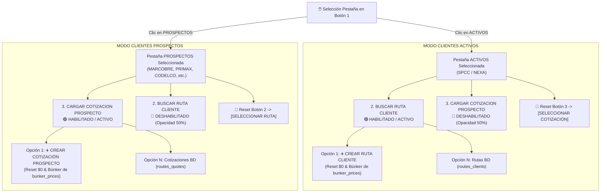
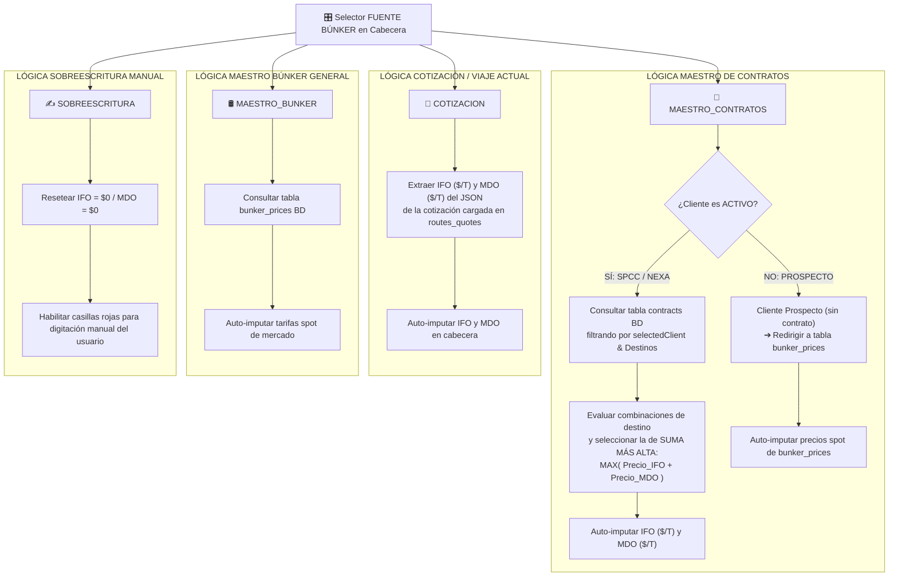

# 📑 ESPECIFICACIONES COMERCIALES: LÓGICA UI CABECERA Y RESOLUCIÓN DE BÚNKER (V1.0)

> **Ubicación de Control:** `C:\Users\rguti\PETRAL.SMART.DASHBOARD\Desarrollo.Profesional\Obsidian.Refactorizacion.Multicotizador`  
> **Fecha de Documentación:** 14 de Agosto de 2026  
> **Estado:** Especificación Comercial y Lógica de Interfaz Multicotizador  
> **Servidor VPS:** `https://forecast.geeksoft.tech`

---

## 📌 1. Arquitectura de la Barra de Control Superior (Pasos 1 al 4)

La barra de control superior estandariza el flujo comercial top-to-bottom respetando la jerarquía de clientes, rutas y cotizaciones:

```text
+------------------------+--------------------------+----------------------------------+-----------------------+
| 1. SELECCIONAR CLIENTE | 2. BUSCAR RUTA CLIENTE   | 3. CARGAR COTIZACION PROSPECTO   | 4. SELECCIONAR BUQUE  |
| [Activos | Prospectos] | (Habilitado en ACTIVOS)  | (Habilitado en PROSPECTOS)       | [SELECCIONAR BUQUE]   |
+------------------------+--------------------------+----------------------------------+-----------------------+
```

### 🔹 1.1. Flujograma de Activación y Reseteo Exclusivo entre Pestañas



### 🔹 1.2. Especificación Detallada por Botón

1. **Botón 1 — Selector de Cliente (Activos vs. Prospectos)**:
   * **Pestaña `ACTIVOS`:** Filtra únicamente a los clientes con contratos vigentes (`SPCC`, `NEXA`).
   * **Pestaña `PROSPECTOS`:** Filtra dinámicamente el listado de prospectos comerciales (`MARCOBRE`, `PRIMAX`, `CODELCO`, `R TRADING`, `CERRO VERDE`).
   * **Rendimiento Instantáneo (0ms):** El filtrado se ejecuta en memoria sobre el catálogo cacheados en el cliente React sin realizar peticiones de red asíncronas redundantes.

2. **Botón 2 — `2. BUSCAR RUTA CLIENTE` (Clientes Activos)**:
   * **Condición de Activación:** Se encuentra **habilitado** únicamente cuando el Botón 1 está en **`ACTIVOS`**.
   * **Primera Opción del Desplegable:** **`➕ CREAR RUTA CLIENTE`**
     * Al ser seleccionada, resetea la grilla live a estado en limpio ($0 fletes, cantidades en 0, 3 tramos base en blanco).
     * La consulta de búnker se redirige automáticamente a la matriz general spot (**`bunker_prices`**).
   * **Opciones Siguientes:** Muestra el listado de las 66 rutas oficiales registradas en la tabla **`routes_clients`**.
   * **Estilización Flex:** Mantiene un ancho dinámico flexible (sin restricción rígida `max-w-[220px]`), mostrando el nombre completo de la ruta sin truncar.

3. **Botón 3 — `3. CARGAR COTIZACION PROSPECTO` (Clientes Prospectos)**:
   * **Condición de Activación:** Se encuentra **habilitado** únicamente cuando el Botón 1 está en **`PROSPECTOS`**.
   * **Primera Opción del Desplegable:** **`➕ CREAR COTIZACIÓN PROSPECTO`**
     * Al ser seleccionada, resetea la grilla live a estado en limpio ($0 fletes, cantidades en 0, 3 tramos base en blanco).
     * La consulta de búnker se redirige automáticamente a la matriz general spot (**`bunker_prices`**).
   * **Opciones Siguientes:** Muestra las proformas y cotizaciones guardadas en la tabla **`routes_quotes`**.
   * **Estilización Flex:** Mantiene un ancho dinámico flexible (sin restricción rígida `max-w-[220px]`), adaptándose al título largo de la cotización.

---

## 🖼️ 2. Encabezado Fact Sheet Técnico del Buque (`VesselFactSheetHeader.tsx`)

* **Ajuste de Fotografía del Buque:**
  * La imagen del buque en la primera celda (`rowSpan={2}`) utiliza la clase `w-full h-full object-fill`.
  * Rellena el **100% del espacio del recuadro contenedor**, eliminando bordes vacíos o blancos, incluso si la imagen se deforma ligeramente para encajar.

---

## 🛢️ 3. Servicio Resolutor de Precios de Búnker (`bunkerProviderService.ts`)

### 🔹 3.1. Flujograma de Decisión para la Fuente de Búnker



### 🔹 3.2. Diagrama Textual en Bloques ASCII

```text
========================================================================================
             🎯 MATRIZ COMPLETA DE INTERACCIÓN Y BÚSQUEDA DE BÚNKER
========================================================================================

 🔘 OPCIÓN 1 EN DESPLEGABLES (CREACIÓN DESDE CERO):
    ├── Botón 2 (Activos): "➕ CREAR RUTA CLIENTE"
    │     └── Limpia la grilla a $0 ➔ Búnker busca automáticamente en `bunker_prices` (Matriz Spot).
    └── Botón 3 (Prospectos): "➕ CREAR COTIZACIÓN PROSPECTO"
          └── Limpia la grilla a $0 ➔ Búnker busca automáticamente en `bunker_prices` (Matriz Spot).

 🔘 RESOLUCIÓN DE PRECIOS DE BÚNKER (bunkerProviderService):
    ├── 📑 MAESTRO_CONTRATOS:
    │     ├── Si Cliente es ACTIVO (SPCC/NEXA) ➔ Busca en tabla `contracts` y toma la tarifa con la
    │     │                                       SUMA MÁS ALTA de (IFO + MDO) para los destinos.
    │     └── Si Cliente es PROSPECTO (MARCOBRE, etc.) ➔ Redirige a tabla `bunker_prices` (Spot).
    │
    ├── 📌 COTIZACION:
    │     └── Extrae IFO/MDO pre-guardados en el JSON de la proforma seleccionada en `routes_quotes`.
    │
    ├── 🛢️ MAESTRO_BUNKER:
    │     └── Consulta directamente la tabla `bunker_prices` (Tarifas Spot de mercado).
    │
    └── ✍️ SOBREESCRITURA:
          └── Inicializa casillas en $0 (IFO = $0 / MDO = $0) habilitando edición manual.
========================================================================================
```

---

## 📄 Archivos Relacionados
* **Documento Modularización previa:** [`04_Modularizacion_Frontend_Servicios_y_Tabs.md`](file:///C:/Users/rguti/PETRAL.SMART.DASHBOARD/Desarrollo.Profesional/Obsidian.Refactorizacion.Multicotizador/04_Modularizacion_Frontend_Servicios_y_Tabs.md)
* **Script Flujograma Python:** [`FLUJOGRAMA_Arquitectura_Multicotizador_V1.py`](file:///C:/Users/rguti/PETRAL.SMART.DASHBOARD/Desarrollo.Profesional/Obsidian.Refactorizacion.Multicotizador/FLUJOGRAMA_Arquitectura_Multicotizador_V1.py)
* **Diagrama PNG:** [`FLUJOGRAMA_Arquitectura_Multicotizador_V1.png`](file:///C:/Users/rguti/PETRAL.SMART.DASHBOARD/Desarrollo.Profesional/Obsidian.Refactorizacion.Multicotizador/FLUJOGRAMA_Arquitectura_Multicotizador_V1.png)
* **Documento PDF:** [`FLUJOGRAMA_Arquitectura_Multicotizador_V1.pdf`](file:///C:/Users/rguti/PETRAL.SMART.DASHBOARD/Desarrollo.Profesional/Obsidian.Refactorizacion.Multicotizador/FLUJOGRAMA_Arquitectura_Multicotizador_V1.pdf)
