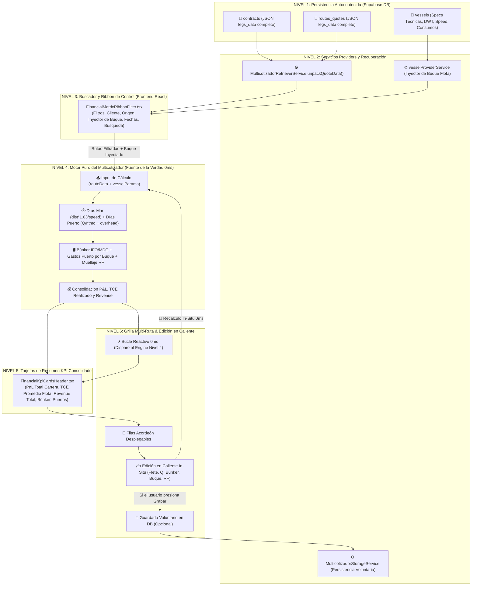
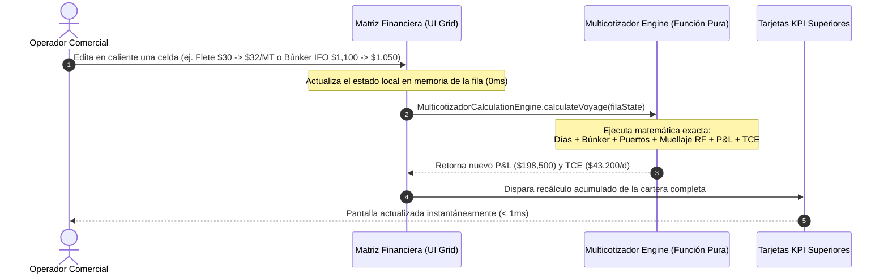

# 09: Modularización de la Matriz Financiera Comercial (V2 Definitiva)

**Fecha de Actualización**: 14 de Agosto de 2026  
**Origen**: Transcripción oficial de audio de Joseph Zabala (Joseph Sabala RG) & Acuerdos de Arquitectura Modular V2  
**Proyecto**: PETRAL Smart Dashboard / Geeksoft Engine  
**Estado**: Especificación Aprobada para Ejecución Inmediata  

---

## 📌 1. Diagnóstico y Objetivo Estratégico

Tras el éxito obtenido al modularizar el monolito del **Multicotizador Comercial**, se aplica la misma arquitectura desacoplada sobre el monolito de la **Matriz Financiera**.

### 🧠 Principios Fundamentales del Nuevo Paradigma:

1. **Multicotizador como Fuente Única de la Verdad (Single Source of Truth / DRY)**:
   - La Matriz Financiera **NO implementa un motor de cálculo matemático paralelo**.
   - Reutiliza directamente el pipeline puro del Multicotizador (`MulticotizadorCalculationEngine`), garantizando coincidencia al centavo en Revenue, Búnker, Gastos de Puerto, Muellaje Refacturado (`RF`), P&L y TCE.
2. **Desacoplamiento de Maestros Estáticos Dispersos**:
   - Se eliminan las consultas a maestros dispersos de Búnker Spot (`bunker_prices`) y Tarifas Portuarias Estáticas (`port_cost_static`).
   - Las rutas y cotizaciones guardadas en `contracts` y `routes_quotes` son **100% autocontenidas** en su JSON (`legs_data`).
3. **`vessels` como Único Maestro Dinámico Requerido**:
   - Los costos portuarios, tiempos y consumos dependen del buque asignado (GRT, DWT, Eslora, Calado, consumos Sea/Idle/Load/Disch).
   - Al inyectar un buque a cualquier ruta de la cartera (ej. *TABLONES*, *MOQUEGUA*, *CONCON TRADER*, *HUEMUL*), el motor adapta la ruta al vuelo.
4. **Edición en Caliente In-Situ (Bucle Reactivo 0ms)**:
   - Permite modificar variables clave en la grilla (Flete, Tonelaje, Búnker, Buque, Checkbox Muellaje) recalculando la fila y los KPIs consolidados en memoria (< 1ms).
5. **Cero Refactorización en Análisis Gráfico y Spaghetti Map**:
   - Garantía de compatibilidad total emitiendo exactamente el contrato de datos `data.aggregated_data` esperado por [`InteractiveChart.tsx`](file:///C:/Users/rguti/PETRAL.SMART.DASHBOARD/Desarrollo.Profesional/Geeksoft_Frontend/src/components/CommercialForecast/InteractiveChart.tsx) y [`useSpaghettiData.ts`](file:///C:/Users/rguti/PETRAL.SMART.DASHBOARD/Desarrollo.Profesional/Geeksoft_Frontend/src/components/CommercialForecast/useSpaghettiData.ts).

---

## 🗺️ 2. Flujograma de Arquitectura V2 (6 Niveles en Cascada)

> [!IMPORTANT]
> **Artefactos Oficiales de Flujograma**:
> - Script Python Generador: [`FLUJOGRAMA_Arquitectura_Matriz_Financiera_V2.py`](file:///C:/Users/rguti/PETRAL.SMART.DASHBOARD/Desarrollo.Profesional/Obsidian.Refactorizacion.Multicotizador/FLUJOGRAMA_Arquitectura_Matriz_Financiera_V2.py)
> - Código DOT: [`FLUJOGRAMA_Arquitectura_Matriz_Financiera_V2.dot`](file:///C:/Users/rguti/PETRAL.SMART.DASHBOARD/Desarrollo.Profesional/Obsidian.Refactorizacion.Multicotizador/FLUJOGRAMA_Arquitectura_Matriz_Financiera_V2.dot)
> - Documento PDF Vectorial: [`FLUJOGRAMA_Arquitectura_Matriz_Financiera_V2.pdf`](file:///C:/Users/rguti/PETRAL.SMART.DASHBOARD/Desarrollo.Profesional/Obsidian.Refactorizacion.Multicotizador/FLUJOGRAMA_Arquitectura_Matriz_Financiera_V2.pdf)



---

## ⚡ 3. Mecanismo de Edición en Caliente (In-Situ 0ms)

El usuario puede modificar directamente en la grilla variables clave de cualquier ruta de la cartera. El proceso de recálculo se realiza en **memoria React (< 1ms)** mediante funciones puras:



### 📋 Variables Editables en Caliente y su Comportamiento:
1. **Flete ($/MT) y Tonelaje ($Q$ en MT)**:
   - Recalcula inmediatamente $\text{Revenue} = Q \times F$, los días de estadía en puerto según el ritmo de carga/descarga y el P&L final.
2. **Precios Búnker IFO y MDO ($/T)**:
   - Recalcula el gasto total de combustible según el tonelaje de IFO/MDO consumido en mar y puerto por el buque activo.
3. **Cambio de Buque por Fila (o Global)**:
   - Inyecta las specs técnicas del nuevo buque (`vesselProviderService`), adaptando velocidad, días de mar, consumos y los costos portuarios asociados al nuevo buque.
4. **Checkbox de Muellaje Refacturado (`RF`)**:
   - Marcado `[x]`: Suma $(+) \text{Refacturación Muellaje}$ como ingreso al Revenue.
   - Desmarcado `[ ]`: El muellaje permanece únicamente como costo portuario absorbido por PETRAL.

---

## 🛡️ 4. Contrato de Datos: Compatibilidad con Análisis Gráfico y Spaghetti Map

> [!CAUTION]
> **REGLA DE ORO DE DESARROLLO**:
> **Queda estrictamente prohibido refactorizar o alterar el código de [`InteractiveChart.tsx`](file:///C:/Users/rguti/PETRAL.SMART.DASHBOARD/Desarrollo.Profesional/Geeksoft_Frontend/src/components/CommercialForecast/InteractiveChart.tsx) y [`SpaghettiMap_V2.tsx`](file:///C:/Users/rguti/PETRAL.SMART.DASHBOARD/Desarrollo.Profesional/Geeksoft_Frontend/src/pages/Tools/SpaghettiMap_V2.tsx) / [`useSpaghettiData.ts`](file:///C:/Users/rguti/PETRAL.SMART.DASHBOARD/Desarrollo.Profesional/Geeksoft_Frontend/src/components/CommercialForecast/useSpaghettiData.ts)**.
> La Matriz Financiera emitirá el objeto `data.aggregated_data` con exactitud del 100%.

### 📦 Estructura del Contrato `data.aggregated_data`:

$$\mathbf{\text{aggregated\_data}}[\text{cliente}][\text{ruta}][\text{buque}][\text{mes}] = \mathbf{\text{monthly\_result}}$$

```json
{
  "status": "success",
  "aggregated_data": {
    "NEXA": {
      "SPOT-NEXA.ILO.CALLAO.MATARANI.ILO": {
        "TABLONES": {
          "2026-08": {
            "carga_unit": 13500.0,
            "freq": 1.0,
            "net_income": 405000.0,
            "total_bunker_costs": 80082.0,
            "total_port_costs": 48000.0,
            "voyage_result": 182961.0,
            "pl_vs_required": 76004.0,
            "pl_percentage": 45.17,
            "total_duration_unit": 7.13,
            "tce_real_unit": 40659.0,
            "tce_required_unit": 15000.0,
            "pcm_projected": 25659.0,
            "raw_inputs": { "monthly_frequency": 1.0 }
          }
        }
      }
    }
  }
}
```

### 🎯 Mapeo de Variables Multicotizador ➔ Gráficos / Mapas:

| Clave en `monthly_result` | Origen en Motor Multicotizador | Uso en Análisis Gráfico | Uso en Spaghetti Map |
| :--- | :--- | :--- | :--- |
| `carga_unit` | `totalQuantity` (MT) | Métrica Toneladas (`total_cargo`) | Volumen de carga/descarga por puerto y grosor de arco |
| `freq` | `frecuencia` mensual | Multiplicador de viajes (`viajes`) | Multiplicador de toneladas acumuladas |
| `net_income` | `totalFreight + refacturacionMuellaje` | Métrica Ingreso Bruto (`net_income`) | - |
| `total_bunker_costs` | `grandBunkerTotal` (IFO + MDO) | Métrica Costo Búnker (`total_bunker_costs`) | - |
| `total_port_costs` | `totalPortCosts` (PODs + Muellajes) | Métrica Gastos Puerto (`total_port_costs`) | - |
| `voyage_result` | `voyageResultPnl` | Métrica Utilidad Neta (`voyage_result`) | - |
| `total_duration_unit` | `totalDays` (Mar + Puerto) | Métrica Duración Total (`total_duration`) | - |
| `tce_real_unit` | `tceRealizado` ($/día) | Cálculo de Yield y TCE | - |
| `tce_required_unit` | `tceReq` ($/día) | Comparación TCE Requerido | - |
| `pl_vs_required` | `voyageResultPnl - (tceReq * totalDays)` | Diferencia P/L vs Requerido | - |

---

## 🏛️ 5. Especificación de Componentes Modulares de la Matriz

```text
src/components/CommercialForecast/financialMatrix/
├── FinancialMatrixMainContainer.tsx    # Contenedor orquestador principal
├── FinancialMatrixRibbonFilter.tsx     # Buscador, filtros por cliente/fuente e inyector global de buque
├── FinancialKpiCardsHeader.tsx         # Tarjetas KPI consolidadas (PnL Total, TCE Promedio, Flete, Búnker)
├── FinancialMatrixGridTable.tsx        # Tabla con acordeones y celdas de edición en caliente (In-Situ)
└── services/
    └── multicotizadorCalculationEngine.ts  # Función pura de cálculo matemático del Multicotizador
```

---

## 🚀 6. Plan de Ejecución y Despliegue

1. **Fase 1: Servicio Puro de Cálculo**:
   - Encapsular `MulticotizadorCalculationEngine` como función pura exportable para uso compartido entre Multicotizador, PDF Export y Matriz Financiera.
2. **Fase 2: Componentes Modulares de la Matriz**:
   - Construir `FinancialMatrixRibbonFilter.tsx`, `FinancialKpiCardsHeader.tsx` y `FinancialMatrixGridTable.tsx`.
3. **Fase 3: Integración en Contenedor & Contexto**:
   - Conectar `FinancialMatrixMainContainer.tsx` a `ForecastContext_V2` garantizando la emisión exacta de `aggregated_data`.
4. **Fase 4: Verificación Triangular & Calidad**:
   - Validar con script automatizado que un viaje calculado en Multicotizador dé exactamente los mismos centavos en Matriz Financiera, Análisis Gráfico y Spaghetti Map.
5. **Fase 5: Despliegue a Producción (VPS)**:
   - `npm run build` en `Geeksoft_Frontend`.
   - `python deploy_forecast_kickoff.py` en `Push.VPS`.
