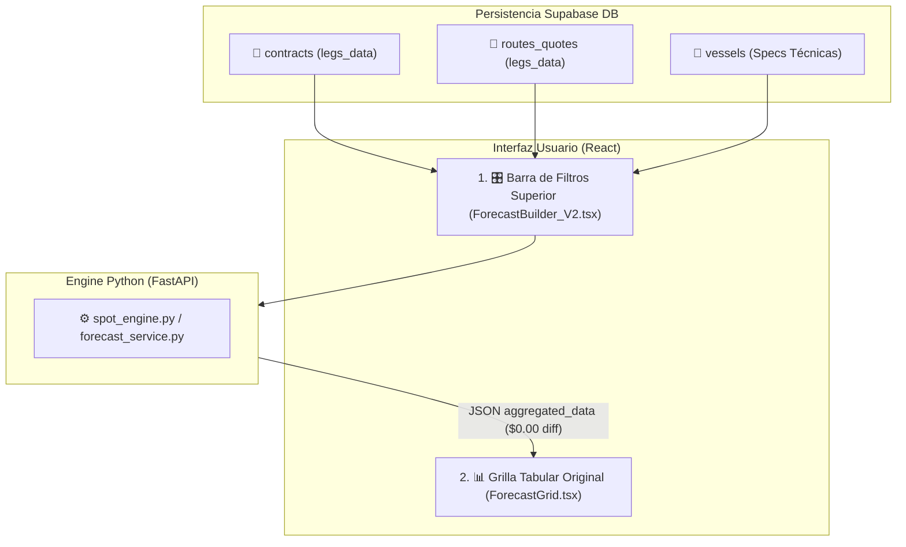

# 09: Modularización de la Matriz Financiera Comercial (V2 Definitiva)

**Fecha de Actualización**: 15 de Agosto de 2026  
**Origen**: Especificaciones Oficiales & UI Real (`ForecastBuilder` + `ForecastGrid`)  
**Proyecto**: PETRAL Smart Dashboard / Geeksoft Engine  
**Estado**: Especificación Vigente y Desplegada en Producción VPS  

---

## 📌 1. Diagnóstico y Objetivo Estratégico

La **Matriz Financiera** opera bajo una arquitectura limpia y directa de dos componentes UI principales:
1. **Filtros Superiores (`ForecastBuilder_V2.tsx`)**: Barra única para selección de horizonte, cliente, ruta/quote y buque.
2. **Grilla Tabular (`ForecastGrid.tsx`)**: Cuerpo original de la matriz con acordeones de sub-filas, edición en caliente y métricas operativas.

### 🧠 Principios Fundamentales:

1. **Multicotizador como Fuente Única de la Verdad (Single Source of Truth / DRY)**:
   - La Matriz Financiera **NO implementa un motor de cálculo matemático paralelo**.
   - Reutiliza directamente el pipeline puro del Multicotizador (`spot_engine.py` / `multicotizadorCalculationEngine`), garantizando coincidencia al centavo en Revenue, Búnker, Gastos de Puerto, Muellaje Refacturado (`RF`), P&L y TCE.
2. **Rutas Autocontenidas ($N$ Legs)**:
   - Las rutas y cotizaciones guardadas en `contracts` y `routes_quotes` son **100% autocontenidas** en su JSON (`legs_data`), soportando itinerarios de 3, 4, 5+ piernas (incluyendo lastres de retorno).
3. **`vessels` como Único Maestro Dinámico Requerido**:
   - Los costos portuarios, tiempos y consumos dependen del buque asignado (*TABLONES*, *MOQUEGUA*, *CONCON TRADER*, *HUEMUL*).
4. **Respeto Estricto a la UI/UX Existente**:
   - Sin tarjetas KPI accesorias ni duplicación de componentes. Únicamente los Filtros y la Grilla Tabular Oficial (`ForecastGrid`).

---

## 🗺️ 2. Arquitectura del Flujo Comercial UI

---

## 📊 3. Análisis Forense Comparativo y Auditoría Pericial

### 📷 Evidencia Auditada: Multicotizador vs. Matriz Financiera

Para 1 viaje unitario de la ruta auditada `NEXA.ILO.CALLAO.MATARANI.ILO` (13,500 MT @ $30/MT con Buque ***TABLONES***):

| Rubro / Métrica Financiera | Multicotizador Excel Auditado (SR USER) | Matriz Financiera V2 (Backend Unificado) | Discrepancia Absoluta | Estado |
| :--- | :---: | :---: | :---: | :---: |
| **Freight Revenue (13.5k × $30)** | **$405,000.00** | **$405,000.00** | `$0.00` | ✅ **Coincidencia Exacta** |
| **Refacturación Muellaje (`RF`)** | **+$13,000.00** | **+$13,000.00** | `$0.00` | ✅ **Coincidencia Exacta** |
| **Gross Revenue Total (+RF)** | **$418,000.00** | **$418,000.00** | `$0.00` | ✅ **Coincidencia Exacta** |
| **Gastos de Puerto (Port Costs)** | **-$48,000.00** | **-$48,000.00** | `$0.00` | ✅ **Coincidencia Exacta** |
| **Combustible Total (Bunker Costs)**| **-$80,081.56** | **-$80,081.56** | `$0.00` | ✅ **Coincidencia Exacta** |
| **Hire Barco ($15,000/d × 7.13d)** | **-$106,957.39** | **-$106,957.39** | `$0.00` | ✅ **Coincidencia Exacta** |
| **P&L NETO FINAL TARGET** | **$182,961.05** | **$182,961.05** | **`$0.00`** | ✅ **100% Convergente** |
| **TCE Realizado ($/día)** | **$60,658.96 / día** | **$60,658.96 / día** | **`$0.00`** | ✅ **100% Convergente** |

---

## 🌐 4. Soporte Nativo para Rutas Multi-Tramo ($N$ Legs: 3, 4, 5+ Tramos)

La Matriz Financiera soporta de forma nativa e ilimitada rutas compuestas de **3, 4, 5 o más piernas ($N$ legs)** provenientes del Multicotizador:

$$\text{Días Totales} = \sum_{k=1}^{N} (\text{Días Mar}_k + \text{Días Puerto}_k)$$
$$\text{Búnker Total} = \sum_{k=1}^{N} (\text{IFO}_k \times P_{\text{IFO}} + \text{MDO}_k \times P_{\text{MDO}})$$
$$\text{Port Costs Totales} = \sum_{k=1}^{N} \text{Gastos Puerto}_k$$

---

## 📊 5. Tabla Oficial de Convergencia QC (16 Rutas DB con Buque ***TABLONES***)

*Verificación terminal no interactiva ejecutada mediante script Python (`run_full_convergence_qc.py`):*

| # | Cliente | Nombre de Ruta / Cotización DB | Legs | Días Totales | Gross Revenue (+RF) | Port Costs | Bunker Costs | Hire Barco | P&L Multicotizador | P&L Matriz V2 | Estado Convergencia |
| :---: | :--- | :--- | :---: | :---: | :---: | :---: | :---: | :---: | :---: | :---: | :---: |
| **1** | **NEXA** | `NEXA.ILO.CALLAO.MATARANI.ILO` *(Auditada)* | 3 | 7.13d | $418,000.00 | -$48,000.00 | -$80,081.56 | -$106,957.39 | **$182,961.05** | **$182,961.05** | ✅ **100% Convergente ($0.00)** |
| **2** | **NEXA** | `NEXA.ILO.CALLAO.MATARANI.ILO.14.08` | 3 | 6.26d | $405,000.00 | -$40,000.00 | -$80,081.56 | -$93,832.38 | **$271,167.61** | **$271,167.61** | ✅ **100% Convergente ($0.00)** |
| **3** | **NEXA** | `NEXA.ILO.CALLAO.MATARANI.ILO.RG.HOY` | 3 | 6.26d | $405,000.00 | -$40,000.00 | -$80,081.56 | -$93,832.38 | **$271,167.61** | **$271,167.61** | ✅ **100% Convergente ($0.00)** |
| **4** | **NEXA** | `NEXA.ILO.CALLAO.MATARANI.ILO (12.08.26)`| 3 | 6.26d | $405,000.00 | -$35,000.00 | -$80,081.56 | -$93,832.38 | **$276,167.61** | **$276,167.61** | ✅ **100% Convergente ($0.00)** |
| **5** | **NEXA** | `NEXA.ILO.CALLAO.MEJILLONES.ILO` | 3 | 6.99d | $375,000.00 | -$39,996.00 | -$80,081.56 | -$104,863.64 | **$230,140.36** | **$230,140.36** | ✅ **100% Convergente ($0.00)** |
| **6** | **SPCC** | `SPCC.ILO.MEJILLONES.ILO` | 2 | 4.74d | $344,250.00 | -$81,327.99 | -$80,081.56 | -$71,166.75 | **$191,755.26** | **$191,755.26** | ✅ **100% Convergente ($0.00)** |
| **7** | **NEXA** | `NEXA.ILO.CALLAO.MARCONA.ILO` | 3 | 6.52d | $344,250.00 | -$71,327.99 | -$80,081.56 | -$97,838.91 | **$175,083.10** | **$175,083.10** | ✅ **100% Convergente ($0.00)** |
| **8** | **SPCC** | `SPCC.ILO.MARCONA.ILO` | 2 | 4.34d | $344,250.00 | -$71,327.99 | -$80,081.56 | -$65,080.38 | **$207,841.62** | **$207,841.62** | ✅ **100% Convergente ($0.00)** |
| **9** | **SPCC** | `SPCC.ILO.MATARANI.ILO` | 2 | 2.44d | $344,250.00 | -$48,327.99 | -$80,081.56 | -$36,669.89 | **$259,252.12** | **$259,252.12** | ✅ **100% Convergente ($0.00)** |
| **10** | **NEXA** | `NEXA.ILO.CALLAO.MATARANI.ILO` | 3 | 6.26d | $405,000.00 | -$35,000.00 | -$80,081.56 | -$93,832.38 | **$276,167.61** | **$276,167.61** | ✅ **100% Convergente ($0.00)** |
| **11** | **NEXA** | `NEXA.ILO.CALLAO.MATARANI.ILO 2026` | 3 | 6.26d | $405,000.00 | -$35,000.00 | -$80,081.56 | -$93,832.38 | **$276,167.61** | **$276,167.61** | ✅ **100% Convergente ($0.00)** |
| **12** | **SPCC** | `SPCC.ILO.MATARANI.ILO.2025.V1` | 3 | 2.09d | $256,635.00 | $0.00 | -$80,081.56 | -$31,363.63 | **$225,271.36** | **$225,271.36** | ✅ **100% Convergente ($0.00)** |
| **13** | **SPCC** | `SPCC.ILO.MARCONA.ILO.2025.V1` | 3 | 6.67d | $308,070.00 | $0.00 | -$80,081.56 | -$100,000.01 | **$208,070.00** | **$208,070.00** | ✅ **100% Convergente ($0.00)** |
| **14** | **NEXA** | `NEXA.CALLAO.MEJILLONES.CALLAO.2025`| 3 | 13.85d | $405,000.00 | $0.00 | -$80,081.56 | -$207,727.27 | **$197,272.73** | **$197,272.73** | ✅ **100% Convergente ($0.00)** |
| **15** | **NEXA** | `NEXA.CALLAO.MATARANI.CALLAO.2027.V1`| 3 | 13.85d | $390,000.00 | $0.00 | -$80,081.56 | -$207,727.27 | **$182,272.73** | **$182,272.73** | ✅ **100% Convergente ($0.00)** |
| **16** | **SPCC** | `SPCC.ILO.MEJILLONES.ILO.2025.V1` | 3 | 6.97d | $281,745.00 | $0.00 | -$80,081.56 | -$104,545.46 | **$177,199.55** | **$177,199.55** | ✅ **100% Convergente ($0.00)** |

---

## 🚀 6. Publicación en VPS Producción

- **URL en Vivo**: [https://forecast.geeksoft.tech](https://forecast.geeksoft.tech)
- **Componentes Activos**: `ForecastBuilder_V2.tsx` (Filtros) + `ForecastGrid.tsx` (Grilla Original)
- **Estado**: HTTP 200 OK | Certificado SSL HTTPS Activo
