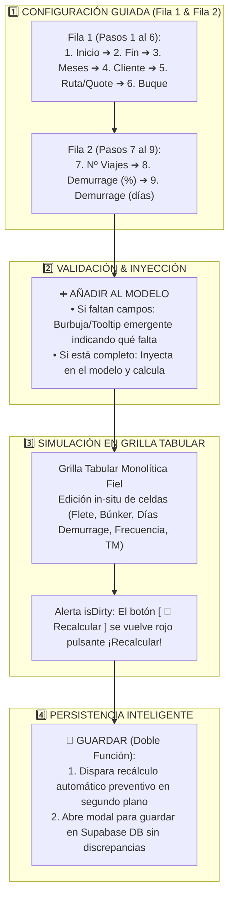

# 10: Especificación UI / UX — Ribbon Superior Guiado Paso a Paso (ForecastBuilder V2)

**Fecha de Actualización**: 15 de Agosto de 2026  
**Origen**: Refinamiento Oficial del Flujo Comercial Guiado & Arquitectura de 3 Partes  
**Proyecto**: PETRAL Smart Dashboard / Geeksoft Commercial Engine  
**Estado**: Especificación Aprobada para Ejecución Inmediata  

---

## 🎯 1. Filosofía y Flujo de Trabajo Comercial (Mental Model)

El Ribbon Superior está estructurado como un **sistema guiado secuencial (Pasos 1 al 9)** que orienta al operador comercial paso a paso para construir la proyección, inyectarla al modelo, simular en grilla y persistir los resultados de forma segura:



---

## 📐 2. Mockup Visual Exacto en 2 Filas

```text
====================================================================================================================================================================================
FILA 1: HORIZONTE, CLIENTE, RUTA Y BUQUE (6 Controles Amplios y Despejados)
====================================================================================================================================================================================
+--------------------+--------------------+--------------------+-------------------------------+-----------------------------------+--------------------+
| 1. Inicio forecast | 2. Fin forecast    | 3. Meses a modelar | 4. Cliente   [ACTIVOS][PROSP] | 5. Ruta / Quote                   | 6. Buque           |
| [ Ene 2027     📅] | [ Dic 2027     📅] | [ 12 meses       ▼]| [ NEXA                      ▼]| [ 💬 QUOTE:NEXA.CALLAO.M...     ▼]| [ MOQUEGUA       ▼]|
+--------------------+--------------------+--------------------+-------------------------------+-----------------------------------+--------------------+

====================================================================================================================================================================================
FILA 2: PARÁMETROS OPERATIVOS, BOTÓN AÑADIR, ESCENARIOS Y ACCIONES
====================================================================================================================================================================================
+---------------+-------------------+---------------------+-------------------------+---------------------------+---------------------------+-----------------+---+-------------+------------+----------+
| 7. Nº Viajes  | 8. Demurrage (%)  | 9. Demurrage (días) | ➕ AÑADIR AL MODELO     | 📁 Escenario              | 🔽 Filtros y Exportación  | VISTA:          |   | [Recalcular]| [ Guardar ]| [ Cargar]|
| [ 1         ] | [ % ] [ Mostrar ] | [ d ] [ Mostrar ]   | [ ➕ Añadir al Modelo ] | [ 📁 Escenario: Sin guar] | [ 🔽 Filtros de Tabla... ]| [ UND ] [ % ]   |   | [ 🔄 Recalc]| [ 💾 Guard]| [ 📂 Carg]|
+---------------+-------------------+---------------------+-------------------------+---------------------------+---------------------------+-----------------+---+-------------+------------+----------+
|<------------------------------ ALINEADO A LA IZQUIERDA ------------------------------>|                           |<--------- ESPACIO --------->|                   |<-- ALINEADO A LA DERECHA -->|
```

---

## 📌 3. Especificación Detallada de Cada Paso

### 🅰️ FILA 1: Horizonte, Cliente, Ruta y Buque

1. **`1. Inicio forecast` (`MonthPicker`)**:
   - Selección del mes y año inicial (ej. `Ene 2027`). Empuja automáticamente el fin si es necesario.
2. **`2. Fin forecast` (`MonthPicker`)**:
   - Selección del mes y año final (ej. `Dic 2027`). Calcula el último día de dicho mes.
3. **`3. Meses a modelar` (`Popover` con Selección Múltiple)**:
   - Despliega las píldoras de los meses comprendidos en el horizonte con botones rápidos `Todos` y `Ninguno`.
4. **`4. Cliente` (`[ ACTIVOS ]` / `[ PROSP. ]` + `<Select>`)**:
   - **Pestaña `[ ACTIVOS ]` (Azul Sky)**: Filtra clientes contractuales con contrato vigente (`SPCC`, `NEXA`).
   - **Pestaña `[ PROSP. ]` (Morado Purple)**: Filtra prospectos comerciales (`MARCOBRE`, `PRIMAX`, `CODELCO`, `CERRO VERDE`, etc.).
5. **`5. Ruta / Quote` (`<Select>` Unificado)**:
   - Agrupa en una sola lista las rutas de contrato y las cotizaciones guardadas con ícono distintivo `💬`.
   - Al seleccionar una cotización, precarga automáticamente el buque, tonelaje y yield/flete pactado.
6. **`6. Buque` (`<Select>`)**:
   - Selector de buque de la flota (`MOQUEGUA`, `TABLONES`, `CONCON TRADER`, `HUEMUL`).

---

### 🅱️ FILA 2: Parámetros Operativos, Añadir y Acciones

7. **`7. Nº Viajes` (`Input number`)**:
   - Frecuencia mensual de viajes que se proyectarán para los meses seleccionados.
8. **`8. Demurrage (%)` (`Input number` + Botón `Mostrar`)**:
   - Ingreso de porcentaje base y conmutador para visualizar la fila de demurrage porcentual en la grilla.
9. **`9. Demurrage (días)` (`Input number` + Botón `Mostrar`)**:
   - Conmutador que activa la fila de demurrage diario en la tabla jalando automáticamente la tarifa diaria de demurrage estipulada en la cotización/buque. En la grilla, el operador edita directamente los días de estadía de cada mes.
10. **`➕ Añadir al Modelo` (`Button Principal`)**:
    - Ubicado estratégicamente a la derecha del Paso 9.
    - **Validación con Burbuja Informativa**: Si el usuario no ha completado los pasos requeridos, se despliega una burbuja/tooltip emergente indicando exactamente qué campo falta (ej. *«Falta seleccionar: Cliente y Ruta»*).
11. **`📁 Escenario: <Nombre>`**: Badge de identificación del escenario activo (`forecastName` o `"Sin guardar"`).
12. **`🔽 Filtros de Tabla y Exportación`**: Botón desplegable que abre el panel flotante de filtros en cascada y exportadores (PDF Vertical, PDF Horizontal, Excel XLSX).
13. **`VISTA: [ UND | % ]`**: Conmutador de visualización de cifras en Dólares ($) o en Porcentaje (%) respecto al Gross Revenue.
14. **`[ 🔄 Recalcular ]`**: Botón con indicador `isDirty` (se ilumina en rojo pulsante `¡Recalcular!` si el usuario editó celdas en la grilla).
15. **`[ 💾 Guardar ]` (Doble Función)**:
    - Ejecuta un **recálculo preventivo en segundo plano** antes de abrir el modal de guardado, garantizando que el payload guardado en Supabase esté 100% sincronizado.
16. **`[ 📂 Cargar ]`**: Abre el modal de lista de escenarios para cargar proyecciones previas.

---

## 🛡️ 4. Regla de Oro: Look & Feel y Safe Points

* **Cero cambios estéticos arbitrarios**: Se preserva al 100% la estética, tipografía, paleta de colores, márgenes y alturas del monolito original.
* **Safe Points Intocables**: [`ForecastGrid_monolito.tsx`](file:///C:/Users/rguti/PETRAL.SMART.DASHBOARD/Desarrollo.Profesional/Geeksoft_Frontend/src/components/CommercialForecast/ForecastGrid_monolito.tsx) y [`ForecastGridFilters_monolito.tsx`](file:///C:/Users/rguti/PETRAL.SMART.DASHBOARD/Desarrollo.Profesional/Geeksoft_Frontend/src/components/CommercialForecast/ForecastGridFilters_monolito.tsx) permanecen congelados y resguardados.
