# 12: Especificación UI / UX — Grilla Tabular Interactiva con Acordeones Financieros (ForecastGrid)

**Fecha de Actualización**: 15 de Agosto de 2026  
**Origen**: Homologación Oficial de Métricas con Card 4 (`FINANCIAL VOYAGE RESULT`) del Multicotizador  
**Proyecto**: PETRAL Smart Dashboard / Geeksoft Commercial Engine  
**Estado**: Especificación Aprobada — Grilla Modular con Acordeones de Revenue y TCE  

---

## 🎯 1. Filosofía de la Grilla: Vista Ejecutiva con Auditoría en 1 Clic

La grilla tabular de la Matriz Financiera está diseñada bajo el principio de **máxima limpieza visual por defecto** combinada con **auditoría profunda bajo demanda** mediante acordeones colapsables:

```mermaid
flowchart TD
    subgraph G1 ["📊 VISTA EJECUTIVA (8 Filas Consolidadas - Fuente de la Verdad Card)"]
        F0["0. ▶ Viajes (freq)"]
        F1["1.   Toneladas"]
        F2["2. ▶ Net Revenue"]
        F3["3.   (-) Hire (TCE x días)"]
        F4["4.   (-) Bunker Costs"]
        F5["5.   (-) Port Costs"]
        F6["6.   (-) Muellaje (Costos)"]
        F7["7.   (=) VOYAGE RESULT / P&L"]
        F8["8. ▶ Métricas TCE ($/d)"]
    end

    subgraph A1 ["📂 ACORDEÓN 1: Net Revenue"]
        F2 --> A1_1["↳ (+) Freight Revenue (TM × Flete)"]
        F2 --> A1_2["↳ (+) Pass-Through Revenue (Refacturación Muellaje al cliente)"]
        F2 --> A1_3["↳ (=) Gross Revenue (Freight + Pass-Through)"]
        F2 --> A1_4["↳ (-) Comisiones (Address % + Broker %)"]
    end

    subgraph A2 ["📂 ACORDEÓN 2: Rendimiento TCE Unitario"]
        F8 --> A2_1["↳ TCE Realizado ($/d = (Net Revenue - Bunker - Ports) / Días)"]
        F8 --> A2_2["↳ TCE Requerido ($/d = Costo Buque Base)"]
        F8 --> A2_3["↳ Diferencia TCE (+/- $/d = Realizado - Requerido)"]
    end

    subgraph A3 ["📂 ACORDEÓN 3: 24 Sub-filas Operativas"]
        F0 --> A3_1["↳ Días de Mar, Puerto, Búnker IFO/MDO, Flete, Celdas Editables"]
    end
```



---

## 📐 2. Estructura de Filas Principales (Modo Colapsado por Defecto)

Por defecto, cada buque/ruta modelada presenta las filas consolidadas homologadas con la tarjeta `FINANCIAL VOYAGE RESULT` (Card Multicotizador):

| # | Métrica en Grilla | Tipo | Descripción / Fórmula Consolidada |
| :---: | :--- | :---: | :--- |
| **0** | **`▶ Viajes (freq)`** | `Numérico` | Frecuencia mensual de viajes modelados *(Desplegable con 24 sub-filas)* |
| **1** | **`  Toneladas`** | `Numérico` | $\text{TM/viaje} \times \text{Viajes}$ |
| **2** | **`▶ Net Revenue`** | `Moneda ($)` | **Ingreso Comercial Neto** $\mathbf{(= \text{Gross Revenue} - \text{Comisiones})}$ *(Desplegable)* |
| **3** | **`  (-) Hire (TCE x días)`** | `Moneda ($)` | Costo por tiempo de charter $\mathbf{(= \text{TCE Requerido} \times \text{Días Totales} \times \text{Viajes})}$ |
| **4** | **`  (-) Bunker Costs`** | `Moneda ($)` | Costo Total de Combustible (IFO + MDO) |
| **5** | **`  (-) Port Costs`** | `Moneda ($)` | Gastos de Puerto Totales (Agencias + Fondeo + Tarifas Portuarias) |
| **6** | **`  (-) Muellaje (Costos)`** | `Moneda ($)` | Costo de Muellaje Refacturable *(Suma a Costos)* |
| **7** | **`  (=) VOYAGE RESULT / P&L`** | `Moneda ($)` | $\mathbf{\text{Net Revenue} - (\text{Hire} + \text{Bunker} + \text{Ports} + \text{Muellaje})}$ *(Cierre Financiero Único)* |
| **8** | **`▶ Métricas TCE ($/d)`** | `Informativo` | TCE Realizado ($/d), TCE Requerido ($/d), Diferencia TCE (+/- $/d) *(Desplegable)* |
| *9* | *`▶ Demurrage`* | *`Moneda ($)`* | *Opcional al activar el conmutador de Demurrage en el Ribbon* |


---

## 📂 3. Especificación Detallada de los Acordeones

### 🅰️ Acordeón 1: Desglose de `Net Revenue` (`isExpandedNetRevenue`)

Al hacer clic en el chevron **`▼ Net Revenue`**, se despliega el cálculo transparente del ingreso comercial homologado con el Multicotizador:

```text
▼ Net Revenue                                  $ 428,208.00  (Consolidado Neto)
   ↳ (+) Freight Revenue                       $ 405,000.00  [TM/viaje × Flete × Viajes]
   ↳ (+) Pass-Through Revenue                  $  33,333.00  [Muellaje RF × Viajes] (o '-' si es $0)
   ↳ (=) Gross Revenue                         $ 438,333.00  [Freight Revenue + Pass-Through Revenue]
   ↳ (-) Comisiones                            -$ 10,125.00  [Freight Revenue × (Address % + Broker %)]
```

* **Fórmulas**:
  1. $\text{Freight Revenue} = \text{TM} \times \text{Flete} \times \text{Viajes}$
  2. $\text{Pass-Through Revenue} = \text{Muellaje } \text{RF} \times \text{Viajes}$ *(se muestra siempre fijo, incluso con valor $0 / -)*
  3. $\text{Gross Revenue} = \text{Freight Revenue} + \text{Pass-Through Revenue}$
  4. $\text{Comisiones} = \text{Freight Revenue} \times (\text{Address Comm \%} + \text{Broker Comm \%})$
  5. $\text{Net Revenue} = \text{Gross Revenue} - \text{Comisiones}$

---

### 🅱️ Acordeón 2: Rendimiento Diario `TCE` (`isExpandedTce`)

Al hacer clic en el chevron **`▼ TCE x días`**, se despliegan las métricas unitarias diarias extraídas de la tarjeta `FINANCIAL VOYAGE RESULT`:

```text
▼ TCE x días                                   $ 240,500.00  (Hire Total: TCE Requerido × Días × Viajes)
   ↳ TCE Realizado ($/d)                       $  16,880.00 /d  [Voyage Result / Días Totales]
   ↳ TCE Requerido ($/d)                       $  13,000.00 /d  [Costo Diario Base del Buque]
   ↳ Diferencia TCE (+/- $/d)                 +$   3,880.00 /d  [Verde si ≥ 0, Rojo si < 0]
```

* **Fórmulas**:
  1. $\text{TCE x días (Hire Total)} = \text{TCE Requerido} \times \text{Días de Viaje} \times \text{Viajes}$
  2. $\text{TCE Realizado} = \frac{\text{Voyage Result}}{\text{Días Totales}}$
  3. $\text{TCE Requerido} = \text{Tarifa Diaria del Buque (Maestro de Flota)}$
  4. $\text{Diferencia TCE} = \text{TCE Realizado} - \text{TCE Requerido}$

---

### 🅲️ Acordeón 3: Sub-filas Operativas de `Viajes (freq)` (`isExpandedRows`)

Al desplegar **`▼ Viajes (freq)`**, se expanden las **24 sub-filas de desglose analítico**:
1. `Distancia (NM)`
2. `Días Mar`
3. `Días Puerto`
4. `Días Totales`
5. `Consumo IFO (T)`
6. `Precio IFO ($/T)` *(Celda editable in-situ)*
7. `Costo IFO ($)`
8. `Consumo MDO (T)`
9. `Precio MDO ($/T)` *(Celda editable in-situ)*
10. `Costo MDO ($)`
11. `Búnker Total ($)`
12. `Gastos Puerto ($)`
13. `Carga / TM` *(Celda editable in-situ)*
14. `Flete ($/TM)` *(Celda editable in-situ)*
15. `Gross Income ($)`
16. `Comisión Address (%)`
17. `Comisión Broker (%)`
18. `Comisiones ($)`
19. `Net Income ($)`
20. `Voyage Result ($)`
21. `TCE Real ($/d)`
22. `TCE Req ($/d)`
23. `Costo TCE ($)`
24. `P/L Unitario ($)`

### 🅳️ Acordeón 4: Demurrage (`isDemurrageVisible` / `isDemurrageDaysVisible`)

Al activar el conmutador de Demurrage en el Ribbon:
* **Modo Porcentual (`Demurrage %`)**:
  $$\mathbf{\text{Demurrage (USD)}} = \mathbf{\text{Freight Revenue}} \times \frac{\mathbf{\text{Demurrage \%}}}{100}$$
  > [!IMPORTANT]
  > El Demurrage porcentual se calcula **estrictamente como porcentaje del `Freight Revenue`** ($\text{TM} \times \text{Flete} \times \text{Viajes}$), sin incluir el muellaje refacturado ni deducciones de comisiones.

* **Modo Diario (`Demurrage d`)**:
  $$\mathbf{\text{Demurrage (USD)}} = \mathbf{\text{Viajes}} \times \mathbf{\text{Días Demurrage}} \times \mathbf{\text{Tarifa Diaria Buque/Quote ($/día)}}$$

---

## 🔄 4. Dinamismo de Cabecera y Jerarquía (`groupOrder`)

La grilla permite permutar libremente los 3 niveles jerárquicos mediante botones interactivos `⇄` en la cabecera:
* `[ Cliente ⇄ Ruta ⇄ Buque ]`
* `[ Buque ⇄ Cliente ⇄ Ruta ]`
* `[ Ruta ⇄ Buque ⇄ Cliente ]`

### 📊 Subtotales y Consolidación Global:
* **Subtotales por Nivel 1**: Fila de consolidación con botón colapsable para cada cliente/nodo principal.
* **Total General**: Consolidado mensual de toda la flota/cartera.
* **Total Acumulado**: Proyección sumatoria mes a mes a lo largo de todo el horizonte.

---

## 🕵️‍♂️ 5. Plan Forense Serie 50 (Benoit Blanc): Habilitación Operativa de Fila 0 (POL) y Saneamiento de Naming

**Fecha de Dictamen**: 18 de Agosto de 2026  
**Objetivo Forense**: Erradicar el bug donde las operaciones de carga en el Puerto de Origen (Fila 0 / POL) no calculaban Días de Puerto ni Búnker, y subsanar el naming duplicado de rutas simples (`SPCC.ILO.ILO.MATARANI.ILO`).

### 5.1. El Crimen en la Fila 0 y en el Naming
1. **Fila 0 Ciega en `SpreadsheetTramosGrid.tsx` (L186)**: La columna `DÍAS PTO` mostraba un guión estático `—` ignorando los días calculados de estadía/carga en el puerto de origen.
2. **Omisión en `MulticotizadorCalculationEngine.ts` (L127–138)**: El motor ignoraba `calcPortDays0` y los consumos de combustible (IFO/MDO) durante la operación de carga en Fila 0, sumando únicamente el costo de agencia monetario.
3. **Naming Duplicado en `MultiCotizadorExcel.tsx` (L527–533)**: `getSuggestedRoutePrefix` unía tramos sin deduplicar puertos adyacentes repetidos, generando secuencias erróneas como `ILO.ILO.MATARANI.ILO` si existía un tramo fantasma de 0 NM.

### 5.2. Cirugía Quirúrgica Propuesta
| Componente | Archivo | Modificación Pericial |
| :--- | :--- | :--- |
| **Cálculo Fila 0** | `MulticotizadorCalculationEngine.ts` | Calcular `idleDays0 = (tc + pos) / 24`, `opDays0 = Q / (rate * factor)`, `calcPortDays0 = idleDays0 + opDays0` y consumos IFO/MDO de Fila 0. Sumar a `totalPortDays`, `totalDays`, `totalIfoTons`, `totalMdoTons`, `ifoCost`, `mdoCost`, `grandBunkerTotal`. |
| **Visualización Grilla** | `SpreadsheetTramosGrid.tsx` | Renderizar `fmtDays(calcPortDays0)` en la columna `DÍAS PTO` de Fila 0 cuando `action !== 'NONE'`, y sumar el búnker de Fila 0 a la fila de costos en vivo. |
| **Naming Limpio** | `MultiCotizadorExcel.tsx` | Deduplicar puertos adyacentes en `getSuggestedRoutePrefix` para garantizar nombres limpios como `SPCC.ILO.MATARANI.ILO.2026`. |

### 5.3. Garantía de Integridad
- **Esquema de BD Inmutable**: No se altera la estructura de `routes_quotes` ni el contrato JSONB de `legs_data`.
- **Compatibilidad Total**: `QuoteExecutiveCardSummary.tsx`, `forecast_service.py` y `multicotizadorPdfPrintService.ts` consumen los datos consolidados con total cuadratura.


