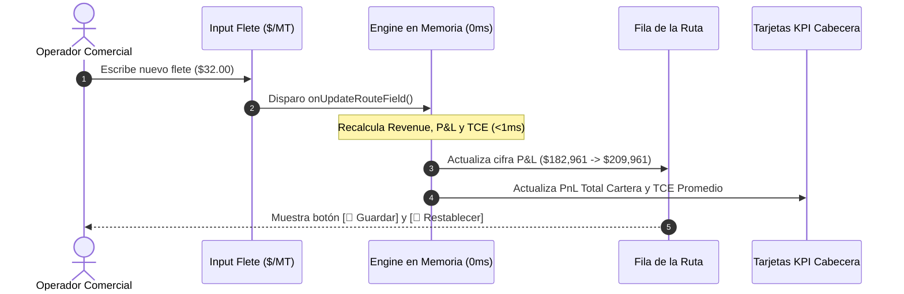

# 13: Especificación UI / UX — Edición en Caliente In-Situ y Feedback Visual

**Fecha de Creación**: 14 de Agosto de 2026  
**Módulo**: Matriz Financiera Comercial — Bucle Reactivo y Persistencia Voluntaria  
**Propósito**: Definir la experiencia de usuario (UX) al editar variables en caliente, estados visuales de celda modificada y persistencia.

---

## 🎯 1. Principio de Experiencia de Usuario (UX)

> **"Simulación Inmediata y Segura"**: El operador puede alterar cualquier cifra para ver el impacto financiero en tiempo real ($0\text{ ms}$) con la total tranquilidad de que **sus cambios viven en memoria (sandbox)** y no alteran la base de datos hasta que decida presionar `💾 Guardar`.

---

## 🎨 2. Estados Visuales de Celdas y Filas

### 🟡 2.1. Estado: Celda Editada (Dirty Cell)
* Cuando el usuario cambia un valor en un input (ej. sube el Flete de `$30.00` a `$32.00` o cambia el precio IFO):
  - **Fondo de la Fila**: Se tiñe sutilmente con un tono ámbar claro (`bg-amber-50/40`) para indicar que la fila tiene modificaciones en memoria no guardadas en base de datos.
  - **Borde del Input**: Resalta en ámbar cálido (`border-amber-300 ring-1 ring-amber-400`).

### 🟢 2.2. Botones de Acción Contextuales (Aparecen solo al Modificar)
En la columna **Acciones**, cuando una fila tiene `isModified === true`, se activan dos botones compactos:
1. **`💾 Guardar (Verde Esmeralda)`**:
   - Envía el nuevo estado a Supabase DB mediante `ForecastService.saveSpot()`.
   - Transición: Mientras guarda, muestra un spinner discreto o deshabilita el botón.
   - Éxito: La fila pierde el fondo ámbar y vuelve al estado normal guardado (`isModified: false`).
2. **`🔄 Restablecer (Gris Pizarra)`**:
   - Descarta inmediatamente los cambios en memoria y restaura los valores originales guardados en base de datos.
   - Recalcula la fila y los KPIs globales en $0\text{ ms}$.

---

## ⚡ 3. Feedback Reactivo en Pantalla

---

## 🛡️ 4. Casos Especiales de Edición

### ⚓ A. Inyección Global de Buque vs Cambio por Fila
* **Inyección Global (Ribbon)**: Si el usuario selecciona `🚢 TABLONES` en el Ribbon superior, toda la cartera cambia temporalmente a *TABLONES*.
* **Cambio por Fila**: Si luego en la Fila #3 el usuario cambia específicamente esa fila a `🚢 HUEMUL`, esa fila respetará *HUEMUL* de forma independiente.

### 🏛️ B. Checkbox de Muellaje `[x] RF`
* **Marcado `[x]` (Refacturado al Cliente)**:
  - Muestra el badge `(+RF $6,000)` en la columna Revenue.
  - El muellaje se suma a los ingresos facturados.
* **Desmarcado `[ ]` (Asumido por Petral)**:
  - Elimina el badge `+RF`.
  - El muellaje permanece únicamente como costo portuario absorbido por Petral.

---

## 🚀 5. Resumen de Buenas Prácticas UX Aplicadas
1. **Cero Pantallas de Bloqueo**: Los cálculos se realizan sincrónicamente en memoria React, sin congelar la interfaz.
2. **Claridad Numérica**: Todos los inputs numéricos utilizan fuentes monoespaciadas (`font-mono`) con alineación a la derecha.
3. **Control Total**: El usuario siempre tiene a la mano el botón `🔄 Restablecer` para volver al estado seguro si desea descartar una simulación.
