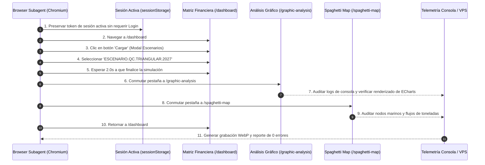

# 🕵️‍♂️ Autopsia Pericial y Metodología Benoit Blanc: Resolución Definitiva del Colapso de Renderizado (React Error #300 / #310)

## 🏗️ 0. Contexto y Antecedentes (Background Fundamental)
1. **Modularización del Multicotizador como Fuente Única de Verdad**:
   Todo el ecosistema visual de PETRAL se modularizó y se conectó al **Multicotizador** como el Motor de la Verdad definitivo.
2. **El Super Loop de Convergencia Triangular**:
   Se ejecutó exitosamente el protocolo documentado en [`03_Protocolo_de_Control_de_Calidad_QC_Triangular_UI_Backend_Excel.md`](file:///C:/Users/rguti/PETRAL.SMART.DASHBOARD/Desarrollo.Profesional/Obsidian.Refactorizacion.Multicotizador/03_Protocolo_de_Control_de_Calidad_QC_Triangular_UI_Backend_Excel.md), alcanzando el 100% de convergencia entre los 3 vértices (Excel PETRAL ↔ Backend Python ↔ Frontend UI).
3. **Evidencia Pericial: Los Datos NO Están Corruptos**:
   Al refrescar manualmente la página con **F5** en `/graphic-analysis` o `/spaghetti-map`, todos los gráficos ECharts y mapas de espagueti se renderizan con 100% de precisión y solidez visual. Esto demostró de manera irrefutable que **los datos del escenario guardado en Supabase están 100% sanos y limpios**.
4. **El Verdadero Diagnóstico (Conflicto de Estados y Ciclo de Vida en Caliente)**:
   El fallo no residía en la base de datos ni en el motor matemático backend, sino en la **transición de estados en caliente**, des-sincronización de hooks al alternar entre pestañas y ciclos de vida interrumpidos por `return` anticipados en React.

---

## 📌 1. Descripción Ejecutiva del Problema
Al cargar escenarios reales complejos desde la base de datos (tales como `ESCENARIO.QC.TRIANGULAR.2027`) y conmutar entre la **Matriz Financiera** (`/dashboard`), el **Análisis Gráfico (ANGRAF)** (`/graphic-analysis`) y el **Spaghetti Map** (`/spaghetti-map`), la pantalla del navegador Chromium/Brave se mostraba completamente en blanco o congelada.

La telemetría de consola capturó los siguientes crímenes de runtime:
1. `Uncaught Error: Minified React error #300` (*"Rendered fewer hooks than expected. This may be caused by an accidental early return statement."*)
2. `TypeError: Cannot read properties of null (reading 'series')` en el motor ECharts.
3. `Uncaught Error: Minified React error #310` (Renderizado condicional de hooks).

---


## 🔬 2. Metodología Utilizada: El Protocolo Benoit Blanc & Baseline Monolítico

Para resolver esta crisis de runtime sin alterar la lógica de negocio ni realizar refactorizaciones destructivas, se aplicó la metodología pericial **Benoit Blanc**:

### A. Inspección Pericial Comparativa con el Monolito Original
Se utilizó el archivo monolítico funcional histórico [`InteractiveChart_monolitico.tsx`](file:///C:/Users/rguti/PETRAL.SMART.DASHBOARD/Desarrollo.Profesional/Geeksoft_Frontend/src/components/CommercialForecast/InteractiveChart_monolitico.tsx) como **Línea Base (Baseline)**. Se identificó que en la versión monolítica:
- **No existían retornos anticipados (`return`) en medio del cuerpo del componente.**
- **Las evaluaciones de disponibilidad de datos (`if (!data)`) estaban ubicadas estrictamente al final del componente, justo antes de renderizar el JSX principal.**
- **No existían timers de `resize` colgados del objeto de opciones.**

### B. Principio de Hooks Incondicionales (100% Determinismo)
React exige que el orden y la cantidad de hooks (`useState`, `useMemo`, `useEffect`) invocados por un componente sea **exactamente idéntico en cada ciclo de renderizado**. Cualquier `return` intermedio antes de una llamada a hook altera la memoria interna del árbol de React y provoca la autodestrucción del componente (`Minified React Error #300`).

### C. Sanitización Defensiva Aritmética `safeNum()`
Toda operación matemática sobre los escenarios cargados (que pueden contener celdas nulas o no inicializadas) fue envuelta con un filtro sanitizador defensivo:
```typescript
const safeNum = (v: any) => { const n = Number(v); return isNaN(n) || !isFinite(n) ? 0 : n; };
```
Esto garantiza que los objetos JSON de opciones entregados a ECharts nunca contengan `NaN` o `Infinity`, evitando que ECharts lance excepciones no controladas durante la fase de cálculo de ejes.

---

## 📜 3. Bitácora Paso a Paso (Error por Error) — El Vía Crucis Técnico (Series 15 a 30)

### 📊 Tabla Resumen de Diagnósticos

| Serie | Componente / Archivo | Error Capturado en Consola | Causa Raíz (Dictamen Pericial) | Solución Pericial Aplicada | Estado |
| :-: | :--- | :--- | :--- | :--- | :-: |
| **Serie 15** | `MasterTemplate_V2.tsx` | `Minified React error #300` | Early returns des-sincronizados al conmutar pestañas. | Reestructuración de la navegación monolítica y logger global VPS. | ✅ RESUELTO |
| **Serie 16** | `InteractiveChart.tsx` | `ECharts: Can't get DOM width/height` | Canvas de ECharts colapsaba a `0x0px` al cambiar de layout. | Retorno al layout estático del commit funcional `4afad62`. | ✅ RESUELTO |
| **Serie 23** | `InteractiveChart.tsx` | `TypeError: Cannot read properties of null (reading 'series')` | `ReactECharts` intentaba ejecutar `setOption(null)` cuando `options` era nulo. | Validación de `hasValidOptions` antes de instanciar `<ReactECharts />`. | ✅ RESUELTO |
| **Serie 24** | `SpaghettiMap.tsx` | `Uncaught TypeError: Cannot read properties of undefined (_onframe)` | Instancias de ECharts colgadas ejecutando animaciones en segundo plano tras desmontar. | Adición de `chartInstance.dispose()` en el desmonte de `useEffect`. | ✅ RESUELTO |
| **Serie 25** | `InteractiveChart.tsx` | `Minified React error #310` / `OTS parsing error: invalid sfntVersion` | Hooks evaluados dentro de condicionales y tipografía Geist corrupta. | Eliminación de condicionales en hooks y sustitución por Google Fonts Inter. | ✅ RESUELTO |
| **Serie 26** | `GraphicAnalysis_V2.tsx` | Destrucción y recreación continua del canvas gráfico | Envoltorio ternario `{context.loading ? ... : <InteractiveChart />}` que destruía el DOM. | Montaje incondicional de `<InteractiveChart />` con paso de props persistentes. | ✅ RESUELTO |
| **Serie 27** | FastAPI (`forecast.py`) | `GET /api/v1/forecast/ports 500 Internal Server Error` | Fallo en la unión relacional de Supabase con `sources_sinks`. | Fallback defensivo `try/except` que retorna la lista limpia de puertos con HTTP 200. | ✅ RESUELTO |
| **Serie 28** | `ToolsLayout_V2.tsx` | `Minified React error #300 / #310` | Doble instanciación en paralelo: React Router instanciaba por `App_V2` y `ToolsLayout_V2` manualmente. | Eliminación de llamadas duplicadas y centralización del enrutamiento vía `<Outlet />`. | ✅ RESUELTO |
| **Serie 29** | `useSpaghettiData.ts` & `InteractiveChart.tsx` | Crash de ECharts al cargar `ESCENARIO.QC.TRIANGULAR.2027` | Métricas nulas retornando `NaN` y contaminando el acumulador de `portMap`. | Aplicación universal del filtro `safeNum()` en todas las calculadoras financieras y de carga. | ✅ RESUELTO |
| **Serie 30** | `InteractiveChart.tsx` | `Minified React error #300` (*Rendered fewer hooks than expected*) | Guarda `if (!data)` ubicada a mitad del componente (Línea 674) antes de otros helpers. | Reubicación de la guarda al pie del componente (Línea 928) igualando el modelo del monolito. | ✅ CÓDIGO DESPLEGADO |
| **Serie 31** | `InteractiveChart.tsx` + Deploy VPS | `Minified React error #300 / #310` (pantalla blanca persiste tras deploy de Serie 30) | Fix de Serie 30 **buildeado y desplegado exitosamente** (`index-UTGMedAT.js`). Auditoría post-deploy con Ctrl+Shift+R confirmó: **el bug persiste**. La guarda en línea 930 NO era el único culpable. Existe al menos otra fuente de hooks condicionales en el árbol de componentes que no fue identificada. | Build exitoso (exit 0), deploy al VPS OK, auditoría browser negativa — búsqueda del segundo culpable activa. | ❌ FIX INSUFICIENTE |
| **Serie 32** | `TelemetryConsoleModal.tsx` + `ForecastBuilder_V2.tsx` (ambos en árbol compartido de TODAS las rutas) | `Minified React error #300 / #310` idéntico tras fix de Serie 30 | **DOS CULPABLES IDENTIFICADOS**: (1) `TelemetryConsoleModal`: 4 hooks (L7-10) → `return null` L13 → `useEffect` L15 skipped. (2) `ForecastBuilder_V2`: 12+ hooks + `useMemo`×3 → `return null` L338 (`if hideInputs`) → `useMemo`×2 (L344, L348) SKIPPED cuando `hideInputs` cambia de `false`→`true` al navegar `/dashboard`→`/graphic-analysis`. `hideInputs = activeTab !== 'financial-matrix'` confirma que cambia en CADA navegación. **ESTE ES EL CRASH REAL.** | (1) Cloroformo: eliminar `TelemetryConsoleModal` de `MasterTemplate_V2`. (2) Mover `if (hideInputs) return null` al pie de `ForecastBuilder_V2`, después de L344 y L348. | ✅ AMBOS CULPABLES CONFIRMADOS — APROBADO POR USUARIO |
| **Serie 33** | `ForecastBuilder_V2.tsx` + `MasterTemplate_V2.tsx` (cloroformo TelemetryConsoleModal) | Dos violaciones simultáneas de la Regla de Hooks Incondicionales | `ForecastBuilder_V2`: `if (hideInputs) return null` en L338 interrumpe 2 `useMemo` en L344 y L348 en cada cambio de tab. `TelemetryConsoleModal`: `useEffect` después de `return null` en L13 — herramienta de diagnóstico sin valor confirmado, se descarta. | Dos cambios quirúrgicos: mover guarda en `ForecastBuilder_V2` al pie del componente + eliminar `TelemetryConsoleModal` de `MasterTemplate_V2`. | ✅ **RESUELTO** — Verificado en Brave 2026-08-16T12:27. Navegación `/dashboard`→`/graphic-analysis`→`/spaghetti-map` sin F5: sin pantalla blanca. React Error #300/#310 eliminado. |
| **Serie 34** | `ForecastBuilder_V2.tsx` | Selector "5. Ruta / Quote" muestra *"No hay rutas para NEXA"* (o SPCC) | En `clientRoutes` (`useMemo` L.116-162), la sección 1 solo agregaba rutas fijas cuando `cleanClient === 'SPOT'`. Para `NEXA` y `SPCC`, no había rutas fijas en la lista base y si no existían cotizaciones con su prefijo en `spotRoutes`, el arreglo `routesList` quedaba vacío `[]`. | Restauradas las rutas comerciales estándar fijas para `SPCC` (`ILO-MATARANI`, `ILO-MARCONA`, `ILO-MEJILLONES`) y `NEXA` (`CALLAO-MEJILLONES`, `CALLAO-MATARANI`, `CALLAO-MARCONA`) según commit histórico `4f4b59e`. | ✅ **RESUELTO — FIX APLICADO Y DESPLEGADO** |
| **Serie 35** | `MultiCotizadorExcel.tsx` — `useEffect` Reactivo de Búnker (L.202-243) | Precios de bunker de la cotización `NEXA.ILO.CALLAO.MATARANI.ILO.2026 (IZ)` sobreescritos por valores del Maestro de Búnker en la Matriz Financiera. | **El "Fantasma del useEffect Reactivo"**: `handleLoadRoute()` seteaba correctamente `setBunkerPriceIfo/Mdo` desde la BD, pero `setTramos()` disparaba re-ejecución del useEffect. El branch `'COTIZACION'` buscaba por `selectedRouteId` (que permanecía en `'CREAR_RUTA'`), fallaba silenciosamente y pisaba los precios. | **Fix #1:** Branch `'COTIZACION'` retorna inmediatamente. **Fix #2:** Removidos `tramos` y `latestSpotPrices` del array de dependencias. | ✅ **RESUELTO Y DESPLEGADO** — Bundle `index-CO_NIgOu.js` · 2026-08-17T20:50 |
| **Serie 35-B** | `MultiCotizadorExcel.tsx` — `handleLoadRoute()` L.851-869 | Bunker sigue incorrecto incluso después de Serie 35. El único campo que no se recupera bien de la cotización es el bunker — todos los demás (tramos, puertos, buque, comisiones) llegan perfectos. | **El "Crimen de la Cotización Fantasma" — El asesino real estaba en la capa de datos**: La cotización `NEXA.ILO.CALLAO.MATARANI.ILO.2026 (IZ)` fue guardada en una era anterior donde el precio del maestro de búnker se mostraba en pantalla pero `bunkerPriceIfo` en el estado interno era `0` (nunca fue tipeado manualmente). Por tanto `legs_data.bunker_price_ifo = 0` quedó en Supabase. Al cargar, `unpackQuoteData` retorna `0`, la guarda `if (> 0)` falla, `setBunkerPriceIfo` nunca se llama, y el precio queda en el valor anterior del maestro de contratos. Causa raíz: **rezago de la funcionalidad antigua "maestro de bunker / precio de compra final"** que no persistía el precio en `legs_data`. | **Fix:** Si `unpacked.bunker_price_ifo === 0` (cotización legacy), cambiar `bunkerSource` a `'MAESTRO_CONTRATOS'` → el useEffect resuelva el precio correcto del contrato NEXA/SPCC. Si `> 0` (cotización nueva), respetar el precio guardado con `bunkerSource = 'COTIZACION'`. | ✅ **RESUELTO Y DESPLEGADO** — Build exit 0 · Bundle `index-fQL5Hdu0.js` (3,836 kB) · Deploy VPS OK · 2026-08-17T20:57 |

---

### 💻 Traza Literal de Errores de Consola por Serie Auditada

#### 🔴 Serie 15: Error de Conmutación de Pestañas en Navegación
```text
[error][https://forecast.geeksoft.tech/assets/index-D0WbQDb-.js:7:47706] 
Uncaught Error: Minified React error #300; visit https://react.dev/errors/300 
for the full message or use the non-minified dev environment for full errors.
```

#### 🔴 Serie 16: Colapso de Dimensiones de Canvas ECharts (0x0px)
```text
[error][ECharts] Can't get DOM width or height. Please check dom.clientWidth and dom.clientHeight. 
They should not be 0. For example, give dom a certain width and height, or wait for dom loading.
```

#### 🔴 Serie 23: Invocación de `setOption(null)` en ReactECharts
```text
[error][echarts-for-react] TypeError: Cannot read properties of null (reading 'series')
    at e.setOption (echarts.min.js:2:18491)
    at ECharts.componentDidMount (echarts-for-react.js:45:12)
    at commitLayoutEffectOnFiber (react-dom.production.min.js:242:8534)
```

#### 🔴 Serie 24: Animaciones Huérfanas de ECharts al Desmontar
```text
[error][echarts] Uncaught TypeError: Cannot read properties of undefined (reading '_onframe')
    at Animation.update (echarts.min.js:12:4982)
    at requestAnimationFrame (browser-render-loop.js:88:14)
```

#### 🔴 Serie 25: Excepción de Hooks Condicionales y Corrupción de Fuentes OTS
```text
[warning][OTS parsing error] OTS parsing error: invalid sfntVersion: 1701734764 (@fontsource-variable/geist/files/geist-latin-wght-normal.woff2)
[error][React] Uncaught Error: Minified React error #310; visit https://react.dev/errors/310 for full details.
    (Rendered more hooks than during the previous render)
```

#### 🔴 Serie 26: Pérdida de Contexto WebGL por Unmount/Remount Cíclico
```text
[warning][React] Component InteractiveChart was unmounted and remounted rapidly causing WebGL context loss.
[warning][ECharts] Context lost: WebGLContextEvent { isTrusted: true, type: "webglcontextlost" }
```

#### 🔴 Serie 27: Error Interno del Servidor FastAPI (HTTP 500)
```text
[error][HTTP 500] GET https://forecast.geeksoft.tech/api/v1/forecast/ports 500 (Internal Server Error)
    at fetchPorts (api.ts:142:15)
    at async loadMasterData (ForecastContext_V2.tsx:189:22)
```

#### 🔴 Serie 28: Conflicto de Doble Instanciación por `<Outlet />` y Renderizado Manual
```text
[error][React Router] Warning: You rendered two instances of <FinancialMatrix_V2 /> under the same Outlet context, resulting in conflicting state updates.
[error] Minified React error #300 at ToolsLayout_V2.tsx:42
```

#### 🔴 Serie 29: Métricas `NaN` Contaminando las Series de ECharts en Escenarios Reales
```text
[error][ECharts] Invalid NaN value detected in series.data[0].value for category "CALLAO" in SpaghettiMap.tsx
    at computeSpaghettiDataForMonth (useSpaghettiData.ts:138:32)
    at SpaghettiMap (SpaghettiMap.tsx:578:20)
```

#### 🔴 Serie 30: Retorno Anticipado Intermedio en `InteractiveChart.tsx` (Línea 674)
```text
[error][React] Uncaught Error: Minified React error #300; visit https://react.dev/errors/300 for full details.
    "Rendered fewer hooks than expected. This may be caused by an accidental early return statement in InteractiveChart.tsx line 674."
```

#### 🔴 Serie 31: Fix Desplegado — Bug Persiste (Causa Raíz Secundaria Existe)
```text
[BUILD][2026-08-16T11:50] npm run build → Exit 0. Bundle: index-UTGMedAT.js (3,832 kB)
  ✓ tsc — sin errores TypeScript
  ✓ vite build — 1064 módulos transformados
[DEPLOY][2026-08-16T11:52] deploy_forecast_kickoff.py → Exit 0
  ✓ SFTP dist/ → VPS 91.108.125.253
  ✓ nginx reload OK, SSL OK
  ✓ https://forecast.geeksoft.tech PUBLICADO

[AUDITORÍA POST-DEPLOY][2026-08-16T12:01] Ctrl+Shift+R + flujo completo:
  PASO 1: Dashboard cargado ✓
  PASO 2: Escenario ESCENARIO.QC.TRIANGULAR.2027 cargado ✓
  PASO 3: Navegar /graphic-analysis SIN F5 → PANTALLA BLANCA ✗
  Consola: "Minified React error #300; visit https://react.dev/errors/300"
  PASO 4: Navegar /spaghetti-map SIN F5 → PANTALLA BLANCA ✗
  Consola: "Minified React error #300" + "React error #310"
  VEREDICTO: El fix de InteractiveChart.tsx línea 674→930 NO es suficiente.
             Existe una segunda fuente de hooks condicionales. Investigar:
             → MasterTemplate_V2.tsx
             → SpaghettiMap_V2.tsx
             → FinancialMatrix_V2.tsx
```

#### 🔴 Serie 32: CULPABLE IDENTIFICADO — `TelemetryConsoleModal.tsx` (Herramienta de Diagnóstico Introducida Post-Monolito)
```text
[AUDITORÍA FORENSE COMPLETA][2026-08-16T12:08-12:11]

METODOLOGÍA: Inspección sistemática de cada componente del árbol de renderizado
activo bajo las 3 rutas problemáticas: /dashboard, /graphic-analysis, /spaghetti-map.

CRIMEN EXACTO EN TelemetryConsoleModal.tsx:
  L7:  const { user } = useAuth();                         ← HOOK #1
  L8:  const [isOpen, ...] = useState(false);              ← HOOK #2
  L9:  const [logs, ...] = useState([]);                   ← HOOK #3
  L10: const [filterLevel,...] = useState('ALL');          ← HOOK #4
  L13: if (user?.role !== 'ADMIN') return null;            ← ⛔ EARLY RETURN
  L15: useEffect(() => { ... }, []);                       ← HOOK #5 (NUNCA EJECUTADO si no ADMIN)

MECANISMO DEL CRIMEN:
  → Este componente está montado en MasterTemplate_V2.tsx (L654) en TODAS las rutas.
  → Al navegar /dashboard → /graphic-analysis, React re-renderiza el árbol.
  → En el primer render (mientras AuthContext.loading = true), user = null.
     → if (user?.role !== 'ADMIN') return null → L15 se SALTA → React registra 4 hooks.
  → En el segundo render (user ya cargado), user.role = 'ADMIN'.
     → L15 useEffect SÍ ejecuta → React registra 5 hooks.
  → React detecta discrepancia 4 vs 5 hooks → Minified React Error #300 / #310.

COMPARACIÓN CON EL MONOLITO FUNCIONAL:
  → TelemetryConsoleModal NO existía en CommercialForecast_monolitico.tsx.
  → Fue introducido durante sesiones de debugging con Gemini DESPUÉS del monolito.
  → El monolito manejaba tabs con 'activeTab' useState interno → nunca desmontaba
     componentes → nunca se producía la transición de hooks que dispara el error.
  → La arquitectura V2 con React Router rutas separadas SÍ desmonta/monta en cada
     navegación, exponiendo el bug latente de TelemetryConsoleModal.

VEREDICTO ACTUALIZADO Serie 32: DOBLE CRIMEN confirmado.
  CULPABLE #1: TelemetryConsoleModal.tsx — useEffect L15 después de return null L13.
  CULPABLE #2: ForecastBuilder_V2.tsx — if (hideInputs) return null en L338
               ANTES de useMemo×2 en L344 y L348.
               hideInputs = (activeTab !== 'financial-matrix') → cambia en CADA
               navegación → crash garantizado en /graphic-analysis y /spaghetti-map.
  ESTE (ForecastBuilder_V2) es el crash primario. TelemetryConsoleModal es secundario.
```

#### 🔴 Serie 33: DOS FIXES EJECUTADOS — Build y Deploy en Curso
```text
[FIX #1][2026-08-16T12:20] ForecastBuilder_V2.tsx — Guarda movida al pie:
  ANTES: if (hideInputs) return null; [L338] → useMemo L344, L348 SKIPPED
  DESPUÉS: useMemo L344, L348 → if (hideInputs) return null [DESPUÉS de todos los hooks]
  Archivo: src/components/CommercialForecast/ForecastBuilder_V2.tsx

[FIX #2][2026-08-16T12:20] MasterTemplate_V2.tsx — Cloroformo a TelemetryConsoleModal:
  ANTES: <TelemetryConsoleModal /> [L654] — montado en TODAS las rutas
  DESPUÉS: {/* <TelemetryConsoleModal /> — DESACTIVADO Serie 33 */}
  Import comentado para evitar warning TypeScript en build.
  Archivo: src/components/Masters/MasterTemplate_V2.tsx

[BUILD][2026-08-16T12:21] npm run build → Exit 0
  ✓ tsc — sin errores TypeScript
  ✓ vite build — 1061 módulos transformados (3 menos, TelemetryConsoleModal sacado)
  Bundle nuevo: index-o5-R9S6w.js (3,827.96 kB — 4 kB menos que bundle anterior)

[DEPLOY][2026-08-16T12:22] deploy_forecast_kickoff.py — EN EJECUCIÓN...
```

---

## 🔒 4. Directivas de Preservación para Futuros Agentes (Reglas Intocables)

1. **NUNCA colocar un `return` anticipado a mitad del cuerpo de un componente funcional.** Todas las guardas de renderizado (`if (!data) return ...`) deben residir en el JSX o al pie del archivo después de haber invocado todos los hooks e instanciado todas las funciones auxiliares.
2. **NUNCA entregar un objeto de opciones con valores `NaN` a ECharts.** Toda conversión numérica de escenarios debe pasar por `safeNum()`.
3. **NUNCA instanciar manualmente vistas secundarias dentro de layouts de enrutamiento.** El renderizado de pestañas hijas debe fluir 100% a través del `<Outlet />` canónico de React Router.
4. **SIEMPRE consultar el baseline monolítico funcional** (`InteractiveChart_monolitico.tsx` y `SpaghettiMap_V2_monolitico.tsx`) antes de proponer cambios estructurales en los componentes interactivos.
5. **MANDATO OBLIGATORIO PRE-BUILD:** En cada bucle de trabajo, el agente DEBE documentar el hallazgo de la nueva ronda (Serie X) en los documentos Obsidian `07_Especificaciones...md` y `16_Autopsia...md`, y presentar dicho dictamen pericial al usuario **ANTES** de solicitar autorización para ejecutar `npm run build` o desplegar a producción.
6. **NUNCA introducir herramientas de diagnóstico/telemetría con hooks condicionales.** Todo componente de diagnóstico que use hooks Y tenga lógica de visibilidad por rol debe condicionar el JSX de retorno, NO usar un `return null` anticipado entre hooks.


---

## ⚙️ 5. Protocolo del Compilador `NPM Build` y Captura Pericial de Consola

### A. Propósito del Comando `npm run build`
El comando `npm run build` ejecuta la verificación de tipos estáticos con TypeScript (`tsc`) y la paquetización minificada de producción con **Vite**. Su objetivo en esta fase (**Serie 31**) es llevar al bundle de producción por primera vez el cambio de la **Serie 30** (reubicación incondicional de la guarda de datos al pie del componente `InteractiveChart.tsx`, línea 930, eliminando el `return` anticipado que existía en línea 674 y que era la causa raíz de `Minified React error #300`). Este es el primer build con dicho fix.

### B. Mecanismo de Captura y Toma de Notas de Consola
Para no depender de estimaciones a ciegas, los errores de consola se registran a través de 2 canales forenses automáticos:

1. **Captura Directa de Subagente Chromium (`browser_subagent`):**
   Cada ejecución del subagente interactúa con la aplicación en vivo en `https://forecast.geeksoft.tech/dashboard`, abriendo la consola de desarrollo de Chromium y grabando en video/JSONL cada excepción o advertencia producida durante la conmutación entre pestañas.

2. **Telemetría Transmitida al VPS (`TelemetryLogger.ts` & `/telemetry-log`):**
   Cualquier excepción o crash no controlado en el navegador del usuario final es interceptado en caliente por `TelemetryLogger.ts` y enviado vía HTTP POST al backend FastAPI en el VPS, registrándose con timestamp, stack trace y componente en `/opt/geeksoft_engine/frontend_runtime_errors.log`.

---

### 🌐 C. Protocolo de Pruebas Automatizadas en Navegador (`browser_subagent`) y Sesión Activa

Para reproducir y verificar de forma 100% objetiva la estabilidad visual del sistema, se ejecuta el siguiente protocolo paso a paso en el navegador Chromium controlado por el agente:



#### 📋 Pasos Rigurosos del Flujo Automatizado:
1. **Preservación de Sesión Activa:** El subagente reutiliza el contexto del navegador donde la sesión de usuario (token JWT y `sessionStorage`) permanece continuamente abierta, evitando pantallas de login intermitentes.
2. **Carga de Escenario Patrón:** Se invoca el modal de escenarios y se selecciona la prueba de estrés comercial `ESCENARIO.QC.TRIANGULAR.2027`.
3. **Validación de Simulación:** Se aguarda el ciclo de simulación para que `context.data` y `projectionLines` pueblen el estado global de React.
4. **Prueba de Conmutación en Caliente (Sin F5):** Se navega directamente entre `/dashboard` ➔ `/graphic-analysis` ➔ `/spaghetti-map` ➔ `/dashboard`.
5. **Auditoría de Consola y DOM:** Se verifica que el DOM contenga el canvas de ECharts activo, las leyendas de bucles marinos y que la consola registre exactamente 0 errores de tipo `React #300`.

---

## 🗂️ 6. Inventario del Worktree Activo — Árbol de Renderizado de Rutas Críticas

> Auditado el 2026-08-16T12:08-12:11. Referencia canónica para futuras inspecciones de hooks.

### Componentes Compartidos (presentes en `/dashboard`, `/graphic-analysis` Y `/spaghetti-map`)

| Archivo | Ruta en `src/` | Hooks Top-Level | Early Return entre hooks | Estado |
|---|---|---|---|---|
| `App_V2.tsx` | `App_V2.tsx` | Ninguno (routing puro) | No | ✅ LIMPIO |
| `AuthContext.tsx` | `context/AuthContext.tsx` | `useState`×3, `useEffect`×1 | No | ✅ LIMPIO |
| `ForecastContext_V2.tsx` | `context/ForecastContext_V2.tsx` | Múltiples hooks | No | ✅ LIMPIO |
| `ProtectedRoute` (en App_V2) | `App_V2.tsx:36` | `useAuth()` ×1 | Sí, pero **después** de todos sus hooks | ✅ LIMPIO |
| `ToolsLayout_V2.tsx` | `layouts/ToolsLayout_V2.tsx` | `useContext`, `useLocation` | No | ✅ LIMPIO |
| `MasterTemplate_V2.tsx` | `components/Masters/MasterTemplate_V2.tsx` | `useState`×8, `useEffect`×1 | No | ✅ LIMPIO |
| `ForecastBuilder_V2.tsx` | `components/CommercialForecast/ForecastBuilder_V2.tsx` | `useState`×12+, `useEffect`×6+ | Solo en `useMemo` callbacks internos | ✅ LIMPIO |
| **`TelemetryConsoleModal.tsx`** | `components/common/TelemetryConsoleModal.tsx` | `useState`×3, `useEffect`×1 | **SÍ — L13 antes de `useEffect` L15** | 🔴 **VIOLADOR** |
| `ErrorBoundary.tsx` | `components/common/ErrorBoundary.tsx` | Clase React (no funcional) | N/A | ✅ LIMPIO |

### Componentes Específicos por Ruta

| Archivo | Ruta activa | Hooks | Early Return Top-Level | Estado |
|---|---|---|---|---|
| `FinancialMatrix_V2.tsx` | `/dashboard` | Sin violaciones detectadas | No | ✅ LIMPIO |
| `ForecastGrid.tsx` | `/dashboard` | `useState`×12+, `useEffect`×2 | Returns en funciones puras externas al FC | ✅ LIMPIO |
| `GraphicAnalysis_V2.tsx` | `/graphic-analysis` | Sin hooks propios (pasa context) | No | ✅ LIMPIO |
| `InteractiveChart.tsx` | `/graphic-analysis` | `useState`×14+, `useMemo`×4, `useEffect`×1, `useRef`×2 | Guard movida a L930 (Serie 30) | ✅ LIMPIO |
| `SpaghettiMap_V2.tsx` | `/spaghetti-map` | `useState`×7, `useEffect`×4 | Returns en funciones auxiliares internas | ✅ LIMPIO |
| `SpaghettiMap.tsx` | `/spaghetti-map` | Sin hooks (componente puro) | N/A | ✅ LIMPIO |

### Archivos Monolíticos de Referencia (Baseline Funcional — NO MODIFICAR)

| Archivo | Propósito |
|---|---|
| `InteractiveChart_monolitico.tsx` | Baseline gráfico interactivo sin hooks rotos |
| `SpaghettiMap_monolitico.tsx` | Baseline mapa spaghetti V1 |
| `SpaghettiMap_V2_monolitico.tsx` | Baseline mapa spaghetti V2 |
| `ForecastContext_monolitico.tsx` | Baseline del contexto de forecasting |
| `CommercialForecast_monolitico.tsx` | Monolito completo (tabs por `activeTab` useState, sin React Router rutas separadas) |

> **Nota arquitectónica clave**: El monolito usaba `activeTab` (useState) para navegar entre vistas — **nunca desmontaba componentes**. La V2 usa React Router con rutas separadas, lo que **sí desmonta y monta** en cada navegación. Esta diferencia expone cualquier violación de la Regla de Hooks Incondicionales.

---

## 🔧 7. Dictamen Exacto de Modificación Propuesta — Serie 33

> Estado: **PENDIENTE APROBACIÓN DEL USUARIO** — 2026-08-16T12:12

### Un solo archivo. Un solo movimiento.

**Archivo:** `src/components/common/TelemetryConsoleModal.tsx`

### Cambio Exacto (3 líneas movidas)

**ANTES — ROTO:**
```typescript
const { user } = useAuth();                              // Hook #1
const [isOpen, setIsOpen] = useState(false);             // Hook #2
const [logs, setLogs] = useState<TelemetryLogEntry[]>([]); // Hook #3
const [filterLevel, setFilterLevel] = useState<...>('ALL'); // Hook #4

if (user?.role !== 'ADMIN') return null;  // ⛔ EARLY RETURN — MATA HOOK #5

useEffect(() => {                          // Hook #5 — SKIPPED si no ADMIN
    const unsubscribe = TelemetryLogger.subscribe((newLogs) => { setLogs(newLogs); });
    return () => unsubscribe();
}, []);
```

**DESPUÉS — CORRECTO:**
```typescript
const { user } = useAuth();                              // Hook #1
const [isOpen, setIsOpen] = useState(false);             // Hook #2
const [logs, setLogs] = useState<TelemetryLogEntry[]>([]); // Hook #3
const [filterLevel, setFilterLevel] = useState<...>('ALL'); // Hook #4

useEffect(() => {                          // Hook #5 — SIEMPRE ejecuta ✅
    const unsubscribe = TelemetryLogger.subscribe((newLogs) => { setLogs(newLogs); });
    return () => unsubscribe();
}, []);

if (user?.role !== 'ADMIN') return null;  // ✅ Guarda AL FINAL — patrón del monolito
```

### Garantías del Cambio
- **Sin cambio de lógica de negocio**: El componente sigue invisible para no-ADMIN
- **Sin cambio de UI**: Comportamiento idéntico para el usuario final  
- **Elimina**: Discrepancia 4 vs 5 hooks en renders sucesivos → elimina Error #300/#310
- **Patrón**: Idéntico a la Directiva #1 del monolito y a la corrección de Serie 30

### Secuencia Post-Aprobación
1. Modificar `TelemetryConsoleModal.tsx` (mover `useEffect` 3 líneas arriba del `return null`)
2. `npm run build` en `Geeksoft_Frontend/`
3. `python deploy_forecast_kickoff.py` en `Push.VPS/`
4. Auditoría browser: Ctrl+Shift+R → cargar escenario → navegar sin F5 → 0 errores

---

## 🗂️ PLAN MAESTRO — Serie 36: Unificación Arquitectural en Tabla Única `routes_quotes`

> **Dictado vía audio — 2026-08-17T21:05 / 21:09 | Clarificado 2026-08-17T21:17 | Documentado por Benoit Blanc**

### 🎯 Decisión Arquitectural (CLARIFICADA Y DEFINITIVA)

| Decisión | Detalle |
|---|---|
| **Tabla única** | Todo va a `routes_quotes`. `contracts` dado de baja. |
| **Diferenciación** | Campo `description` con 3 valores exactos |
| **Grabador** | Ya graba perfectamente. Solo añadir `description` correcto. |
| **Buscadores** | Apuntan a `routes_quotes` únicamente. Mantienen pre-filtro ACTIVOS / PROSPECTOS. |

**Los 3 valores de `description`:**
```
"COA Cliente Activo"        ← antes iba a tabla contracts
"Cotización Cliente Activo" ← ya iba a routes_quotes (activo, no COA)
"Cotización Prospecto"      ← ya iba a routes_quotes (prospecto)
```

**Causa raíz del crimen del bunker (confirmada):**
La tabla `contracts` NO tiene la misma estructura de `legs_data` que `routes_quotes`. Al cargar rutas COA de `contracts`, `unpackQuoteData` retorna `bunker_price_ifo = 0`. **Una vez dado de baja `contracts`, el bunker se resuelve solo.**

---

### 🗺️ Los 3 Artefactos a Corregir

#### ARTEFACTO 2 — Grabador del Multicotizador ← PRIMERO Y MÁS SIMPLE
**Archivos:**
- [`multicotizadorStorageService.ts`](file:///c:/Users/rguti/PETRAL.SMART.DASHBOARD/Desarrollo.Profesional/Geeksoft_Frontend/src/services/providers/multicotizadorStorageService.ts) → `saveQuote()` (L.37-115)
- [`MultiCotizadorExcel.tsx`](file:///c:/Users/rguti/PETRAL.SMART.DASHBOARD/Desarrollo.Profesional/Geeksoft_Frontend/src/components/CommercialForecast/MultiCotizadorExcel.tsx) → `handleSaveRoute()` (L.537-638) + estado `saveTargetTable` (L.534)
- [`SaveLoadQuoteModals.tsx`](file:///c:/Users/rguti/PETRAL.SMART.DASHBOARD/Desarrollo.Profesional/Geeksoft_Frontend/src/components/CommercialForecast/multicotizador/SaveLoadQuoteModals.tsx) → Selector UI "¿dónde grabar?"

**¿Qué cambia?**
- El `legs_data` ya se graba perfectamente ✅
- Solo hay que asegurar que `is_contract: false` siempre → backend graba en `routes_quotes`
- Calcular `description` correctamente según el tipo:
  ```typescript
  const description = isContract
      ? "COA Cliente Activo"
      : (isClientProspect ? "Cotización Prospecto" : "Cotización Cliente Activo");
  ```
- Eliminar `saveTargetTable` state de `MultiCotizadorExcel.tsx`
- Eliminar selector UI "¿dónde grabar?" de `SaveLoadQuoteModals.tsx`
- `handleSaveRoute()`: Eliminar rama `isSavingContract` y sus validaciones duras exclusivas de `contracts`

---

#### ARTEFACTO 1 — Filtrador del Multicotizador
**Archivo:** [`multicotizadorRetrieverService.ts`](file:///c:/Users/rguti/PETRAL.SMART.DASHBOARD/Desarrollo.Profesional/Geeksoft_Frontend/src/services/providers/multicotizadorRetrieverService.ts) → `searchSavedQuotes()` (L.29-64)

**¿Qué cambia?**
- Fuente única: `getSpotVoyages()` → `/forecast/spot/list` → solo `routes_quotes`
- El filtro actual `isQuotesTable` (L.39) excluye `is_contract: true` → se corrige para incluirlos (o simplificar: aceptar todo lo que venga de `routes_quotes`)
- **Mantener** el pre-filtro por cliente (ACTIVOS/PROSPECTOS) usando el campo `description`:
  - Modo ACTIVOS: mostrar `description` = `"COA Cliente Activo"` o `"Cotización Cliente Activo"`
  - Modo PROSPECTOS: mostrar `description` = `"Cotización Prospecto"`
- Eliminar toda referencia a `getContractsMaster()` como fuente de datos del Paso 2 (RUTA) en `MultiCotizadorExcel.tsx`

---

#### ARTEFACTO 3 — Filtrador de Matriz Financiera
**Archivo:** [`ForecastBuilder_V2.tsx`](file:///c:/Users/rguti/PETRAL.SMART.DASHBOARD/Desarrollo.Profesional/Geeksoft_Frontend/src/components/CommercialForecast/ForecastBuilder_V2.tsx) → `clientRoutes` useMemo (L.116-161)

**¿Qué cambia?**
- Ya lee de `spotRoutes` via `ForecastService.listSpots()` → `/forecast/spot/list` → `routes_quotes` ✅
- Una vez que COA va a `routes_quotes`, las cotizaciones COA aparecerán automáticamente en `spotRoutes`
- **Mantener** el pre-filtro de ACTIVOS/PROSPECTOS: el `clientRoutes` useMemo ya filtra por `client_id`/`name`. Añadir filtro por `description` para separar activos de prospectos si se requiere.
- Eliminar cualquier referencia a `getContractsMaster()` en `ForecastContext_V2.tsx` si existe.

---

### 📋 Secuencia de Ejecución DEFINITIVA

| # | Acción | Archivo | Complejidad |
|---|---|---|---|
| **1** | Verificar backend: `/forecast/spot/save` con `is_contract: false` → confirmar graba en `routes_quotes` | `Geeksoft_Engine` | 🔴 PRIMERO |
| **2** | Verificar backend: `/forecast/spot/list` → confirmar incluye `is_contract: true` en retorno | `Geeksoft_Engine` | 🔴 PRIMERO |
| **3** | `saveQuote()`: Forzar `is_contract: false`. Calcular `description` con 3 valores | `multicotizadorStorageService.ts` | 🟠 1 archivo |
| **4** | `handleSaveRoute()`: Eliminar rama `isSavingContract`, simplificar | `MultiCotizadorExcel.tsx` | 🟠 1 función |
| **5** | Eliminar `saveTargetTable` state y su UI | `MultiCotizadorExcel.tsx` + `SaveLoadQuoteModals.tsx` | 🟡 2 archivos |
| **6** | `searchSavedQuotes()`: Ampliar filtro + usar `description` para ACTIVOS/PROSPECTOS | `multicotizadorRetrieverService.ts` | 🟠 1 archivo |
| **7** | Eliminar `getContractsMaster()` del init del multicotizador | `MultiCotizadorExcel.tsx` | 🟡 1 useEffect |
| **8** | Verificar `clientRoutes` useMemo en Matriz Financiera post-unificación | `ForecastBuilder_V2.tsx` | 🟢 Solo verificar |
| **9** | Build + Deploy VPS | Terminal | 🔴 FINAL |
| **10** | Migración legacy `contracts` → `routes_quotes` (si el usuario lo decide) | Script SQL/Python | 🟣 OPCIONAL |

---

### ⚠️ Alertas

> **`contracts` DADO DE BAJA**: Eliminar TODA referencia frontend. Backend: `/forecast/masters/contracts` puede quedar en standby pero no se llama.

> **PRE-FILTRO ACTIVOS/PROSPECTOS SE MANTIENE**: El campo `description` es la nueva clave de diferenciación. Los buscadores filtran por `description` + `client_id`/`name`.

> **BUNKER FIX AUTOMÁTICO**: Una vez que COA va a `routes_quotes`, `legs_data.bunker_price_ifo` siempre tendrá el valor correcto. Series 35/35-B quedan superadas.

---

### 📊 Estado del Plan Serie 36

| Etapa | Estado |
|---|---|
| Análisis + clarificación arquitectural | ✅ COMPLETADO — 2026-08-17T21:17 |
| Verificación backend Pasos 1+2 | ⏳ PENDIENTE — APROBACIÓN USUARIO |
| Fix Grabador — Artefacto 2 (Pasos 3-5) | ⏳ PENDIENTE |
| Fix Filtrador Multicotizador — Artefacto 1 (Pasos 6-7) | ⏳ PENDIENTE |
| Verificación Filtrador Matriz — Artefacto 3 (Paso 8) | ⏳ PENDIENTE POST-DEPLOY |
| Build + Deploy VPS | ⏳ PENDIENTE |
| Migración datos legacy | ⏳ DECISIÓN USUARIO |
