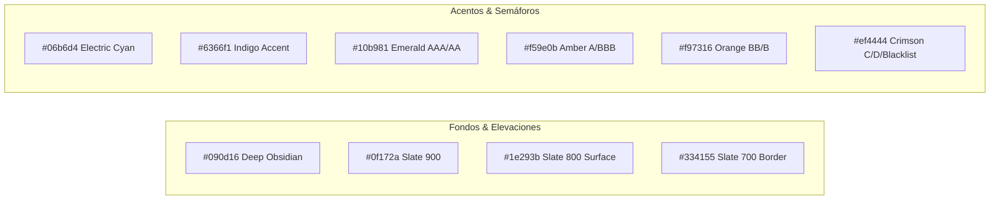

# 💎 Sistema de Diseño UI/UX Desktop "Ultra Pro" APEFAC

> [!IMPORTANT]
> Inspirado en la interfaz de clase mundial de **OpenConstructionERP**, este sistema de diseño convierte a APEFAC en un **Software Enterprise de Grado Institucional**: estética oscura ultra pulida (Deep Slate), tipografía financiera de alta densidad, componentes modulares tipo Ribbon, microinteracciones fluidas y paneles analíticos con **Apache ECharts**.

---

## 1. Paleta Cromática y Tokens de Color



| Token | Valor Hex | Uso en la Interfaz |
| :--- | :---: | :--- |
| `--bg-app` | `#090d16` | Fondo principal de la ventana (efecto visual inmersivo). |
| `--bg-panel` | `#0f172a` | Paneles laterales, ribbons y contenedores de tarjetas. |
| `--bg-card` | `#1e293b` | Tarjetas elevadas, celdas interactivas y modales. |
| `--border-subtle` | `rgba(255, 255, 255, 0.08)` | Bordes nítidos de 1px entre filas y columnas. |
| `--accent-primary` | `#06b6d4` | Botones de acción clave, resaltado de selección y gráficas vivas. |
| `--accent-indigo` | `#6366f1` | Badges de rol y conectividad de red. |
| `--risk-aaa` | `#10b981` | Verde esmeralda (Riesgo mínimo / 100% al día). |
| `--risk-retail` | `#f59e0b` | Ámbar (Retraso operativo leve 1-30d). |
| `--risk-stressed`| `#f97316` | Naranja (Tensión de liquidez 46-90d). |
| `--risk-critical`| `#ef4444` | Rojo carmesí (Mora grave >90d / Lista Negra). |

---

## 2. Top Ribbon & Anatomía de la Ventana Desktop

```
+---------------------------------------------------------------------------------------------------------+
| [ APEFAC RISK CORE ]  [🔍 Buscar RUC / Razón Social... (Ctrl+K)]   [PEN S/ | USD $] [INANDES v] [👤 Juan R] |
+---------------------------------------------------------------------------------------------------------+
| [ 📊 Central de Riesgos 360° ] [ 📥 Ingestión & Carga ] [ 🏢 22 Factorings ] [ 🚨 Lista Negra ] [ ⚡ Onboard ] |
+---------------------------------------------------------------------------------------------------------+
|                                                                                                         |
|  [ FICHA DEL ACEPTANTE: SAN FERNANDO S.A. | RUC 20100154308 | Sector: Alimentos ]                       |
|  +--------------------------------+ +----------------------------------------------------------------+  |
|  | SPEEDOMETER SCORE GAUGE        | | EVOLUCION 12 MESES STACKED BARS + LINEA FACTORINGS             |  |
|  |        ( 961 - AAA )           | | [ === Vigente | == Mora 1-15d | -- Inst: 10 ]                  |  |
|  +--------------------------------+ +----------------------------------------------------------------+  |
|                                                                                                         |
|  MATRIZ TOTALIZADORA HISTORICA 12 MESES (CON DESGLOSE PROTEGIDO)                                        |
|  +------------------+---------+---------+---------+---------+---------+---------+---------+----------+  |
|  | Estadio de Mora  | Jul-25  | Ago-25  | Set-25  | Oct-25  | Nov-25  | ...     | May-26  | Jun-26   |  |
|  +------------------+---------+---------+---------+---------+---------+---------+---------+----------+  |
|  | > Vigente        | S/ 4.1M | S/ 4.9M | S/ 5.4M | S/ 3.7M | S/ 1.8M | ...     | S/ 2.3M | S/ 2.8M  |  |
|  |   - INANDES      | [priv]  | [priv]  | [priv]  | [priv]  | [priv]  | ...     | [priv]  | [priv]   |  |
|  |   - CRECE CAP    | [priv]  | [priv]  | [priv]  | [priv]  | [priv]  | ...     | [priv]  | [priv]   |  |
|  | > Mora 1-15d     | 0.00    | 35.1k   | 19.9k   | 14.8k   | 538.8k  | ...     | 38.4k   | 20.4k    |  |
|  |   - CRECE CAP    | 0.00    | 0.00    | 0.00    | 0.00    | 43.2k   | ...     | 0.00    | 0.00     |  |
|  +------------------+---------+---------+---------+---------+---------+---------+---------+----------+  |
|  | Σ Total Deuda    | S/ 4.1M | S/ 4.9M | S/ 5.4M | S/ 3.7M | S/ 2.4M | ...     | S/ 2.4M | S/ 2.8M  |  |
|  | Total Factorings |    6    |    8    |    8    |    9    |    8    | ...     |    5    |    7     |  |
|  +------------------+---------+---------+---------+---------+---------+---------+---------+----------+  |
+---------------------------------------------------------------------------------------------------------+
```

---

## 3. Principios de Interacción "Ultra Pro"

1. **Búsqueda Instantánea con Autocompletado (Omnibar `Ctrl + K`):**
   * El usuario escribe *"San Fer"* o *"201001"* y la ficha se actualiza en **menos de 50 milisegundos** consumiendo directamente Supabase.
2. **Microanimaciones y Transiciones de Datos:**
   * La aguja del Speedometer se mueve suavemente con física de amortiguación.
   * Las barras de Apache ECharts transicionan con efectos de apilado.
3. **Data Grid Denso con Barras Condicionales:**
   * En lugar de texto plano gris, las celdas numéricas muestran microbarras de intensidad para comparar visualmente los meses de mayor mora sin tener que leer cada número.
4. **Desglose K-Anónimo en Acordeón:**
   * Al hacer clic en cualquier estadio de mora, se despliegan suavemente las 22 instituciones asociadas mostrando el secreto comercial intacto.
5. **Certificado de Carga en 1 Clic:**
   * En el módulo de ingestión, el analista arrastra el Excel y ve la validación fila por fila en caliente con feedback instantáneo.

---

## 4. Estrategia de Responsividad para Dispositivos Fijos (Laptops & Desktops de Distinta Proporción)

> [!IMPORTANT]
> **Eliminación del Zoom Manual (`Ctrl + Scroll`):** El sistema se auto-ajusta en escala, densidad y altura de contenedor para encajar exactamente al 100% de la pantalla visible en cualquier resolución (desde Laptops HD de 1366x768 hasta Monitores 4K de 3840x2160), eliminando la necesidad de que el usuario ajuste manualmente el zoom del navegador (`Ctrl + +` / `Ctrl + -`).

### 4.1 Arquitectura de Escalado Dinámico ("Zero-Scroll-Deformation")

1. **Auto-Scaling Root / Escala Tipográfica Fluida (`rem` adaptativo):**
   * Inyección de reglas de medios adaptativas sobre el tamaño de fuente base de la aplicación (`html / :root`):
     ```css
     /* Desktops HD / Full HD Standard (1080p) */
     @media (max-width: 1920px) {
       :root {
         font-size: 15px;
       }
     }
     /* Laptops 14" / 15.6" (1440px - 1536px) */
     @media (max-width: 1536px) {
       :root {
         font-size: 13.5px;
       }
     }
     /* Laptops Compactas HD (1366x768) */
     @media (max-width: 1366px) {
       :root {
         font-size: 12px;
       }
     }
     ```
   * Utilización estricta de `height: 100dvh` (Dynamic Viewport Height) para garantizar que los elementos de cabecera, ribbon y pie encajen exactamente en el área de visión sin desbordamiento vertical.

2. **Paneles Flexibles Verticales con Contención de Scroll Interno:**
   * **Estructura Flex-Col Rígida de Aplicación:**
     * `Header / Top Ribbon`: `flex-shrink-0` (altura fija auto-ajustable por `rem`).
     * `Fact Sheet Header`: `flex-shrink-0` (altura compacta responsiva).
     * `Cuerpo de Grilla / Gráficas`: `flex-1 min-h-0 overflow-auto`.
   * Los controles superiores permanecen **100% visibles y fijos** independientemente de la resolución, y solo la grilla interna o panel analítico habilita scroll de datos cuando el contenido excede el espacio dinámico.

3. **Apache ECharts & Data Grids Auto-Resizables:**
   * Vinculación obligatoria de `ResizeObserver` en todos los contenedores de gráficos (`Apache ECharts`) para ejecutar `.resize()` en tiempo real ante cualquier cambio de pantalla o colapso de menú.
   * Celdas de tabla numéricas con `max-width` dinámico y truncado inteligente (`truncate` + tooltip nativo `title={valor}`) para prevenir la deformación horizontal del layout en pantallas pequeñas.

### 4.2 Matriz de Breakpoints para Dispositivos Fijos Enterprise

| Rango de Resolución | Dispositivo / Pantalla | Escala Root (`rem`) | Ajustes de Layout y Densidad |
| :--- | :--- | :---: | :--- |
| **> 1920px** | Monitores Ultrawide / Workstations 2K/4K | `16px` | Espaciado holgado, tarjetas expandidas con vistas analíticas en paralelo. |
| **1536px – 1920px** | Desktops Full HD Standard (1080p) | `14.5px - 15px` | Escala base 1:1 por defecto, vista corporativa equilibrada. |
| **1366px – 1535px** | Laptops Enterprise 14" / 15.6" | `13px - 13.5px` | Densidad alta, reducción de paddings (`py-0.5`), compresión de botones. |
| **< 1366px** | Laptops Compactas HD (1366x768) | `11.5px - 12px` | Ribbons en `overflow-x-auto scrollbar-none`, grillas ultra-compactas sin desbordamiento general. |

### 4.3 Estandarización Canónica en Plantilla Global `MasterTemplate_V2.tsx`

> [!TIP]
> Para evitar parches o trucos de ancho fijo (`px`) celda por celda en cada tabla, la responsividad se aplica **directamente en la plantilla contenedora global `MasterTemplate_V2.tsx`**, propagándose de manera unificada a **absolutamente todos** los módulos del sistema (Matriz Financiera, Multicotizador Multirutas, Maestros, Spaghetti Map, etc.).

1. **Delimitación Viewport Bounded 100%:**
   * El contenedor raíz sustituye `min-h-screen` por `h-screen max-h-screen w-screen max-w-full overflow-hidden`.
2. **Relativización Flexbox Dynamic Space (`min-h-0 min-w-0`):**
   * El cuerpo de contenido principal (`<main>`) y la barra lateral de maestros (`<aside>`) adoptan `flex-1 min-h-0 min-w-0 overflow-auto`.
3. **Garantía Universal de Ajuste:**
   * Cualquier pantalla de cualquier módulo respeta el 100% de la altura y ancho útil de la ventana del usuario sin desbordar el marco exterior ni requerir zoom manual (`Ctrl + Scroll`).

### 4.4 Truncamiento Inteligente y Fluidez de Selectores & Ribbons Superiores

> [!NOTE]
> Se resolvió el desborde horizontal de elementos en la barra de control superior (Selector de Rutas en `/dashboard` y Cintas de Pestañas en Módulos Maestros como `/ports`, `/clients`).

1. **Truncamiento Elíptico Canónico en Selectores (`index.css`):**
   * Se asignó la clase de alcance `.master-template-content` a nivel del contenedor `<main>` en `MasterTemplate_V2.tsx`.
   * En `index.css` se agregaron reglas globales para que todo control `select` o `combobox` dentro del marco principal aplique `max-width: 100%` con truncamiento elíptico automático (`text-overflow: ellipsis; white-space: nowrap; overflow: hidden;`), impidiendo que nombres largos de ruta (ej: `SPCC.MATARANI-ILO-CALLAO-MOQUEGUA`) deformen los contenedores superiores.
2. **Cinta Superior de Opciones con Overflow Contenido (`ForecastBuilder_V2.tsx`):**
   * El selector de rutas se delimitó en `max-w-[280px]` con truncado elíptico limpio (`truncate`).
   * El contenedor flex de la barra de herramientas adoptó `overflow-x-auto scrollbar-none shrink-0`, asegurando que todos los botones (`Buque`, `N° Viajes`, `Demurrage`, `Añadir al Modelo`) permanezcan alineados sin empujar elementos fuera del área visible.
3. **Cero Intrusividad en Lógica de Negocio:**
   * Cambio 100% visual y estructural de CSS, sin tocar variables, funciones de cálculo, APIs FastAPI ni la base de datos Supabase. Ninguna modificación al branch Benoit.

