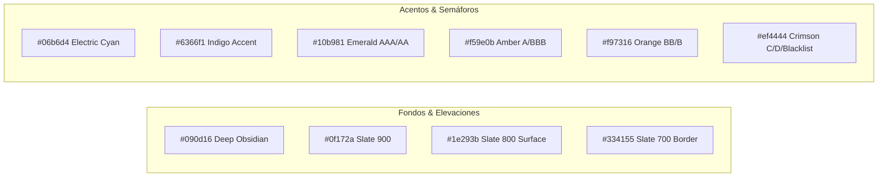

# 💎 Sistema de Diseño UI/UX Desktop "Ultra Pro" APEFAC

> [!IMPORTANT]
> Inspirado en la interfaz de clase mundial de **OpenConstructionERP**, este sistema de diseño convierte a APEFAC en un **Software Enterprise de Grado Institucional**: estética oscura ultra pulida (Deep Slate), tipografía financiera de alta densidad, componentes modulares tipo Ribbon, microinteracciones fluidas y paneles analíticos con **Apache ECharts**.

---

## 1. Paleta Cromática y Tokens de Color



| Token | Valor Hex | Uso en la Interfaz |
| :--- | :---: | :--- |
| `--bg-app` | `#090d16` | Fondo principal de la ventana (efecto visual inmersivo). |
| `--bg-panel` | `#0f172a` | Paneles laterales, ribbons y contenedores de tarjetas. |
| `--bg-card` | `#1e293b` | Tarjetas elevadas, celdas interactivas y modales. |
| `--border-subtle` | `rgba(255, 255, 255, 0.08)` | Bordes nítidos de 1px entre filas y columnas. |
| `--accent-primary` | `#06b6d4` | Botones de acción clave, resaltado de selección y gráficas vivas. |
| `--accent-indigo` | `#6366f1` | Badges de rol y conectividad de red. |
| `--risk-aaa` | `#10b981` | Verde esmeralda (Riesgo mínimo / 100% al día). |
| `--risk-retail` | `#f59e0b` | Ámbar (Retraso operativo leve 1-30d). |
| `--risk-stressed`| `#f97316` | Naranja (Tensión de liquidez 46-90d). |
| `--risk-critical`| `#ef4444` | Rojo carmesí (Mora grave >90d / Lista Negra). |

---

## 2. Top Ribbon & Anatomía de la Ventana Desktop

```
+---------------------------------------------------------------------------------------------------------+
| [ APEFAC RISK CORE ]  [🔍 Buscar RUC / Razón Social... (Ctrl+K)]   [PEN S/ | USD $] [INANDES v] [👤 Juan R] |
+---------------------------------------------------------------------------------------------------------+
| [ 📊 Central de Riesgos 360° ] [ 📥 Ingestión & Carga ] [ 🏢 22 Factorings ] [ 🚨 Lista Negra ] [ ⚡ Onboard ] |
+---------------------------------------------------------------------------------------------------------+
|                                                                                                         |
|  [ FICHA DEL ACEPTANTE: SAN FERNANDO S.A. | RUC 20100154308 | Sector: Alimentos ]                       |
|  +--------------------------------+ +----------------------------------------------------------------+  |
|  | SPEEDOMETER SCORE GAUGE        | | EVOLUCION 12 MESES STACKED BARS + LINEA FACTORINGS             |  |
|  |        ( 961 - AAA )           | | [ === Vigente | == Mora 1-15d | -- Inst: 10 ]                  |  |
|  +--------------------------------+ +----------------------------------------------------------------+  |
|                                                                                                         |
|  MATRIZ TOTALIZADORA HISTORICA 12 MESES (CON DESGLOSE PROTEGIDO)                                        |
|  +------------------+---------+---------+---------+---------+---------+---------+---------+----------+  |
|  | Estadio de Mora  | Jul-25  | Ago-25  | Set-25  | Oct-25  | Nov-25  | ...     | May-26  | Jun-26   |  |
|  +------------------+---------+---------+---------+---------+---------+---------+---------+----------+  |
|  | > Vigente        | S/ 4.1M | S/ 4.9M | S/ 5.4M | S/ 3.7M | S/ 1.8M | ...     | S/ 2.3M | S/ 2.8M  |  |
|  |   - INANDES      | [priv]  | [priv]  | [priv]  | [priv]  | [priv]  | ...     | [priv]  | [priv]   |  |
|  |   - CRECE CAP    | [priv]  | [priv]  | [priv]  | [priv]  | [priv]  | ...     | [priv]  | [priv]   |  |
|  | > Mora 1-15d     | 0.00    | 35.1k   | 19.9k   | 14.8k   | 538.8k  | ...     | 38.4k   | 20.4k    |  |
|  |   - CRECE CAP    | 0.00    | 0.00    | 0.00    | 0.00    | 43.2k   | ...     | 0.00    | 0.00     |  |
|  +------------------+---------+---------+---------+---------+---------+---------+---------+----------+  |
|  | Σ Total Deuda    | S/ 4.1M | S/ 4.9M | S/ 5.4M | S/ 3.7M | S/ 2.4M | ...     | S/ 2.4M | S/ 2.8M  |  |
|  | Total Factorings |    6    |    8    |    8    |    9    |    8    | ...     |    5    |    7     |  |
|  +------------------+---------+---------+---------+---------+---------+---------+---------+----------+  |
+---------------------------------------------------------------------------------------------------------+
```

---

## 3. Principios de Interacción "Ultra Pro"

1. **Búsqueda Instantánea con Autocompletado (Omnibar `Ctrl + K`):**
   * El usuario escribe *"San Fer"* o *"201001"* y la ficha se actualiza en **menos de 50 milisegundos** consumiendo directamente Supabase.
2. **Microanimaciones y Transiciones de Datos:**
   * La aguja del Speedometer se mueve suavemente con física de amortiguación.
   * Las barras de Apache ECharts transicionan con efectos de apilado.
3. **Data Grid Denso con Barras Condicionales:**
   * En lugar de texto plano gris, las celdas numéricas muestran microbarras de intensidad para comparar visualmente los meses de mayor mora sin tener que leer cada número.
4. **Desglose K-Anónimo en Acordeón:**
   * Al hacer clic en cualquier estadio de mora, se despliegan suavemente las 22 instituciones asociadas mostrando el secreto comercial intacto.
5. **Certificado de Carga en 1 Clic:**
   * En el módulo de ingestión, el analista arrastra el Excel y ve la validación fila por fila en caliente con feedback instantáneo.
