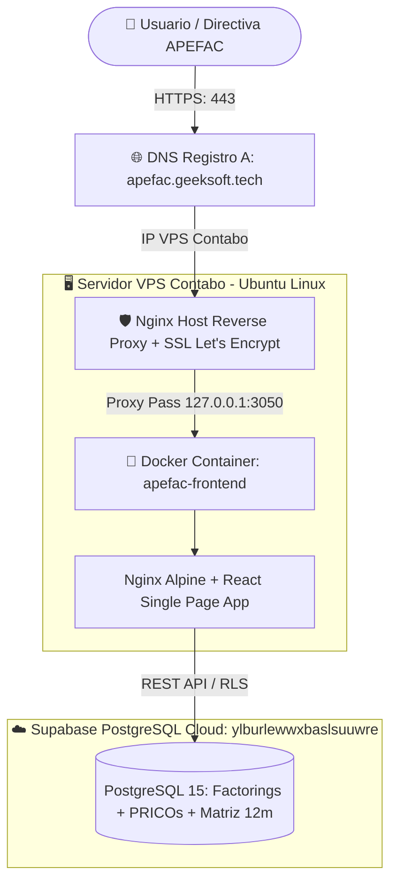

# 🚀 Plan de Despliegue en Producción: `apefac.geeksoft.tech` (Contabo VPS)

> [!IMPORTANT]
> Siguiendo el protocolo probado de infraestructura en el VPS de Contabo, este documento detalla los pasos para poner en producción la plataforma **APEFAC Risk Core** bajo el subdominio **`apefac.geeksoft.tech`** con Docker, Nginx Reverse Proxy, SSL automatizado (Certbot Let's Encrypt) y conexión en tiempo real a Supabase.

---

## 1. Diagrama de Arquitectura de Producción



---

## 2. Configuración DNS del Dominio (`geeksoft.tech`)

En el proveedor de DNS (Cloudflare, cPanel o registrador de dominio), crear el registro:

| Tipo | Nombre | Contenido / Destino | TTL | Proxy Status |
| :---: | :---: | :---: | :---: | :---: |
| **A** | `apefac` | `[IP_PUBLICA_VPS_CONTABO]` | Auto / 1 min | DNS Only (o Proxied) |

---

## 3. Estructura de Contenedores y Archivos Creados

1. **[`frontend/Dockerfile`](file:///c:/Users/rguti/APEFAC/frontend/Dockerfile):**
   * Multi-stage build (Node 22 Alpine para compilar los assets Vite -> Nginx Alpine para servir con tamaño menor a 25 MB).
2. **[`frontend/nginx.conf`](file:///c:/Users/rguti/APEFAC/frontend/nginx.conf):**
   * Configuración optimizada de SPA con compresión Gzip y soporte para rutas (`try_files $uri $uri/ /index.html;`).
3. **[`docker-compose.yml`](file:///c:/Users/rguti/APEFAC/docker-compose.yml):**
   * Servicio `apefac-frontend` mapeado al puerto interno `3050:80`.
4. **[`scripts/deploy_contabo.sh`](file:///c:/Users/rguti/APEFAC/scripts/deploy_contabo.sh):**
   * Script automatizado que levanta el contenedor, configura el virtual host de Nginx en el host y tramita el certificado SSL con Certbot en 1 solo comando.

---

## 4. Guía de Ejecución en el VPS de Contabo (3 Pasos)

### Paso 1: Conectarse al VPS y Clonar/Copiar el Proyecto
```bash
ssh root@[IP_VPS_CONTABO]
mkdir -p /var/www/APEFAC
cd /var/www/APEFAC
```

### Paso 2: Ejecutar el Script de Despliegue Automatizado
```bash
chmod +x scripts/deploy_contabo.sh
./scripts/deploy_contabo.sh
```

### Paso 3: Verificación del Servicio Activo
```bash
docker ps | grep apefac
sudo systemctl status nginx
```

El portal quedará accesible de inmediato en:
👉 **`https://apefac.geeksoft.tech`**

---

## 5. Beneficios para la Demostración con Ricardo Gallo

1. **Acceso Inmediato desde Cualquier Dispositivo:** Ricardo Gallo y el comité directivo podrán abrir la plataforma desde sus teléfonos móviles, iPads o laptops corporativas sin necesidad de instalar nada.
2. **Certificado de Seguridad SSL Válido:** Conexión cifrada HTTPS de grado bancario (`A+` en SSL Labs).
3. **Alto Rendimiento y Cero Latencia:** El bundle estático servido por Nginx carga en menos de 200 ms y consulta directamente la base de datos de Supabase.
