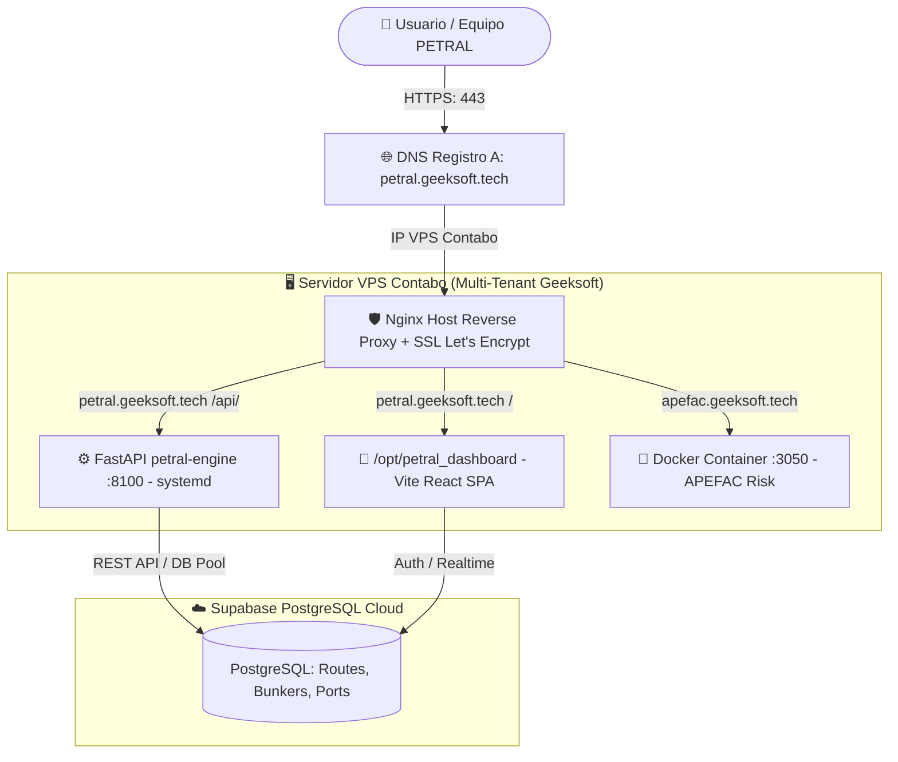

# 🚀 Plan de Despliegue en Producción: `petral.geeksoft.tech` (Contabo VPS)

> [!IMPORTANT]
> Migración integral de la plataforma **PETRAL SMART DASHBOARD** desde el VPS actual de Hostinger (`91.108.125.253`) hacia el **VPS Contabo existente** (donde ya convive `apefac.geeksoft.tech`) bajo el subdominio **`petral.geeksoft.tech`**. Esta consolidación elimina costos recurrentes de Hostinger y unifica la infraestructura en Contabo de alto rendimiento.

---

## 1. Diagrama de Arquitectura de Producción



---

## 2. Configuración DNS del Dominio (`geeksoft.tech`)

En el proveedor DNS (Cloudflare / registrador), crear el siguiente registro:

| Tipo | Nombre | Contenido / Destino | TTL | Proxy Status |
| :---: | :---: | :---: | :---: | :---: |
| **A** | `petral` | `[IP_PUBLICA_VPS_CONTABO]` | Auto / 1 min | DNS Only (o Proxied) |

---

## 3. Estructura de Servicios y Configuración en Contabo

### 3.1. Servicio Systemd: `petral-engine.service`
Ruta: `/etc/systemd/system/petral-engine.service`
```ini
[Unit]
Description=PETRAL Geeksoft Engine (FastAPI)
After=network.target

[Service]
Type=simple
User=root
WorkingDirectory=/opt/petral_engine
ExecStart=/usr/bin/python3 -m uvicorn main:app --host 127.0.0.1 --port 8100
Restart=always
RestartSec=5
Environment=PYTHONUNBUFFERED=1

[Install]
WantedBy=multi-user.target
```

### 3.2. Virtual Host Nginx: `/etc/nginx/sites-available/petral.geeksoft.tech`
```nginx
server {
    listen 80;
    server_name petral.geeksoft.tech;
    return 301 https://$host$request_uri;
}

server {
    listen 443 ssl;
    server_name petral.geeksoft.tech;
    root /opt/petral_dashboard;
    index index.html;

    ssl_certificate /etc/letsencrypt/live/petral.geeksoft.tech/fullchain.pem;
    ssl_certificate_key /etc/letsencrypt/live/petral.geeksoft.tech/privkey.pem;

    location /api/ {
        proxy_pass http://127.0.0.1:8100;
        proxy_set_header Host $host;
        proxy_set_header X-Real-IP $remote_addr;
        proxy_set_header X-Forwarded-For $proxy_add_x_forwarded_for;
        proxy_set_header X-Forwarded-Proto $scheme;
    }

    location / {
        try_files $uri $uri/ /index.html;
        add_header Cache-Control "no-store, no-cache, must-revalidate, max-age=0";
    }

    gzip on;
    gzip_types text/plain text/css application/javascript application/json image/svg+xml;
    gzip_min_length 1000;
}
```

---

## 4. Script de Despliegue Automatizado SFTP/SSH
Ruta: `C:\Users\rguti\PETRAL.SMART.DASHBOARD\Push.VPS\deploy_petral_contabo.py`

* Conexión directa SFTP/SSH a Contabo.
* Sube `/dist` a `/opt/petral_dashboard`.
* Sube `Geeksoft_Engine` a `/opt/petral_engine`.
* Reinicia `systemctl restart petral-engine`.
* Configura Nginx y emite certificado SSL Let's Encrypt con Certbot.

---

## 5. Protocolo de Transición y Cierre de Hostinger

1. Validar `https://petral.geeksoft.tech` en Contabo al 100%.
2. Redirigir el dominio legado `forecast.geeksoft.tech` a Contabo mediante Nginx `301 Redirect`.
3. Cancelar el VPS Hostinger (`91.108.125.253`) para optimizar costos de infraestructura.
