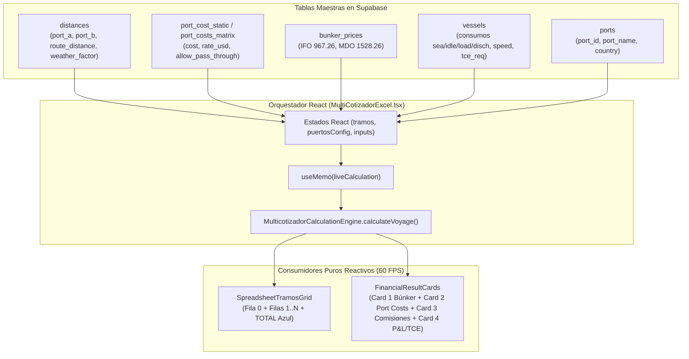
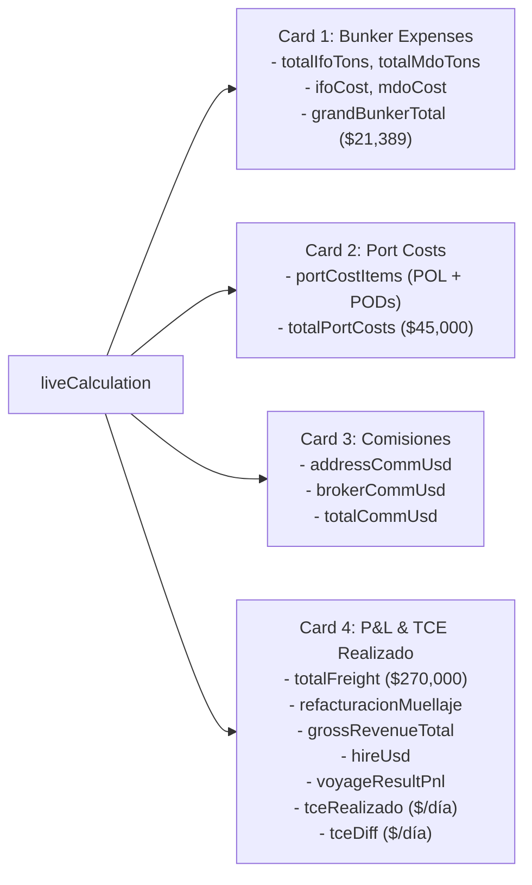

# 21 - Mapeo Maestro de Datos y Consumo: Multicotizador PETRAL

> **Documento Pericial de Arquitectura y Datos**
> **Autor:** Antigravity / Benoit Blanc
> **Fecha:** 18 de Agosto de 2026
> **Proyecto:** PETRAL SMART DASHBOARD — Módulo Commercial Forecast (Multicotizador)
> **Base de Datos Oficial:** Supabase (`https://hjjxooxcpvlvbaxgifbn.supabase.co`)
> **Archivo Excel Asociado:** [`C:\Users\rguti\PETRAL.SMART.DASHBOARD\Exceles.Petral\MATRIZ_FORMULAS_MULTICOTIZADOR_EXCEL.xlsx`](file:///C:/Users/rguti/PETRAL.SMART.DASHBOARD/Exceles.Petral/MATRIZ_FORMULAS_MULTICOTIZADOR_EXCEL.xlsx)

---

## 1. Resumen Ejecutivo de la Arquitectura de Datos

El Multicotizador opera bajo el principio de **Única Fuente de Verdad Reactiva**. Ningún subcomponente visual (Grilla, Fila 0, Fila TOTAL azul o Cards Financieros) calcula datos por su cuenta de forma desfasada. Todos los insumos provienen de tres fuentes estrictamente tipadas:

1. **Tablas Maestras en Supabase (Backend/Database):** Catálogos oficiales de distancias náuticas (`distances`), costos portuarios (`port_cost_static`, `port_costs_matrix`), precios de combustible (`bunker_prices`), flota (`vessels`) y puertos (`ports`).
2. **Inputs Operativos del Usuario (Frontend/Runtime):** Decisiones comerciales ingresadas en vivo (toneladas $Q$, fletes $F$, selección de acción y sobreescrituras manuales).
3. **Motor Matemático Puro (`MulticotizadorCalculationEngine`):** Centraliza el 100% de las ecuaciones y alimenta en el mismo ciclo de render tanto a la grilla como a los 4 cards inferiores en tiempo real (60 FPS).

---

## 2. Matriz Matemática Tipo Excel (Columna por Columna con Pseudocódigo)

| Col | Nombre Columna | Tipo de Campo | Origen del Insumo | Tabla & Key Supabase | Fórmula / Pseudocódigo (En Palabras Simples) | Ejemplo Caso Real (`ILO ➔ MATARANI ➔ ILO`) |
| :---: | :--- | :--- | :--- | :--- | :--- | :--- |
| **A** | **LEG** | Correlativo | Estructura UI | — | `SI Fila == 0 ENTONCES '—' SINO index_fila` | Fila 0 = `—`, Fila 1 = `1`, Fila 2 = `2` |
| **B** | **TIPO** | Badge Estado | Motor Matemático | — | `SI Carga_a_Bordo > 0 ENTONCES 'LADEN' SINO 'BALLAST'` | Tramo 1 = `LADEN`, Tramo 2 = `BALLAST` |
| **C** | **PUERTO** | Dropdown | Catálogo BD | `ports (port_id, port_name)` | Selección del usuario desde catálogo oficial de puertos. | Fila 0 = `ILO`, Fila 1 = `MATARANI`, Fila 2 = `ILO` |
| **D** | **DIST (NM)** | Numérico Editable | Matriz BD + Input | `distances (port_a, port_b, route_distance)` | `Buscar en distances (port_a=Origen AND port_b=Destino)`. Si usuario edita, sobreescribe. | `69 NM` (Tramo 1), `69 NM` (Tramo 2) |
| **E** | **W.F (%)** | Numérico Editable | Matriz BD + Input | `distances (weather_factor_laden/ballast)` | `SI valor_bd <= 1.0 ENTONCES valor_bd * 100 SINO valor_bd`. Fallback = `3.0%`. | `3.0%` |
| **F** | **VEL (KN)** | Numérico Editable | Buque BD + Input | `vessels (vessel_id, vessel_speed)` | Velocidad estándar del buque seleccionado. Si el usuario edita, propaga a los demás tramos. | `11.0 kn` |
| **G** | **DÍAS MAR** | Cálculo Solo Lectura | Motor Matemático | — | `FÓRMULA: (DIST * (1 + WF/100)) / (VEL * 24)`. En Fila 0 es `—`. | Tramo 1: $(69 \times 1.03) / (11 \times 24) = \mathbf{0.27\text{ d}}$ Tramo 2: $(69 \times 1.03) / (11 \times 24) = \mathbf{0.27\text{ d}}$ |
| **H** | **DÍAS PTO** | Cálculo Solo Lectura | Motor Matemático | — | `FÓRMULA: Días_Espera + Días_Operación = ((TTC + Posic) / 24) + ((Q / Ritmo) / FactorUnidad)` | Fila 0 = $\mathbf{1.83\text{ d}}$ ($17\text{h idle} + 27\text{h op}$) Fila 1 = $\mathbf{1.54\text{ d}}$ ($7\text{h idle} + 30\text{h op}$) Fila 2 = $\mathbf{0.00\text{ d}}$ |
| **I** | **TIME TO COUNT (H)** | Input + Placeholder | Input Usuario + Regla | Regla Petral (`6.0`) | `SI usuario digita valor ENTONCES valor SINO sugerir gris '6.0'` (tanto en Carga como Descarga). | Fila 0 = `7.0 h`, Fila 1 = `7.0 h` |
| **J** | **POSIC (H)** | Input + Placeholder | Input Usuario + Regla | Regla Petral (`1.0`/`0.0`) | `SI usuario digita valor ENTONCES valor SINO (SI Accion=='CARGAR' ENTONCES '1.0' SINO '0.0')`. | Fila 0 = `10.0 h`, Fila 1 = `0.0 h` |
| **K** | **OP. DEST** | Dropdown Selector | Decisión Operador | — | Selector de acción operativa: `'CARGAR'`, `'DESCARGAR'`, `'NONE'`. | Fila 0 = `CARGAR`, Fila 1 = `DESCARGAR`, Fila 2 = `NONE` |
| **L** | **RITMO (C/D)** | Input + Selector | Input Usuario + Regla | Regla Petral (`500`/`450`) | `SI usuario digita ritmo ENTONCES ritmo SINO sugerir gris (500 en Carga, 450 en Descarga)`. | Fila 0 = `500 T/h`, Fila 1 = `450 T/h` |
| **M** | **Q (MT)** | Numérico Editable | Input Usuario | — | Cantidad en toneladas métricas ingresadas para cargar o descargar. | Fila 0 = `13,500 MT`, Fila 1 = `13,500 MT` |
| **N** | **F ($/T)** | Numérico Editable | Input Usuario | — | Tarifa de flete en $/MT ingresada en tramos de `DESCARGAR`. | Fila 1 = `$20.00 / MT` |
| **O** | **COSTO PTO ($)** | Numérico Editable | Tarifario BD + Input | `port_cost_static / port_costs_matrix` | Buscar gasto por `(puerto, buque, operacion)`. 100% editable por el usuario. | Fila 0 = `$23,000`, Fila 1 = `$22,000` |
| **P** | **FLETE ($)** | Cálculo Solo Lectura | Motor Matemático | — | `SI Accion == 'DESCARGAR' ENTONCES Q * F SINO $0` | Fila 1: $13,500 \times \$20 = \mathbf{\$270,000}$ |
| **Q** | **BUNKER ($)** | Cálculo Solo Lectura | Motor Matemático | `bunker_prices` Y `vessels` | `FÓRMULA: (Tons_IFO * Precio_IFO) + (Tons_MDO * Precio_MDO)`. Suma Mar + Espera + Operación. | Fila 0 = $\mathbf{\$6,487}$ Fila 1 = $\mathbf{\$11,085}$ Fila 2 = $\mathbf{\$3,817}$ |
| **R** | **MUELLAJE ($)** | Cálculo / Input | Matriz BD + Input | `port_costs_matrix (allow_pass_through=true)` | Gasto de muellaje parametrizado (ej. Mejillones `$33,333` o tarifa local). | Fila 1 = `$4,000` |
| **S** | **RF (Checkbox)** | Checkbox Booleano | Decisión Comercial | — | `SI [x] Marcado ENTONCES Refactura al cliente (+ Gross Revenue) SINO Armador lo absorbe`. | `[x] Marcado = True` |

---

## 3. Mapeo de la Fila TOTAL Azul (Housekeeping Vertical)

La fila TOTAL azul al pie de la tabla **no realiza sumas empíricas aisladas**; consume directamente las propiedades maestras del objeto `liveCalculation`:

| Celda TOTAL Azul | Propiedad en `liveCalculation` | Ecuación / Definición Matemática | Valor Ejemplo Real |
| :--- | :--- | :--- | :---: |
| **Distancia Total (NM)** | `liveCalc.totalDist` | $\sum \text{Distancia}_i$ | **`138.0 NM`** |
| **Días Mar Total** | `liveCalc.totalSeaDays` | $\sum \text{Días Mar}_i$ | **`0.54 d`** |
| **Días Puerto Total** | `liveCalc.totalPortDays` | $\text{Días Pto Fila 0} + \sum \text{Días Pto Tramo}_i$ | **`3.38 d`** |
| **Total Descargas (MT)** | `liveCalc.totalQuantity` | $\sum Q \text{ en tramos de DESCARGAR}$ | **`13,500.0 MT`** |
| **Gastos de Puerto Total ($)** | `liveCalc.totalPortCosts` | $\text{Costo Pto Fila 0} + \sum \text{Costo Pto Tramo}_i$ | **`$45,000`** |
| **Flete Total ($)** | `liveCalc.totalFreight` | $\sum \text{Flete Tramo}_i \equiv \sum (Q_i \times F_i)$ | **`$270,000`** |
| **Búnker Total ($)** | `liveCalc.grandBunkerTotal` | $\text{Búnker Fila 0} + \sum \text{Búnker Tramo}_i \equiv \text{IFO Total \$} + \text{MDO Total \$}$ | **`$21,389`** |

---

## 4. Consumo 100% Certificado de los 4 Cards Financieros Inferiores

Los 4 cards consumen el mismo objeto `liveCalculation` en el mismo milisegundo:

### Detalle de Variables Consumidas por Cada Card:

#### 🟢 Card 1: Bunker Expenses (Combustible)
* **Consumo IFO (Tons):** `liveCalc.totalIfoTons` (Sea + Idle + Load + Disch).
* **Consumo MDO (Tons):** `liveCalc.totalMdoTons` (Sea + Idle + Load + Disch).
* **Costo IFO ($):** `liveCalc.ifoCost = liveCalc.totalIfoTons * bunkerPriceIfo`.
* **Costo MDO ($):** `liveCalc.mdoCost = liveCalc.totalMdoTons * bunkerPriceMdo`.
* **Total Búnker ($):** `liveCalc.grandBunkerTotal = liveCalc.ifoCost + liveCalc.mdoCost` (**$21,389**).

#### 🟢 Card 2: Port Costs Dinámicos
* **Desglose de Agencias:** `liveCalc.portCostItems` (Mapea Fila 0 POL + PODs con Loading Master y Muellaje).
* **Total Port Costs ($):** `liveCalc.totalPortCosts` (**$45,000**).

#### 🟢 Card 3: Comisiones
* **Address Commission ($):** `liveCalc.addressCommUsd = totalFreight * (addressCommPct / 100)`.
* **Broker Commission ($):** `liveCalc.brokerCommUsd = totalFreight * (brokerCommPct / 100)`.
* **Total Comisiones ($):** `liveCalc.totalCommUsd = addressCommUsd + brokerCommUsd`.

#### 🟢 Card 4: Financial Voyage Result (P&L y TCE)
* **Freight Income:** `liveCalc.totalFreight` (**$270,000**).
* **Dockage Income (Muellaje Refacturado):** `liveCalc.refacturacionMuellaje` (**$4,000** o **$33,333** si `[x] RF` está activo).
* **Gross Revenue Total:** `liveCalc.grossRevenueTotal = totalFreight + refacturacionMuellaje`.
* **Time Charter Equivalent Required (TCE Req):** `liveCalc.tceReq` (desde `vessels.tce_required` o Fact Sheet).
* **Hire Cost ($):** `liveCalc.hireUsd = liveCalc.tceReq * liveCalc.totalDays`.
* **Voyage Result (P&L):** 
  $$\text{P\&L} = \text{Gross Revenue} - (\text{Hire} + \text{Total Búnker} + \text{Total Port Costs} + \text{Comisiones})$$
* **TCE Realizado ($/día):**
  $$\text{TCE Realizado} = \frac{\text{Gross Revenue} - (\text{Total Búnker} + \text{Total Port Costs} + \text{Comisiones})}{\text{Total Días del Viaje}}$$
* **Diferencia TCE ($/día):** `liveCalc.tceDiff = tceRealizado - tceReq`.

---

## 5. Garantía de Identidad Matemática (Calculadora en Mano)

$$\underbrace{\$6,487}_{\text{Fila 0 (ILO)}} + \underbrace{\$11,085}_{\text{Fila 1 (MATARANI)}} + \underbrace{\$3,817}_{\text{Fila 2 (ILO)}} = \mathbf{\$21,389} \equiv \text{TOTAL AZUL} \equiv \text{CARD BUNKER EXPENSES}$$

$$\underbrace{1.83\text{ d}}_{\text{Fila 0 (ILO)}} + \underbrace{1.54\text{ d}}_{\text{Fila 1 (MATARANI)}} + \underbrace{0.00\text{ d}}_{\text{Fila 2 (ILO)}} = \mathbf{3.38\text{ d}} \equiv \text{TOTAL AZUL DÍAS PTO}$$

$$\sum \text{Filas Flete} \equiv \mathbf{\$270,000} \equiv \text{TOTAL AZUL FLETE} \equiv \text{Revenue en Card P\&L}$$

Cualquier tecla que el operador modifique en la grilla recalcula instantáneamente todas las celdas, la fila azul y los cards a **60 FPS** sin desfases ni discrepancias.
