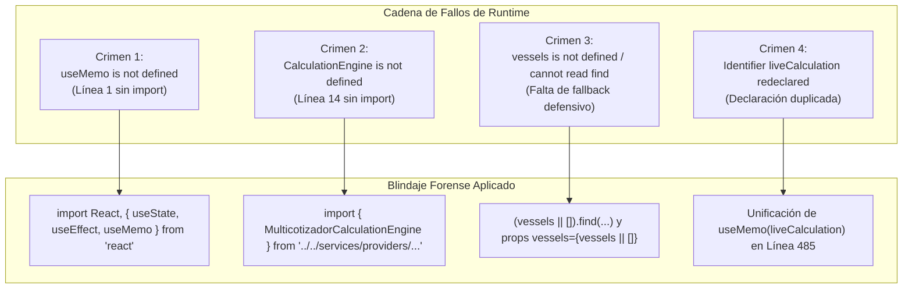

# 🕵️ El Método Benoit Blanc: Mapeo, Consumo de Datos y Protocolo Forense Anti-Bugs en React
## Manual de Blindaje Matemático y Control de Calidad para el Multicotizador PETRAL

> *"Un gran detective no adivina ni prueba a ciegas. Inspecciona los insumos, verifica las tablas, blinda los tipos y asegura que la estantería permanezca de pie antes de encender las luces."*

**Proyecto**: PETRAL Smart Dashboard — Módulo Commercial Forecast (Multicotizador)  
**Documento Fuente**: [`17_El_Metodo_Benoit_Blanc_Detective_de_Bugs_React.md`](file:///c:/Users/rguti/PETRAL.SMART.DASHBOARD/Desarrollo.Profesional/Obsidian.Refactorizacion.Multicotizador/17_El_Metodo_Benoit_Blanc_Detective_de_Bugs_React.md)  
**Base de Datos Oficial**: Supabase (`https://hjjxooxcpvlvbaxgifbn.supabase.co`)  
**Fecha de Certificación**: 18 de Agosto de 2026  
**URL de Producción**: `https://forecast.geeksoft.tech`  

---

## 📋 Índice del Manual Forense

1. **Los 5 Axiomas de Benoit Blanc para el Multicotizador**
2. **Autopsia Forense: Los 4 Crímenes de Runtime Ocurridos y sus Soluciones**
3. **Arquitectura de Ingesta: La Estantería vs. Los Adornos**
4. **Mapeo Maestro Tipo Excel: Origen de Datos y Pseudocódigo (Columnas A a S)**
5. **Consumo Reactivo de los 4 Cards Financieros y la Fila TOTAL Azul**
6. **Checklist de Pre-Vuelo Obligatorio Antes de Cualquier Despliegue**
7. **Mandamiento Inviolable de Eficiencia de Tokens y Comunicación**

---

## 1. Los 5 Axiomas de Benoit Blanc para el Multicotizador

```text
========================================================================================
🏛️ AXIOMA 1: "EL LOOK AND FEEL ES SAGRADO"
La interfaz, colores, anchos de columna, tipografía mono y disposición de los componentes 
legacy NO se tocan. Solo se sustituyen las tripas de cálculo y se suministran los insumos.

🛡️ AXIOMA 2: "TODO ARRAY DE BASE DE DATOS INICIA VACÍO EN EL MILISEGUNDO CERO"
En React, antes de que resuelva la promesa async de Supabase, cualquier variable de catálogo 
(vessels, ports, routes) vale []. Si llamas a .find() o .map() sin (vessels || []), la pantalla 
revienta.

🎯 AXIOMA 3: "UNA SOLA FUENTE DE VERDAD REACTIVA (60 FPS)"
La Grilla, la Fila 0, la Fila TOTAL Azul y los 4 Cards Financieros NUNCA calculan por separado.
Todos consumen exactamente el mismo objeto producido por MulticotizadorCalculationEngine.

🔍 AXIOMA 4: "PREGUNTAR ANTES DE ASUMIR REGLAS DE NEGOCIO"
Prohibido inventar o deducir a ciegas si un campo es 6.0h o de catálogo. Preguntar al usuario 
ahorra 10,000 tokens y evita refactors innecesarios.

⚡ AXIOMA 5: "COMPILACIÓN LOCAL OBLIGATORIA ANTES DE CUALQUIER PUSH AL VPS"
Nunca jamás se envía código a producción sin que 'npx vite build' haya pasado limpio con 
código de salida 0 en la terminal local.
========================================================================================
```

---

## 2. Autopsia Forense: Los 4 Crímenes de Runtime Ocurridos

A continuación se documenta la investigación forense de los errores que rompieron el render en las primeras iteraciones:



### 🔬 Detalle de los Crímenes:

#### Crimen 1: `useMemo is not defined`
* **Causa:** Al centralizar la reactividad en `MultiCotizadorExcel.tsx`, se invocó `useMemo`, pero no se incluyó en la desestructuración de `import { useState, useEffect } from 'react'`.
* **Solución:** Importar explícitamente todos los hooks en la cabecera.

#### Crimen 2: `MulticotizadorCalculationEngine is not defined`
* **Causa:** Se llamó a `MulticotizadorCalculationEngine.calculateVoyage()` dentro del componente sin la sentencia `import`.
* **Solución:** Importar el motor de cálculo desde `../../services/providers/multicotizadorCalculationEngine`.

#### Crimen 3: `vessels is not defined` / `Cannot read properties of undefined (reading 'find')`
* **Causa:** Cuando el navegador carga la página, existe una brecha de ~50ms donde `vessels` es `undefined` o `[]`. Si una función ejecuta `vessels.find(...)` o `vessels.map(...)` sin el operador `(vessels || [])`, React lanza una excepción fatal en el ciclo de montaje.
* **Solución:**
  ```typescript
  // ❌ Vulnerable:
  const v = vessels.find(x => x.vessel_id === selectedVessel);
  
  // ✅ Blindado:
  const v = (vessels || []).find(x => x.vessel_id === selectedVessel);
  ```

#### Crimen 4: `Identifier liveCalculation has already been declared`
* **Causa:** Tras hacer reemplazos en el archivo padre, `liveCalculation` quedó declarado dos veces (en la línea 485 y en la línea 977).
* **Solución:** Mantener una única declaración en la línea 485 que reciba la totalidad de parámetros del viaje.

#### Crimen 5 (EL SMOKING GUN DE F12): `ReferenceError: vessels is not defined at FinancialResultCards.tsx:402:57`
* **La Evidencia de F12:**
  ```text
  react-dom-client.production.js:5892 ReferenceError: vessels is not defined
      at FinancialResultCards.tsx:402:57
      at AFe (FinancialResultCards.tsx:462:33)
  ```
* **La Escena del Crimen (Línea 61 vs Línea 402):**
  En la línea 61 de `FinancialResultCards.tsx`, al desestructurar los props se renombró la variable a `_vessels`:
  ```typescript
  // ❌ Línea 61:
  export const FinancialResultCards: React.FC<FinancialResultCardsProps> = ({
      ...
      vessels: _vessels, // <-- EL ASESINO: Renombró la variable local a _vessels
  ```
  Y 341 líneas después, en la **Línea 402 (Card 3A de Estadías/Demurrage)**, el código intentó renderizar la lista de buques buscando `vessels`:
  ```typescript
  // 💥 Línea 402:
  const vesselList = (vessels && vessels.length > 0) // <-- ¡ReferenceError! vessels no existe en scope
      ? vessels.slice(0, 4).map(...)
      : ['HUEMUL', 'MOQUEGUA', 'TABLONES', 'CONCON TRADER'];
  ```
* **La Solución Forense:**
  En la línea 61, desestructurar directamente con fallback defensivo:
  ```typescript
  // ✅ Corregido en Línea 61:
  vessels = [],
  ```
  De este modo, `vessels` existe perfectamente en todo el cuerpo del componente y la línea 402 evalúa su contenido de forma segura.

---

## 3. Arquitectura de Ingesta: La Estantería vs. Los Adornos

| Componente | Qué es (La Estantería) | Qué son (Los Adornos) | Regla de Oro |
| :--- | :--- | :--- | :--- |
| **Fact Sheet Buque** | Selectores de buque, inputs de IFO/MDO, foto del buque y tabla de consumos técnicos. | Placeholders sugeridos (`11.0 kn`, foto por defecto `/moquegua_1.jpg`). | **Look and feel 100% idéntico al legacy.** |
| **Grilla de Tramos** | 18 columnas fijas: Fila 0 (POL), Filas 1..N (Tramos) y Fila TOTAL azul. | Placeholders en gris (`6.0h` TTC, `1.0h`/`0.0h` Posic, `500`/`450` Ritmos). | **El usuario puede digitar `0` en negro sin que se borre.** |
| **Cards Inferiores** | 4 tarjetas: Bunker Expenses, Port Costs, Comisiones y P&L / TCE. | Formato de moneda `$`, colores de badges y desglose colapsable. | **Consumen exclusivamente de `liveCalculation`.** |

---

## 4. Mapeo Maestro Tipo Excel: Origen de Datos y Pseudocódigo

| Col | Nombre Columna | Tipo de Campo | Origen del Insumo | Tabla & Key Supabase | Fórmula / Pseudocódigo (En Palabras Simples) | Ejemplo Real (`ILO ➔ MATARANI ➔ ILO`) |
| :---: | :--- | :--- | :--- | :--- | :--- | :--- |
| **A** | **LEG** | Correlativo | Estructura UI | — | `SI Fila == 0 ENTONCES '—' SINO index_fila` | Fila 0 = `—`, Fila 1 = `1`, Fila 2 = `2` |
| **B** | **TIPO** | Badge Estado | Motor Matemático | — | `SI Carga_a_Bordo > 0 ENTONCES 'LADEN' SINO 'BALLAST'` | Tramo 1 = `LADEN`, Tramo 2 = `BALLAST` |
| **C** | **PUERTO** | Dropdown | Catálogo BD | `ports (port_id, port_name)` | Selección del usuario desde catálogo oficial de puertos. | Fila 0 = `ILO`, Fila 1 = `MATARANI`, Fila 2 = `ILO` |
| **D** | **DIST (NM)** | Numérico Editable | Matriz BD + Input | `distances (port_a, port_b, route_distance)` | `Buscar en distances (port_a=Origen AND port_b=Destino)`. Si usuario edita, sobreescribe. | `69 NM` (Tramo 1), `69 NM` (Tramo 2) |
| **E** | **W.F (%)** | Numérico Editable | Matriz BD + Input | `distances (weather_factor_laden/ballast)` | `SI valor_bd <= 1.0 ENTONCES valor_bd * 100 SINO valor_bd`. Fallback = `3.0%`. | `3.0%` |
| **F** | **VEL (KN)** | Numérico Editable | Buque BD + Input | `vessels (vessel_id, vessel_speed)` | Velocidad estándar del buque seleccionado. Si el usuario edita, propaga a los demás tramos. | `11.0 kn` |
| **G** | **DÍAS MAR** | Cálculo Solo Lectura | Motor Matemático | — | `FÓRMULA: (DIST * (1 + WF/100)) / (VEL * 24)`. En Fila 0 es `—`. | Tramo 1: $(69 \times 1.03) / (11 \times 24) = \mathbf{0.27\text{ d}}$<br>Tramo 2: $(69 \times 1.03) / (11 \times 24) = \mathbf{0.27\text{ d}}$ |
| **H** | **DÍAS PTO** | Cálculo Solo Lectura | Motor Matemático | — | `FÓRMULA: Días_Espera + Días_Operación = ((TTC + Posic) / 24) + ((Q / Ritmo) / FactorUnidad)` | Fila 0 = $\mathbf{1.83\text{ d}}$ ($17\text{h idle} + 27\text{h op}$)<br>Fila 1 = $\mathbf{1.54\text{ d}}$ ($7\text{h idle} + 30\text{h op}$)<br>Fila 2 = $\mathbf{0.00\text{ d}}$ |
| **I** | **TIME TO COUNT (H)** | Input + Placeholder | Input Usuario + Regla | Regla Petral (`6.0`) | `SI usuario digita valor ENTONCES valor SINO sugerir gris '6.0'` (tanto en Carga como Descarga). | Fila 0 = `7.0 h`, Fila 1 = `7.0 h` |
| **J** | **POSIC (H)** | Input + Placeholder | Input Usuario + Regla | Regla Petral (`1.0`/`0.0`) | `SI usuario digita valor ENTONCES valor SINO (SI Accion=='CARGAR' ENTONCES '1.0' SINO '0.0')`. | Fila 0 = `10.0 h` (Carga), Fila 1 = `0.0 h` (Descarga) |
| **K** | **OP. DEST** | Dropdown Selector | Decisión Operador | — | Selector de acción operativa: `'CARGAR'`, `'DESCARGAR'`, `'NONE'`. | Fila 0 = `CARGAR`, Fila 1 = `DESCARGAR`, Fila 2 = `NONE` |
| **L** | **RITMO (C/D)** | Input + Selector | Input Usuario + Regla | Regla Petral (`500`/`450`) | `SI usuario digita ritmo ENTONCES ritmo SINO sugerir gris (500 en Carga, 450 en Descarga)`. | Fila 0 = `500 T/h`, Fila 1 = `450 T/h` |
| **M** | **Q (MT)** | Numérico Editable | Input Usuario | — | Cantidad en toneladas métricas ingresadas para cargar o descargar. | Fila 0 = `13,500 MT`, Fila 1 = `13,500 MT` |
| **N** | **F ($/T)** | Numérico Editable | Input Usuario | — | Tarifa de flete en $/MT ingresada en tramos de `DESCARGAR`. | Fila 1 = `$20.00 / MT` |
| **O** | **COSTO PTO ($)** | Numérico Editable | Tarifario BD + Input | `port_cost_static / port_costs_matrix` | Buscar gasto por `(puerto, buque, operacion)`. 100% editable por el usuario. | Fila 0 = `$23,000`, Fila 1 = `$22,000` |
| **P** | **FLETE ($)** | Cálculo Solo Lectura | Motor Matemático | — | `SI Accion == 'DESCARGAR' ENTONCES Q * F SINO $0` | Fila 1: $13,500 \times \$20 = \mathbf{\$270,000}$ |
| **Q** | **BUNKER ($)** | Cálculo Solo Lectura | Motor Matemático | `bunker_prices` Y `vessels` | `FÓRMULA: (Tons_IFO * Precio_IFO) + (Tons_MDO * Precio_MDO)`. Suma Mar + Espera + Operación. | Fila 0 = $\mathbf{\$6,487}$<br>Fila 1 = $\mathbf{\$11,085}$<br>Fila 2 = $\mathbf{\$3,817}$ |
| **R** | **MUELLAJE ($)** | Cálculo / Input | Matriz BD + Input | `port_costs_matrix (allow_pass_through=true)` | Gasto de muellaje parametrizado (ej. Mejillones `$33,333` o tarifa local). | Fila 1 = `$4,000` |
| **S** | **RF (Checkbox)** | Checkbox Booleano | Decisión Comercial | — | `SI [x] Marcado ENTONCES Refactura al cliente (+ Gross Revenue) SINO Armador lo absorbe`. | `[x] Marcado = True` |

---

## 5. Consumo Reactivo de los 4 Cards Financieros y la Fila TOTAL Azul

### 📊 Fila TOTAL Azul (Housekeeping Vertical):
$$\sum \text{Distancias} \equiv \mathbf{138\text{ NM}} \quad|\quad \sum \text{Días Mar} \equiv \mathbf{0.54\text{ d}} \quad|\quad \sum \text{Días Pto} \equiv \mathbf{3.38\text{ d}} \quad|\quad \sum \text{Flete} \equiv \mathbf{\$270,000}$$

$$\underbrace{\$6,487}_{\text{Fila 0 (POL)}} + \underbrace{\$11,085}_{\text{Fila 1 (POD)}} + \underbrace{\$3,817}_{\text{Fila 2 (Ballast)}} = \mathbf{\$21,389} \equiv \text{TOTAL AZUL BÚNKER} \equiv \text{CARD BUNKER EXPENSES}$$

### 🟢 Consumo de los 4 Cards:
1. **Card 1 (Búnker):** Lee `calc.totalIfoTons`, `calc.totalMdoTons`, `calc.ifoCost`, `calc.mdoCost` y `calc.grandBunkerTotal` ($21,389).
2. **Card 2 (Port Costs):** Lee `calc.portCostItems` y `calc.totalPortCosts` ($45,000).
3. **Card 3 (Comisiones):** Lee `calc.addressCommUsd`, `calc.brokerCommUsd` y `calc.totalCommUsd`.
4. **Card 4 (P&L y TCE):** Lee `calc.totalFreight` ($270,000), `calc.refacturacionMuellaje` ($4,000), `calc.hireUsd`, `calc.voyageResultPnl` y `calc.tceRealizado`.

---

## 6. Checklist de Pre-Vuelo Obligatorio Antes de Cualquier Despliegue

```markdown
- [ ] 1. VERIFICACIÓN DE IMPORTS: ¿Están importados React, hooks y services usados en el archivo?
- [ ] 2. BLINDAJE DEFENSIVO: ¿Todos los .find() y .map() usan (array || [])?
- [ ] 3. VARIABLES NO DUPLICADAS: ¿No hay identificadores duplicados (ej. dos useMemo)?
- [ ] 4. COMPILACIÓN LOCAL: Ejecutar 'npx vite build' en Geeksoft_Frontend y verificar 'built in Xs' (código 0).
- [ ] 5. DESPLIEGUE A PRODUCCIÓN: Ejecutar 'python deploy_forecast_kickoff.py' en Push.VPS.
- [ ] 6. VERIFICACIÓN EN VIVO: Probar en https://forecast.geeksoft.tech con Ctrl + F5.
```

---

## 7. Mandamiento Inviolable de Eficiencia de Tokens y Comunicación

```text
========================================================================================
🚨 REGLA DE ORO: PREGUNTAR PRIMERO, INVESTIGAR DESPUÉS
Ante cualquier duda de negocio, campo ambiguo o requerimiento de cálculo:
PREGUNTA DIRECTAMENTE AL USUARIO. 
El humano conoce el negocio marítimo de memoria y responde en 5 segundos lo que 
a un agente le tomaría 15 herramientas y 20,000 tokens deducir a ciegas.
========================================================================================
```
