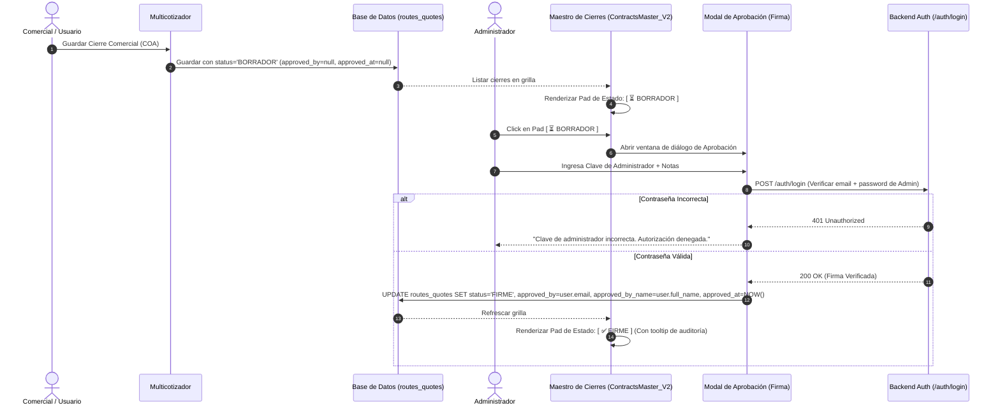

# Plan Maestro 25: Seguridad, Roles RBAC y Flujo de Cierres BORRADOR ➔ FIRME con Firma de ADMIN

> **Objetivo de Negocio:**
> Implementar un flujo de gobernanza comercial y seguridad de nivel empresarial:
> 1. Todo Cierre comercial (COA / Contrato) originado en el Multicotizador entra al **Maestro de Cierres** en estado **`BORRADOR`** (Draft).
> 2. El estado **`BORRADOR`** solo podrá transicionar a **`FIRME`** mediante la autorización explícita de un usuario con rol **`ADMIN`**.
> 3. Al intentar aprobar, el sistema solicitará obligatoriamente la **clave de ingreso del Administrador** como firma de seguridad.
> 4. Se registrará la trazabilidad y auditoría completa en base de datos: **quién aprobó** (`approved_by`, `approved_by_name`, `approved_by_email`) y **cuándo aprobó** (`approved_at` timestamp).
> 5. La **Matriz de Gestión de Usuarios (`/users`)** se sincronizará asignando roles y permisos (`Editor` / `Visor` / `Nulo`) estrictamente para los **18 módulos activos en el VPS**.

---

## 1. Arquitectura del Flujo de Estados y Firma de Seguridad



---

## 2. Catálogo Oficial de Módulos Activos en VPS (18 Módulos)

La matriz de permisos en `AuthContext.tsx` y `UsersPermissions.tsx` gobernará estrictamente estos módulos:

### 🛠️ Herramientas de Negocio (5 Módulos):
| Módulo ID | Nombre Oficial en Pantalla (VPS) | Ruta URL |
|---|---|---|
| `multicotizador` | ⛴️ **Multicotizador Multirutas** | `/multicotizador` |
| `matriz_financiera` | 📊 **Matriz Financiera** | `/dashboard` |
| `analisis_grafico` | 📈 **Análisis Gráfico** | `/graphic-analysis` |
| `spaghetti_map` | 🗺️ **Spaghetti Map** | `/spaghetti-map` |
| `analisis_liquidaciones` | 📊 **Análisis Gráfico Liquidaciones** | `/liquidations-graphic-analysis` |

### 🗂️ Datos Maestros (13 Módulos):
| Módulo ID | Categoría | Nombre Oficial en Pantalla (VPS) | Ruta URL |
|---|---|---|---|
| `maestro_flota` | 🏗️ Físicos | 🚢 **Maestro de Flota** | `/vessels` |
| `maestro_puertos` | 🏗️ Físicos | ⚓ **Maestro de Puertos y Terminales** | `/ports` |
| `maestro_distancias` | 🏗️ Físicos | 📏 **Maestro de Distancias** | `/routes` |
| `maestro_clientes` | 💼 Comerciales | 🏢 **Maestro de Clientes** | `/clients` |
| `maestro_cierres` | 💼 Comerciales | 📜 **Maestro de Cierres** | `/contracts` |
| `maestro_cotizaciones` | 💼 Comerciales | 📑 **Maestro de Cotizaciones** | `/quotes` |
| `maestro_presupuestos` | 💼 Comerciales | 📊 **Maestro de Presupuestos** | `/budgets` |
| `maestro_matrices` | 💼 Comerciales | 📈 **Maestro de Matrices** | `/financial-projections` |
| `maestro_tarifas_portuarias`| 💰 Costos | 🏷️ **Maestro de Tarifas Portuarias** | `/port-tariffs` |
| `maestro_gastos_portuarios` | 💰 Costos | 🧮 **Maestro de Gastos Portuarios** | `/port-costs` |
| `maestro_demoras` | 💰 Costos | ⏳ **Maestro de Demoras** | `/demurrage` |
| `maestro_bunker` | ⛽ Mercado | ⛽ **Maestro de Búnker** | `/bunker-prices` |
| `maestro_originacion` | ⛽ Mercado | ⚙️ **Maestro de Originación** | `/sources-sinks` |

---

## 3. Especificación Técnica de Persistencia y UI

### 3.1. Esquema de Datos de Auditoría en `routes_quotes`
Campos guardados en cada registro de Cierre/COA:
* **`status`**: `'BORRADOR'` (al crearse) $\rightarrow$ `'FIRME'` (al aprobarse).
* **`approved_by`**: ID / Email del Administrador que aprobó.
* **`approved_by_name`**: Nombre completo del Administrador.
* **`approved_at`**: Fecha y hora ISO exacta de la aprobación (ej: `2026-08-25T19:05:00Z`).
* **`approval_notes`**: Comentarios u observaciones ingresadas durante la firma.

### 3.2. Pad de Estado en `ContractsMaster_V2.tsx`
* Ubicación: A la izquierda inmediata del botón *Eliminar*.
* **Estado `BORRADOR`:**
  * Botón pill ámbar/amarillo con ícono de reloj (`Clock`):
    ```tsx
    <button 
        onClick={(e) => { e.stopPropagation(); handleOpenApprovalModal(route); }}
        className="px-2.5 py-1 rounded bg-amber-50 hover:bg-amber-100 text-amber-900 border border-amber-300 font-bold text-xs flex items-center gap-1.5 cursor-pointer shadow-xs transition-colors"
        title="Cierre en estado Borrador. Clic para autorizar y pasar a FIRME (Solo Administradores)"
    >
        <Clock size={13} className="text-amber-600" />
        <span>BORRADOR</span>
    </button>
    ```
* **Estado `FIRME`:**
  * Botón pill esmeralda/verde con ícono de check (`CheckCircle2`) y badge de auditoría:
    ```tsx
    <button 
        onClick={(e) => { e.stopPropagation(); handleOpenAuditModal(route); }}
        className="px-2.5 py-1 rounded bg-emerald-50 hover:bg-emerald-100 text-emerald-900 border border-emerald-300 font-bold text-xs flex items-center gap-1.5 cursor-pointer shadow-xs transition-colors"
        title={`Aprobado por ${route.approved_by_name || route.approved_by || 'ADMIN'} el ${new Date(route.approved_at).toLocaleDateString()}`}
    >
        <CheckCircle2 size={13} className="text-emerald-600" />
        <span>FIRME</span>
    </button>
    ```

### 3.3. Modal de Diálogo de Aprobación (`CierreApprovalModal.tsx`)
1. **Validación de Rol Inicial:**
   * Si el usuario logueado NO es `ADMIN`, el modal o botón bloquea la acción y avisa: *"Acción restringida: Solo un Administrador puede autorizar y firmar el paso a estado FIRME."*
2. **Formulario de Firma y Validación de Contraseña:**
   * Muestra resumen ejecutivo del Cierre (Cliente, Ruta, Buque, Margen / P&L).
   * Input de texto para **Notas / Observaciones de Aprobación**.
   * Input tipo **Password**: *"Ingrese su contraseña de Administrador para firmar"*.
   * Al presionar **`Autorizar y Pasar a FIRME`**:
     1. Llama a `AuthService.login({ email: user.email, password })`.
     2. Si la clave es correcta: Ejecuta la actualización en BD guardando `status='FIRME'`, `approved_by=user.email`, `approved_by_name=user.full_name`, `approved_at=NOW()`.
     3. Refresca automáticamente la grilla y muestra notificación de éxito.
     4. Si la clave es errónea: Muestra mensaje de error en rojo y no efectúa cambios.

---

## 4. Fases de Ejecución

1. **Fase 1:** Actualizar `UserPermissions` en `AuthContext.tsx` y la matriz de `UsersPermissions.tsx` con los 18 módulos exactos del VPS.
2. **Fase 2:** En `MulticotizadorStorageService.ts`, garantizar que todo Cierre guardado viaje con `status: 'BORRADOR'` y campos de auditoría limpios.
3. **Fase 3:** Crear el componente `CierreApprovalModal.tsx` con validación de clave de administrador e integrarlo en `ContractsMaster_V2.tsx`.
4. **Fase 4:** Actualizar `ContractsMaster_V2.tsx` para renderizar el **Pad de Estado** a la izquierda de Eliminar, soportar los estados `BORRADOR` y `FIRME`, y mostrar el tooltip con la firma del aprobador.
5. **Fase 5:** Compilación (`npx vite build`) y despliegue a producción vía `deploy_forecast_kickoff.py`.
